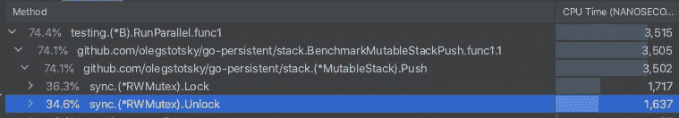
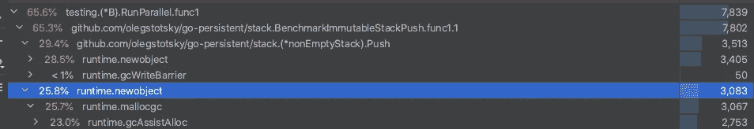

# 地鼠的持久数据结构:持久堆栈

> 原文：<https://levelup.gitconnected.com/persistent-data-structures-for-gophers-persistent-stack-70aa012d3bfa>

在这一系列的博客文章中，我想探索不可变持久数据结构的世界，它们与可变数据结构相比的优缺点，涵盖我们希望在哪些场景中使用它们，并提供一些理论背景。


首先，我们来定义一下什么是不可变数据结构。根据维基百科:

> 在计算中，持久数据结构是一种在被修改时总是保留其自身的先前版本的数据结构。这种数据结构实际上是不可变的，因为它们的操作不会(明显地)就地更新结构，而是总是产生新的更新结构。

与可变对应物相比，我们可以立即看到几个好处:

1.  因为我们没有可变状态，所以我们不必担心我们调用的方法会意外地改变我们的变量
2.  我们不必使用锁之类的同步，理论上，当锁争用较高时，这应该会提高性能
3.  我们有我们的结构的所有版本，如果我们想做撤销-重做这样的事情，这将非常方便。

让我们通过构建不可变堆栈来看看这在实践中意味着什么。Stack 是一种抽象数据类型，支持以下操作:

首先，让我们创建一个可变堆栈，看看实现是什么样子，并提供一个参考点:

我们使用可变切片来存储元素，并且我们必须使用锁来避免竞争情况。渐近复杂性方面，所有运算的成本为 O(1)。

现在让我们看看持久堆栈的实现是什么样子的:

一切都很简单:我们使用单独的类型来表示空堆栈，以减少代码混乱。我们还使用空堆栈的静态实例来减少内存开销，因为它没有状态，因此可以共享。Push 创建一个新版本的 stack 并返回它，而 pop 只是返回一个 tail，它为我们提供了我们讨论过的变更的完整历史。请注意，我们从不改变状态，因此我们从不需要使用锁。

持久堆栈是一种非常好的数据结构，因为所有的操作都具有与可变实现完全相同的渐近复杂性，但是提供了可变实现所没有的巨大优势。当我们探索其他持久数据结构时，我们会发现情况并不总是这样。


现在让我们做一些基准测试，看看不可变实现与可变实现相比如何。我设计了一个很小的用例，在这个用例中 stack 非常方便:假设我们正在用矢量图形构建一个绘图应用程序。所有绘制的点都表示为向量，向量本身表示为成对的点。

以及两个保存用户编辑历史的数据结构:可变堆栈和不可变堆栈

并不是说在不可变版本中我们必须将堆栈存储在不安全的地方。指针，因为我们需要保存堆栈的当前版本，为了做到这一点，我们必须能够自动更新当前版本的指针，这可以使用 atomic.CompareAndSwapPointer 来完成。

让我们从比较推送性能的基准测试开始:

我们得到以下结果:

```
BenchmarkMutableStackPush/push_with_1_g-6  9494250 115 ns/op
BenchmarkMutableStackPush/push_with_5_g-6  9068743 131 ns/op
BenchmarkMutableStackPush/push_with_100_g-6 5516866 221 ns/op
BenchmarkMutableStackPush/push_with_1000_g-6 5231342 227 ns/op
BenchmarkMutableStackPush/push_with_5000_g-6 5698480 243 ns/op
```

快速提醒一下 RunParallel 是如何工作的:它在 SetParallelism 定义的多个 goroutines 之间分配 b.N 次迭代。因此，在理想情况下，如果我们将 goroutines 的数量增加到 N，其中 CPUs 的数量，我们应该会看到性能提高 N 倍。然而，事实完全不是这样，正如我们在基准测试中看到的:从 1 个 goroutine 增加到 5 个并没有提高性能，反而运行得更慢了！为了理解为什么，让我们用 profiler 运行基准测试，看看什么占用了我们基准测试的大部分时间。



分析结果

正如我们所见，74%的时间花在锁定/解锁互斥体上，这意味着我们只有 26%的并行空间。

让我们看看在 push benchmark 中不可变栈和可变栈的比较。推送基准代码:

正如您所看到的，我们必须进行循环，直到 compareandswappoint 返回 true，这仅在当前 oldVal 等于 h.history 中的值时发生。我们需要这样做，因为在我们通过调用 Push 创建新版本的 stack 的时间和我们调用 compareandswappoint 的时间之间，其他 goroutine 可能已经更新了值 h.history，所以我们的更新变得无效。

结果:

```
BenchmarkImmutableStackPush/push_with_1_g-6 3585588 433 ns/op
BenchmarkImmutableStackPush/push_with_5_g-6 4179456 339 ns/op
BenchmarkImmutableStackPush/push_with_100_g-6 2486130 493 ns/op
BenchmarkImmutableStackPush/push_with_1000_g-6 3969709 394 ns/op
BenchmarkImmutableStackPush/push_with_5000_g-6 6096267 341 ns/op
```

正如你所看到的，我们被可变堆栈超越了。这是为什么呢？让我们用 profiler 运行代码，看看什么花费了大部分时间:

正如我们所看到的，大部分时间都花在分配新对象和收集垃圾上。



我们可以尝试解决这个问题的一个方法是使用 sync 预分配一个对象池。池并从中返回实例，而不是分配新的实例。就这么办吧。

代码:

基准测试结果:

```
ImmutableStackPushWithPool/push_with_1_g-6 5884106 229 ns/op
ImmutableStackPushWithPool/push_with_5_g-6 5945172 208 ns/op
ImmutableStackPushWithPool/push_with_100_g-6 6525007 273 ns/op
ImmutableStackPushWithPool/push_with_1000_g-6 6722889 203 ns/op
ImmutableStackPushWithPool/push_with_5000_g-6  7014976 203 ns/op
```

的确，使用 sync。Pool 的性能与可变版本不相上下，因为我们减轻了实现中最弱的一点——垃圾收集器的压力。

现在我们来看看当 Push 和 Top 混合使用时，性能是如何变化的。让我们编写一个基准，在偶数迭代时调用 Top，在奇数迭代时推送。可变堆栈的代码:

结果:

```
BenchmarkMutableStackPushAndTop/push_with_1_g-6 10864327 233.0 ns/op
BenchmarkMutableStackPushAndTop/push_with_5_g-6 11345487 212 ns/op
BenchmarkMutableStackPushAndTop/push_with_100_g-6 5179686 227 ns/op
BenchmarkMutableStackPushAndTop/push_with_1000_g-6 5018956 202 ns/op
BenchmarkMutableStackPushAndTop/push_with_5000_g-6 7064036 204 ns/op
```

不可变堆栈的代码:

```
ImmutableStackPushAndTop/push_with_1_g-6  11457074 261 ns/op
ImmutableStackPushAndTop/push_with_5_g-6 12009836 301 ns/op
ImmutableStackPushAndTop/push_with_100_g-6 11332501 262 ns/op
ImmutableStackPushAndTop/push_with_1000_g-6 10732173 264 ns/op
ImmutableStackPushAndTop/push_with_5000_g-6 11492300 256 ns/op
```

正如我们所看到的，这次的结果与可变堆栈相当。这是因为我们不需要做太多的分配，因此我们在 GC 上花费的时间更少，而且，与可变堆栈不同，当我们调用 Top 时，我们不需要在锁中花费时间。但是如果我们用池运行不可变的版本呢？

```
ImmutablePooledStackPushAndTop/push_with_1_g-6 11825787 127 ns/op
ImmutablePooledStackPushAndTop/push_with_5_g-6 11818896 119 ns/op
ImmutablePooledStackPushAndTop/push_with_100_g-6 12145059 129 ns/op
ImmutablePooledStackPushAndTop/push_with_1000_g-6 11344802 120 ns/op
ImmutablePooledStackPushAndTop/push_with_5000_g-6 11398592 127 ns/op
```

我们能够以两倍的速度击败可变堆栈！这是因为池化的不可变堆栈具有两个世界的优点:由于是不可变的，所以没有锁；由于使用了 sync.Pool，所以 GC 开销更小。

以表格形式显示基准测试结果:

我们可以看到，结果并不那么明显。然而，根据 Push/Top 调用的具体比例，当我们需要获得最后的性能百分比时，不可变堆栈可能是我们工具箱中的一个很好的工具。在本系列的下一篇文章中，我将研究更多不可变的数据结构，解释它们的用例，并探索它们的性能。所有的代码都可以在 github 的[资源库](https://github.com/OlegStotsky/go-persistent)中找到。请随意投稿。

感谢阅读，敬请关注新帖子！