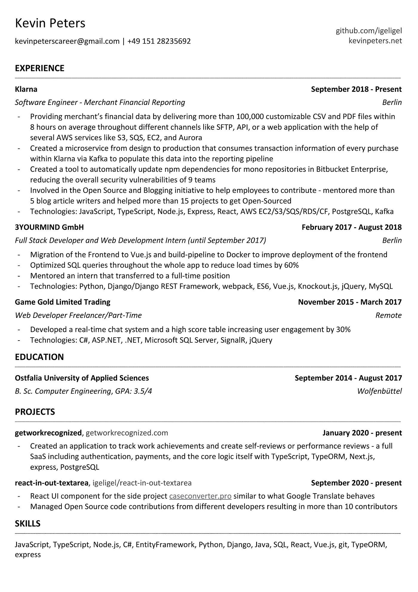

# 作为软件工程师的个人品牌

> 原文：<https://levelup.gitconnected.com/personal-branding-as-a-software-engineer-572eee5edab9>

最近在工作中，人们讨论了一种工具，这种工具可以对员工和申请人的 GitHub 简介进行评级。使用该工具可能不道德——这是结论，但围绕另一个角度进行了讨论:一个好的 GitHub 配置文件会让你成为更好的开发人员吗？让我们来看看这个问题，看看你如何应用一些简单的东西来提升你的 GitHub 个人资料，让自己更有价值。

# GitHub 和就业市场

[GitHub](https://github.com/) 是一个托管代码的平台。但对许多人来说，它正在成为社交媒体。[发现新潮流](https://github.com/explore)，关注新人，观看其他项目。查看其他人在做什么，他们提交代码的频率，以及更多的事情。

GitHub 的主要用例是存储代码。但如今，所有其他因素都发挥着更大的作用。你可以把它和你的简历进行比较。一份精心设计的简历会说服更多的招聘经理雇佣你。拥有多页或不必要内容的简历可能会导致工作被拒。简历应该简短，让招聘经理相信你能给公司增加价值，而不是他们给你的薪水。这是公司雇佣你的主要动机。

我的简历简明扼要

然而，就业市场的竞争一年比一年激烈。越来越多的大学生希望在计算机科学领域找到工作，但随着训练营毕业生的增加，入门级工作的市场增加了可用人才的储备。你可以通过检查入门级的工作描述很容易地看到这一点，这需要多年的技术经验，而大学不会教这些。因此，这些训练营是为了满足市场需求而创建的。为了理解这是如何影响市场的，我们必须看看市场需求。

目前，公司正在广泛寻找软件工程师。大多是高级工程师。但是为什么呢？答案很简单:他们不想培训软件开发人员，而是让他们开发出可以长期维护的产品。如果你让应届毕业生去做这件事，可能会奏效，但最常见的是，他们会从中吸取教训，做出错误的决定，但对许多公司来说，这是不好的，因为这可能意味着他们需要投入更多的长期资金。短期收益但长期亏损。对于初级开发人员来说，这是一个完美的环境，因为他们可以从错误中学习。创业公司更喜欢冒这种风险，但也更愿意付出代价。但是如果你喜欢这个，就加入一个创业公司。之前描述的案例将主要适用于工程不是一等公民的公司。不仅仅是一家科技公司，在那里工程是一项支出，而不是一个商机。

# 公司在寻找什么？

较大的公司，包括 FAANG ( [脸书](https://www.facebook.com/careers/)、[苹果](https://jobs.apple.com/en-us/search?location=united-states-USA)、[亚马逊](https://www.amazon.jobs/en/)、[网飞](https://jobs.netflix.com/)、[谷歌](https://careers.google.com/jobs/results/))和类似的公司，对招聘初级工程师更加开放。为什么？原因很简单，他们有资源，有更多训练有素的高级工程师，知道如何教其他开发人员“正确”的做事方式。这些公司将员工与公司的股票期权捆绑在一起更长时间，因此任期是值得的，员工对收入的贡献超过了他们的成本。

如你所见，初级开发人员的市场现在看起来相当糟糕。但是有些事情你可以采取行动:你的适销性。为了理解这一点，让我们再来看看不同的公司及其需求:

**创业小，< 15 人**

*   员工可以快速构建软件，构建原型
*   员工可以随意接触不同的工作领域，如销售、营销、产品等
*   员工应该有良好的推销技巧来推销自己和产品

**启动介质，> =15 人**

*   员工可以非常快速地构建软件，构建原型——但是应该可以维护一年以上
*   员工可以随意接触一些不同的工作领域，如销售、营销、产品等
*   营销技巧变得不那么重要了

**普通公司**

*   技术不是很重要，员工应该能够维护当前的软件
*   员工应该能够不时地添加功能，通常没有巨大的时间压力
*   不需要其他技能

**大型科技公司**

所有 FAANG 公司的旗帜

*   技术收入最高，是公司的动力，创新是由技术推动的
*   员工面临的挑战是尽可能地为产品做出贡献，进行创新
*   产品焦点也可以是完全技术性的，比如编译器焦点。只是提高性能之类的。
*   市场营销等其他机会也可以利用，但会很有挑战性

所以不同的公司有不同的要求。一个初级的人如何说服这些公司雇佣他们？通常情况下，所有公司最重要的部分是经验。实习，现实生活中的项目，以及过去的全职职位。在大学期间或训练营结束后，你可以寻找实习机会。这类职位的入职门槛会远远低于全职初级职位，大部分公司会在实习后转为全职。但即便如此，你也可能会与数百名其他申请人竞争。那么如何脱颖而出呢？这让我们回到了最初的讨论: [GitHub](https://github.com/) 。

GitHub 将用于检查您的编码能力。但是招聘经理会检查什么呢？让我们进入招聘经理的位置。他们没有很多时间，而且他们知道“好”的软件项目看起来是什么样的。大多数情况下，当你是一个项目的新手时，你希望得到一些关于软件正在做什么以及如何运行它的指导。**你**。确保自述文件包含示例、简单的安装说明以及越来越多的示例。不要只关注文本，还要在自述文件中包含丰富的媒体内容，如图像或视频。确保你得到版权和许多其他东西。我将会写一篇关于好的自述文件的指南。

react-in-out-textarea 的简历示例

否则，您的 GitHub 个人资料的很大一部分就是个人资料页面。你会看到不同的东西，比如你应该填写的基本账户信息。用一张好的照片，让别人能看到你的脸。这将确保人们与真实的人类互动。此外，配置文件页面还包括三个组件:自定义配置文件自述文件，这是可选的，但很好。你可以在这里找到一些文档: [GitHub Docs |管理你的个人资料自述文件](https://docs.github.com/en/free-pro-team@latest/github/setting-up-and-managing-your-github-profile/managing-your-profile-readme)。此外，在这个自述文件中确保为什么一家公司**应该雇用你**！一定要解释你如何为他们的公司贡献价值，增加公司的收入和利润。沿着这条线的东西:

> 我是一名专注于前端技术的软件工程师。在我的项目中，我使用了几个用户体验增长技巧来提高参与度，并推动用户参与项目。我知道基本的 SEO 术语，可以帮助你提高产品的适销性。请随意查看我下面的项目:
> 
> -项目 X Y (JavaScript，Node.js，TypeScript)
> 
> -项目 Z (Java，…)
> 
> - ….我目前正在寻找新的机会。如果你想和我一起工作，请随时给我发邮件。

这份简历将确保你对招聘经理产生兴趣。这会驱使他们去做项目。有了完美的自述文件，你在这一点上做得很好。

招聘人员或招聘经理可能会看的另一件事是贡献图。但老实说，这不是一个好的衡量标准。这很好，但不应该对你的就业能力有直接影响。

# 作为网络工具的 GitHub

大多数软件工程师寻求发展。他们想成为高层，赚更多的钱，过更轻松的生活。或者他们想发展自己的解决方案。有很多事情。但是重要的是要明白，这些事情大部分都可以在团队内部完成。创建一家创业公司非常困难。你必须专注于多个方面，如营销、销售、产品和工程。复杂性是巨大的，与其他人合作是重要的。要让别人和你一起工作，你必须了解他们。一个机会是 GitHub。对贡献持开放态度，并与其他人一起工作。例如，在 [Hacktoberfest](https://hacktoberfest.digitalocean.com/) 期间，你可以准备你的投稿项目。我会写一份详细的指南。但简而言之:为贡献者创建一个好的自述文件，目标稍有不同，创建易于理解的问题，并对任何请求保持开放。在 hacktoberfest 期间，只需用所需的问题标记您的存储库和问题，您将很快收到许多投稿。寻求反馈，但也要与人沟通。在[Twitter](https://twitter.com/kevinpeters_)/[GitHub](https://github.com/igeligel)/[LinkedIn](https://www.linkedin.com/in/kevinpetersde/)上请求关注，以便保持联系。这些机会总有一天会有回报的。即使没有，你也在被动地建立一个能帮你找到酷职位的受众，因为你永远不知道这些人最终会在哪里工作，也许是谷歌、网飞，或者是你喜欢的创业公司。

GitHub 的网络效应非常巨大。所以，用吧。只要你能以某种方式为对方提供价值，你就有很多机会与人交流。

# 其他平台

还有很多其他的平台可以让你联系到其他的专业人士。社交网络可能是最大的。Twitter、脸书集团或 LinkedIn。报名吧，看看什么最适合你。还有很多其他社区，比如 Discord 服务器、IRC 频道和类似的社区，你可以免费加入。尝试在这些平台上提供价值，你会看到你的网络缓慢但肯定地增长，机会将由此产生。

# 结论

尽管我在一开始提到的我公司的讨论指出了一个不同的问题，但这表明作为一名软件工程师，你的个人品牌是非常重要的。雇主实际上会以某种方式关心你的 GitHub，如今人际网络比以往任何时候都更重要。所以，让你的 GitHub 档案变得更好吧🎉

*最初发表于*[*【https://www.kevinpeters.net】*](https://www.kevinpeters.net/personal-branding-as-software-engineer)*。*