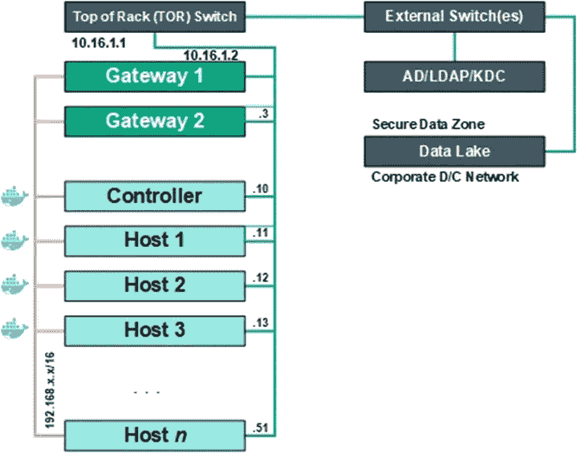
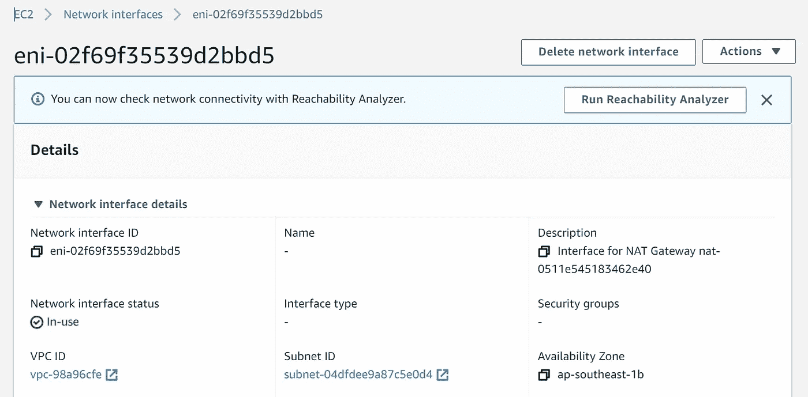
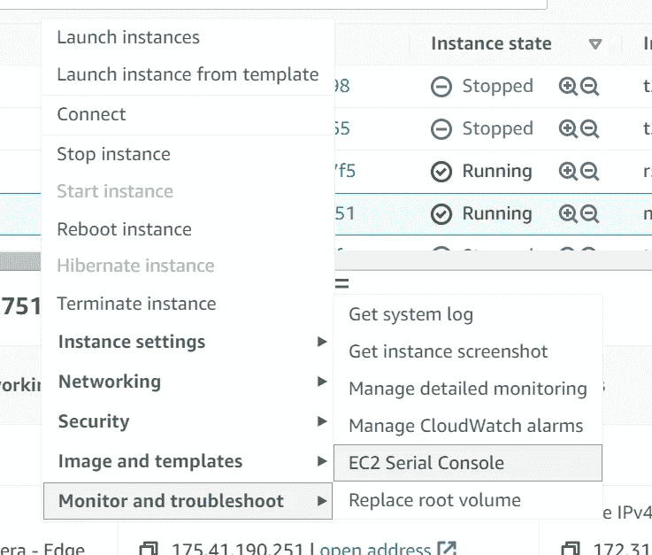
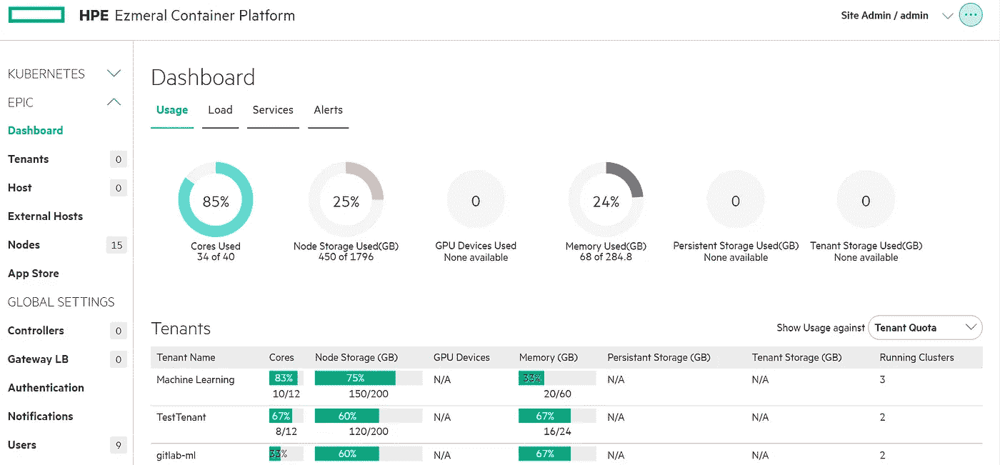

# 宠物 vs 牛深度

> 原文：<https://levelup.gitconnected.com/pets-vs-cattle-in-depth-4dbfde632a02>

由 [Alvan Nee](https://unsplash.com/@alvannee?utm_source=medium&utm_medium=referral) 在 [Unsplash](https://unsplash.com?utm_source=medium&utm_medium=referral) 上拍摄

对于像我一样在数字行业工作的人来说，我们对宠物与牛的类比并不陌生。我经历了深入管理服务器的学习曲线和差异，我想写下来，以便缩短服务器管理员的学习曲线，他们习惯于把服务器当作牲口，突然发现自己不得不把它们当作宠物。

如何识别服务器必须被视为宠物？当服务器软件不能像牛一样被对待时，有一些迹象可以说明问题:

1.  服务器使用内部 DNS/IP 作为固定地址来识别自己
2.  服务器通过 SSH 相互通信和安装，因此需要将`id_rsa.pub`键传递给所有相关服务器的`authorized_keys`文件。
3.  每台服务器都有一个名称或用途(网关、主服务器、控制器、工作服务器、数据服务器)，它们所需的规模非常大。
4.  用户很少，最多可能在几百到几千之间。
5.  它们通常很贵，可能是 ERP 级别的

通常他们的架构图如下所示:

我是宠物！

那么，当你遇到这样一个软件并被要求安装在云中时，你该如何处理它呢？假设 AWS？以下是一些建议:

***创建网络接口，分配内部 IP***

[杰米·斯特里特](https://unsplash.com/@jamie452?utm_source=medium&utm_medium=referral)在 [Unsplash](https://unsplash.com?utm_source=medium&utm_medium=referral) 上拍摄的照片

假设您有一个新的 AWS 帐户，您要做的第一件事是**而不是**创建 EC2 实例并开始安装。您要做的第一件事是为每台服务器规划并分配一个内部 IP 地址。为什么？因为引用*“如果你有三只宠物狗，给它们起名字。如果你有一万头牛，就别麻烦了。”，*所以开始给你的宠物取名*。如前所述，软件将与 IP 地址紧密结合，因此如果你在 AWS 中，第一件事就是创建所有需要的网络接口，每个接口都有你想要分配的固定 IP。然后创建 EC2，并将网络接口分配给唯一的 EC2(控制器、主机等)。*

嗨！我是 ENI。我给你的服务器一种认同感和自我价值感

***备份服务器***

比如说，如果你想让一只死去的宠物猫复活，你会执行一些被禁止的仪式来让它复活。如果 ERP 服务器不工作，您想快速更换它，该怎么办？你不能就这样进入一个 AMI，然后把它恢复成一个 EC2。你不是在和一个不关心 IP 地址的 Drupal 应用打交道。您正在处理一个需要与其他服务器通信的服务器，反之亦然

您必须首先杀死失效的服务器，以释放包含您喜爱的服务器的 IP 地址的网络接口，并将其分配给从备份 AMI 创建的新 EC2，以便服务器可以具有相同的 IP 地址，并且不会有身份问题。

我是 10.0.71.33 吗？或者我是 172.111.7.9？

***有单独的方式访问服务器***

转到 EC2 串行控制台

云和内部有很大的不同。当服务器在本地时，OpenSSH 突然不工作了，您可以带一个显示器和键盘，并将其插入服务器 VGA 和 USB 端口，以检查出了什么问题。在 AWS 或 GCP 有同样的问题，如果你试图在他们的数据中心做同样的事情，你会被警察拘留。所以大概你别无选择，只能杀了服务器，去一个角落哭。

但是还有一个选择。在 AWS 中有 EC2 串行控制台。在服务器设置的开始，你必须在服务器中创建一个有密码的用户，在任何不好的事情发生之前。因此，当服务器出现访问问题时，您可以右键单击服务器，转到“monitor and troubleshoot ”,然后转到 EC2 控制台。它将弹出一个服务器控制台，输入您之前设置的用户名和密码，您将获得所需的访问权限

请记住，并不是所有的 EC2 实例类型都有这个特性。请仔细检查他们的[文档](https://docs.aws.amazon.com/AWSEC2/latest/UserGuide/ec2-serial-console.html)。记住你把你的服务器当成宠物，所以给它一个大小合适的家。这与基于牛的服务器不同，你给它们最低的规格，你[自动缩放](https://mosesliao.medium.com/tips-on-building-a-ha-architecture-62661930e407)它们以应对流量。不过，你和 GCP 不会有问题。当他们第一次推出他们的[电脑产品](https://cloud.google.com/compute/docs/ssh-in-browser)时，他们基于网络的控制台就已经内置了。

***日志可以内部保存***

您不需要将日志推送到 elasticsearch 或 cloudwatch，因为它们有许多不同的日志文件用于不同的故障诊断目的。Logrotate 是一个比较好的宠物日志管理工具。这让我想到了*接下来非常重要的一点*:

***如果实例/服务器遇到问题*** ，不要立即终止

当你的宠物生病时，你并不立即杀死它。你带它去看兽医。与带有 pet 设置的服务器相同。您需要 SSH 登录，检查日志，尽您所能找到根本问题。请记住，您处理的是有状态服务器，它往往包含大量信息。你不想在服务器遇到困难的时候就终止它，因为你想知道它是如何遇到问题的

***有交错启动和关闭***

我们都知道这一点，对吗？为了省钱，我们在周末和睡觉的时候关闭了 EC2 服务器上基于网络的应用程序，这样就不会积累不必要的成本。ERP 服务器呢？即使在 UAT/SIT 环境中，每天关闭服务器通常也是不可取的，但是如果您真的想这么做，您最好很好地跟踪依赖关系，并进行交错启动和关闭。

我使用 [HPE Ezmeral Platform](https://docs.containerplatform.hpe.com/53/) 的经验是，其中一个服务器必须被视为宠物，如果链接到外部认证工具(LDAP/AD)并且该链接不存在，当服务器启动时，现有的容器将无法工作，您也无法创建新的容器。因此，最好是确保先启动 LDAP，然后再启动 Ezmeral 集群。您会注意到一些有趣的事情:在控制器和工人之前，网关将首先通过 2/2 的状态检查。原因是身份认证需要在这些虚拟机中传播，然后它们才能正常工作。

看哪！HPE 埃兹迈拉集装箱平台！

# 结论

心态的转变并不容易。想象一下，一个养猫的人转行到牛屠宰场工作，在看到牛是如何被杀死的之后，他会有心理问题。或者屠宰场的工人转到宠物店工作，在 3 天内杀死所有的宠物。这需要时间，所以放松自己，克服心态上的困难。