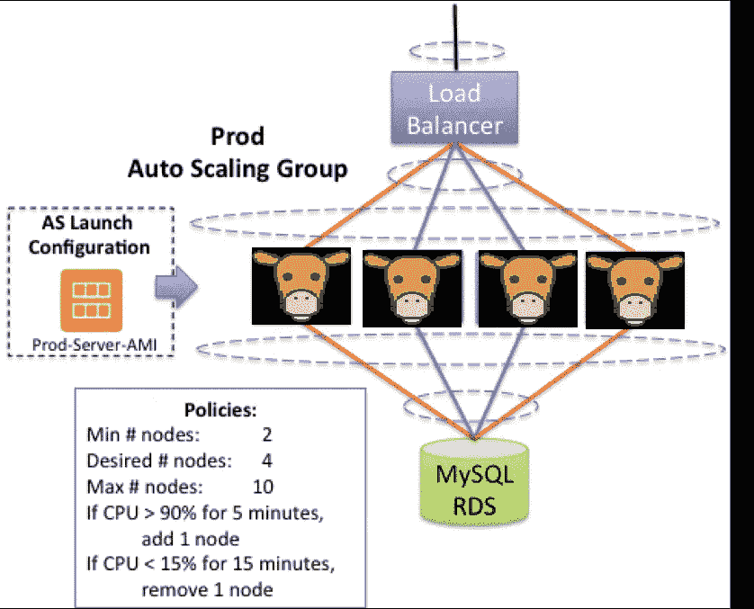
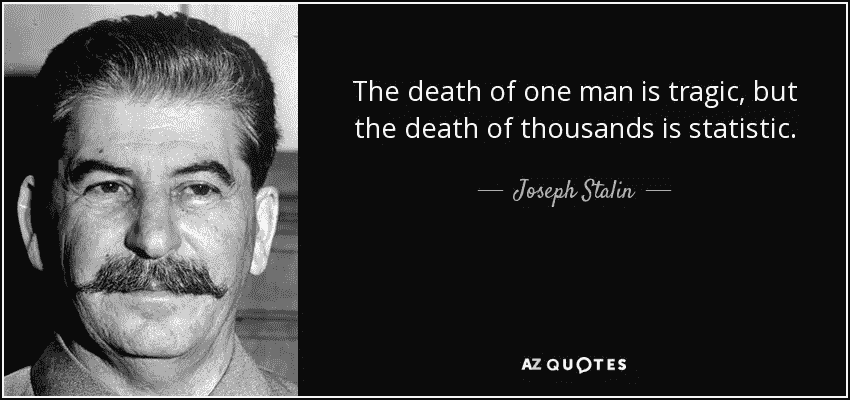

# 宠物与牛第二部分

> 原文：<https://levelup.gitconnected.com/pets-vs-cattle-part-2-682995f52e47>

[费比延](https://unsplash.com/@febiyanr?utm_source=medium&utm_medium=referral)在 [Unsplash](https://unsplash.com?utm_source=medium&utm_medium=referral) 上的照片

你如何对待你的服务器作为一个牛或作为一个[宠物](/pets-vs-cattle-in-depth-4dbfde632a02)需要非常不同的心态。我的上一篇文章讲述了如何判断你的软件或架构是否需要将服务器视为宠物。现在我想谈谈如何把服务器当牛。

通常，牛服务器具有以下属性:

1.  倾向于基于免费的开源软件
2.  是无状态的，只与有状态的应用程序(MySQL，Redis)服务通信，而不相互通信
3.  从(AMI 或 docker 存储库)中提取一个映像
4.  非常具有水平扩展性
5.  客户往往以百万计，因此服务器以百计

这个架构看起来像这样:

Mooo！！！！！Moooo！！！！

那么如何处理这样的架构呢？让我们开始吧！

**有一个创建图像的管道**

这是直接来自星球大战克隆人战争。你想要一个超级士兵，在那里你可以用 DNA 来克隆你的士兵。您需要一个 EC2 或其他 VM 类型的实例，安装并设置您的 HTTPD 或其他 web 服务，并对其进行镜像。或者，如果您使用 Dockerfile，创建一个管道来运行它，并将映像推送到存储库来启动容器

宠物的流程如下:

1.  创建服务器
2.  安装软件，确保它按计划运行
3.  将其视为日常备份
4.  将服务器用作 UAT /生产
5.  任何变化/插件只是 ssh 在和做它

牛的流动略有不同:

1.  创建服务器
2.  安装软件，确保它能正常工作
3.  创建服务器/docker 文件的映像并推送映像。
4.  根据步骤 3 中的映像，在负载平衡器上旋转出一台服务器
5.  如果有任何问题，请重复步骤 1 至 4

因此，当务之急是你要创建尽可能好的图像，这样你就不会在运行时遇到问题。

**创建一个管道来部署映像**

如前所述，所有的冲锋队都来自同一个基因，因此你可以标准化他们的部署。使用 env 参数，以便可以将同一个映像部署到不同的环境中。

**将所有日志集中到一个地方**

在一个牛群设置中，服务器的数量可以达到数千个，所以要想办法将日志抽取到一个可以收集所有日志的地方(cloudwatch/logstash/kibana)。这样，当服务器或容器出现错误时，开发人员就可以方便地查询并找出问题所在。

**当服务器不工作时关闭服务器**

是的，我知道，这听起来很残酷，但是当你有成百上千的服务器，也就是牛在跑的时候，作为一个系统管理员或开发人员，你很难照顾好每一只牛。因此，进行健康检查，如果服务器没有通过健康检查，将会终止服务器，并让自动缩放功能替换它们。你宁愿立即关闭服务器，也不愿意有一大群不高兴的客户。

斯大林的话在牛群中听起来很真实

**服务器供应不足，数据库/缓存供应过度**

不像宠物，你不能把奶牛放在狗窝里。你把它们放在一个开放的围栏里，因为这样更便宜。对于像牛一样的服务器，提供足够的 CPU 和内存运行而不抛出错误，让云的自动伸缩特性接管。对于高速缓存和数据库，提供更多资源，以便动态添加新服务器不会让它们不堪重负。

**将对服务器的访问仅限于一个应用端口**

这是标准的。Web 在 80 上运行，一些 java 应用程序在 8080 上运行，因此对于防火墙规则，只开放应用程序需要运行的一个端口和 1-2 个其他端口来与数据库/缓存通信。如果你需要打开不止一个端口来和其他服务器对话，那么你不是把它当牛，你是把它当宠物。所以要非常清楚这一点。如果您需要在相同的源代码上打开另一个端口，请在不同的服务器上运行它。

也从来没有打开过 22 号端口。这是为了安全。我甚至不允许自己通过 SSH 进入服务器，因为如果您输出日志，可以在 cloudwatch 上进行故障排除。

**结论**

我关于如何为系统管理员设置宠物和牛的区别的讨论到此结束。人们不应该认为宠物设置比牛好或者牛设置比宠物好。在开始创建基础设施之前，你需要仔细考虑这是一个宠物设置还是一个牲畜设置，然后将心智框架应用到它上面。