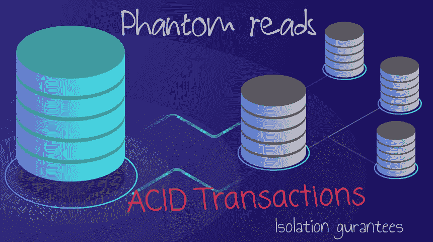
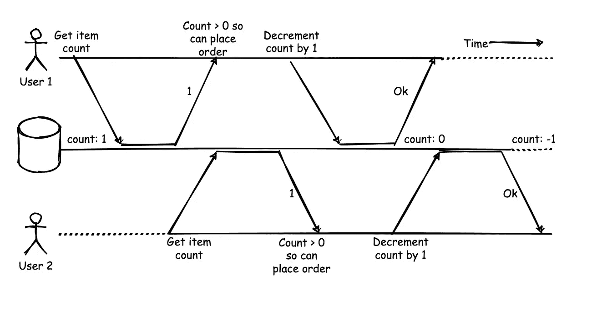
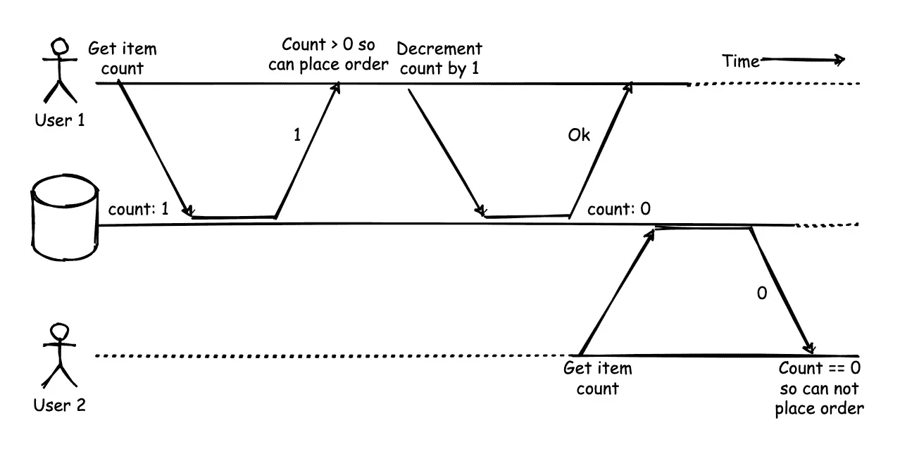
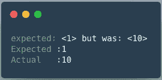
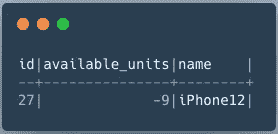
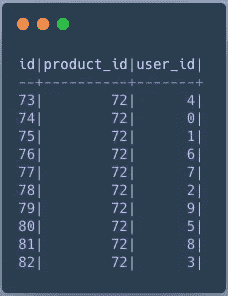
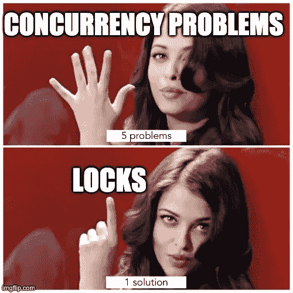
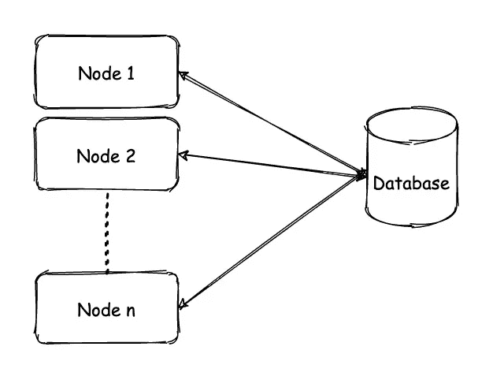
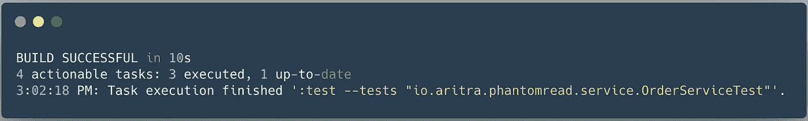

# 幻影读取:数据库上的竞争条件

> 原文：<https://levelup.gitconnected.com/phantom-reads-race-condition-on-database-45a2990efc97>



基础图片:[https://www.techgig.com/](https://www.techgig.com/)

T 何数据库[交易](https://www.guru99.com/dbms-transaction-management.html)中[酸](https://www.educative.io/edpresso/what-are-acid-properties-in-a-database)的故事和时间一样古老，但人们对这些性质的理解却存在着很多困惑和歧义。我见过有人有这种误解，认为既然他们使用的数据库提供了 ACID 支持，那么默认情况下一切都会高度一致。嗯，这种说法是不正确的。如果你不相信我，继续读下去，我会证明给你看。

在支持 ACID 的 SQL 数据库中也会出现许多一致性和隔离问题，其中大部分是由于我们系统的并发性而产生的。原子性、一致性和持久性有些简单，但是您在系统中可能面临的大多数问题可能是由于隔离造成的。

# 隔离

让我们首先理解隔离在数据库事务的上下文中意味着什么。简单地说，隔离意味着，如果有多个数据库事务同时发生，它们不应该相互影响，数据库引擎应该以这样一种方式处理它们，即并发事务应该像串行执行的事务一样。数据库支持不同的隔离级别，每个级别都可以防御某些类型的[隔离问题](https://en.wikipedia.org/wiki/Isolation_(database_systems))。但是隔离的定义会因提供者的不同而不同。这里有一个非常有趣的不同 db 提供的隔离级别对比[ [链接](https://fauna.com/blog/a-comparison-of-scalable-database-isolation-levels) ]。

# 幻像读取

现在让我们来看这篇文章的实际主题，即幻像读取。这也是由于数据库中的弱隔离保证而引起的异常之一。很难从理论上解释这一点，因此我将尝试用一个例子来解释这一点。

假设您正在为 Amazon 构建一个订购系统，这是用户下订单时发生的情况。

1.  获取项目计数
2.  检查计数是否大于 0
3.  如果为真，则将该项的计数减 1
4.  创建订单

简单吧？LOL，不太会。让我们试着看看在一个高度并发的系统中这是如何引起问题的。



平行交易

让我们来理解这个图表

1.  数据库中的项目计数为 1。
2.  用户 1 获取计数，并返回 1。
3.  用户 2 获取计数并返回 1。
4.  用户 1 看到 count > 0，假定该商品可用并下了订单，并将 count 减 1。
5.  用户 2 看到 count > 0，假定该商品可用并下了订单，并将 count 减 1。
6.  用户 1 已下订单。
7.  用户 2 已下订单。

因此，即使只有一件商品可用，用户实际上也能够预订该商品。这是一个幻像读取问题，其中事务修改条件中使用的值，以检查事务是否应该通过。简而言之，多个事务读取同一个对象来决定一个事务是否应该通过，然后可能更新该对象或其他对象。

这是一个非常常见的问题，在这类系统中可能会发生

1.  预订系统(两个人预订同一个房间)
2.  用户管理系统(两个人获得相同的用户名)
3.  客户服务系统(一个代理同时被分配多个呼叫)

或任何其他系统，在该系统中，您检查并修改相同或不同的对象，使得可行性检查条件结果现在被改变。现在请注意，在检查条件之后，事务可能不仅仅改变相同的对象，而且可以改变或创建不同的对象。有时，检查条件的对象可能不是实际的数据库行。例如，如果您检查符合条件的对象计数，然后根据结果更改不同的行，则计数不是物理行，而是不同行的聚合数据。当你执行第二步时，count 的值会改变。因此，即使您没有像上图所示那样更新公共行，也仍然可能产生幻像读取问题。

> 话虽如此，幻像读取总是遵循相同的模式
> 
> 1.运行选择查询以获取符合特定条件的数据。
> 
> 2.根据 first 的结果，事务要么继续，要么中止。
> 
> 3.如果事务继续进行，那么您进行一些插入、更新、删除调用并提交事务。
> 
> 我希望现在你已经明白什么是幻影了。

让我们继续前进。现在，在绝对隔离的情况下，这些事务应该看起来像是连续发生的。请注意，它们不一定连续运行，但如果连续运行，结果是一样的。



连续交易

理所当然地，第二笔交易失败了。

> 幻像读取在并发的分布式世界中非常常见。但你不必相信我的话，我说过我会证明给你看，所以让我们跳到代码中，看看我们能否重现这个问题。

# 让我们开始编码吧

手动重现这些问题非常困难，因此我们将借助测试来重现这些问题。(一路 TDD😜 ).我将演示如何使用 Java + PostgreSQL。不管技术如何，这个概念都是一样的，所以不要担心，跟着做。我会尽量用详细的解释和代码注释让你更容易理解。

该测试将一个可用性计数为 1 的产品插入数据库。然后试着同时下 20 个订单。

我来给你演示一下下单的实际实现。

它按照下面的顺序做了几件事

1.  从产品表中获取(选择)请求的产品
2.  检查可用性计数是否大于 0
3.  如果是，则将计数递减(更新)1，并在顺序表中建立一个条目。

> 你可以看到这个图案和幻影图案是一样的，对吗？

这是原子递减计数方法(如果您在一个查询中计数，然后在另一个查询中设置，这会产生一组不同的问题)

# 问题:测试失败

在运行测试时，我得到了这个



Junit 结果

下了 10 份订单，而不是 1 份。不相信我？让我们看看表格。



产品表



订单表

# 解决方法

现在我们已经确定这个问题是真实存在的。那么解决办法是什么呢？我很高兴你问了。让我们看看我们的选择



因为没有迷因，我的博客是不完整的

在不同的竞争条件解决方案中，锁定无疑是一个强有力的竞争者。所以下一个问题是什么样的锁？

## 代码级锁？

我们可以使用代码级锁来阻止临界区`placeOrder`一次被一个线程使用。这是一种非常幼稚的方法，但它会起作用。除非您运行订单服务的多个实例。我的意思是，如果只有一个节点运行这个订单服务，那么代码级锁就可以工作。但是在 Amazon 的规模上，你不能在一个节点上运行你的服务，你可能会运行数千个相同服务的实例。欢迎来到分布式系统😂



分布式服务设置

一个非常简单的生产设置可能如下所示。现在我们不能设置代码级锁，在这个图表中，所有服务的共同点是什么？数据库对吗？那么我们可以使用数据库锁吗？让我们看看。

## 数据库锁

让我解释一下数据库锁是如何解决这个问题的。

步骤会是这样的。

1.  **开始**交易**交易**
2.  **从**产品**中选择** * **其中** id = '27' **和**取一个**独占** **锁** **在**行上
3.  **检查** **如果** **计数** > 0
4.  **更新**产品**设置**available _ units = available _ units-1**其中** id = '27 '
5.  **将** **插入**订单…..
6.  **提交** **事务**
7.  **释放** **独占** **锁定**

## 了解排他锁

在我们继续之前，让我们了解一下什么是排他锁。

简单地说，排他锁就是写锁。它的一些特性是

1.  一个对象上只能有一个排他锁。
2.  当你拥有这个锁的时候，你可以读写这个对象。
3.  任何试图获取任何锁的人都必须等到这个锁被释放。
4.  因此，当一个对象上存在一个排他锁时，其他事务的读和写都会被阻塞，直到前一个锁被释放。

因此，当第一个事务开始时，它锁定 iPhone12 行，因为这是一个排他锁，所以所有其他事务都必须等待，然后才能读取或写入。

# 多工艺流程

因此，具有两个不同并行流程的流程看起来像这样

1.  **流程 1:** *获取 iPhone12 排并锁定排:* ***成功***
2.  **进程 2:** *获取 iPhone12 行并锁定该行* : **等待**该进程必须等待进程 1 释放锁定，然后才能继续。
3.  **流程 1:** *检查计数>是否为 0* : **为真**
4.  **流程 1:** *减量计数减 1:* ***成功***
5.  **进程 2:** *仍在等待获取 iPhone12 上的锁行:* **等待**
6.  **流程 1:** *录入订单表:* **成功**
7.  **流程 1:** *解锁 iPhone 12 行:* **成功**
8.  **流程二:** *获取 iPhone12 上的一个锁行现在:* **成功**
9.  **流程 2:** *但计数为 0，于是中止交易:* ***失败***

好吧，看来这能解决我们的问题。让我们把它编码起来。

# 用于更新

Postgres 上最接近排他锁的是“ [For UPDATE](https://www.postgresql.org/docs/9.4/explicit-locking.html) ”关键字，我们将使用它。

所以让我们创建一个使用锁的新方法

这将保持对 iPhone12 行的锁定，直到事务被提交。

在`placeOrder`方法中，我们将使用这个，而不是`findById`方法。

是时候再次进行测试了。



测试成功

瞧，测试通过了，这意味着只下了一个订单，我们就能解决幻影读取。

# 可序列化隔离级别

除了上面提到的方法之外，我们还可以为这个特定的事务指定“可序列化”的隔离级别，在这种情况下，数据库基本上可以通过某种方式以某种接近串行顺序的方式运行事务。

要运行具有*可串行化*隔离级别*的*就行了。

```
@Transactional(isolation = Isolation.*SERIALIZABLE*)
```

Serializable 是隔离的最高形式，它解决了所有的隔离异常。但是在某些情况下，不可能使用可序列化隔离。

# 但是

1.  凡事都有权衡，使用锁和可序列化隔离级别可以解决问题，但会降低系统速度。
2.  数据库锁和隔离级别是危险的领域，在使用它们之前一定要正确理解它们，因为它们可以成就或破坏您的系统。

# 离别赠言

1.  我希望你能够理解这个问题和解决方案。我想现在您已经有足够的能力来处理生产中的幻像读取，或者至少有足够的知识开始工作。
2.  如果您对这些概念感兴趣，您可以去阅读更多关于不同异常的内容，如脏读、更新丢失、可重复读取等，以及防止这些异常的不同技术。我推荐这个精彩的[视频](https://www.youtube.com/watch?v=5ZjhNTM8XU8)，由独一无二的马丁·克莱普曼制作，它会让你开始。
3.  如果您想查看包含所有代码的整个工作项目，可以在 GitHub 上找到

[](https://github.com/dev-aritra/phantomread) [## dev-aritra/phantomread

### 在 GitHub 上创建一个帐户，为 dev-aritra/phantomread 开发做出贡献。

github.com](https://github.com/dev-aritra/phantomread) 

感谢阅读！

> 我是 Aritra Das，我是一名开发人员，我非常喜欢构建复杂的分布式系统。任何与科技相关的事情，都可以在[*Linkedin*](https://www.linkedin.com/in/dev-aritra/)*或*[*Twitter*](https://twitter.com/aritra__das)*上联系我。*
> 
> 快乐学习……