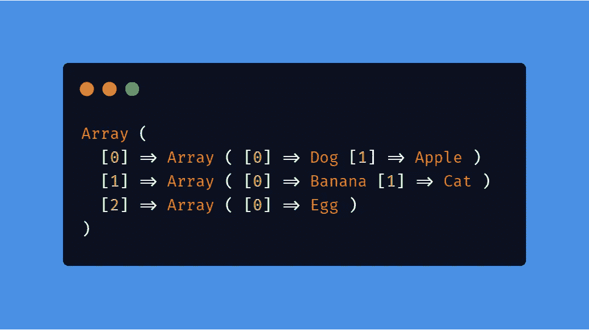

# PHP 数组

> 原文：<https://levelup.gitconnected.com/php-arrays-64d9c823e4fd>

在 PHP 中可以用这个简单的数据类型做的事情

看完这篇文章，你应该知道:

*   什么是数组，
*   各种类型的数组
*   向数组中添加元素
*   从数组中移除，
*   而且还是很多。

要开始，您应该知道:

*   基本 PHP，变量，以及如何输出到屏幕上。
*   有编程经验会有所帮助。

> PHP 是一种服务器脚本语言，也是制作动态交互式网页的强大工具。
> 
> PHP 是一个广泛使用的、免费的、高效的替代品，可以替代微软的 ASP。
> 
> PHP 7 是最新的稳定版本。

作为一种流行的编程语言，它允许使用多种数据类型进行数据操作。

# 入门指南

> 数组是将一个或多个相似类型的值存储在单个值中的数据结构。

数组可以说是数据的集合。它可以是一个空的集合，就像一个空盒子，或者只有一个项目，就像一辆只有一个人的汽车——它可以带更多你知道的东西，或者你想要多少项目就带多少项目。

数组有各种类型，数字索引数组，关联数组，多维数组。

# 创建数组

PHP 中数组的创建和其他数据类型一样，它被赋给一个变量。

数组可以通过多种方式创建。

其他时候，你可能想要一个简单的数组，但是输入起来太紧张了。你可能需要一组数字或者一组英文字母。

## 范围()

range 函数有助于在给定起点和终点的情况下自动生成数组的内容。

# 打印阵列

所以现在我们有了我们的食物阵列，它包含了一些食物——我知道猫不是食物，是吗？我们继续吧。我们希望将数组输出到浏览器或终端的屏幕上。

我们使用 ***print_r*** 函数，它以人类可读的方式显示关于变量的信息，在这个上下文中是一个数组。阅读更多关于 ***print_r*** [这里](https://www.php.net/manual/en/function.print-r.php)。

现在，你一定想知道数组中的数字是什么，让我们在下一节看看它们是什么。

# 数组索引

PHP 数组是由元素组成的，数组中的每一项都被视为一个元素，每个元素都有一个索引，通过这个索引可以引用它。

索引是在创建数组时自动生成的，第一个元素的索引为零——PHP 和其他编程语言一样是零索引的，但是如果需要，也可以指定索引。

PHP 数组| [Educative.io](https://www.google.com/imgres?imgurl=https%3A%2F%2Fwww.educative.io%2Fapi%2Fedpresso%2Fshot%2F6594177787756544%2Fimage%2F5441204286128128&imgrefurl=https%3A%2F%2Fwww.educative.io%2Fedpresso%2Fwhat-are-numeric-arrays-in-php&tbnid=-_A7bkjn1CJdWM&vet=12ahUKEwjQssyGmoHrAhXOwYUKHSonBqUQMyhPegUIARCWAQ..i&docid=7mMc8rBgUDkTyM&w=616&h=273&q=arrays&ved=2ahUKEwjQssyGmoHrAhXOwYUKHSonBqUQMyhPegUIARCWAQ)

因此，数组中的第一个元素的索引为 0，第二个元素的索引为 1，并且以这种模式继续。

要指定索引，只需按以下方式创建数组:

现在如何只打印出数组中的一项呢？保持冷静，继续读下去。

## 打印数组元素

很多时候你不想打印出数组中的每个元素，而只想打印出一个。

你用索引来选择单项并 ***呼应*** 将其调出。

或者你甚至可以用在这样的句子中:

输出数组元素| [Carbon.now.sh](http://Carbon.now.sh)

# 其他数组函数

因此，在实际应用中，阵列可能会变得很大，难以管理。

PHP 给了我们很多函数来做这件事。

## is_array()

PHP 的 is_array()函数告诉我们给定的变量是否是一个数组。如果是数组，则返回 True，如果不是数组，则返回 False。

## 计数()

PHP 内置的 count 函数告诉我们任何数组的元素数量。这个函数对于决定在 web 应用程序中显示什么非常有帮助。例如，在博客应用程序中，如果用户没有帖子或文章，则显示“还没有文章”，否则显示所有文章。所以你用 ***计数*** 函数来得到长度。

> 该函数与 Python 中的 len()函数或 JavaScript 中的 length()方法相同。

## array_sum()

***array_sum()*** 计算数组中所有元素的总和。

在本例中，数组是用 1 到 10 的数字自动生成的，总和是使用 ***array_sum()*** 函数计算的。

## 排序()

如果您希望元素从最低到最高排列，那么这个函数就是您所需要的，因为它返回的是相同的数组，并且元素已经排序。

## rsort()

此函数与 ***sort()*** 函数相反，因为值不是从最高到最低排序的。

## 无序播放()

其他时候，您可能想要构建一个随机引用生成器，或者想要在在线测试中随机化问题。

你使用 ***shuffle()*** 随机重新排列数组的内容。

该数组以新的随机顺序返回其内容。

> 请注意，在运行这段代码时，您的输出可能与我的略有不同，这是因为 shuffle 不会以指定的方式重新排列。因此多次运行代码也会输出不同的顺序。

## array_rand()

在其他一些情况下，您只是想要一个数组中的随机值，而不是打乱整个数组，就像在骰子游戏中，您想要在用户每次游戏时输出 1 到 6 之间的随机值。

这段代码每次运行时都会输出一个给定范围内的随机数。

## in_array()

***in_array()*** 帮助你检查一个数组中是否存在给定值。如果存在则返回 true，如果不存在则返回 false。

## 数组计数值()

假设你想做一份关于人们喜欢什么类型汽车的报告。所以你决定建立一个小的网络应用程序，让用户输入他们最喜欢的汽车类型。

现在，在数据收集的最后，你有一长串的汽车。使用***array _ count _ values()***可以知道数组中的每个元素重复了多少次。

返回的数组是一个关联数组，给定数组的元素作为键，它们的计数作为值。

## 数组唯一()

其他时候，你只想知道数组中有多少独特的元素。***【array _ unique()***返回一个只有唯一值的数组。

返回的数组是:

它显示在一个有 10 个元素的数组中只有 3 辆不同的汽车。

## array_diff()

用 ***array_diff()*** 函数可以很容易地得到两个或多个数组之间的差，该函数返回一个数组的值，这些值对于给定的数组来说不是公共的。

返回的数组，在这种情况下，只有一个元素作为唯一元素在 ***水果 _a*** 中，而不是在 ***水果 _b*** 中是“香蕉”。

## 数组 _ 反转()

****

**以及许多其他功能，我们将在后面讨论。**

**现在，我们可以学习如何向现有数组添加元素。可以将元素添加到数组的开头、末尾或数组中的特定位置。**

## **添加到数组的开头:array_unshift()**

*****【array _ un shift()***向一个数组的开头添加被传递的元素。元素或元素列表作为一个整体被预先考虑，以便元素保持相同的顺序。所有索引将被修改为从零开始计数。**

****

## **添加到数组末尾:array_push()**

*****array_push()*** 将数组视为一个堆栈，并将传递的元素推送到数组的末尾。数组的长度随着被推的元素数量而增加。**

****

*****array_push()*** 在向一个数组中添加多个元素时特别有用，但是在添加单个元素时，可以通过这种方式手动实现其目的。**

****

**使用 **array_push()** 的替代方法**

**到目前为止，我们只学习和使用了数字索引数组，现在让我们通过学习关联数组和探索更多的数组函数来更深入地研究数组。**

# **关联数组**

**数组可以不仅仅使用数字索引，还可以使用用户定义的键或索引。**

****

**关联数组的一个用例**

**因此，关联数组的工作方式就像一个包含键值对的字典。**

**如果我们对一个学生的考试成绩进行排列。**

****

**创建关联数组和创建普通数组没有太大的区别。所以其他方法仍然存在。**

****

> **关联数组可以比作 Python 字典或 JavaScript 对象。**

## **从关联数组打印**

**从关联数组打印与从普通的数字索引数组打印没有太大的不同，唯一的区别是使用键而不是索引来输出。**

****

**在句子中使用这些值与在数字索引数组中使用它们是一样的。**

## **仅列出关联数组中的键**

**在我们上面创建的 ***分数*** 数组中，我们可能需要没有分数的受试者进行某种评估或评价。**

**我们只使用 ***array_keys()*** 来获取密钥。它返回给我们一个密钥数组。**

****

**返回的数组是数字索引的，只包含 ***分数*** 数组的关键字。**

****

## **仅列出关联数组中的值**

**仍然使用分数数组，我们可以只得到分数而不必得到主题。**

**我们使用***array _ values()***只获取值。它向我们返回一组值。**

****

**返回的数组是数字索引的，只包含 ***分数*** 数组的值。**

****

## **检查关联数组中是否存在关键字**

**仍然使用 scores 数组，我们可以通过检查数组中是否存在一个键来检查学生是否做过某个特定的科目。**

*****array _ key _ exists()***将只在第一维搜索关键字，这意味着该函数只对关联数组有效，不适用于多维数组。如果在数组中找到给定的键，则返回 true，否则返回 false。**

****

**代码显示“英语是一个重要的主题”，因为该函数返回 true，因为它可以在键中找到“英语”。**

**在需要行和列的情况下，数组可能会变得更加复杂。然后，你需要多维数组。**

# **多维数组**

**多维数组基本上是嵌套在数组中的数组，其中最外面的数组可以看作是一个表，其中的数组是行，数组的元素是表的列。**

****

# **更多数组函数**

## **array_chunk()**

*****array_chunk()*** 根据给定的大小将数组分割成更小的块。因此，被拆分的主数组变成了多维数组，因为它现在包含其他数组。**

****

**运行上面的代码会得到以下显示较小数组的结果。**

****

## **数组组合()**

*****array_combine*** 帮助您从两个数字索引数组创建一个关联数组，使用第一个数组的元素作为新形成的关联数组的键，使用后者的元素作为数组的值。**

****

**新创建的 *students_scores* 数组现在是一个关联数组，如下所示:**

****

## **array_merge()**

*****array _ merge()***将一个或多个数组的元素连接在一起，使一个数组的值追加到前一个数组的末尾。它返回结果数组。**

****

**显示的代码将 scores 数组与 marks 数组连接起来，因为它们都是关联数组，并且两个数组中没有重复的键，所以得到的数组有四个键值对。**

****

## **ksort()**

*****ksort()*** 按键对数组排序，保持键与数据的相关性。这主要对关联数组有用。**

****

**现在，返回的数组按关键字排序。**

****

## **数组 _ 差异 _ 关联()**

**已经了解了如何用 ***array_diff()*** 在多个数组中寻找差异，在关联数组中寻找差异也没什么不同。**

****

**在上面的代码中，键“b”出现在两个数组中，但是值不同，因此被认为是不同的。**

****

## **array_flip()**

**array_flip()帮助您在关联数组中的键值对之间切换，将键转换为值，将值转换为键。**

****

**返回的数组仍然是关联数组。**

****

> **无论函数使用什么类型的数组，输出总是一个关联数组。如果给定一个数字索引数组，这些元素就成为它们索引的键。**

**至此，您一定已经学习了很多关于 PHP 数组的知识，并且一定非常熟悉使用它们。如果你想了解更多，请阅读官方文档[这里](https://www.php.net/manual/en/function.array)。**