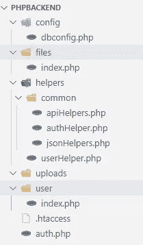

# React 应用程序的 PHP 后端。便宜。快点。

> 原文：<https://levelup.gitconnected.com/php-backend-for-your-react-app-cheap-quick-3f890a574acc>

## 戴夫的生活。叙事。主意

## 一个开发者通过远离主流赢得求职面试的故事。

照片由[莱昂](https://unsplash.com/@myleon?utm_source=medium&utm_medium=referral)在 [Unsplash](https://unsplash.com?utm_source=medium&utm_medium=referral) 上拍摄

伊莎再一次环顾四周。她对自己看到的一切感到高兴和满意——昂贵的小玩意、现代绘画和奢华的装饰。她喜欢公司。但她知道一件事:在这里找到一份工作并不容易。

面试的第二阶段即将开始。丽莎把椅子稍微挪了挪，面对着采访者。“该讨论你的测试任务了，丽莎，”面试官之一曼迪说。那天有三个人采访了她。Mandy 是项目经理，Anton 是高级开发人员，Advik 代表人力资源部。

“我们目前正在审查其他几名候选人，但你，丽莎，是第一个成功完成任务的人。所以，你是我们的最佳候选人之一。做得好，”曼迪继续说道，“安东，你愿意从我停下的地方继续吗？”

“是的，谢谢，曼迪。你的代码给我留下了深刻的印象，但是我有一个问题要问你。安东想知道，在所有后端技术中，你为什么选择 PHP。

“嗯”，丽莎似乎很困惑，“任务描述说我们可以使用任何我们喜欢的后端，你也证实了没有偏好，”丽莎回答。

“说实话，你的选择没有错。我只是想知道你为什么不选择 AWS、Azure 或与节点相关的产品。”

“嗯，我在寻找一种更简单、更便宜的选择。我的任务时间有限，我不想花太多时间配置服务器和解决意外问题。再加上我刚毕业，预算有限，”丽莎笑着解释道。

“AWS 和 Azure 都提供免费账号吧？”

“我已经为 AWS 的另一个职位完成了一项任务。在任务中，我花了太多时间配置 IAM、角色和网络。在我看来，Azure Cosmos DB 是我的最爱，因为它需要最小的配置。此外，一个免费帐户是有限的，因为我只能得到 400ru/s，也就是每秒几次读/写。如果我没弄错的话，项目的表现是一个重要的验收标准，”Lisa 解释道。

“是的，没错。性能至关重要。如果我可以问的话，你以前做过 PHP 项目吗？”安东问。

“不完全是，但我知道一些基本知识，而且我有一个相当便宜的主机，”丽莎回答。

“呵呵，听起来很有悟性！你能指导我一下你的后端代码吗，因为我实际上不是 PHP 专家？让我们从你的项目结构开始，”安东说。

“肯定的。我用 KISS 原则构建了我的项目，意思是保持简单，笨蛋。我还使用了 MVC 方法。如您所见，每个端点都有自己的文件夹。所有的控制器，我也称之为处理程序，都放在指定的文件夹中。我还有一个配置文件夹和另一个存放常量和字符串的文件夹，”Lisa 解释道。

显示项目结构的图片

安东点点头。

“这是我的数据库配置文件，它不仅存储配置设置，还为助手提供数据库连接，”Lisa 继续说道。

“最初，我想把所有的数据库请求作为单独的函数放在这里，但对我来说这看起来有点乱，”Lisa 补充道。

“你有没有使用任何框架来简化 API 开发，”Anton 问道。

“在公共网站上设置 composer(PHP 包管理器)很有挑战性，所以我决定使用普通的 PHP，”Lisa 回答道。

“好吧，”安东点点头。“现在，让我们来完成后端任务。第一个任务是创建一个用户端点，对吗？”

"是的，这是用户端点创建用户和触发其他所需动作的助手."

“这是用户的端点，”丽莎补充道。

Anton 评论道:“我喜欢你关注安全性的事实，你将变量绑定到 SQL 中，而不是联系字符串。

“谢谢你，安东。我试图避免基本的 SQL 注入，”Lisa 回答道。

"我假设所有其他端点都遵循相同的模式？"

“是的，没错，除了文件上传和认证，”丽莎回答道。

“认证？我认为没有这样的要求，”安东很惊讶。

“我有多余的时间，决定增加一些基本的安全措施。这很简单，尽管它只增加了最低程度的保护，”丽莎回答道。

“很好，”安东点点头，“让我们移到前端，让我们从项目结构开始。”

“听起来不错，”Lisa 导航到她的 VS 代码中的另一个文件夹。Pages 文件夹包含所有呈现网页的组件。所有其他组件都在相关文件夹中，并根据其逻辑拆分到子文件夹中。api_client 文件夹包含与端点通信的功能。以下是“创建用户”页面的外观

“这里有一个 API 请求，作为一个例子，”Lisa 继续说道。

Lisa 和 Anton 进一步讨论了前端任务，随后 Advik 提出了一些技术和行为方面的问题。最终，Lisa 的知识和对编码的热情给面试官留下了深刻的印象。

11 个月后，Lisa 离开了 IT 公司，开始了另一次冒险。不过这应该是后话了。我们需要知道的是，对于 Lisa 来说，这十一个月的时间充满了挑战性的任务和难以置信的学习软件开发的机会。

# 外卖

**请注意:**本文中提供的代码是一个极其简化的快照，仅供参考。我个人会选择类型脚本和样式组件，比如 Material UI。不过，我可能会保留普通的 PHP。这是因为市面上很多开发者都可以编码。这里的安全措施很原始，不适合商业项目。但是，它可能适用于 PoC(概念验证)。

完整的项目存储在以下位置:

 [## 野生/中等

### 中等文章的源代码。在 GitHub 上创建一个帐户，为 wildroo/medium 开发做出贡献。

github.com](https://github.com/wildroo/medium/tree/main/react_php_task) 

# 动机

今天，许多开发人员正在努力选择他们的后端技术。这样做的原因是可以理解的。直到现在，软件开发人员从来没有为他们的后端提供过如此多的选择。然而，有很多后端技术可供选择并不能转化为工作效率。事实上，经验表明，拥有太多的后端工具通常会导致一个简单的项目变得昂贵和过于复杂。

在这个故事中，Lisa 展示了跟随主流并不总是在小项目中工作的最有效的方式。因此，如果你努力定义你的目标，并围绕这些目标为你承担的任何项目构建解决方案，这将会有所帮助。

更重要的是，你现在可以获得每年 2 美元的 PHP 托管服务，该服务包括域名、数据库、文件存储和你需要的所有必要的安全特权。

**提示 1:** 如果你需要为 PHP 安装一个包或者在共享服务器上执行一个命令，检查 **shell_exec** 命令。

**技巧 2:** Axios 向端点发出两个请求。首先，它发送选项，然后是您发送的命令。因此，不要忘记处理端点中的选项。