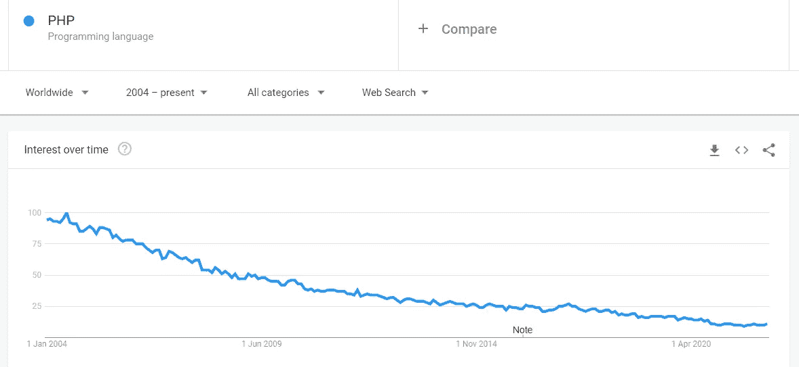
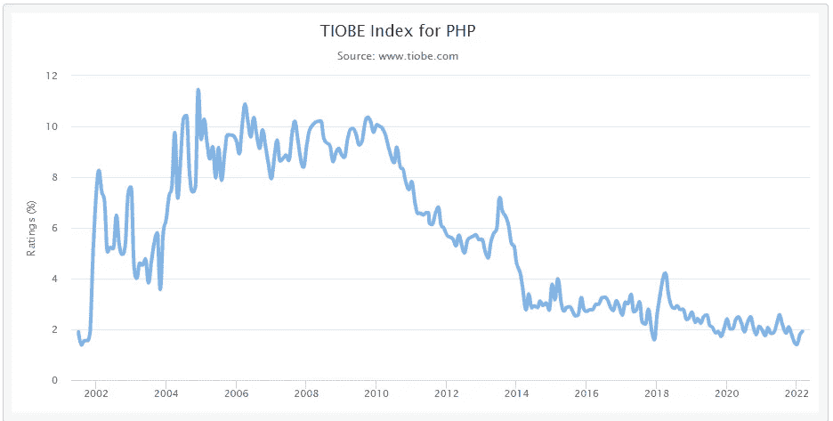
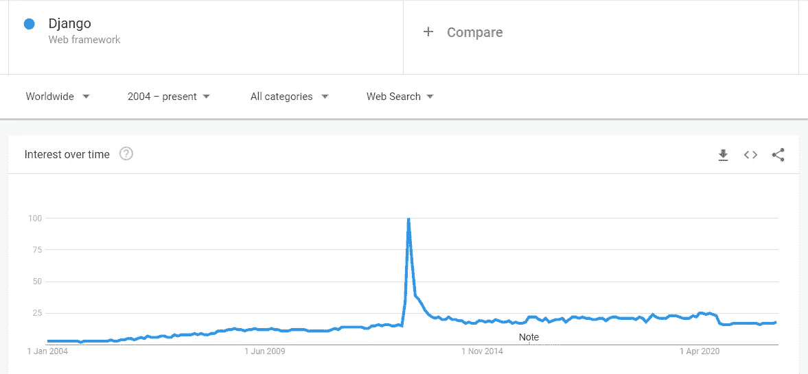
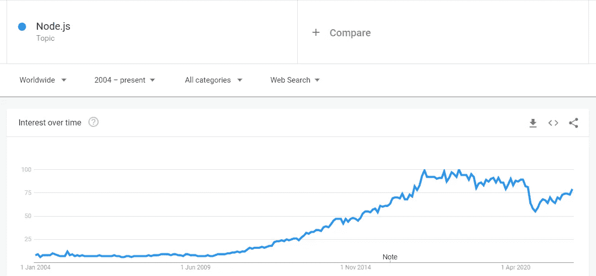

# PHP 正在快速消亡

> 原文：<https://levelup.gitconnected.com/php-is-dying-a3805e23a3b8>

## 我们会想念你的

图片来源: [Pixabay](https://pixabay.com/illustrations/php-elephant-blue-elephant-toy-2066704/)

凡事有开始就有结束。对于 PHP 来说，是时候了。在这个时代，保持相关性的唯一方法是成为不可或缺的。

如果你不是必需的，你就会慢慢被遗忘。PHP 不仅是可有可无的，而且使过程变得复杂。有现代语言可以更好地完成这项工作。

这些现代语言没有 PHP 的局限性。我同意，它不断得到更新，但它只是不削减它。我不讨厌它。我只是陈述了它为什么会死亡的事实。

# 死亡即将来临

在为你的项目选择技术之前，你能做的最重要的事情之一就是检查它的趋势。

如果你的目标是在未来几年加速你的项目，这将变得非常有价值。长期项目需要以正确的方式做事。你不希望被困在一种技术中，这种技术会减少并最终缺乏支持或其他必要的东西。下面是 PHP 的例子。

来源:[谷歌趋势](https://trends.google.com/trends/explore?date=all&q=%2Fm%2F060kv)

在过去的十年里，PHP 一直在走下坡路，现在几乎跌到了谷底。下面是另一张来自[的 TIOBE 指数](https://www.tiobe.com/tiobe-index/php/)的趋势图。

来源: [TIOBE](https://www.tiobe.com/tiobe-index/php/)

很明显 PHP 正在减少。当前流行的基础设施使用 PHP。这是因为它们是在 PHP 处于巅峰或仍在上升时(从 2001 年到 2010 年或更早)构建的。例子包括 WordPress 和维基百科。

要构建复杂的系统，我们不能依赖相同的语言。更糟糕的是，我们不能依赖正在衰落的语言。即使是我们的前辈也是在这些语言兴起或处于巅峰的时候选择的。

到 2022 年，为你的项目选择 PHP 将不再是手册的内容。除非是暂时的。如果你非常关心你的项目，你应该选择一门现代语言。正在上升或处于顶峰的人。这保证了未来的安全、生存和发展。

# Node.js 正在慢慢取代 PHP——新一代程序员觉醒了

新一代程序员不会选择 PHP 作为一门需要掌握的语言。他们选择 node.js 而不是 PHP。这些人将主宰未来的网络。

他们了解使用两种语言的摩擦和 PHP 的缺点。他们知道掌握 PHP 不会给他们带来最大的价值。

招聘人员也意识到了这一点。他们中的许多人正在慢慢地用 node.js 或其他替代程序取代 PHP 代码。

熟练的程序员也不会选择 PHP 作为一门需要掌握的语言。(也就是说，以前是游戏开发人员，现在想从事网页开发的人。)大部分都是选择 Node.js。

下面是 PHP 与其他后端框架如 Node.js 和 Django 的比较。

来源:[谷歌趋势](https://trends.google.com/trends/explore?date=all&q=%2Fm%2F06y_qx)

姜戈相对年轻，前途无量。我知道它还没有完全成熟。在未来，它很可能是一头野兽。它没有减少。

来源:[谷歌趋势](https://trends.google.com/trends/explore?date=all&q=%2Fm%2F0bbxf89)

Node.js 比 Django 更受关注。明明是最喜欢的。相似的是，这两个框架都在成长。未来，它们很可能会很强劲。

这些框架和其他现代语言如 Rust 和 Go 可以说比 PHP 更好。

它们解决了 PHP 的缺点，被系统地创建，并且更有组织性。因此它们比 PHP 更可靠。

# 技术栈已经改变了

世界正在慢慢转向 web 3.0。未来的网络可能会被云解决方案和机器学习所主导。

目前，我们正处于 web 2.0 时代。Django 和 Node.js 等技术非常适合这种转变。

Django 尤其擅长基于人工智能的网络应用程序、分析应用程序、实时应用程序更改，并且具有高度的可扩展性。

Node.js 擅长于开发效率、实时数据发送、高速度以及来自服务器的一致回调。

这些是 PHP 缺少的一些关键领域。因此，Django、Node.js、Rust 和其他现代技术似乎更有未来意识。

技术栈也发生了变化。在我们有 LAMP 之前，它就是经典。使用了 10 多年，因其简单、可靠和稳定而深受喜爱。

现在，我们有了 MEAN、MERN、MEVN 和由 AWS Lambda 和 google cloud 等云平台支持的无服务器堆栈。MERN 或其任何亲戚显然是 LAMP 的赢家。

我们还有其他技术，比如 Ruby 和 flutter，可以用来创建跨平台的应用程序。当开发速度比其他一切都重要时，堆栈可以完成这项工作。

# 像手机和平板电脑这样的便携设备没有未来

手机和平板电脑正在主宰网络。我们几乎到哪里都带着手机。

目前，大部分网络流量来自移动设备。普通人花在手机上的时间比任何其他设备都多。

技术协会已经意识到了这一点，许多公司正在将他们的服务从网络转移到移动应用上。这导致了一场巨大的迁徙，现在正在发生，将来也会发生。

简而言之，这对移动应用开发者来说是个好消息。无论是斯威夫特还是科特林，他们都将大快朵颐。

然而坏消息是 PHP 不属于这种迁移。它不适合移动应用程序。这甚至不是为他们准备的。这是一种适用于网络的服务器端语言。

另一方面，Django 和 Node.js 在移动应用程序上运行良好。

未来，这两家公司都有可能在移动应用中占有相当大的份额。Django 已经是先锋了。它为 Instagram 提供动力，insta gram 是世界上访问量排名第六的网站。