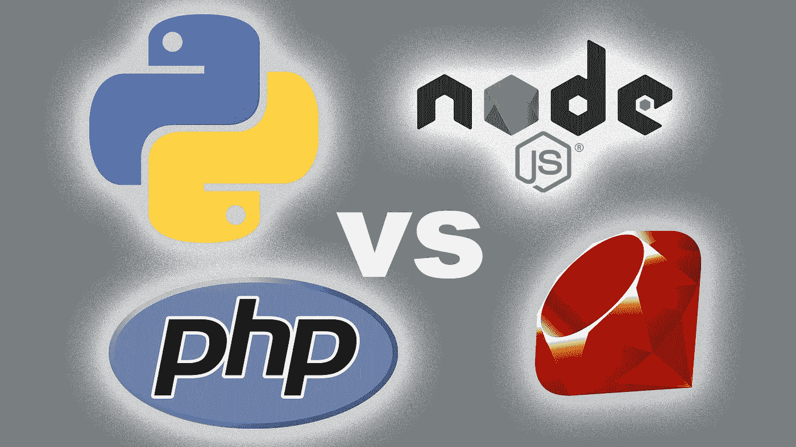
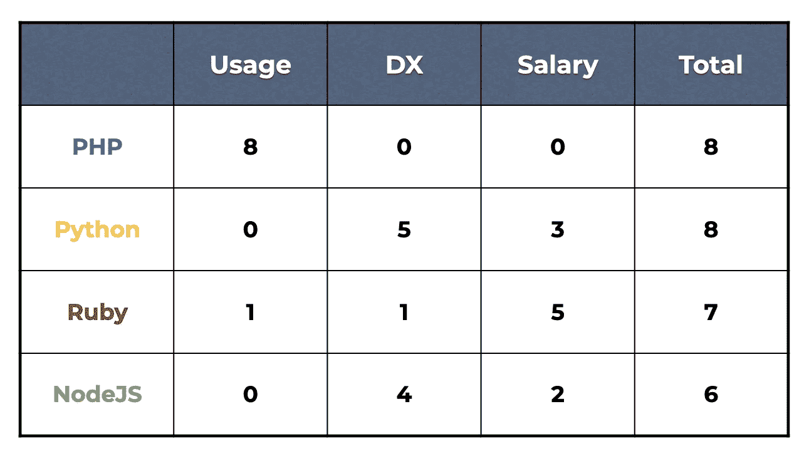

# PHP vs NodeJS vs Python vs Ruby:数字说明了什么？

> 原文：<https://levelup.gitconnected.com/php-vs-nodejs-vs-python-vs-ruby-what-do-the-numbers-say-efb19c986948>

## 四个截然不同的竞争者之间的三轮较量



PHP、Python、NodeJS、Ruby 之间，**后端开发**选择哪种语言？

我喜欢学习新技术。如果可以，我会推荐你全部学会。但是生命短暂，时间宝贵。这四种语言各有不同的优缺点和用例。(你可以在这里找到我对这个问题[的视频处理)](https://www.youtube.com/watch?v=Wq7rZxU3_pw)

我们会一起看一遍，最后，我希望能帮助你做出选择。

在继续之前，还有一个小细节。我将自己限制在脚本语言上，以避免写太长的文章，并专注于我非常了解的主题。这就是我忽略 ASP.NET 或爪哇的原因。

现在，让我们看看谁是竞争者。

首先，我们有创建于 1991 年的 **Python、**(以及 2008 年的版本 3)。然后我们有 **PHP** 它创建于 1994 年。Ruby 创建于 1995 年。最后， **NodeJS** 创建于 2009 年。但是这种语言是 1995 年创建的 JavaScript 的扩展。

因此，让我们根据不同的标准，一起检查这些不同的语言。对于其中的每一个，我将总共分配 10 个点，我们将看到它会把我们带到哪里。

为此，我将依靠不同的信息来源，特别是两个。

第一个是栈溢出开发者调查，它测量开发者如何评价不同的语言。w3tech 网站测量了不同服务器技术的[](https://w3techs.com/technologies/overview/programming_language)****的真实使用情况。****

# ****第一轮:服务器使用情况****

**为什么看这个数字很有趣呢？这显示了现实世界的受欢迎程度。而且它表明有多少找工作的机会。**

**废话不多说，下面是不同语言在已知语言的服务器上的使用率:**

*   ****Python** 的使用率为 1.3%。**
*   **然后我们有 1.9%的 **NodeJS** 。**
*   **然后我们有 **Ruby** ，它出现在超过 6%的服务器上。**
*   **最后， **PHP** 出现在多达 78%的服务器上。**

**PHP 是维基百科、脸书，当然还有 WordPress 建立的基础。老实说，仅 WordPress 就出现在 40%的网站上——至少是那些我们知道其技术的网站。**

**一旦我们忽略 WordPress，那么“只”剩下 38%的网站使用 PHP。与最接近的竞争对手 Ruby 相比，这仍然是 6 倍。**

**因此，鉴于 PHP 的使用率接近 80 %, Ruby 的使用率为 6%,这一轮我给 PHP 打 8 分，给 Ruby 打 1 分(给另外两个打 0 分)。**

# ****第二轮:DX****

**现在让我们来看看 2021 年的 [StackOverflow 开发者调查。我们先来看看本次调查提出的两个问题。第一个问题是:这种语言……你喜欢它，还是害怕它？](https://insights.stackoverflow.com/survey/2021#technology-most-loved-dreaded-and-wanted)**

**这个问题很有意思，因为它反映了开发者的满足感和挫败感。所以这是我们称之为“ **DX** ”或“开发者体验”的一个很好的指标。但这也是该语言一致性和社区质量的一个很好的指标。**

**第二个问题是:你想从事这种语言的工作吗？这表达了一种语言的吸引力。**

**对于每一种语言，我们将采用喜欢它的人的比率，减去不喜欢它的人的比率，这将给出我们的净满意度得分。然后我们再加上想用这种语言工作的人的百分比:**

```
round 2 score = like % - dread % + want %
```

**所以。结果如何？**

**对于 PHP，40%的开发者表示喜欢，60%的开发者表示不喜欢。这使我们的净得分为-20%。只有 2.5%的开发人员想用这种语言工作，所以 PHP 的总得分为-17.5**

**接下来，Ruby 的情况稍微好一点:53%的人喜欢它，47%的人讨厌它，净得分为+6%。而想从事 Ruby 工作的人的比例也只是略高于 PHP，为 2.6%。所以对于 ruby，我们总共有 8.5。**

**接下来是 NodeJS，63%的正面意见对 37%的负面意见，净满意度得分为+26。而 NodeJS 的吸引力在 12%，所以我们一共有 38 个。**

**(哦，顺便说一下:供您参考，Typescript——可以与 NodeJS 一起使用——有 73%的支持率。其吸引力为 15%。所以这里总共有 61 个。在这里我不打算把它包括在 NodeJS 总数中，但是值得一提)**

**最后，Python 有 68%的正面评价和 32%的负面评价，即净满意度得分为+36。考虑到 19%的吸引力，它的总分是 55 分。**

**相比 PHP 的-17.5，Ruby 多 26 分，NodeJS 多 56 分，Python 多 73 分。**

**如果我把所有这些加起来，然后把每个分数除以总分，我们现在得到的百分比加起来是 100，我们用它来分配分数。**

**所以所有这些给了我们第二轮:PHP 0 分，Ruby 1 分，NodeJS 4 分，Python 5 分。**

**如果我们看一下现在的分数，我们暂时处于最后一名**

*   **红宝石，共 2 分。**
*   **NodeJS 有 4 分，**
*   **然后 Python 加 5 分**
*   **最后是 8 分的 PHP。**

# ****第三轮:工资****

**现在我们来谈谈钱和薪水。更准确地说，是工资中位数。 [Stack Overflow 问全世界的开发者](https://insights.stackoverflow.com/survey/2021#technology-top-paying-technologies)年薪多少。**

**显然，全球形势不一定会影响到每个国家。但确实给了我们一个相对的指标。对于一种给定的技术，他们确定了多付工资的人和少付工资的人的工资，即该技术的平均工资。**

**值得注意的是，中位数是一个比平均值更好的指标。尤其是存在差异的时候。说到薪水，事情很少是平等的。**

**所以我们来看看这些工资中位数。**

**对于 PHP，平均年薪是 39 000 美元。**

**NodeJS 的平均工资是 55 000 美元。**

**接下来是 Python，工资中位数是 59 000 美元。**

**最后，Ruby 以 80 000 美元领先。**

**我们做一个和上一个问题类似的计算。我们计算这些数量与最低数量(即 PHP)之间的差异。然后，我们将每个微分与一个百分比相关联，这就给出了这一轮的结果:**

*   **最后一名，0 分的 PHP。**
*   **第三名，NodeJS 得 2 分。**
*   **第二个位置，Python 分。**
*   **排在第一位的是鲁比，5 分。**

# **那么，哪种语言值得投入时间呢？**

**如果我们计算累积分数，我们现在有以下情况:**

****

**最终结果**

*   **NodeJS 以 6 分排在最后。**
*   **鲁比以 7 分排名第二**
*   **而 PHP 和 Python 以 8 分打成平手。**

**如你所见，分数很接近，但原因非常不同。**

**有什么理由选择一个而不是另一个呢？**

**这是另一个微妙之处。**

**PHP 和 JavaScript 的语法都是受 c 启发的，比如花括号定义代码块。**

**而 Python 和 Ruby(相对而言)彼此更接近。至少视觉上是这样。例如，块由“def”关键字定义。尽管缩进在 Python 中有语法上的重要性，但在 Ruby 中却没有。**

**现在:一种语言和另一种语言的区别是什么？**

**这就是数字的客观方面的极限。事实上，这完全取决于你想把你的职业生涯带向何方。你的抱负是什么。以及你对风险的厌恶程度。**

**让我解释一下。**

**让我们以 Python 为例。说实话，Python 的主要用例是数据和机器学习。这些公司提供有趣的机会和薪水。但是他们也需要对数学有一定的兴趣。**

**然而，与其他三种语言相比，Python 作为一种服务器端语言，是一种边缘用例。**

**但是如果你知道你想进入后端开发，并且你担心找不到工作，你就不能忽视 PHP。**

**这不是一个令人兴奋的解决方案，但它是可靠和坚实的。另外，如果你想找自由职业者的工作，了解 WordPress 是如何工作的是值得的。**

**但是 PHP 的工资中位数是四个中最低的。**

**反过来，Ruby 的机会就少了。但是熟练的开发人员也少了。**

**这意味着 Ruby 的工资更高。**

**如果你想要工作稳定，你最好选择 PHP，如果你不怕风险，但你想要更高的薪水，Ruby 可以是一个不错的选择。**

**最后，我们有 NodeJS。这里的情况有点不同。NodeJS 是 JavaScript 的变种。正如 StackOverflow 调查显示的那样，几乎 70%的开发人员使用 JavaScript。**

**这意味着如果你想有竞争力，了解 JavaScript(最好是 TypeScript)是很重要的。**

**因此，我的建议是学习 JavaScript 和 TypeScript，以及第二种语言，这取决于你想做什么或你想拥有的工作保障。**

**如果你对数据科学(和数学)感兴趣，还有 Python。**

**如果你不害怕风险，并且想找一份报酬更高的工作，还有 Ruby**

**还有一个安全的解决方案，PHP。如果您已经会说 JavaScript，这也是一个简单的解决方案。但这可能不是最激动人心的一个。**

**但是无论你选择什么，一定要一路上玩得开心！**