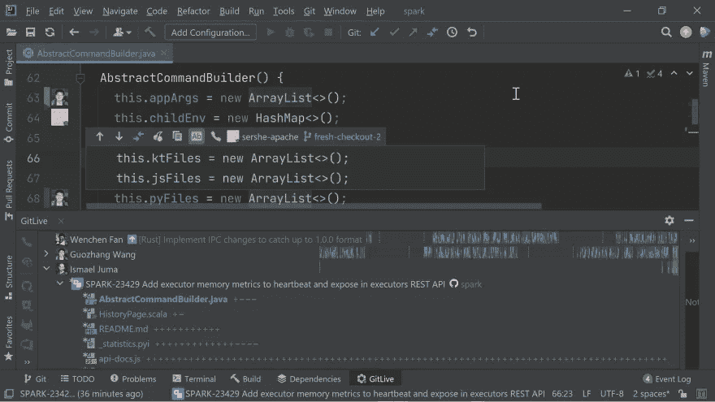
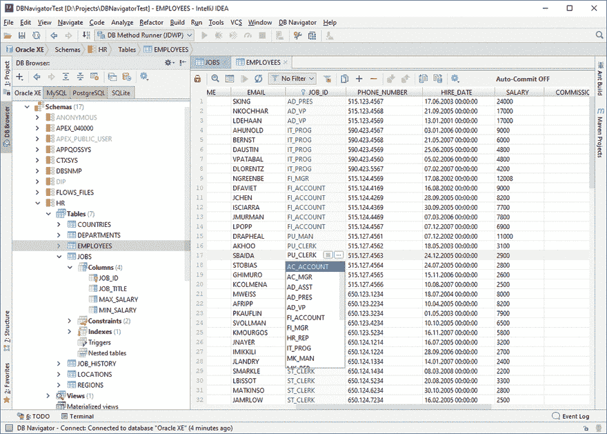
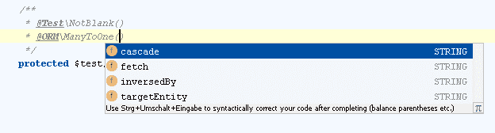

# 你应该知道的 PhpStorm 插件

> 原文：<https://levelup.gitconnected.com/phpstorm-plugins-you-should-know-ea4e51aeee69>

作者图片

如果您是 PhpStorm 用户，您会知道它提供了许多很棒的特性，使 PHP 编程变得更快更容易。最重要的是，JetBrains marketplace 提供了许多有用的插件，旨在提高我们的工作效率和舒适度。我决定测试其中的一些，这里是我选择的真正有所作为的工具！

# [Php 检查(EA 扩展)](https://plugins.jetbrains.com/plugin/7622-php-inspections-ea-extended-)

这个插件是 PHP 的开源代码审查和静态代码分析工具(在 JetBrains IDEs 中也称为检查),它似乎比原生检查工作得更好。它是 PhpStorm 的必备附件，以确保高质量的编码。默认配置非常严格，但是由于这个原因，您可以避免很多代码味道(或者禁用一些您不喜欢的规则)。

它涵盖了与架构相关的问题、弱类型控制和可能的代码构造简化、性能问题、非最优、重复和可疑的“如果”条件、魔法方法使用的验证等等！

# [GitLive](https://plugins.jetbrains.com/plugin/11955-gitlive)

这个插件对于增强 PhpStorms 的内置 Git 功能是必不可少的，它具有实时特性，比如团队成员的在线状态和即时合并冲突检测。

得益于 GitLive 添加到您的 IDE 中的工具窗口，您可以看到您的团队中有谁在线，他们正在处理什么问题和分支，以及他们对这些分支所做的更改。

即时合并冲突检测是一个令人印象深刻的特性，它可以帮助您在合并冲突发生之前解决它们！编辑器中的指示器显示您的更改和其他人的更改之间的差异。这些会在您和您的队友编辑时实时更新，并提供潜在合并冲突的早期警告。这是所有开发团队的必备之物！

GitLive

# [数据库导航器](https://plugins.jetbrains.com/plugin/1800-database-navigator)

数据库导航器是一个数据库开发，脚本和导航工具。它为 PhpStorm 增加了广泛的数据库开发和维护功能。除了合格且符合 IDE 标准的 SQL 和 PL/SQL 编辑器之外，它还提供了高级数据库连接管理、脚本执行支持、数据库对象浏览、数据和代码编辑器、数据库编译器操作支持、方法执行和调试、数据库对象工厂，以及所有组件之间的各种导航功能。

数据库导航器

# [PhP 注释](https://plugins.jetbrains.com/plugin/7320-php-annotations)

我非常喜欢 DocBlocks，因为它们可以确保我们写出干净和高质量的代码。这个有用的插件扩展了 PhpStorm 以支持文档块中的注释，并提供了额外的属性特性，如:类导入注释器、文档标记中的类常量、注释类的自动别名导入、文档标记和属性名的 Goto 等等。

PhP 注释

# [Symfony 支持](https://plugins.jetbrains.com/plugin/7219-symfony-support)

Symfony 是一个用于 web 开发的开源 PHP 框架，无需介绍。如果你正在使用它，这个插件绝对是必备的。它为 PhpStorm(和其他 JetBrains IDEs)提供了完整的 Symfony 框架和组件支持。它包含了 Symfony 开发所需的所有工具，包括模板、依赖注入、表单、路由等等。

Symfony 支持

有一些反馈或建议？请在评论中告诉我吧！