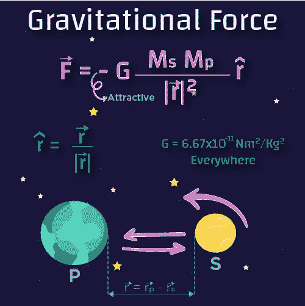
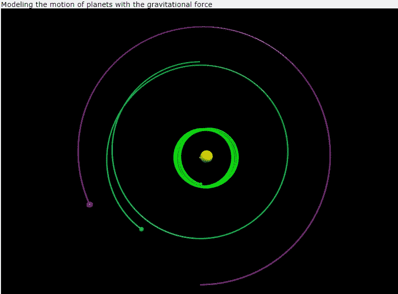

# 使用 VPython 的物理模拟

> 原文：<https://levelup.gitconnected.com/physics-simulations-using-vpython-a3d6ee69d121>

## VPython

## 模拟复杂的物理方程


康纳·乐迪在 [Unsplash](https://unsplash.com?utm_source=medium&utm_medium=referral) 上的照片

# 介绍

物理科学是建立在简化和近似的基础上的:轨道总是圆形的，射弹飞行没有空气阻力，钟摆只以很小的角度摆动。当你第一次试图理解自然的基本规律时，这种简化是必要的和适当的，(这些近似是有用的，我们失去了一点精度，相反我们节省了很多时间(例如在[磁矩](https://en.wikipedia.org/wiki/Magnetic_dipole_moment)中使用的近似)，但真实世界要复杂得多，也有趣得多。因为物理学的最终目的是**了解现实世界**。

幸运的是，计算机使得在可以忽略不计的时间内完成极其冗长的计算成为可能。 **VPython** 为我们提供了一种在图形上模拟复杂的物理系统方程并生成可导航的实时 3D 动画的解决方案。

要安装 VPython，如果您使用的是 Jupyter notebook，3D 场景会出现在 Jupyter notebook 中。否则，如果在笔记本之外启动代码(例如，从命令行或 IDLE)，将会打开一个显示场景的浏览器窗口(不支持 Internet Explorer)。建议使用 Chrome 浏览器，因为它提供了最有用的错误信息。

# 如何入门？

这个包已经用 Pypi 发布了，可以很容易地用 pip 安装。

```
**pip install** vpython
```

一旦安装完成，你可以试着制作一个 [3D 圆柱体](https://www.glowscript.org/docs/VPythonDocs/cylinder.html)。

```
**import** vpython **as** vp
vp**.cylinder()**
```

要更改位置、大小和颜色:

```
vp.cylinder(pos=vp.vector( 4, 0, 0), size=vp.vector(4,4,4), color = vp.color.red)
```

# 模拟太阳系

## 过程设计

引力方程是物理学上最大的成功之一。它告诉我们月球绕地球运行的速度，告诉我们如何将卫星送入轨道，并帮助我们找到暗物质和黑洞。



插图由 [Freepik](http://www.freepik.com) 绘制

研究重力的最好方法之一是在计算机代码中使用**欧拉克罗默方法**。假设，我们想研究行星围绕恒星的轨道，对行星和恒星之间的引力进行编程只需要几个数学步骤。

*   首先，前面的负号，意味着引力总是吸引人的。
*   第二，万有引力常数。这个数永远不变，不管你在宇宙的哪个位置。
*   然后，我们将恒星的质量乘以行星的质量。
*   接下来，我们需要考虑恒星和行星之间的距离。通过减去它们的位置，我们可以得到一个从恒星到行星的距离矢量。这个距离矢量的大小成为引力的分母。
*   最后，我们计算一个叫做 *R hat* 的矢量，它给出了引力的方向。我们可以通过将距离向量除以其大小来计算 R hat。

## 编码

带上您的咖啡，让我们从创建新的 python 脚本、导入模块和生成场景开始:

首先，导入模块，然后生成场景:

然后，让我们做一个恒星和一个行星(你可以把质量改成现实世界的值):

现在，我们需要创建一个计算重力的函数:

为了创建动画，我们将使用欧拉克罗默方法，所以首先，我们需要生成一个时间变量和步长:

```
t = 0
**dt = 0.0001** #The step size. This should be a small number
```

在无限循环下，我们必须计算力，并更新位置、动量和时间变量`t`,如下所示:

**注意**:我们使用`[rate()](https://python.developpez.com/cours/vpython/webdoc/visual/rate.php)`来限制动画速率，我们也可以使用`sleep()`。

现在让我们尝试添加更多的行星。

**注意**:我们可以使用 RGB 来声明颜色，如下所示:

然后更新位置和动量，



输出结果

# 最后

VPython 允许我们生成简单/复杂的 3D 动画来描述物理现象，或绘制实时图…

**感谢阅读！😄**


查看我的其他文章，并在[媒体](https://medium.com/@ahmedazizkhelifi)上关注我

哈利菲·艾哈迈德·阿齐兹