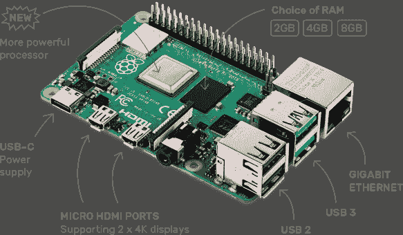
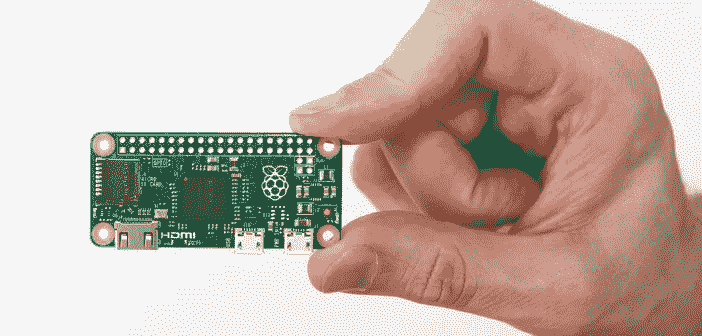
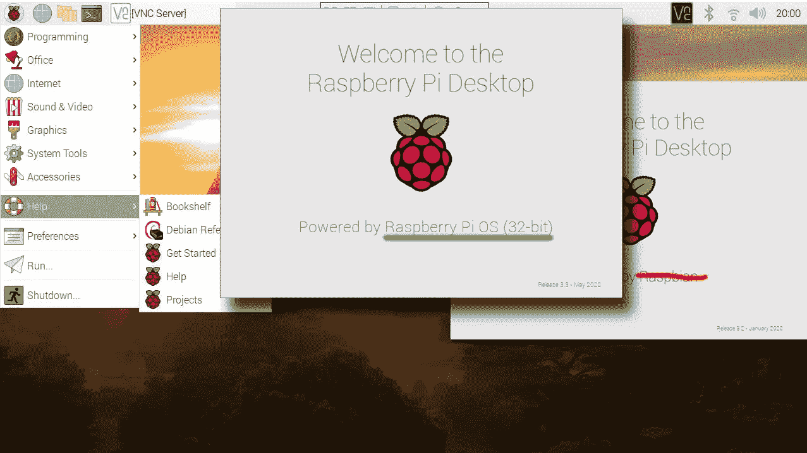
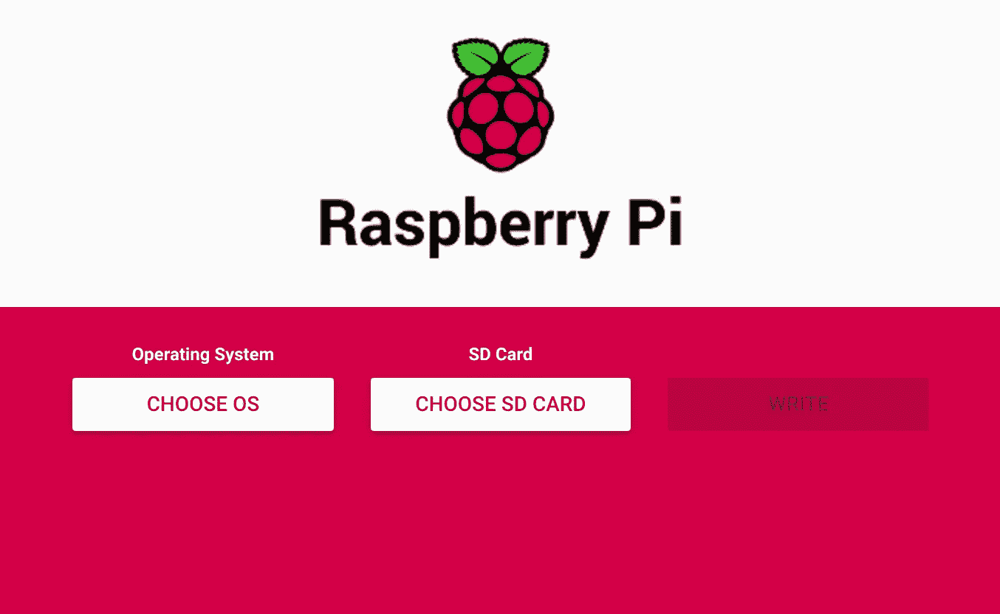
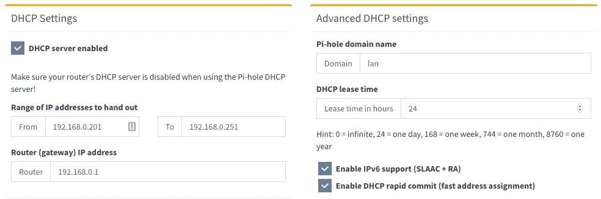
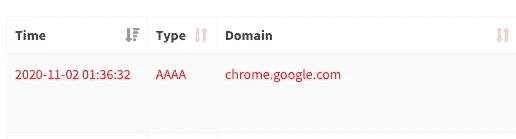

# 使用 Docker 和 Docker Compose 在树莓 Pi 上创建 Pi-hole

> 原文：<https://levelup.gitconnected.com/pi-hole-on-raspberry-pi-using-docker-docker-compose-8dc3944f6282>

为注重隐私的家庭网络设置 Pi-hole 的实用指南。


Gerold Hinzen 在 [Unsplash](https://unsplash.com/s/photos/calm?utm_source=unsplash&utm_medium=referral&utm_content=creditCopyText) 上拍摄的照片

我需要用一些简单的免责声明来开始这篇文章:我喜欢 Raspberry Pi，我喜欢 Docker，我不太喜欢网络(剧透:我不喜欢它)。

*   我喜欢树莓派，因为它是一台小巧、功能齐全的电脑，让我起鸡皮疙瘩。这是那些让你感觉像[机器人先生](https://en.wikipedia.org/wiki/Mr._Robot)的事情之一。它相对便宜，容易获得，而且网上有很多指南可以做你能想象到的任何事情。
*   我喜欢 Docker，因为它是一种以标准化方式运行各种软件的简单方式:你为你的平台提取 Docker 映像，你用一个命令运行映像，就这样！你可以把东西粘在一起，你可以添加你自己的图像，你可以共享你的配置，你可以在不同的机器上运行相同的设置，一旦你不再需要它们，你可以很容易地销毁它们。我并不是说它是有史以来最简单的软件，但它相对来说比较容易上手。
*   我不太喜欢社交，只是因为我不擅长。我对它的许多部分有一个基本的高级概念的理解，但它们并不总是转化为现实生活中事情是如何工作的。我大概知道计算机如何通过网络通信，但是当我需要调试一个坏的连接时，我很快就迷失了。好的一面是，这意味着我的目标是让这个指南尽可能简单，这样我也能理解它。

因此，既然我们已经完成了免责声明，那么在我们开始指南之前，让我们稍微了解一下基础知识。如果您知道上面提到的所有工具和技术，请随意跳过这一部分。

# 基础

因为我们需要在文章中使用一些技术，所以我们需要澄清一些事情，这样就不会有太多的困惑。我会尽量简短，并添加一些阅读材料，以防你想了解更多。

## 什么是树莓派？

Raspberry Pi 是一种简单的单板计算机，最初是为教育目的开发的；然而，该板在制造商中广受欢迎，在包括机器人、家庭自动化和物联网在内的许多用例中非常受欢迎。第一款于 2012 年 2 月推出，树莓 Pi 迄今已有 4 代，最新的一款是最先进的一款，包括四核 ARM 处理器和高达 8GB 的 RAM。它的最新版本从 35 美元起，涨到 75 美元；不是超级便宜，但对于一台通用电脑来说是个不错的价格。

可以把 Raspberry Pi 想象成一台简单的台式电脑，没有任何屏幕或外围设备。你可以将屏幕连接到它，你可以连接你的键盘，鼠标，以太网，并将其用作一台普通的电脑。有大量的用例不需要这些外围设备，因此经常会看到 Raspberry Pi 设备被用在手持设备中，或者作为网络设备隐藏在办公室空间中，等等。它是一台通用计算机，你的想象力在这里是极限。

该设备看起来像这样:



树莓 Pi 4，[来自树莓 Pi 官方网站](https://www.raspberrypi.org/products/raspberry-pi-4-model-b/)

他们还有一个更便宜、更小的同系列版本，Raspberry Pi Zero W，比常规 Pi 的资源更少，但比常规 Pi 更小，适合物联网应用和移动用例。Zero W 目前的售价是 [$10](https://www.raspberrypi.org/products/raspberry-pi-zero-w/) 。



来自 raspberrypi-spy.co.uk 的[树莓派零度](https://www.raspberrypi-spy.co.uk/2015/11/introducing-the-raspberry-pi-zero/)

所有的 Raspberry Pi 设备都能够运行各种操作系统(OS ),具体取决于您拥有的具体型号；不过树莓 Pi 最常见的操作系统是[树莓 Pi OS](https://www.raspberrypi.org/downloads/raspberry-pi-os/) ，老字号 Raspbian。它基于 Debian，有一堆简单的安装程序，是修补 Pi 的良好起点。如果您刚刚开始接触这个生态系统，我强烈建议您使用 Pi OS，它肯定会简化您在开始时查找文档和在线帮助的过程。

想要了解更多关于树莓派的信息，请访问官方的[树莓派网站](https://www.raspberrypi.org/)。

## 什么是 Pi-hole？

[Pi-hole](https://pi-hole.net/) 是一个即插即用的软件，它提供网络范围的 [DNS sinkhole](https://en.wikipedia.org/wiki/DNS_sinkhole) 来过滤连接到同一网络的所有设备的内容。简而言之:当你的浏览器试图连接一个服务器向你显示网站上的一些内容时，Pi-hole 会将该主机的 IP 地址解析为一个黑洞 IP 地址(如果它在黑名单上)，这意味着你的计算机将无法到达广告服务器，因此，你将看不到广告。这对最终用户有很多好处:

*   无需在任何连接到网络的设备上安装特定的软件，您的所有设备都可以从中受益，包括您的智能电视和移动设备。
*   这不仅可以阻止网站上的传统广告，还可以阻止嵌入其他地方的应用内广告，例如智能电视的操作系统。
*   由于对广告内容的请求永远不会离开您的网络，因此不会下载任何内容，您的网络性能将会提高。
*   它还会屏蔽一些追踪器，这意味着它会在你上网时自动提供更好的隐私保护。

总而言之，Pi-hole 是一款简洁的开源软件，它能让你更好地了解和控制网络中的广告流量。要了解更多细节，请访问他们的[网站](https://pi-hole.net/)，以及他们的 [GitHub 组织](https://github.com/pi-hole)，查看源代码并了解更多关于该项目的信息。

## Docker 是什么？

作为云原生时代的典型代表，Docker 在过去几年里一直是非常受欢迎的软件。它本质上是一个包装良好的系统，简化了许多不同操作系统上的容器管理，并且是运行容器的事实上的标准引擎。它允许您以简单的格式打包应用程序及其依赖项，并共享它们。你可以点击下面的链接来了解更多关于 Docker 的信息。(剧透提醒:文章是我写的。)

[](https://medium.com/swlh/what-exactly-is-docker-1dd62e1fde38) [## Docker 到底是什么？

### 对容器和 Docker 的介绍，包括真实的例子和对完整软件的建议…

medium.com](https://medium.com/swlh/what-exactly-is-docker-1dd62e1fde38) 

# 目标

于是，我想在家里的网络上设置 Pi-hole，身边躺着一个[树莓 Pi 3 Model B+](https://www.raspberrypi.org/products/raspberry-pi-3-model-b-plus/?resellerType=home) 。在开始设置之前，我有几个目标:

*   我希望能够远程管理设备；也就是说，我所需要的改变应该是一个到设备的工作网络连接，因为我将从我的家庭网络开始，这将是一个给定的。我不想依赖键盘、屏幕或其他外围设备来玩它。
*   我想将相同的 Pi 用于我的其他用例，比如家庭自动化；因此，我希望 Pi 安装尽可能干净，以防我需要使用不同的设备重新构建相同的设置，或者如果我需要在另一个存储设备上进行干净的安装。
*   我希望能够将我的设置保存在 Git repo 中，以便能够跟踪我的更改并进行备份，因为，为什么不呢？
*   我希望该设置能够在其他设备和网络上轻松重现，这样我也可以为我的家人和朋友进行设置。
*   我希望能够用其他用例来扩展我的设置，希望通过某种自动化来将我的更改部署到 Pi。我总是可以连接到 Pi 并手动安装我需要的任何东西，但这将与我之前的目标相矛盾，即使设置易于重现。

对你们中的一些人来说，这些目标可能无关紧要，这完全没问题。我只想以这些为目标，并学会努力实现它们。

最后，我决定用 Docker & Docker Compose 进行简单的 Pi OS Lite 设置来管理 Pi。我选择 Lite OS 的原因是，我不需要桌面环境和默认 Raspberry Pi OS 附带的其他软件，如游戏或办公软件。我决定使用 Docker 的原因是，我希望能够在设备上以容器的形式运行所有东西，而不依赖于手动安装和依赖地狱，Docker Compose 能够以简单的 YAML 格式定义我将运行的所有东西，我可以将其保存在版本控制中。此外，从一开始就依赖 Docker 使我能够在未来的冒险中去那里，例如[建立集群](https://magpi.raspberrypi.org/articles/build-a-raspberry-pi-cluster-computer)或[在 Raspberry Pis 上运行 Kubernetes。](https://ubuntu.com/tutorials/how-to-kubernetes-cluster-on-raspberry-pi#1-overview)当然，这些不是要求，只是供我娱乐的潜在想法。

正如我之前提到的，这并不意味着您必须为您的安装运行完全相同的设置；只是刚好是我选的那个。本文的其余部分将介绍如何设置和运行这个配置，因此，如果您仍然感兴趣，请继续阅读。

# 要求

我们对项目的要求相对简单:

*   管理网络中整个安装的主计算机。
*   有效的互联网连接。
*   带有以太网端口的路由器。您也可以使用某些型号的内置 Wi-Fi，尽管如果您使用电缆连接，它的性能会更好。
*   树莓派，我想任何模型都可以在这里工作。
*   安装操作系统的 MicroSD 卡。如果你已经安装了一个，那也没关系，你用的是什么操作系统并不重要。

本文的其余部分将假设您满足这些要求。

我们将采取的步骤是:

*   设置 SD 卡以启动设备
*   将 Pi 连接到路由器，并访问互联网
*   安装 Docker
*   使用 Docker & Docker Compose 运行 Pi-hole
*   用穿孔 DHCP 服务器替换路由器的 DHCP 服务器
*   就是这样！

让我们开始吧。

## 在你继续之前

要记住的一件事是:Pi-hole 不能删除所有网站上的所有广告。屏蔽广告只是一个猫捉老鼠的游戏，Pi-hole 试图在 DNS 层面禁用它们，这意味着您仍然应该在浏览器上保留您的拦截器扩展，以获得良好的体验。Pi-hole 肯定会对你的整体体验有所贡献，但如果它不能删除所有的广告，请不要生气，有些广告不花大力气几乎不可能删除。

如果你正在寻找一个拦截器扩展，我推荐开源的 [uBlock Origin](https://github.com/gorhill/uBlock) :这里是针对[谷歌 Chrome](https://chrome.google.com/webstore/detail/ublock-origin/cjpalhdlnbpafiamejdnhcphjbkeiagm?hl=en) 的，这里是针对 [Mozilla Firefox](https://addons.mozilla.org/en-US/firefox/addon/ublock-origin/) 的。

# 1.设置 SD 卡

如果您已经有一个以某种方式启用了 SSH 的 Raspberry Pi，那么您可以跳过这一节。如果你想从头开始在 SD 卡上安装 Raspberry Pi 操作系统，请留在这里。

首先，我们的 Raspberry Pi 需要一个操作系统来运行。如果你不知道该选择哪个操作系统，或者你没有偏好，你可能最好选择树莓派的官方操作系统，即[树莓派操作系统](https://www.raspberrypi.org/downloads/raspberry-pi-os/)。这个操作系统由 [Raspberry Pi Foundation](https://www.raspberrypi.org/about/) 官方支持，并且在在线支持方面将是最简单的默认设置。



[来自汤姆的硬件](https://www.tomshardware.com/news/raspberry-pi-os-no-longer-raspbian)

对于我的特定用例，我将使用 Raspberry Pi OS Lite 版本，这是相同的操作系统，没有桌面图形用户界面(GUI)。我不需要 GUI，因为我不会将我的 Pi 连接到显示器或任何东西，我也不会将它作为我的主要计算机使用；因此，我不需要用户界面。这还具有操作系统包含的软件更少、操作系统尺寸更小的额外优势，精简版为 435MB，而 2020 年 8 月版的桌面版为 1133MB。

## 写入基础映像

将操作系统映像写入 SD 卡的最简单方法是使用 [Raspberry Pi Imager](https://www.raspberrypi.org/downloads/) 工具，这是一个简单的工具，可以在所有主要操作系统上运行，并允许使用包含的映像之一创建 SD 卡。



树莓 Pi 成像仪长这样，我只是截图。

将 SD 卡插入电脑后，您只需点击“选择操作系统”按钮，并在弹出窗口中选择路径“Raspberry Pi OS(其他)> Raspberry Pi OS Lite (32 位)”下的 Lite 版本。之后，您可以点击“选择 SD 卡”按钮，从列表中选择您的 SD 卡。完成后，只需点击“写入”按钮，等待整个过程完成。

一旦你完成了这些，不要从你的电脑上拔下你的 SD 卡，因为在我们的操作系统设置准备好之前还有最后一步。

## 启用 SSH

为了能够从我们的主计算机访问我们的 Raspberry Pi，我们需要对 Pi 进行 SSH 访问。默认情况下，Raspberry Pi OS 出于安全原因禁用 SSH 访问；因此，我们需要启用它。小心:我们正在启用 SSH 访问，因为我们将只在我们的内部网络中使用我们的 Raspberry 如果您正在考虑为您的办公空间或公共网络设置此功能，您需要考虑保护 SSH 连接，尤其是取消密码并使用公私密钥认证。

启用 SSH 连接非常简单:在计算机上打开 SD 卡内容，并在那里创建一个名为`ssh`的新文件。该文件不需要写入任何内容，并且确保文件名中没有扩展名，如`.txt`或任何东西:只需将其命名为`ssh`。操作系统第一次启动时，它会检查这个文件是否存在，并在您的 Raspberry 上启用 SSH 访问。

一旦完成，您的操作系统就可以使用了。

# 2.将 Raspberry Pi 添加到您的网络中

为了能够从您的主计算机访问您的 Pi，Pi 需要与您的计算机在同一个网络中:简单地说，只需在您的路由器和 Raspberry Pi 之间插入一根以太网电缆。在这之后，你可以简单地将你的树莓派插入你的电源适配器，让它启动。覆盆子通常很快启动，但给它几分钟只是为了确保它启动。

此时，您应该准备好通过 SSH 连接到您的 Raspberry。转到主计算机的终端，键入:

```
ssh pi@raspberrypi.local
```

如果提示您输入此连接的密码，默认密码是`raspberry`。

如果你在 Windows 机器上，通过默认的 Windows 终端运行 SSH 可能没那么简单，所以我建议在这个用例中使用 [PuTTY](https://www.putty.org/) 。官方文档中也介绍了通过 SSH 连接不同操作系统的 Raspberry Pi 的方法[，所以如果您无法通过 SSH 连接到您的 Pi，请务必仔细阅读。这也是您应该弄清楚在您的主计算机上使用什么终端设置的地方，因为本指南的其余部分将假设您能够在您的主计算机的终端上运行像`docker ps`这样的命令。我使用的是 macOS，但是在其他普通终端中，这个过程应该是相似的。](https://www.raspberrypi.org/documentation/remote-access/ssh/)

成功连接后，您应该会看到如下内容:

```
Linux raspberrypi 5.4.51-v7+ #1333 SMP Mon Aug 10 16:45:19 BST 2020 armv7lThe programs included with the Debian GNU/Linux system are free software;
the exact distribution terms for each program are described in the
individual files in /usr/share/doc/*/copyright.Debian GNU/Linux comes with ABSOLUTELY NO WARRANTY, to the extent
permitted by applicable law.
Last login: Mon Oct 26 00:59:18 2020 from 1.2.3.4
pi@raspberrypi:~ $
```

如果你看到`pi@raspberrypi:~ $`提示，这意味着你已经连接上了，这是个好消息。

## 更改默认 SSH 密码

默认情况下，使用密码`raspberry`为用户`pi`启用 SSH 访问，这不是一个非常安全的默认设置，因此让我们继续更改密码。

要更改密码，只需输入`passwd`并按回车键。这将向您显示一个简单的表单来更改您的密码。**确保设置强密码。**

## 在您的 Raspberry Pi 上设置一个静态 IP

IP 地址在任何网络中都会不断变化，对于我们指南的其余部分和 Pi-hole 用例，为我们的 Raspberry Pi 设置一个静态 IP 很重要，这样即使它断开连接，IP 地址也不会改变。为此，我们需要运行几个简单的命令，收集输出，并最终将它们写入另一个文件。

让我们从路由器 IP 开始:

```
ip r | grep default 
```

输出将如下所示:

```
default via 192.168.0.1 dev eth0 src 192.168.0.2 metric 202
```

在我的例子中，第一个 IP 地址是我们路由器的 IP 地址。**记下这个值，你以后会用到它。**

接下来，运行以下命令获取您当前的私有 IP:

```
ifconfig -a | grep -A 1 eth0 | grep inet
```

这将输出如下内容:

```
inet 192.168.0.2  netmask 255.255.255.0  broadcast 192.168.0.255
```

紧挨着`inet`的 IP 地址，在我的例子中是`192.168.0.2`，是你的私有 IP。**也记下这个值。**

现在是最后一步，运行以下命令:

```
sudo nano /etc/dhcpcd.conf
```

这将打开配置文件的编辑器，滚动到文件底部并添加以下行:

```
interface eth0
static ip_address=<YOUR_PRIVATE_IP_ADDRESS_HERE>
static routers=<YOUR_ROUTER_IP_HERE>
```

在我的例子中，这些行如下所示:

```
interface eth0
static ip_address=192.168.0.2
static routers=192.168.0.1
```

就这样，你做到了！此时，您需要使用`sudo reboot`命令重启您的 Raspberry Pi，以使更改生效；然而，接下来的部分也将要求你这样做，所以如果你要按照指南，然后你可以继续下去，并重新启动时，Docker 安装需要它。

# 3.安装 Docker

在我们在 Raspberry Pi 上安装 Docker 之前，您需要确保您的主要机器上安装了 Docker，这样我们就可以从我们的终端运行 Docker CLI 命令，将 Raspberry 作为远程 Docker 主机，这意味着我们不需要复制文件并保持连接到 Raspberry 来修改我们的容器。Docker 适用于所有主要的操作系统，如果您还没有安装，请[为您的主计算机安装](https://docs.docker.com/get-docker/)。

为了在您的 Raspberry Pi 上安装 Docker，如果您还没有通过 SSH 连接，请开始:

```
ssh pi@raspberrypi.local
```

一旦你进入，让我们开始更新我们的软件包:

```
apt-get update && apt-get upgrade
```

升级完成后，运行以下命令:

```
curl -sSL https://get.docker.com | sh
```

嗯，一般来说，将`curl`的输出直接通过管道传输到`sh`并不是一个好的做法，因为这基本上打开了一个无限的远程代码执行的可能性池，你应该考虑为什么应该避免这样做。与此同时，我找不到一种更安全的方式在 Raspberry Pi OS 上安装 Docker，这对于初学者来说也很容易，所以我决定选择这个选项。如果你从安全的角度有改进的建议，请留下一些评论，我会把它们放在这里。

**注意:** [Iankino](https://medium.com/u/4dbb9d1598bc?source=post_page-----8dc3944f6282--------------------------------) 报告上述安装脚本在 Raspbian Buster Lite 上可能会失败，并出现错误`E: Sub-process /usr/bin/dpkg returned an error code (1)`。在这种情况下，他们设法通过在上面的`apt-get update && apt-get upgrade`之后用`sudo reboot`重启设备来消除错误，之后`curl`安装工作正常。

安装 Docker 后，您需要将`pi`用户添加到所需的组中，以便能够运行`docker`命令:

```
sudo usermod -aG docker pi
```

此时，您需要重新启动设备以使其生效:

```
sudo reboot
```

这将终止您当前的 SSH 连接，因为设备开始重新启动。给它几分钟时间启动并再次连接:

```
ssh pi@raspberrypi.local
```

此时，您应该能够用一个简单的命令来验证您的 Docker 安装:

```
pi@raspberrypi:~ $ docker run hello-worldHello from Docker!
This message shows that your installation appears to be working correctly.To generate this message, Docker took the following steps:
 1\. The Docker client contacted the Docker daemon.
 2\. The Docker daemon pulled the "hello-world" image from the Docker Hub.
    (arm32v7)
 3\. The Docker daemon created a new container from that image which runs the
    executable that produces the output you are currently reading.
 4\. The Docker daemon streamed that output to the Docker client, which sent it
    to your terminal.To try something more ambitious, you can run an Ubuntu container with:
 $ docker run -it ubuntu bashShare images, automate workflows, and more with a free Docker ID:
 [https://hub.docker.com/](https://hub.docker.com/)For more examples and ideas, visit:
 [https://docs.docker.com/get-started/](https://docs.docker.com/get-started/)
```

如果您得到这个输出，这意味着您的 Docker 设置完成了，耶！

# 4.运行 Pi-hole

现在是真正的时候了:运行 Pi-hole。Docker 允许我们通过运行常规的 Docker 命令和一个名为`DOCKER_HOST`的特殊 env 变量来控制远程 Docker 机器。所以，让我们先从定义这个环境变量开始。

```
export DOCKER_HOST=ssh://pi@raspberrypi.local
```

从这一点开始，我们运行的所有 Docker 命令都将针对 Raspberry Pi 的 Docker 环境。或者，您可以将这个环境变量作为前缀添加到您将要运行的命令中，以便显式地针对 Pi 运行它们，如下所示:

```
DOCKER_HOST=ssh://pi@raspberrypi.local docker ps
```

这将列出您的 Raspberry Pi 上正在运行的容器。

## Docker 撰写

我们希望能够以声明方式定义我们的容器，并将它们存储在版本控制中，因此我们将使用 Docker Compose。为您的项目创建一个目录，然后创建一个名为`docker-compose.yml`的文件。将以下内容放入该文件:

运行 Pi-hole 的 docker-compose.yml

实际上就这些。一旦你有了这个文件，你要做的就是:

```
DOCKER_HOST=ssh://pi@raspberrypi.local docker-compose up -d
```

这将开始在你的树莓皮上打洞。给它几分钟，然后，你可以在你的浏览器上找到你的树莓 Pi 的本地 IP 地址，在我的例子中是 T4，然后看到 Pi-hole UI。


我自己的 Pi-hole 实例的一个示例截图。

# 5.让 Pi-hole 成为您的主要 DHCP 服务器

如果您可以将路由器配置为使用另一台设备作为 DNS 服务器，则此步骤是可选的。在我的情况下，我的路由器不允许我改变 DNS 服务器，因此我不得不采取高的方式，使用 Pi-hole 作为我的网络中的 DHCP 服务器。这两个选项在这里都有记录，所以我将主要关注 DHCP 部分。

## 什么是 DHCP？

动态主机配置协议(DHCP)是一种通信协议，它允许网络中的每台设备都有一个动态本地 IP 地址，以便可以在该本地网络中对设备进行寻址，管理这一分配过程的软件称为 DHCP 服务器。简单地说，它就是给你的计算机本地`192.168.x.y` IP 地址的东西。

在你继续前进之前，有一件事你需要知道，特别是如果你不知道 DHCP 是什么或者它是如何工作的:**在一个简单的家庭网络中需要有一个单一的 DHCP 服务器，否则你会遇到麻烦。**

## 在你继续之前

重要的是启用整个 DHCP 服务器，然后禁用路由器的 DHCP 服务器，以免两个 DHCP 服务器在同一个网络中运行，这会混淆连接的客户端。因此，在您继续之前，请确保了解如何禁用路由器的 DHCP 服务器。这很大程度上取决于你的路由器型号，因此你需要谷歌一下。

## 启用 Pi-hole DHCP 服务器

Pi-hole 自带一个内置的 DHCP 服务器，可以用来代替你默认的 DHCP 服务器。为此，转到`Settings > DHCP`并勾选`DHCP Server Enabled`复选框。注意这里的范围和 IP 地址值:

*   **要分发的 IP 地址范围:**这是您的设备将在本地获得的 IP 地址范围。请将 50–250 作为 IP 地址的最后一部分，以确保安全范围。在我的例子中，我将它限制在`192.168.0.201`到`192.168.0.251`，这意味着任何加入我的网络的新设备都将获得这个范围内的 IP。在我的例子中，我只能安全地连接 50 个客户端，这对于我的用例来说已经足够了，但是您可能想为自己的设置更改这个。
*   **路由器(网关)IP 地址:**这是我们之前找到的您的路由器的 IP 地址。
*   **DHCP 租用时间:**这是将为给定客户端分配单个本地 IP 地址的时间。在您的设置过程中给这个限制一个较低的值是有意义的，这样您就可以很容易地测试过期的租约场景。完成后，您可以将该值增加到一周左右，如果您的家庭网络中有固定设备，这将是有益的。
*   **启用 IPv6 支持(SLAAC + RA):** 此选项用于在您的家庭网络中分配 IPv6 地址。我希望 Pi-hole 也能处理好这个问题，所以请继续检查这个。
*   **启用 DHCP 快速提交(快速地址分配):**这是一个使用 [DHCP 快速提交](https://tools.ietf.org/html/rfc4039)的选项。它基本上允许在像你家这样的可信网络上更快地分配地址。在我的情况下，我的路由器不允许我禁用 IPv6 DHCP 服务器，因此我启用了该功能，以便客户端可以从 Pi 而不是我的路由器获取 IP 地址，从而允许在我的所有设备上使用无广告冲浪。



我使用的 Pi-hole 设置。

完成后，点击页面底部的“保存”按钮，进入下一步。

## 禁用路由器的 DHCP 服务器

这很大程度上取决于您的路由器配置，但是您应该已经想出了如何在此时禁用您的路由器的 DHCP 服务器。所以，去禁用它吧。

# 就是这样！

此时，您应该准备好在启用 Pi-hole 的情况下上网了。要快速享受 Pi-hole 的好处，您可以重新启动您的设备，让它们再次加入网络。一旦它们重新连接，Pi-hole 应该是代理 DHCP 服务器，您应该开始在 Pi-hole 仪表板上看到查询数量增加。

请记住:网络通信中涉及到许多层的 DNS 缓存，因此给你的设备一些时间，在某些情况下可能是一两天，直到你开始抱怨你仍然看到广告。或者，你可以清除你的设备的 DNS 缓存，尽管可能仍然会有一些缓存向你显示一些广告。给 Pi-hole 一些信任，让您的设备通过更新 DNS 缓存来适应时间的推移。我已经使用这个设置 2 周了，没有任何问题。我做了一些进一步的研究，并在我的阻止列表中添加了更多的列表来改善我的隐私，Pi-hole 平均每天阻止 10-15%的网络流量。

这里要注意的一点是:可能会有一些情况，Pi-hole 阻塞了您实际上想要访问的域，因此您想要在您的阻塞策略中加入一些例外规则。为此，您只需转到 Pi-hole 仪表板上的`Query Log`选项卡，查看被阻止的域:



由于我添加了一个广告列表，我阻止了这个。

一旦你得到了这个域名，你可以进入侧边栏的`Whitelist`标签，将这个域名添加到你的白名单中，这样 Pi-hole 就不会阻止这个地址。

我希望你喜欢这篇文章，并且学到了一些东西。欢迎在下面的评论中提出改进建议或纠正我的错误。我还要感谢我的朋友[伯拉克·萨因](https://www.linkedin.com/in/buraksayin/)的耐心和帮助我在家里调试 Pio-hole 设置，以及他对这篇文章的评论。

这是一只可爱的狗狗，让你度过美好的一天:


由 [Richard Brutyo](https://unsplash.com/@richardbrutyo?utm_source=unsplash&utm_medium=referral&utm_content=creditCopyText) 在 [Unsplash](https://unsplash.com/s/photos/happy-animal?utm_source=unsplash&utm_medium=referral&utm_content=creditCopyText) 上拍摄