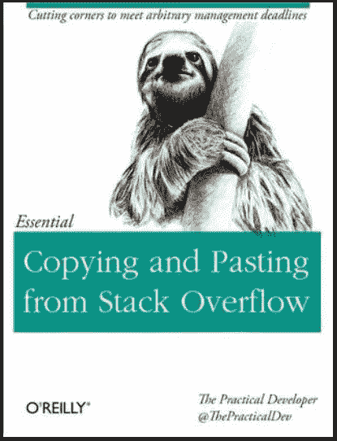

# 给初级开发人员和开发人员候选人的建议第 3742 卷

> 原文：<https://levelup.gitconnected.com/pieces-of-advice-for-junior-developers-and-developer-candidates-vol-3742-34139a0dcfd7>

Gabrielle Henderson 在 [Unsplash](https://unsplash.com?utm_source=medium&utm_medium=referral) 上拍摄的照片

***如果没有中等会员，可以使用*** [***好友链接***](https://medium.com/@mhkoca/pieces-of-advice-for-junior-developers-and-developer-candidates-vol-3742-34139a0dcfd7?sk=07d74512031bacdf38d5be3be7f9628e) ***阅读本文。(另外还有一个*** [***的土耳其版本。***](https://medium.com/t%C3%BCrkiye/yaz%C4%B1l%C4%B1mc%C4%B1-adaylar%C4%B1-ve-%C3%A7i%C3%A7e%C4%9Fiburnunda-yaz%C4%B1l%C4%B1mc%C4%B1lara-tavsiyeler-vol-3742-b7ecc37e6229)***)***

正如你在标题中看到的，这是关于这个主题的第 3742 篇文章。但我坚持不住，写了出来。我喜欢写作，我希望你也会喜欢阅读。

## 免责声明:

*亲爱的读者！最近我面临一些关于“给新开发者的建议”的问题，所以我写了这篇文章作为这些问题的参考。本文所讲的一切都是我个人的经历和想法。当然，这些都不是绝对的真理。*

另外，我不是童年时拥有 64 代海军准将的人之一。我在大学认识了软件开发。所以，我是一名普通的电脑工程师。

J unior 开发者或者开发者候选！
我们稍微聊一下。

## 软件语言

我觉得每个开发者都应该非常了解至少两种软件语言(要我说其中一种一定是 JavaScript)。此外，你也应该学习其他语言，至少能理解一点。这里有两个好处:你将获得不同的视角，在与他人比较时，你将更好地理解你的主要语言。

我们有一个不断变化的宇宙。几乎每年都有新语言和大量框架发布。你会接受学习所有新事物是不可能的。但是学习这些是可能的:

*   这种新语言/框架有什么特点？
*   它承诺解决什么需求或问题？
*   与同类产品的主要区别是什么？
*   具有等效物的基准已经发布了吗？相应的，在哪些点上是有利的，在哪些点上是不利的？

## 狂热问题

说到这些，再来说说另一个很关键的问题:软件语言狂热。

我将尝试用一个简单的类比来解释这个问题:

想象一下，你正在玩一个像职业进化足球这样的视频游戏。你有一个编辑器，让你把同一个球员在同一个团队多次。让我们成为你最喜欢的攻击手球员是梅西，后卫球员是皮克。

你可能不会把梅西作为门将。即使把他放在第 5 或第 8 位也是荒谬的。同样，你也不能到处撒气。你会用 11 个梅西还是 11 个皮克打造一支球队？(我希望你对此说不。)

> 我们可以把许多球员称为完美的前锋或完美的后卫，但没有“适合所有位置的完美球员”这样的事情。
> 
> 同样，一些语言可以完美地完成一些事情，但是没有完美的语言可以处理所有事情。

资料来源:2016 年公共支出调查(国家统计局:RWF)

因此，有必要根据每一个足球运动员的能力来评估每一种软件语言，并根据我们的需要把它用在他们擅长的地方。

你可以用 C#做几乎任何你能用 C#做的开发，但是在一种情况下，你可以用 C #在 1 天内完成你的工作，你可能需要用 C 工作 2 或 12 天。因为他们都声称——大多数情况下——他们能很好地满足不同的需求。

## 变化，发展

也许很难相信，14 年前没有 iOS，12 年前没有 Android。第一代 iPad 发布于 10 年前。Swift 的 1.0 版本发布于 2014 年，Kotlin 的第一个版本发布于 2016 年。甚至 C#也只是一门 20 年前的语言。一个时代最流行的语言，如 Delphi 和 Pascal，仍然停留在积满灰尘的遗留代码中(一般来说)。此外，AngularJS 10，反应了 7 岁的框架。

> 这一切都表明；2030 年最流行的软件语言可能还没有被创造出来。或者现在流行的一些语言可能是 10 年后遗留下来的。

除了这些，破坏性的新技术如**人工智能**(机器学习，深度学习)和“未来的互联网”(我认为是这样。)区块链最近一直在议事日程的中间。(我觉得每个软件开发者都应该紧紧跟随这两种技术。)

没有其他部门以如此令人眼花缭乱的速度变化。如果你没有足够的发展，你将会落后。所以如果我们用一句老套的口号来表达。”**如果你不跑，你就会陷入**这种境界。

> 所以你需要的最重要的两样东西是无尽的好奇心和研究热情。

## 改变和发展自己

你应该读书。你应该多读书。你应该好好读书。你应该读得很好！你也应该多听多看。

我的建议是(只要你有时间)阅读你遇到的每一篇关于软件开发的有趣或有用的文章，并倾听每一个讨论。你可能不需要在那个时候被告知这个主题。你可能永远都不需要它。但是它们都会对你有用。有时它会给你不同的视角，有时会开阔你的眼界；有时会帮助你更好地理解一个你没有深入思考的概念。

## GitHub(或 GitLab、Bitbucket 等。)

我来提一下 GitHub 这个话题。GitHub 是一个平台，在这里你可以向雇主展示你的工作质量和你所知道的具体内容。最简单的说法是，“你想要经验。我没有职场经验，但是你看，我做过/会做这些事。
还有什么？

除了语言、语法和算法之外，还有不同的——也是非常重要的——其他问题需要学习:方法、原则、原则……(本主题中的关键词:测试写作、TDD、重构、干净代码、设计原则、设计模式等。)

这些方法的主要目的是开发易于理解、易于维护、可轻松升级/扩展的软件。在我看来，学好软件语言，让你成为软件开发人员；很好的理解算法，让你成为工程师。**但是学习和吸收这些方法/原则会让你成为一名优秀的工程师和优秀的软件开发人员。**

例如，你可以很容易地在互联网上找到如何用一种语言编写循环。但是要有一个视角/方法，你需要提高你在这些主题上的知识。(比如从谷歌即时学习 vs 看书)

> “任何傻瓜都能写出计算机能理解的代码。优秀的程序员编写人类能够理解的代码”
> 
> 马丁·福勒

在软件生态系统中，联合性是最常见的——很可能。想象一下，有成千上万个开源项目，其中最流行的操作系统(Linux，Android——除了它的一小部分——等。)、软件语言(Java、Go、PHP 等。).以至于连微软——封闭源码的大本营——都放弃了，发布了。对 Linux 的热爱。除了这些优秀的东西，还有几百个互助平台，几千个博客，尤其是 StackOverflow。

来源:[https://www . goodreads . com/book/show/29437996-从堆栈中复制粘贴-溢出](https://www.goodreads.com/book/show/29437996-copying-and-pasting-from-stack-overflow)

除了这些，还有几十个软件社区。这些社区组织活动，发布视频/播客，撰写博客，并创建常见的开源项目。

当然，你应该利用这整个生态系统。此外，你应该尽可能地为生态系统做出贡献(写博客，为开源项目做出贡献，在活动中承担任务，等等。)，而且你还得尝尝那是多么美好的感觉。

## 附录

软件开发的一个主要目的是让人们的生活更容易。在软件开发过程中尽量让自己的生活更轻松。

学习 ide 的快捷方式。学习有效的复制粘贴方法。我对此很认真(比如 shift + alt +鼠标光标快捷键)。如果你经常复制文件，写一个小程序，让它做。

例如，为了调试我正在处理的项目，我需要复制一些文件并删除一些临时文件。所以每次代码更改后至少需要 30 秒。更重要的是，处理这种苦差事造成的心理磨损和随之而来的动力丧失是糟糕的。然后我写了一个简单的程序。现在，这些操作只需点击一下鼠标，我的应用程序就会在浏览器中运行。

通过这种方式，学习一些小技巧将会让你从许多家务杂事中解脱出来，并且每天可以节省 15-20 分钟甚至更多的时间。

希望这一切对你有所帮助。不要犹豫发送您的反馈。

照顾好你自己。

*联系人:* [*领英*](https://www.linkedin.com/in/muhammed-hilmi-koca-60a06152/?ppe=1) *，* [*推特*](https://twitter.com/mhk_developer)