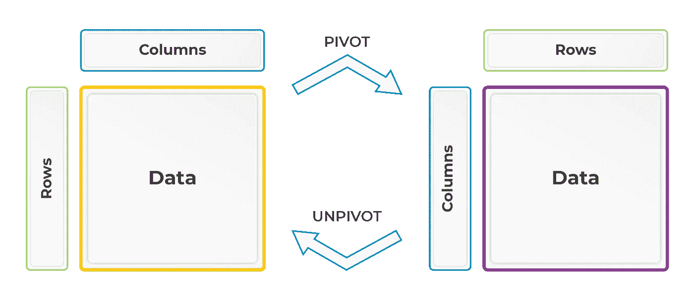
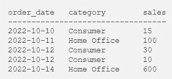
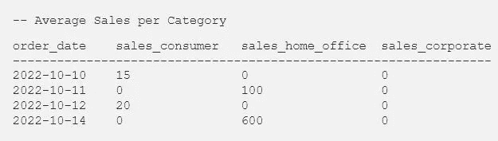
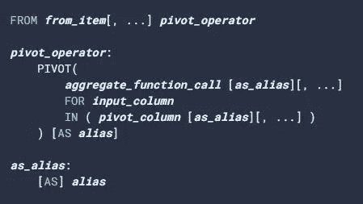
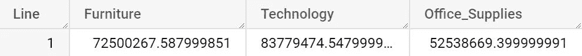
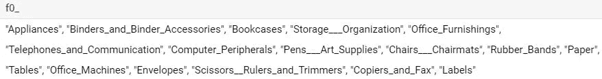
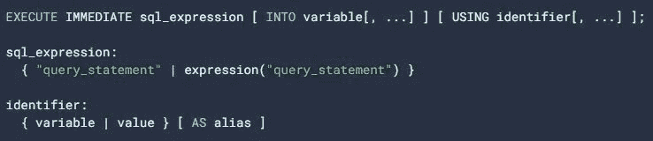
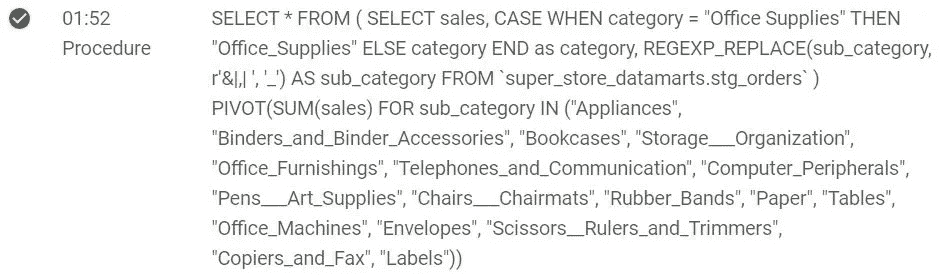
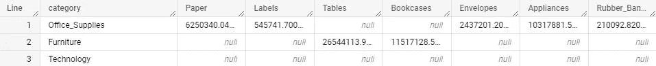

# 如何使用 Google BigQuery 透视数据

> 原文：<https://levelup.gitconnected.com/pivot-on-steroids-with-google-bigquery-4289eec13569>

## 从理论到实践，充分说明

当您像在 Excel 或 SQL 中一样操作表格数据时，您可能需要通过将一列的值组织成行来汇总数据。

为此，您必须“旋转”您的数据，并使用**函数来聚合**其他列的值。

这个操作叫做**转**，相反的过程叫做**转**。



演职员表:[米凯尔·安德烈](https://medium.com/@mickael-andrieu/)

让我们看一个订单列表，上面有日期、类别和销售额:



如果要汇总每个细分市场的平均销售额，一个 ***透视运算*** *会产生以下结果*:



> 你可以查一下 2022 年 10 月 12 日的平均销售额确实是 20 美元，或者说(10 + 30)/2。

## 如何用 Google BigQuery 做一个简单的支点

像大多数现代数据仓库解决方案一样，Google BigQuery 有专门的数据分析操作功能。

以下是官方文件中**枢轴**操作者的文件:



我们检索之前描述的主要概念:

*   一个**聚合函数**(又名“聚合函数调用”)
*   **列来操作**聚合(" input_column ")
*   本栏中的**值要考虑**

但是 Pivot 操作符有一些你需要理解的约束。

> 为了尝试本文中的每一个例子，[下载这个文件](https://gist.github.com/mickaelandrieu/464f0851e68b2ca60bce8252bb6c267f)并将其导入 Google BigQuery。

如果您遵循文档并使用 Big Query 透视数据，您最终会得到以下无效代码:

在 BigQuery 客户端中执行该查询将抛出一条错误消息:

```
Invalid field name "Office Supplies".
```

这是因为列名不能有空格。

以下是对列名(或“字段”)的约束列表:

*   只能包含字母、数字和下划线。
*   必须以字母或下划线开头:禁止以*数字开头*⛔)；
*   必须少于 300 个字符；

如果只有一些列值包含空格，您可以像下面这个*有效的*查询一样单独处理它们:



但是，如果当您不能准备转换或者有许多“无效”的列名候选项时，您考虑动态列表该怎么办呢？

考虑这个新示例，您希望根据每个子类别透视销售数据:


那里没那么有趣😓

此时，您最好使用正则表达式使用 **REGEXP_REPLACE** 函数替换下划线的每个空格:

> **下一个问题是将选择的值填入 in 操作符。**

您需要准备值并动态填充它们。

## 如何创建列名的动态列表

遗憾的是，该列表包含其他无效字符:

*   管道操作员("**| "**)；
*   与号字符(**&**)；
*   以及分号("**，"**)；

此时，您有了一个更复杂但功能更强的替代品。此外，您需要使用 **DISTINCT** 操作符来确保值是唯一的:


有点丑，但是很实用🙂

您已经接近成功，但是 BigQuery 禁止在 **IN** 操作符中执行查询，或者在同一个流程中使用前一个查询的结果。以下代码无效:

另外，操作符中的**需要一个字符串值列表，而不是一个查询结果。**

您需要准备数据，并要求 Google BigQuery 在另一个查询中使用一个查询的即时结果。

## **准备灌装作业动态清单**

这一步很容易，因为我们已经准备好了有效值列表:

*   声明一个类型为**字符串**的变量，比如说“*子类*”；
*   用前一个查询的结果填充它，连接成一个字符串；

> 我们试图生成最终的“完整”查询，并要求 Google BigQuery 执行它。

我们使用 **CONCAT** 和 **STRING_AGG** 函数来构建我们想要放入最终查询的操作符中的内容！



这是您在最终查询中需要的:令人敬畏的✨

下一步也是最后一步是让 BigQuery 使用这个变量，并在同一个流程中执行一个新的查询。

## 使用 Google BigQuery 立即执行

按照设计，BigQuery 会“逐个”处理每一个查询，你不能在同一个“批处理”中使用一个变量的结果作为需要它的查询。

> 您可以使用 Python 或任何其他编程语言来实现这一点，但我想与您分享另一个更智能的解决方案。

您可以让 BigQuery 使用相同的流程，用[**EXECUTE IMMEDIATE**](https://cloud.google.com/bigquery/docs/reference/standard-sql/procedural-language#execute_immediate)操作符来处理以下查询:



正如您所看到的，这个操作符允许使用变量。

为了帮助你理解它是如何工作的，你可以考虑一种介绍性的编程语言。例如:

BigQuery 将在查询执行时用变量值替换问号。您也可以使用多个变量:

但是如果你需要将一个字符串传递给一个 SQL 表达式，你应该使用**格式的**函数:

> 最后一个“技巧”是将立即执行和**格式化**结合起来。

***子类别*** 变量被视为任何其他字符串，并在运算符中填充为**的值:**

您将在 Google BigQuery UI 客户端的**结果**面板中找到执行的查询:



当您点击“**时，您的数据透视表显示本程序的结果**:



这篇文章写完了🚀🚀！

感谢您阅读到最后，希望这些内容对您有所帮助。

# 你可能也喜欢

[](https://medium.com/learning-sql/static-and-dynamic-pivot-in-mysql-8-9bef25d83d4b) [## 如何用 SQL 汇总数据

### 了解如何透视数据。理论和实践充分说明！

medium.com](https://medium.com/learning-sql/static-and-dynamic-pivot-in-mysql-8-9bef25d83d4b) 

如果您有任何问题，请随时发表评论，如果您喜欢这篇文章，[关注我](https://mickael-andrieu.medium.com/)，当我下一次发布时，您会收到通知。