# Python 中的熊猫数据透视表指南

> 原文：<https://levelup.gitconnected.com/pivot-tables-in-pandas-7b672e6d8f47>

## 如何在 Python 中使用熊猫数据透视表？

威廉·艾文在 [Unsplash](https://unsplash.com?utm_source=medium&utm_medium=referral) 上的照片

数据分析的一个重要部分是对数据进行分组、总结、汇总和计算统计的过程。**熊猫数据透视表提供了一个强大的工具来用 Python 执行这些分析技术。**有时数据透视表和分组依据之间的区别令人困惑。您可以将数据透视表视为多维形式的分组。

简而言之，我将在这篇文章中解释以下主题。

*   什么是 groupby 方法？
*   pivot_table 和 groupby 有什么区别？
*   如何使用 pivot_table？
*   什么是多级透视表？
*   什么是交叉表？
*   如何用真实数据集做一个样本应用？

在开始之前，别忘了订阅[我的 youtube 频道](https://youtube.com/c/tirendazacademy)，我在那里创建关于人工智能、数据科学、机器学习和深度学习的内容。

# 什么是 groupby 方法？

为了解释 groupby，让我们导入 Pandas 和 NumPy 库。

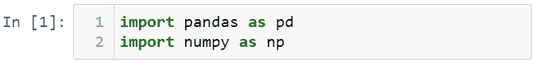

为了展示熊猫数据透视表，让我创建一个数据集。

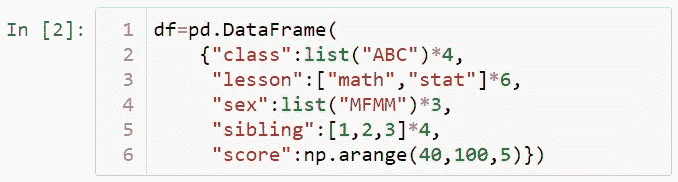

让我们来看看这个数据集。

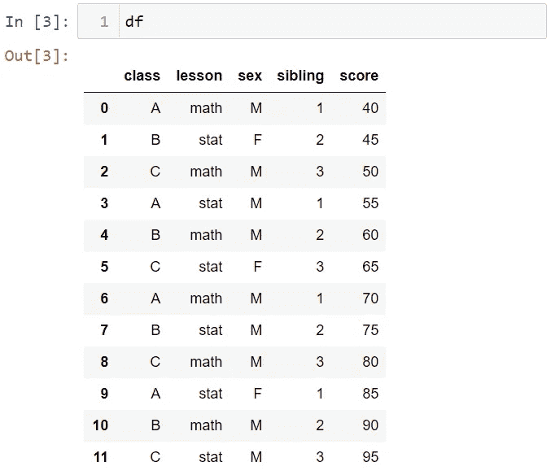

正如我在这篇文章中解释的，你可以用 groupby 方法对类别进行分组。让我展示给你看。例如，让我们根据课程的类别进行分组。接下来，让我们根据这一课栏找出平均分数。

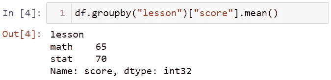

现在，让我们再获得一个分类列，并根据这两个分类列的值找到平均值。

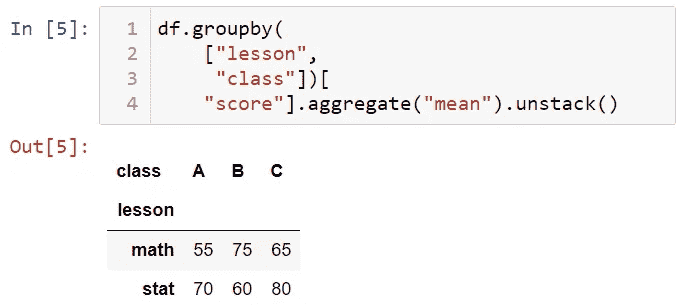

# pivot_table 和 groupby 有什么区别？

groupby 方法一般对于二维操作就足够了，但是 pivot_table 用于多维分组操作。

# 如何使用 pivot_table？

DataFrame 有一个 pivot_table 方法。让我们使用 pivot_table 创建我们用 groupby 创建的表。

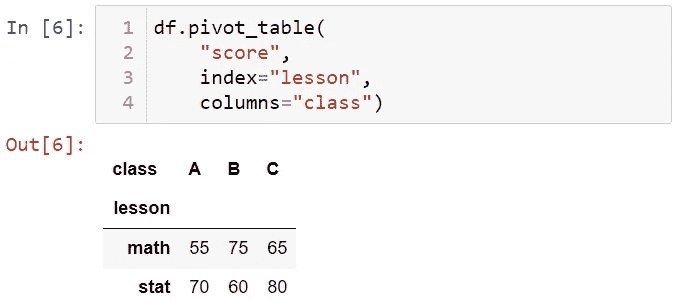

给你。现在让我们创建一个带有层次索引的数据透视表。

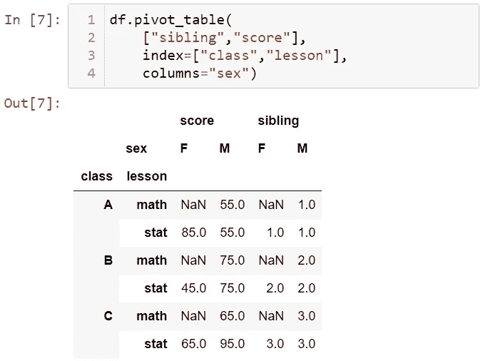

请注意，缺失数据是为表中不对应的值写入的。当 Margins = True 时，可以将列和行的平均值添加到表格中。让我展示一下。

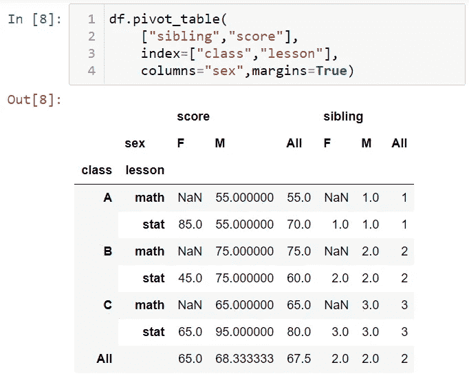

如果要赋值而不是缺失值，可以使用 fill_value。

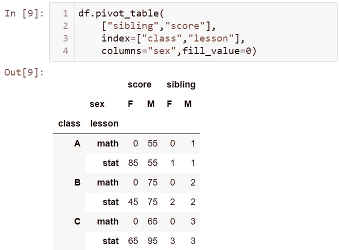

# 多级数据透视表

您还可以创建多级数据透视表。例如，让我们用 cut 方法将兄弟变量划分为区间。

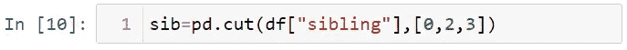

现在让我们使用这个兄弟变量创建一个多级数据集。

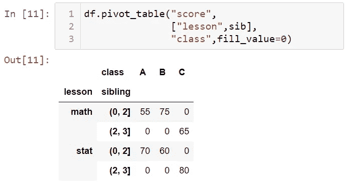

您可以增加级别数。默认情况下，aggfunc 选项采用均值函数。您可以更改此功能。让我展示一下。

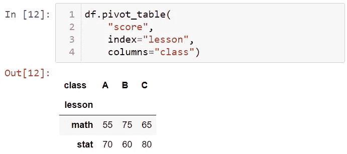

也可以使用 sum 函数代替 mean 函数。

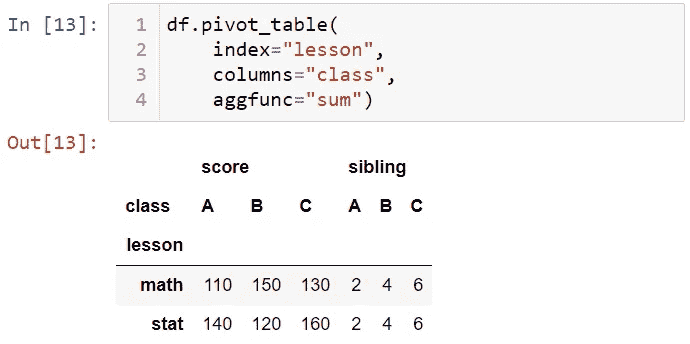

如果需要，您可以通过使用字典结构，使用单独的函数来为每一列实现。例如，让我们对兄弟使用 max 函数，对分数使用 sum 函数。

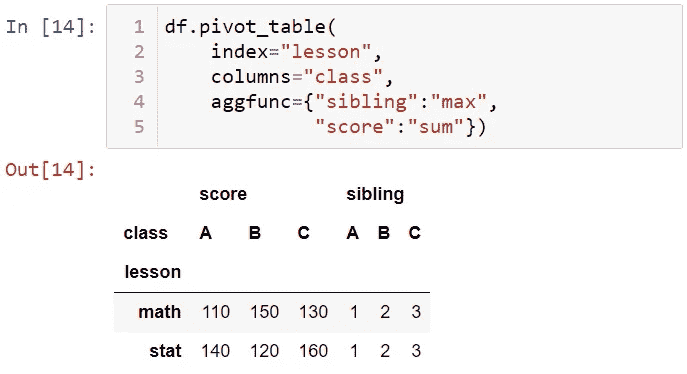

# 交叉表

最后，我们来看看交叉表方法。交叉表是计算分组频率的数据透视表的特例。让我们将交叉表用于兄弟和课程列。

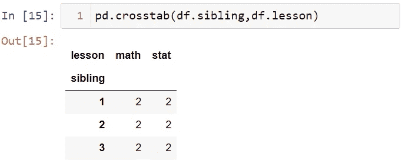

现在，让我们将变量性别添加到索引中。

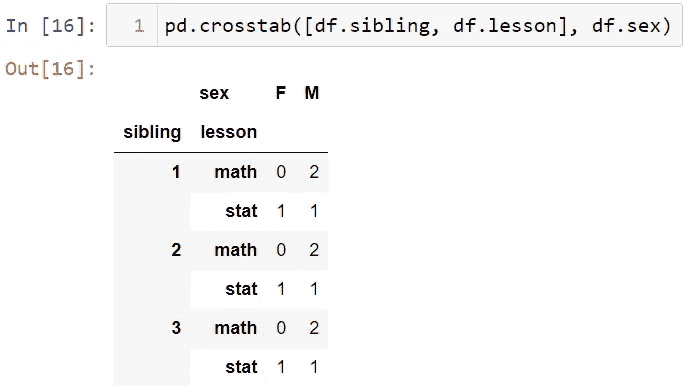

# 具有真实数据集的应用程序

现在，让我们用真实的数据集来展示我所说的内容。这个数据集是关于在美国出生的婴儿的。首先，让我导入数据集。你可以从[这里](https://github.com/TirendazAcademy/pandas-tutorial)下载这个数据集。

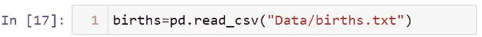

让我们使用 head 方法来查看这个数据集的前五行。

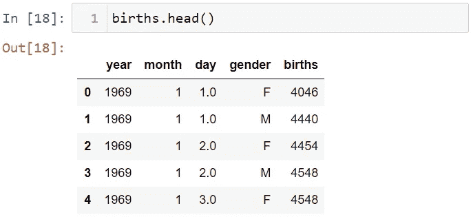

该数据集显示了按出生婴儿性别分列的出生人数。让我们使用 pivot_table 方法来理解这个数据集。我将创建一个名为 ten_year 的列来查找每十年出生的孩子的数量。

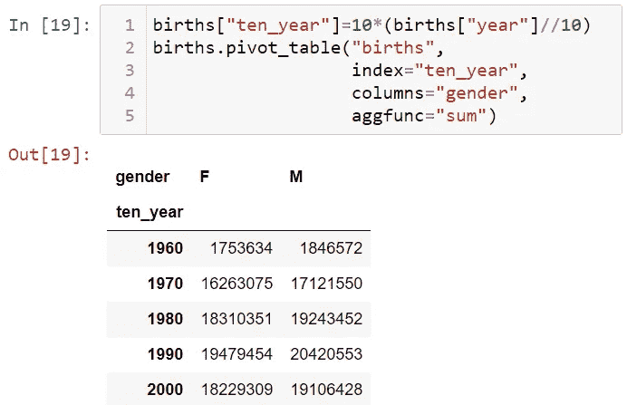

现在，我们来看看男女生育的趋势。为此，我将使用 matplotlib。首先，让我使用% matplotlib inline magic 命令来内联查看图形。

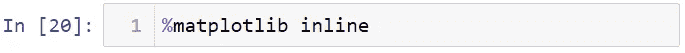

接下来，我们导入 Matplotlib 和 Seaborn。

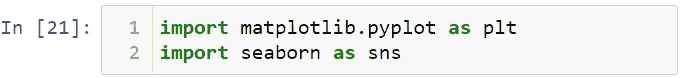

之后，我将使用 pivot_table 方法来查看每年的变化，并绘制一个线图来显示男性和女性出生率的变化。

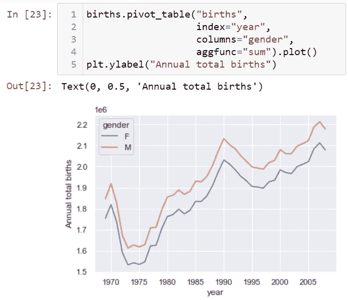

给你。从这张图上你可以看到每年的变化。在这篇文章中，我讨论了数据透视表，并展示了如何将数据透视表用于现实世界的数据集。就是这样。我希望你喜欢这篇文章。你可以在这里找到这本笔记本[。](https://github.com/TirendazAcademy/PANDAS-TUTORIAL)

如果你还没看过，我强烈推荐你看下面这些关于熊猫的文章。👇👇👇

*   [熊猫简介](https://ai.plainenglish.io/introduction-to-the-pandas-library-a3a557c8d094?source=your_stories_page-------------------------------------)
*   [熊猫的重要方法](https://ai.plainenglish.io/important-methods-in-pandas-2d4c774fcac9?source=your_stories_page-------------------------------------)
*   [在熊猫身上读写数据](https://ai.plainenglish.io/reading-and-writing-in-pandas-2d83dc538aff?source=your_stories_page-------------------------------------)
*   [如何修复熊猫丢失的数据](https://ai.plainenglish.io/missing-data-in-pandas-d41cbcec04e0?source=your_stories_page-------------------------------------)
*   [在熊猫里和 Groupby 一起工作](/working-with-groupby-in-pandas-7e7823414537?source=your_stories_page-------------------------------------)
*   [熊猫的分类数据](https://tirendazacademy.medium.com/categorical-data-in-pandas-9eaaff71e6f3?source=your_stories_page-------------------------------------)
*   [在 Pandas 中处理文本数据](https://tirendazacademy.medium.com/working-with-text-data-in-pandas-f78aa368e1a?source=your_stories_page-------------------------------------)
*   [熊猫实用数据分析](/practical-data-analysis-with-pandas-c40fbd2955fa?source=your_stories_page-------------------------------------)

请鼓掌👏如果你喜欢这篇博文。另外，别忘了关注我们的 [*蒂伦达兹学院 YouTube*](https://www.youtube.com/channel/UCFU9Go20p01kC64w-tmFORw) 📺， [*碎碎念*](https://twitter.com/TirendazAcademy) 😎*、*、[、*中等*、](https://tirendazacademy.medium.com/)📚，[*LinkedIn*](https://www.linkedin.com/in/tirendaz-academy)*👍*

*下一篇文章再见…*