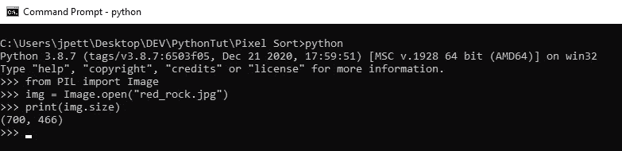

# Python 中的像素排序

> 原文：<https://levelup.gitconnected.com/pixel-sorting-in-python-62337c078118>

用枕头释放你的艺术才华


像素排序技术的一个例子。

随着技术在我们生活中占据中心位置，我们转向媒体来表达自己。了解像 Python 这样的编程语言可以打开许多大门，包括那些向内打开的大门。

编码是开启创造过程的机会。像谷歌的 [DevArt](http://processing) 和[Processing.org](https://processing.org/)这样的项目正在让艺术家和工程师更容易创新新的、引人入胜的体验。

有了 Python，利用像素的力量制作激动人心的数字艺术成为可能。有了[枕库](https://pillow.readthedocs.io/en/stable/)，Python 可以读写图像数据，让创造无尽的新艺术作品成为可能

**我将向你展示如何使用 Python 创建一个流行的** [**毛刺艺术**](https://en.wikipedia.org/wiki/Glitch_art) **技术，称为像素排序。**

像素排序是指重新排列图像中的像素，通常是通过对图像数据的行或列进行排序。记住，电脑上的图像是由成千上万个像素组成的。每个像素有三个值，分别对应用于在显示器上绘制图像的三种颜色:红色、绿色和蓝色。

这种“RGB”数据被组合起来，以呈现你看到的每个像素的最终颜色。

枕头图书馆让我们可以使用工具来处理图像。它提供了各种图像处理功能，包括但不限于颜色增强和其他图像过滤器。

在使用 Pillow 之前，您需要将它安装在您的电脑上。使用 pip 安装库是最简单的。

```
pip install Pillow
```

安装 Pillow 后，我们可以通过以下方式访问 PIL 图像库:

```
from PIL import Image
```



枕头库可用于读取和写入图像数据。

在开始分类之前，我们需要一张参考图片。请记住，图像越大，程序完成排序过程的时间就越长。我的图像大约 700 像素宽，400 像素高。


将图像保存在与您正在使用的 Python 文件相同的文件夹中。我把我的命名为 pixel_sort.py。

访问图像的单个像素相当容易，存储图像的尺寸也是如此。

```
img = Image.open(“red_rock.jpg”)width, height = img.sizepixels = img.load()
```

这就是我们开始分类过程所需要的一切。Image.load()返回一个字典或键/值对，其中每个键指向一个 RBG 值。

例如，如果像素[0，0]的值是亮红色，则该像素可能等于(255，0，0)。

使用嵌套的 for 循环，我们将遍历图像的行，然后对每一行进行排序。对像素进行排序的方法有很多种。色调、亮度、对比度等。这些都可以作为进行分类的标准。

为了简单起见，我们将关注每个像素的整体价值。由于每个像素都由三种颜色(RGB)组成，我们可以将它们相加，得到一个单一的值。

对于图像中的每一行，我们将找到具有最高整体值的像素。这将作为排序的突破点，意味着我们将只对该像素的数组进行排序。

这样做会产生一些有趣的艺术效果，但这只是像素排序的一种方法。这项技术的发明者肯·阿森多夫受到了启发。

我们将把排序代码包装在它自己的函数中。这将为图像中的每一行调用，返回一个排序的行。

```
def sort_row(row):
    min = 255*3
    min_index = 0
    #find the darkest pixel in the row
    for i in range(len(row)):
        # each pixel has an RPG value, for instance (255, 255, 255)
        temp = row[i][0] + row[i][1] + row[i][2]
        if temp < min:
            min = temp
            min_index = i# sort the row up the brightest pixel
    sorted_row = row[:min_index]
    sorted_row.sort()return sorted_row + row[min_index:]
```

枕头库允许我们使用 *new()* 方法从头开始创建图像。我们需要指定图像模式(RGB)并提供所需的宽度和高度。

```
new_img = Image.new(‘RGB’,(width, height))
```

一旦创建了新图像，我们就可以使用 *putdata()* 方法给它添加像素数据。这个方法需要一个 Python [列表](https://docs.python.org/3/tutorial/datastructures.html)，所以我们需要将我们的像素数据转换成一个列表才能工作。

```
# to make a new image, we'll need to conver the data to a list
sorted_pixels = []for y in range(height):
       for x in range(width):
           sorted_pixels.append(pixels[x,y])new_img.putdata(sorted_pixels)
```

使用 *show()* 方法显示图像。

```
new_img.show()
```


最后，我们可以使用 *save()* 方法保存新图像。

```
new_img.save(“sorted_red_rock.jpg”)
```

我试图用一种基本的排序技术使这个练习尽可能简单，但是这个程序可以有很多扩展的方式。

例如， [Asendorf 的原始代码](https://github.com/kimasendorf/ASDFPixelSort/blob/master/ASDFPixelSort.pde)合并了水平和垂直排序，选择其他排序方法可以产生有趣的结果。


《山地之旅》作者:金·阿森多夫。

请随意修改这段代码，扩展它的潜力并添加您自己的方法。谁知道呢，你可能会做出一些美丽的东西。下面是完整的代码:

```
from PIL import Image“””
To pixel sort, we first need to load all the pixels in an image file.
We’ll then loop through each row of the image data, record the color value of
each pixel in the row, then sort the row based on those values.
“””
def sort_row(row):
 min = 255*3
 min_index = 0
 #find the darkest pixel in the row
 for i in range(len(row)):
 # each pixel has an RPG value, for instance (255, 255, 255)
 temp = row[i][0] + row[i][1] + row[i][2]
 if temp < min:
 min = temp
 min_index = i# sort the row up the brightest pixel
 sorted_row = row[:min_index]
 sorted_row.sort()return sorted_row + row[min_index:]def pixel_sort():
 print(“loading the image…”)
 # load the image data
 img = Image.open(“motorboat.jpg”)# load the pixel data from the file.
 pixels = img.load()width, height = img.sizeprint(“sorting the image…”)
 # loop through each row and sort the pixels in that row
 for y in range(height):
 # get a row
 row = []
 for x in range(width):
 row.append(pixels[x,y])# sort the row
 row = sort_row(row)# record the sorted data
 for x in range(width):
 pixels[x,y] = row[x]# to make a new image, we’ll need to conver the data to a list
 sorted_pixels = []for y in range(height):
 for x in range(width):
 sorted_pixels.append(pixels[x,y])new_img = Image.new(‘RGB’,(width, height))
 new_img.putdata(sorted_pixels)print(“image preview…”)
 # preview the sorted image.
 new_img.show()
 print(“saving image…”)
 # save the file with a new name.
 new_img.save(“motorboat_sorted.jpg”)pixel_sort()
```