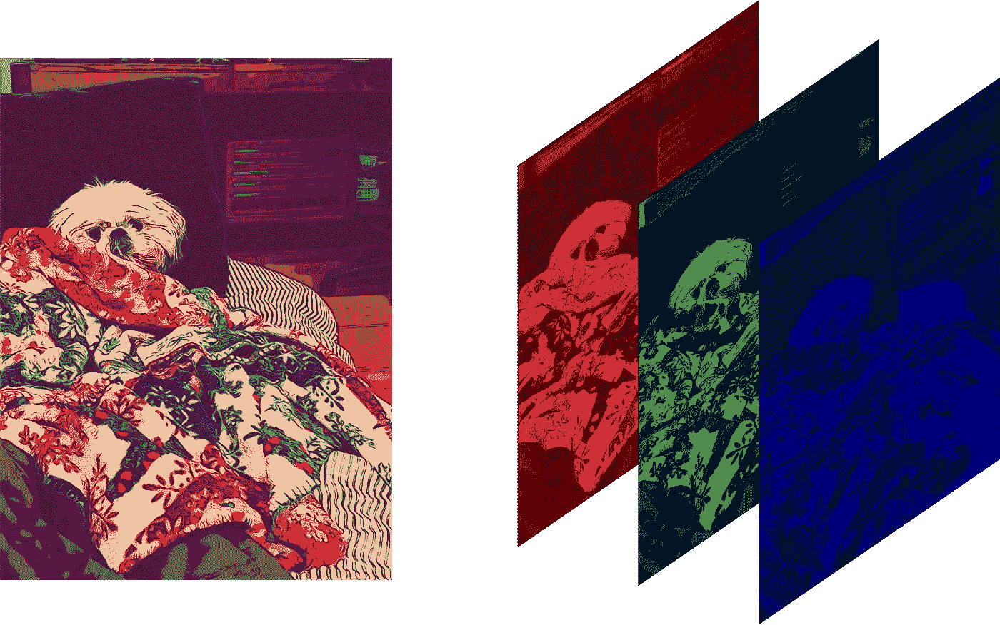
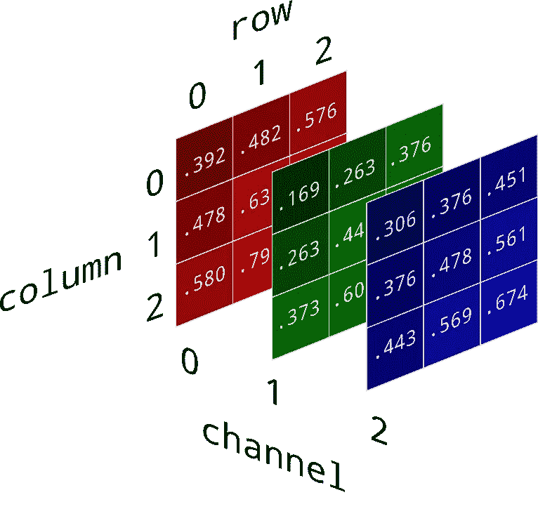
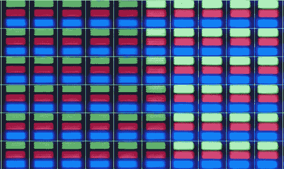

# 像素、阵列和图像

> 原文：<https://levelup.gitconnected.com/pixels-arrays-and-images-ef3f03638fe7>

计算机视觉导论，第一部分

来源: [BlockGeni](https://blockgeni.com/understanding-computer-vision/)

计算机视觉是一个不断发展的研究领域，有很多应用，从人脸检测到分析 x 光图像，甚至确定火车的车钩是否会很快分离。计算机视觉的应用似乎是无限的。但是它是如何工作的呢？今天，我们要学习的就是这个。我们将少关注数学，多关注直觉。我们开始吧！

# 什么是图像？

为了理解计算机是如何“看见”的，我们首先需要对图像有一个基本的了解。让我们看看下图:

图片来源:[黛安·罗尔](https://e2eml.school/convert_rgb_to_grayscale.html)

左边是原图。当计算机扫描、存储或检索这张图像时，它首先将它分解成三个独立的通道:红色、绿色和蓝色。你可能记得在科学课上，这是组成白光的三种颜色。画出这些通道和光之间的联系对我们来说非常重要，因为这将帮助我们回答下一个问题:

# 电脑是怎么看的？

他们不知道。至少不是以传统的方式。计算机只理解数字形式的数据。这些数字通常存储为标量、向量或数组和矩阵。这些数字也可以代表任何东西！然而，它们仍然是数字。

我们刚刚讨论了计算机如何将图像分解成三个通道。完成后，这些通道被转换成一个三维数组。看下一个例子。

阵列的每个单元对应于图像中的一个像素。这意味着数组的维数等于分辨率。因此，分辨率为 1920 x 1080 像素的彩色图像将被分解为具有相同尺寸的 a 3 数组。存储在阵列的每个单元中的**值**代表对应像素的该通道的**强度。**

让我们快速后退一步，通过做一个快速练习来消化这个问题。

为了浏览上图，我们将使用一个遵循这种模式的索引:[Channel #，Row #，Column #]。所以如果我问，“存储在[1，0，2]的值是什么？”，您将转到绿色通道(通道 1)，找到顶行(第 0 行)和第 3 列(第 2 列)的单元格，并报告答案为 0.376。

有了这些，我们来比较单个像素的值。下列单元格中的值是什么:[0，0，1]，[1，0，1]和[2，0，1]？

答案:分别是 0.482，0.263，0.376。那么这意味着什么呢？请记住，这些值代表该像素通道的**强度**(或亮度)。所以在这个像素中，红色通道将是最亮的**，其次是蓝色通道，绿色通道是最暗的。**

**你可能会问“为什么是渠道？”以及“为什么是像素强度？”这两个问题都很好，可以通过查看像素的图片来回答。**

****

**这是一个 60 像素的图像。正如你所看到的，每个像素有三个通道:红色，绿色和蓝色。就像上面阵列的三个通道一样。所以数组中的值是重新创建图像的秘诀！在我们刚刚做的练习中，阵列在说，“将该像素中红色通道的亮度设置为 0.482，绿色通道的亮度设置为 0.263，蓝色通道的亮度设置为 0.376。这样做，该像素将是正确的颜色！”**

**快速注意:本例中的值已经标准化，因此值的范围是 0 到 1。典型地，强度等级将在从 **0 到 255** 的**标度上；0 表示**无光**，255 表示**最亮**。****

# **将这一切结合在一起**

**让我们回顾一下我们刚刚学到的内容:**

*   **彩色图像由三个通道组成:红色、绿色和蓝色。**
*   **这些通道对应于单个像素中的通道。**
*   **当计算机读取(或写入)图像时，它获取像素中每个通道的亮度值，并将它们存储在 3D 阵列的相应单元中。**

**因此，计算机“看到”的是数组！因此，计算机视觉的任务是训练一种算法来识别 3D 阵列中的模式，并将该模式与物体或形状相关联。**

**[在下一篇文章](/haar-like-features-seeing-in-black-and-white-1a240caaf1e3)中，我们将讨论非常强大的算法 Viola-Jones 是如何在 2001 年使用类似 Haar 的特性实现这一点的！**

**到时候见！**