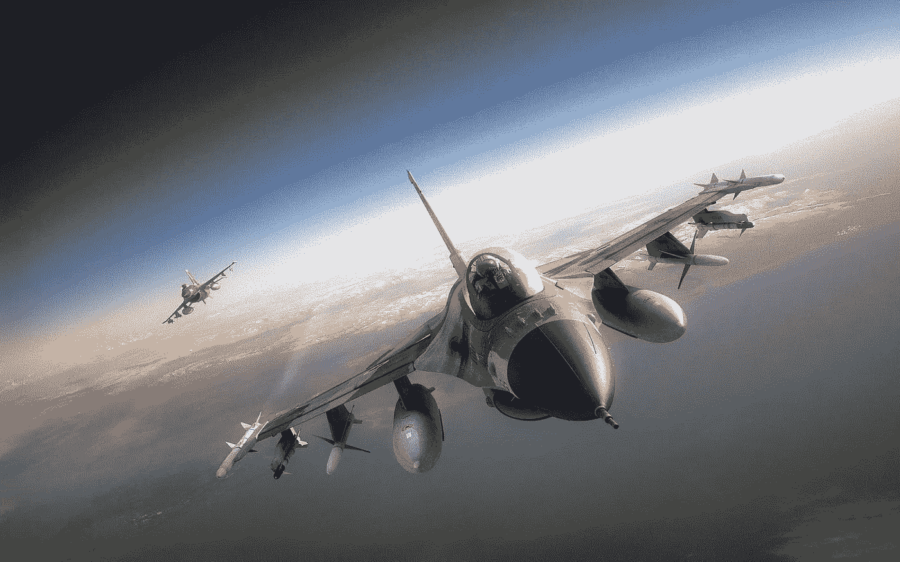
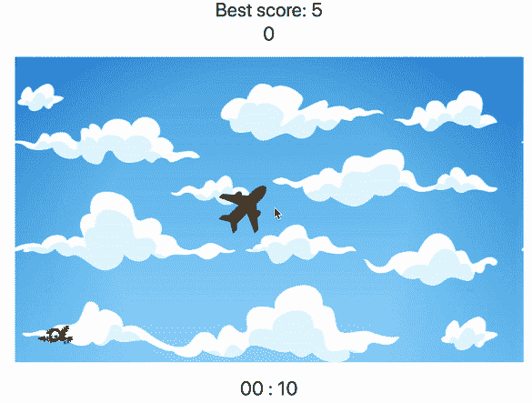
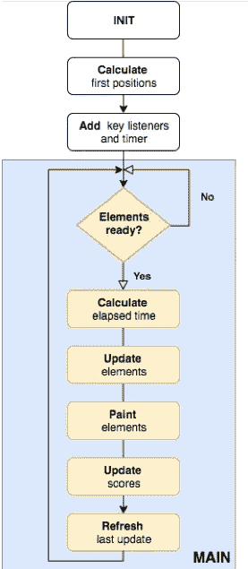
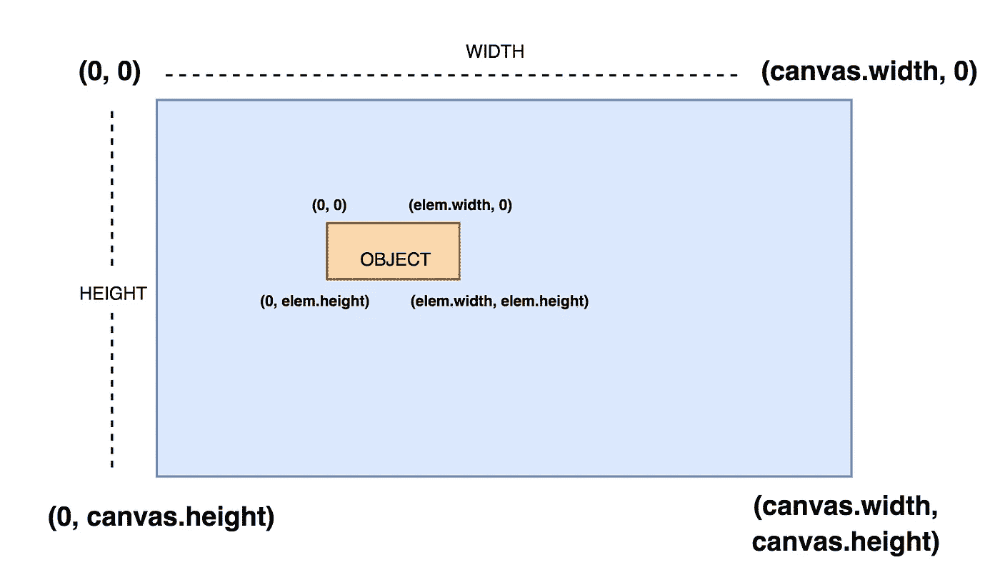
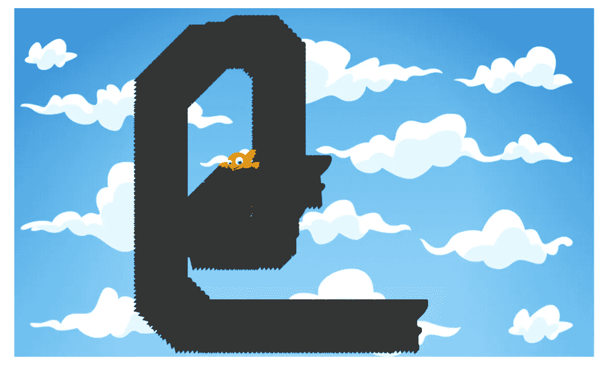
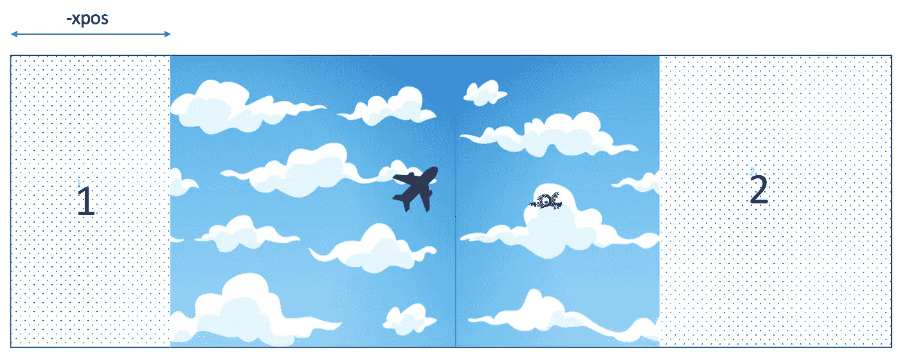

# 使用 Canvas API 和 Javascript 创建你的第一个游戏:平面攻击

> 原文：<https://levelup.gitconnected.com/plane-attack-create-your-first-simple-game-using-canvas-api-and-javascript-96eafe7801e2>

目前，我们都习惯于看到令人惊讶的游戏与惊人的图形，但是，你有没有玩过那些古老的 2D 简单的游戏，你必须通过不同的水平？你有没有想过自己造一个类似的东西？如果是这样的话，敬请关注，继续阅读！👀



高质量的飞机图像

这个想法并不是要创造一个复杂的游戏，而是提供一个建立简单游戏所需步骤的例子，同时解释这个过程中涉及的主要概念。

为此，我们将使用 **HTML 5** (使用 **Canvas API** )、 **Javascript** ，几乎不用 CSS。为了简单起见，我们将在一个 JavaScript 文件中实现全部功能，并直接在浏览器中执行

> 例如，如果我们想要 ES5 的结果，我们可以使用一些捆绑工具，比如 [Babel](https://babeljs.io/) 、 [Webpack](https://webpack.js.org/) 、[package](https://parceljs.org/)等等。此外，**如果我们创造一个更复杂的游戏**，这也是一个好主意**为我们的游戏建模并把它分成不同的模块**

在给定的时间内，你能抓到多少只鸟？😎



飞机攻击画布游戏

# HTML 结构

HTML 非常简单。创建一个***planeAttack.html***文件如下:

HTML 游戏代码

我们基本上需要三个元素:一个用于显示分数(最佳分数和当前分数)，一个用于附加 canva，s 的元素，最后一个用于计时器。

> 我们还链接了样式文件 **planeAttack.css** ,在那里我们基本上只是将游戏居中并格式化分数和计时器信息

一旦我们的 UI 完成，我们创建一个包含所有所需逻辑的***plane attack . js***文件。

# 初始化主要元素

首先，通过`[**onload**](https://developer.mozilla.org/en-US/docs/Web/API/GlobalEventHandlers/onload)`窗口事件，我们初始化主要元素:

第一步。初始化元素

这里有两件主要的事情:初始化分数和计时器值，创建画布并将其添加到我们的 board 容器中。

> 您也可以使用**<canvas>***标签将画布直接定义到 html 中*

*HTML**[**Canvas**](https://developer.mozilla.org/en-US/docs/Web/API/Canvas_API)元素提供了一个将图形绘制到 web 中的 API，但只是充当一个容器，所以您需要 javascript 来实际绘制图形。它有一个相当不错的浏览器 [*支持*](https://caniuse.com/#feat=canvas)***

***在我们的例子中，我们创建了一个二维画布，设置宽度和高度。***

> ***`[***getContext***](https://developer.mozilla.org/es/docs/Web/API/HTMLCanvasElement/getContext)`方法给了我们在画布上绘图的上下文。它还通过实验性的 [*WebGL*](https://developer.mozilla.org/en-US/docs/Web/API/WebGL_API) 实现支持三维渲染上下文***

> ***从现在开始，所有的定位参考都将以像素表示，而像素/秒则以速度表示***

# ***计算第一个位置***

***计算飞机和鸟的第一个位置将是下一步。为此，我们将创建两个具有所需属性的对象:***

***飞机和鸟的物体。计算第一个位置***

***飞机和鸟的物体被建模成一幅图像所描绘的几何形状(分别是正方形 ***80x80*** 和长方形 ***60x32*** )，所以它们基本上有相同的属性:`**width**`、`**height**`、**、**和`**image**`***

> ****平面对象还包含一个额外的* `**speed**` *属性，因为它是我们要控制的对象，因此，我们需要计算每个时间间隔所走过的距离****

***第一个鸟的位置(*和被平面*击中后的后续位置)将是随机的，平面一一开始就在我们画布上下文的中间。***

> ***请记住，我们还没有在画布上绘制任何东西。我们只是计算两个对象的第一个位置，以便在接下来的步骤中绘制它们***

# ***添加侦听器***

***我们将用箭头键控制飞机，所以我们需要添加合适的监听器:***

***箭头键监听器***

***这个`**keyActions**` 对象将在整个游戏过程中跟踪所有被按下的键，帮助我们稍后绘制平面运动。***

***按下的第一个箭头键将触发游戏，所以我们使用`**firstMove**` 变量来定位它，并设置计时器来帮助我们控制游戏的持续时间。***

# ***游戏计时器***

***为此，我们将定义 1 秒(*1000 毫秒*)的时间间隔:***

***控制游戏持续时间的间隔***

***每次执行`**clock**`间隔时，我们都会减少`**interval**` 变量，让我们控制游戏持续时间。一旦游戏在 10 秒后结束，我们重置间隔和所有变量，重新计算新游戏的初始位置。***

> ***用`**clearInterval(clock)**`重置时钟和所有的变量迫使停止当前的游戏，并为新的游戏做好准备，我们将再次听到第一个箭头键被按下***

> ***到目前为止一切正常，但是，我们如何将元素绘制到画布上呢？这个游戏实际上是如何运作的？***

***我们已经在上面定义了设置游戏基础所需的主要步骤，但是我们缺少定义控制游戏执行所需的所有任务的*[***游戏引擎***](https://www.gamecareerguide.com/features/529/what_is_a_game.php)*或***【main】***程序。*****

**********

*****游戏流程图*****

# *****主要的*****

*****`**main**`函数将包含执行逻辑:*****

*****游戏引擎。主程序*****

*****正如刚才解释的，基于更新之间的`**elapsed**`时间(以秒为单位的*)我们更新鸟和飞机的位置，将它们绘制到画布中，刷新分数并更新上次执行时间。******

******但是我们需要不断地检查这个逻辑来运行这个游戏，我们该怎么做呢？在初始步骤之后设置定时器，该定时器将周期性地执行主逻辑。******

```
******// Calculate positions
calculateFirstPositions()// Add key event listeners
addEventListeners()// Execute main program every 16 ms
**setInterval(main, 16)********
```

> ******为什么要每 16 毫秒设置一次呢？******

******间隔功能会模拟游戏的[](https://www.techsmith.com/blog/frame-rate-beginners-guide/)*****(每秒帧数)*** 。我们越频繁地执行该逻辑(*，因此位置更新越多*，我们在游戏中体验到的性能和流畅行为就越好(*，对 CPU 的要求也越高*)。在那种情况下我们渲染**60 fps*****(1000 毫秒/60fps ~ 16 毫秒)*** 对人眼来说足够好的速率。********

> *******更高的时间值会产生我们在玩游戏时都讨厌的“滞后”效果。将间隔改为**33 毫秒(30fps)** ，您会注意到不同之处*******

## *******1.更新元素*******

*******我们将创建一个函数`**updateElements**`,接受经过的时间作为参数:*******

*******更新职位逻辑*******

*******首先我们需要的是被覆盖的平面`**distance**` ***，*** 所以我们得到它乘以平面速度*(定义为* ***400 像素/秒*** *)在平面对象中********

*******飞机将越过画布的边界，穿过所有的边，从对面出来，所以我们用最大的平面尺寸和边界来计算`**planeLimit**`、`**heighLimit**`和`**widthLimit**`变量，直到它实际穿过边界，一直可见。*******

**************

*******帆布结构*******

*******逻辑总是遵循相同的模式:如果平面在画布范围内，我们总是用新的`**distance**`值更新它的位置，但是如果它穿过任何边界，我们就根据边来更新位置。*******

```
*******// UP key. Crossing top limit
if (keyActions.hasOwnProperty(UP)) {
(planeObj.y > -planeLimit) 
    ? planeObj.y -= distance 
    : planeObj.y = heightLimit
}*******
```

*******在这种情况下，如果向上的平面仍然可见(*至少 10 个像素*)，我们基于新的距离值更新位置，如果不可见，我们将其放置在底部画布限制(*少 10 个像素，所以它已经可见)********

> *******我们使用独立的 if 语句作为我们不希望平面只在 4 个方向上移动，所以同时按下向上和向右键将沿对角线移动平面(与向上和向下相同，将保持平面在画布上静止)*******

*******最后，当平面物体到达鸟中间时，我们检测到碰撞，更新一个点的当前分数，并计算鸟的新位置*******

> *******执行`**calculateFirstPositions**`只会为小鸟生成一个新的位置，因为平面一是在游戏开始时计算和更新的*******

## *******2.绘画元素*******

*******更新完元素后，我们终于可以将它们绘制到画布上了:*******

*******将元素绘制到画布中*******

*******每次执行`**paintElements**`方法时，我们总是画出飞机和鸟的位置。为此，我们使用 Canvas 2D API 提供的`[**drawImage**](https://developer.mozilla.org/en-US/docs/Web/API/CanvasRenderingContext2D/drawImage)`方法。*******

> *******但是如果你只有一张纸，并且每 5 秒钟就在不同的位置画一张新的画，那该怎么办呢？一段时间后，你可能会用尽空间，产生一个大的 draw mark*******

**************

*******未正确刷新时的示例*******

*******帆布也一样。如果我们只是在每个主循环中画一个新的平面位置，我们会在整个画布上留下大量的平面标记，而这并不是游戏的目的。我们想要绘制一个新的平面位置，但是删除了之前的位置，这样就一直只有一个平面图。*******

*******这就是`**backgroundObj**`发挥作用的地方。*******

*******在游戏开始时，我们只需在画布上的初始位置绘制背景图像:*******

```
*******// Position (0, 0) (x, y)
ctx.drawImage(backgroundObj.image, 0, 0, backgroundObj.image.width, backgroundObj.image.height)*******
```

*******一旦游戏开始，我们将有一个动态背景图像以***`**backgroundObj.speed**`每秒 100 像素的速度不断向左移动，*** 帮助我们刷新平面位置，如下所示:*******

*   *****基于从开始起*经过的时间*、背景速度*和带有*的*我们计算出背景在每个循环中将向左移动多少`**xpos**`个像素******
*   *****我们`[**save**](https://developer.mozilla.org/en-US/docs/Web/API/CanvasRenderingContext2D/save)`画布上下文，所以当前的绘图状态(*和第一个初始位置*)在任何改变之前被保存*****
*   *****我们基于`xpos`将画布`[**translate**](https://developer.mozilla.org/en-US/docs/Web/API/CanvasRenderingContext2D/translate)`放在左边*****
*   *****我们基于`**numImages**` ( *删除最后一个平面位置*)在新翻译的画布上绘制一些新的背景图像*****

> *****但是为什么我们需要一个 for 循环来绘制不止一个背景图像呢？*****

**********

*****翻译了背景图像的画布*****

*****因为我们想要无限的背景效果，所以在将第一个背景图像画在翻译过的画布上之后，我们用一个新的图像填充它的剩余部分。*****

> *****根据其计算，`xpos`变量将具有画布宽度的最大值(之后从初始位置 0 重新开始)，因此两幅图像足以完成背景过渡*****

*   *****最后，我们`[**restore**](https://developer.mozilla.org/en-US/docs/Web/API/CanvasRenderingContext2D/restore)`画布上下文，这样我们将再次拥有相同的初始状态，因此，每次我们翻译和修改画布时都有相同的位置参考*****

*****在所有这些过程之后，画布上有了新的背景图像，我们重新绘制新的飞机和鸟的位置。*****

> *****这就是我们开始玩游戏所需要的一切！*****

*****接下来需要改进的地方？增加鸟的动作，有几个不同的挑战水平，包括一些障碍迫使飞机避开它们，不要坠毁等等。*****

*****您可以在这里查看项目[](https://github.com/adrigardi90/plane-attack)*****

*******我已经用 GitHub 页面托管了游戏，所以你也可以直接玩 [**这里**](https://adrigardi90.github.io/plane-attack/)*******

*******希望你喜欢它！*******