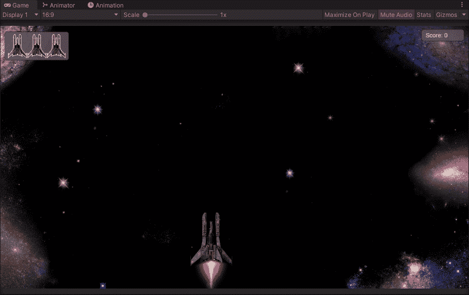
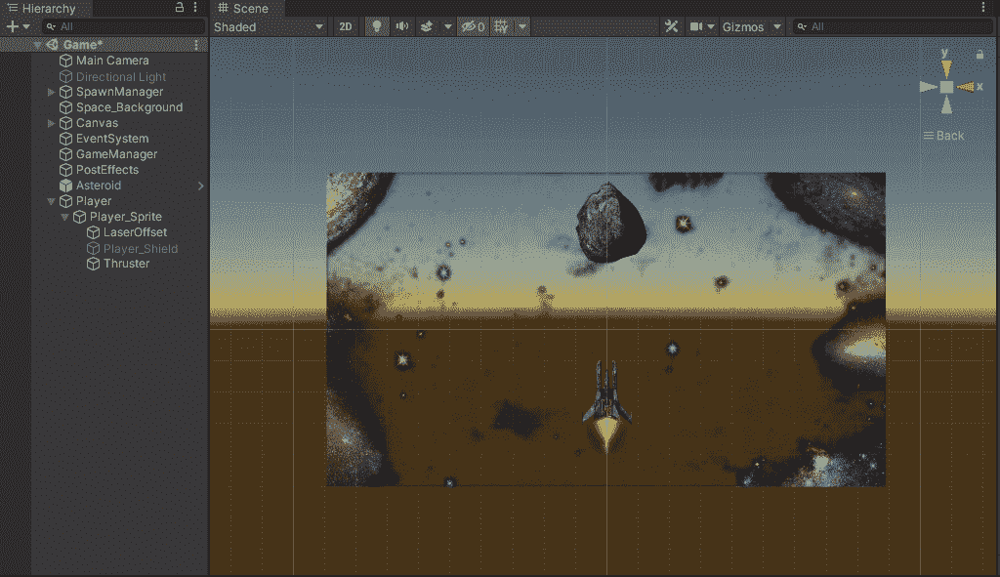
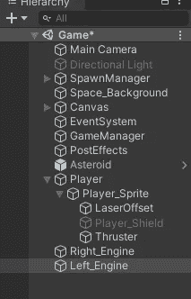
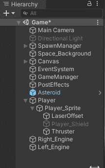
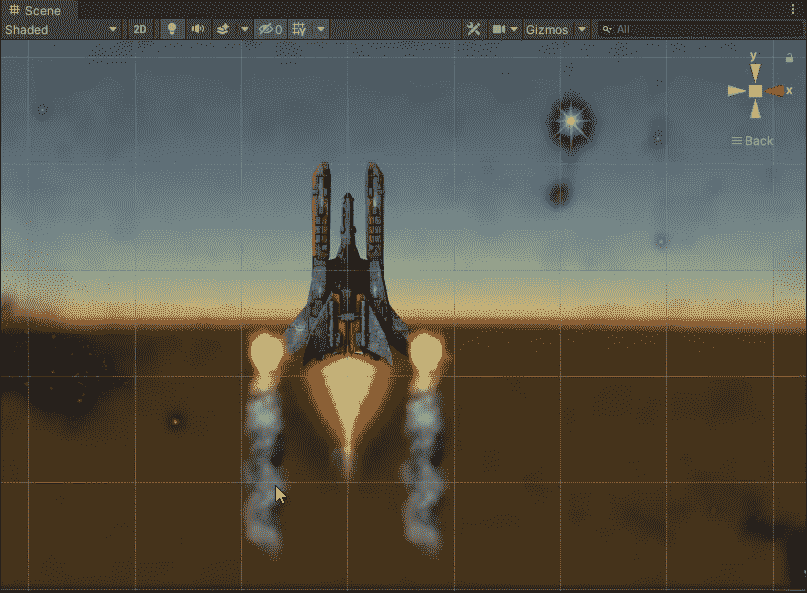
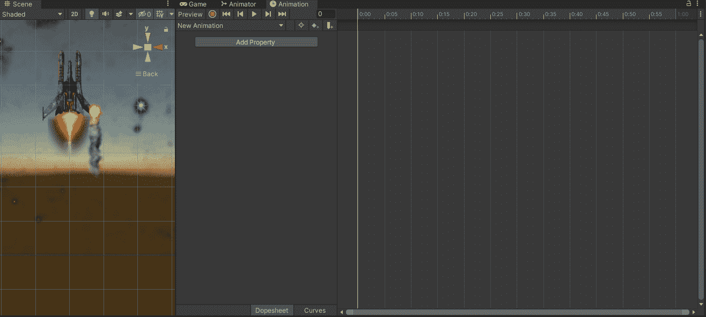
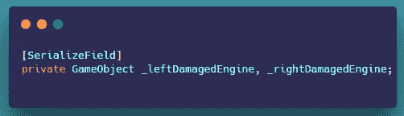
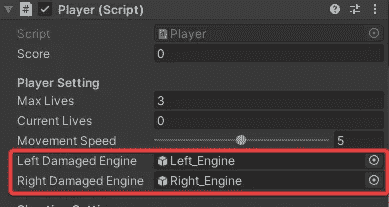
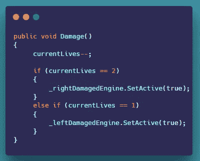

# 玩家在 Unity 中使用动画精灵伤害 VFX

> 原文：<https://levelup.gitconnected.com/player-damage-vfx-using-animated-sprites-in-unity-99eeb403b849>

**概述:**

今天，我们将讨论如何使用动画精灵来创建玩家受损的 VFX。让我们开始吧。

**创建玩家伤害动画:**

我们需要做的第一件事是拖动我们损坏的 VFX 精灵并复制它。现在我们可以让它成为玩家游戏对象的一个子对象，并把这两个伤害 VFX 放到想要的位置。接下来，我们制作精灵动画。

1.  在这里，我们正在拖动我们受损的 VFX 雪碧和定位他们。

**拖动损坏的 VFX 雪碧并定位。**

**复制右边的引擎，重新命名。**

2.现在我们既可以伤害作为游戏对象的孩子的 VFX，又可以把这两个伤害 VFX 的人放到想要的位置上。

**育儿对玩家的伤害 VFX。**

**将** **育儿后的 VFX 损坏在期望的位置给玩家**

3.现在我们可以制作每个受损 VFX 的动画。为此，我们单击其中一个受损的 VFX，例如，我从右侧受损的 VFX 开始。在动画标签中选择精灵，我们可以点击创建新的动画，并在我们的精灵表中拖动。你也可以对左侧重复同样的过程。

**将玩家损坏的精灵表拖入动画窗口**

一旦你完成了所有简单工作，现在就去激活两个损坏的 VFX 游戏物品。

动画到此为止。接下来，我们将继续通过代码触发

**通过代码触发动画:**

现在我们已经准备好了一切，我们可以打开我们的玩家脚本，并在玩家受到伤害时触发受损的 VFX 出现。让我们开始吧。

1.  首先，我们需要两个游戏对象类型的变量用于每个 VFX 伤害对象，并在检查器中分配它们。

2.现在在伤害方法中，我们可以简单地检查我们当前的生命是否等于 2，然后激活右边的伤害 VFX，如果是 1，那么我们激活左边的。

**玩家受到伤害触发伤害 VFX 出现**

这就是为创造球员损害 VFX。

感谢您的时间和关注。

# 分级编码

感谢您成为我们社区的一员！在你离开之前:

*   👏为故事鼓掌，跟着作者走👉
*   📰查看[升级编码出版物](https://levelup.gitconnected.com/?utm_source=pub&utm_medium=post)中的更多内容
*   🔔关注我们:[Twitter](https://twitter.com/gitconnected)|[LinkedIn](https://www.linkedin.com/company/gitconnected)|[时事通讯](https://newsletter.levelup.dev)

🚀👉 [**加入升级人才集体，找到一份神奇的工作**](https://jobs.levelup.dev/talent/welcome?referral=true)