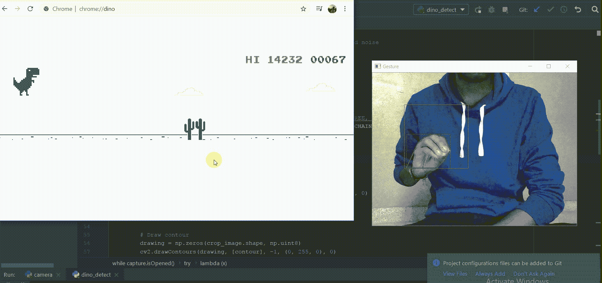

# 用 OpenCV 玩 Chrome 的恐龙游戏

> 原文：<https://levelup.gitconnected.com/playing-chromes-dinosaur-game-using-opencv-19b3cf9c3636>

我们将使用 Python 和 OpenCV 来玩恐龙游戏。在这里，我使用的是 Windows，我的摄像头用于摄像头馈送，但你也可以使用 Linux 和 MacOS 的大部分代码。

我们基本上是要用摄像头的手部动作来玩 Chrome 恐龙游戏。

# 演示

我们最终代码的一瞥。



# 我们开始吧

## 您需要以下库

```
import numpy as np
import cv2
import math
import pyautogui
```

Pyautogui: PyAutoGUI 是一个 Python 模块，用于以编程方式控制鼠标和键盘，无需任何用户交互。

打开相机并设置矩形

```
# Open Camera
capture = cv2.VideoCapture(0)

while capture.isOpened():

    # Capture frames from the camera
    ret, frame = capture.read()

    # Get hand data from the rectangle sub window
    cv2.rectangle(frame, (100, 100), (300, 300), (0, 255, 0), 0)
    crop_image = frame[100:300, 100:300]
```

模糊图像以平滑一些边缘，将模糊的图像从 BGR(蓝、绿、红)转换为 HSV(色调、饱和度、值)，因为在 HSV 中比用 BGR 更容易过滤掉。

设置 H、S、V 值的上限和下限，以便仅包括肤色、橙色色调。(随意发挥这些价值)。

这被称为阈值处理，它将每个像素转换成白色或黑色，现在上下范围内的每个像素都是白色，而每隔一个像素是黑色，这样的图像被称为“掩模”。

```
# Apply Gaussian blur
blur = cv2.GaussianBlur(crop_image, (3, 3), 0)

# Change color-space from BGR -> HSV
hsv = cv2.cvtColor(blur, cv2.COLOR_BGR2HSV)

# Create a binary image with where white will be skin colors and rest is black
mask2 = cv2.inRange(hsv, np.array([2, 0, 0]), np.array([20, 255, 255]))

# Kernel for morphological transformation
kernel = np.ones((5, 5))

# Apply morphological transformations to filter out the background noise
dilation = cv2.dilate(mask2, kernel, iterations=1)
erosion = cv2.erode(dilation, kernel, iterations=1)

# Apply Gaussian Blur and Threshold
filtered = cv2.GaussianBlur(erosion, (3, 3), 0)
ret, thresh = cv2.threshold(filtered, 127, 255, 0)
```

寻找和绘制等高线。每个相邻的像素部分被称为一个轮廓。这将画出框架的每个白色“部分”的轮廓。输出看起来会像这样。

我们现在需要找到轮廓(手)的中心，为此我们将使用 cv2.moments 来找到轮廓的质心。根据矩，质心被提取如下。当检测到手时，按下空格键，恐龙可以跳跃，如果你不打开恐龙窗口，你会看到每次检测到手时，按下空格键。

```
# Find contours
#image, contours, hierarchy = cv2.findContours(thresh, cv2.RETR_TREE, cv2.CHAIN_APPROX_SIMPLE)
contours, hierachy = cv2.findContours(thresh, cv2.RETR_TREE, cv2.CHAIN_APPROX_SIMPLE)

try:
    # Find contour with maximum area
    contour = max(contours, key=lambda x: cv2.contourArea(x))

    # Create bounding rectangle around the contour
    x, y, w, h = cv2.boundingRect(contour)
    cv2.rectangle(crop_image, (x, y), (x + w, y + h), (0, 0, 255), 0)

    # Find convex hull
    hull = cv2.convexHull(contour)

    # Draw contour
    drawing = np.zeros(crop_image.shape, np.uint8)
    cv2.drawContours(drawing, [contour], -1, (0, 255, 0), 0)
    cv2.drawContours(drawing, [hull], -1, (0, 0, 255), 0)

    # Fi convexity defects
    hull = cv2.convexHull(contour, returnPoints=False)
    defects = cv2.convexityDefects(contour, hull)

    # Use cosine rule to find angle of the far point from the start and end point i.e. the convex points (the finger
    # tips) for all defects
    count_defects = 0for i in range(defects.shape[0]):
    s, e, f, d = defects[i, 0]
    start = tuple(contour[s][0])
    end = tuple(contour[e][0])
    far = tuple(contour[f][0])

    a = math.sqrt((end[0] - start[0]) ** 2 + (end[1] - start[1]) ** 2)
    b = math.sqrt((far[0] - start[0]) ** 2 + (far[1] - start[1]) ** 2)
    c = math.sqrt((end[0] - far[0]) ** 2 + (end[1] - far[1]) ** 2)
    angle = (math.acos((b ** 2 + c ** 2 - a ** 2) / (2 * b * c)) * 180) / 3.14

    # if angle >= 90 draw a circle at the far point
    if angle <= 90:
        count_defects += 1
        cv2.circle(crop_image, far, 1, [0, 0, 255], -1)

    cv2.line(crop_image, start, end, [0, 255, 0], 2)

# Press SPACE if condition is match
if count_defects >= 4:
    pyautogui.press('space')
    cv2.putText(frame, "JUMP", (115, 80), cv2.FONT_HERSHEY_SIMPLEX, 2, 2, 2)
```

# *执行*

运行程序，切换到 chrome，打开 chrome://dino

开始时，将手放在长方形内。移动你的手让迪诺跳起来。

[](https://medium.com/@harshilp/invisibility-cloak-using-opencv-8b07142c83d6) [## 隐身衣-使用 OpenCV

### 如果你是哈利波特迷，你会知道什么是隐身衣。是啊！是斗篷让哈利…

medium.com](https://medium.com/@harshilp/invisibility-cloak-using-opencv-8b07142c83d6) 

# 完整代码

github Link—【https://github.com/its-harshil/handdino-opencv 

参考资料:

[https://medium . com/@ sulphur FX/playing-chromes-恐龙-游戏-使用-计算机-视觉-105da2f3114f](https://medium.com/@sulphurgfx/playing-chromes-dinosaur-game-using-computer-vision-105da2f3114f)

[https://github . com/SinghalHarsh/OpenCV-Projects/blob/master/Playing _ Chrome _ 恐龙 _Game.ipynb](https://github.com/SinghalHarsh/OpenCV-Projects/blob/master/Playing_Chrome_Dinosaur_Game.ipynb)