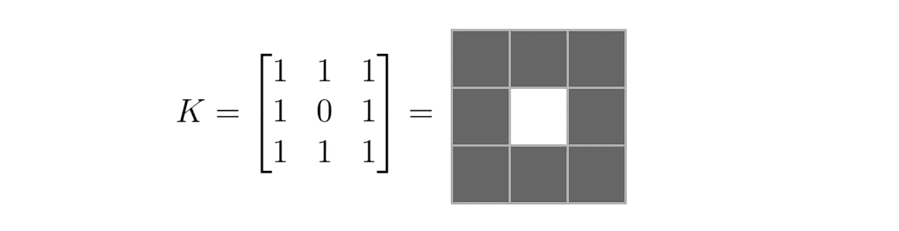
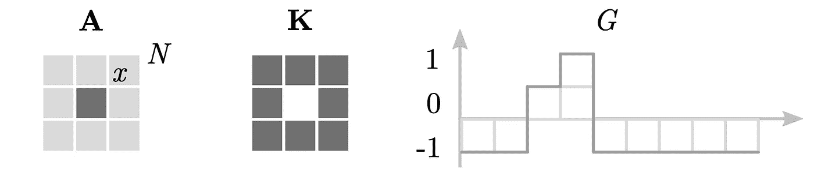
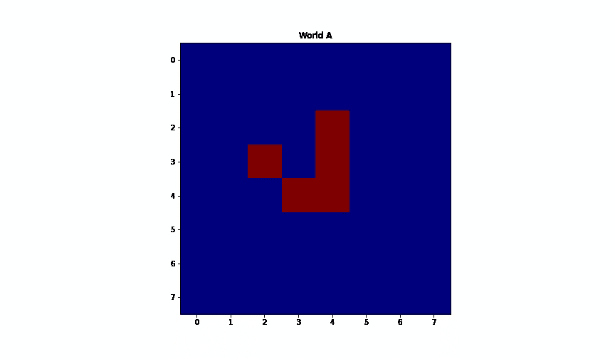
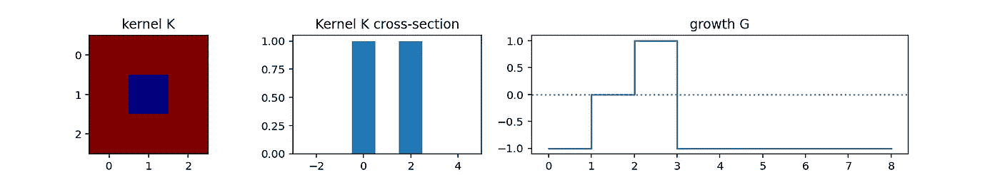
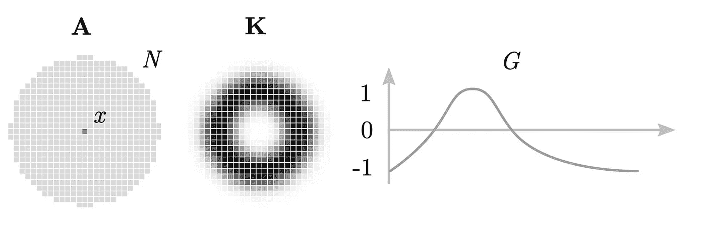
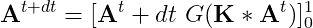
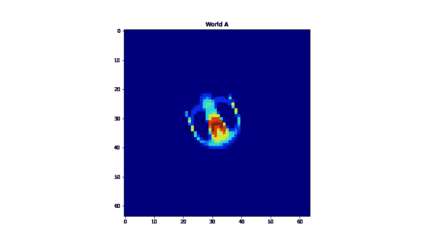
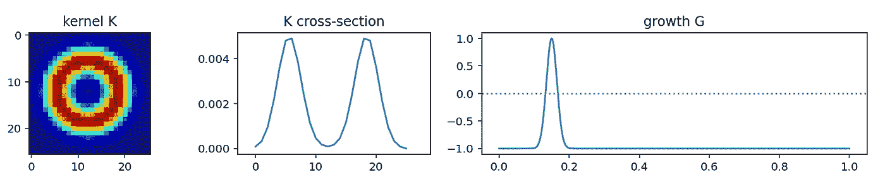
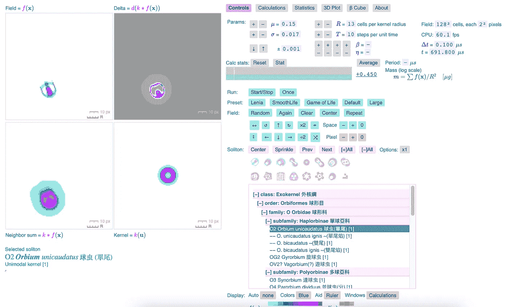

# 与 Lenia 玩耍，康威生命游戏的连续版本

> 原文：<https://levelup.gitconnected.com/playing-with-lenia-a-continuous-version-of-conways-game-of-life-a26a5a7f1680>

一些列宁主义的例子

如果你读了这篇文章，很可能你已经知道康威的生活游戏。它基本上是生活在二维网格世界中的细胞，其中的细胞可以是活的，也可以是死的。给定初始配置，它们遵循一组简单的规则进化。在这里，我们将看到由伯特·王 Chan 陈(2015)创作的《勒尼亚》，这是康威《生活的游戏》的广义或连续版本。

先看基础的。经典的生活游戏有这些简单的规则:

1.  任何具有少于两个活邻居(在 *t -1* )的活单元(在时间 *t-1* )在时间 *t* 转变为死状态。
2.  任何具有两个或三个存活邻居( *t -1* )的存活单元( *t -1* )在时间 *t* 保持存活。
3.  任何具有三个以上活邻居( *t -1* )的活单元( *t -1* )在时间 *t* 转变为死状态。
4.  恰好具有三个活邻居( *t -1* )的死单元( *t -1* )在时间 *t* 转变到活状态。

如果你想用这些规则为生命游戏写一个程序，你可以用一些简单的循环来计算相邻的单元格和一些 if-else 语句。为了计算相邻细胞的数量，你可以看到使用卷积和这个内核将有助于以后的推广。

核 K 矩阵及其可视化

这个内核将帮助计算有多少个邻居单元(不包括它自己在中心)。除了使用与这个核的卷积来计算相邻细胞，我们还需要做一些条件来根据上面的规则进化细胞。为了概括这一点，我们可以使用称为增长或映射函数的东西。对于生命的经典游戏，成长函数值会离散为 *1* (出生) *0* (存活)，或者 *-1* (死亡)。为了用这些计算和规则来形象化经典生活游戏，我们可以看到这个图表。世界 *A* ，站点 *x* 和邻居 *N* 如下图所示。进化将通过将内核 *K* 和函数 *G* 应用于初始 *A* 来更新/进化单元，并再次重复。

经典康威生活游戏规则

这个生活游戏的 Python 代码可以这样写(你可以用 Jupyter 笔记本在线运行这个[:](https://cocalc.com/projects?session=default)

运行代码后，结果将如下所示:

康威的生活游戏:滑翔机

康威的生命游戏:内核和生长函数

另一方面，Lenia 有类似的规则，但推广到连续域，具有实值的无穷小站点 *x* ，循环邻域 *N* ，环状内核 *K* (模仿经典生命游戏的内核)，平滑增长函数 *G* (模仿经典生命游戏的步进/离散 *G* ，增量时间更新 *dt* 。 *A* 的更新值也被夹在 *0* 和 *1* 之间(如果更新值低于 *0* ，将被设置为*0*；如果该值高于 *1* ，则设置为 *1* 。

勒尼亚的统治

基本上，该规则可以用以下公式表示:

Python 代码可以这样写(来自 Lenia):

上面代码的结果:

莱娜:奥比姆

Lenia:核函数和生长函数

你可以在这里阅读更多关于伯特·王 Chan 陈的文章。至于更有效的计算，可以用快速傅立叶变换(FFT)代替上面的简单卷积计算。

如果你想在不自己运行代码的情况下和 Lenia 一起玩，Lenia 的作者在这里有一个 web (Javascript)版本可以玩[https://chakazul.github.io/Lenia/JavaScript/Lenia.html](https://chakazul.github.io/Lenia/JavaScript/Lenia.html):

[Lenia 网页版](https://chakazul.github.io/Lenia/JavaScript/Lenia.html)截图

通过 Lenia，你可以探索生命游戏连续版本的不同规则，比如使用不同的内核和生长函数来观察这些生物如何进化和行为。看到这个数字世界的简单规则可以导致一些涌现现象，这有点酷。2020 年，Lenia 还进行了进一步的扩展，在 3D/4D 中产生了更多有趣的图案。如果你觉得这个有意思，就去看看，玩玩。