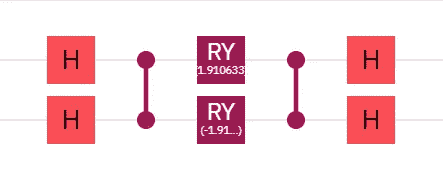

# 玩弄光子

> 原文：<https://levelup.gitconnected.com/playing-with-photons-68ef9287e6ad>


[https://cloud.xanadu.ai/](https://cloud.xanadu.ai/)

# 成就解锁

我不得不等了一段时间才最终获准使用 Xanadu 的一个光子设备 X8，但这最终在大约一年前发生了。自从我开始从事量子计算以来，这几乎是我的愿望清单的顶端，因为还有什么比玩单个光子听起来更棒的呢？当然，玩原子、离子和量子点等等听起来都很有趣，但是，对我来说，玩光子在“头脑=爆炸”排行榜上名列前茅。最终我获准使用另一个光子设备，Borealis，现在我相信每个人都可以免费使用这两个设备。

## 与超导量子比特的比较

我几乎只使用 IBM 的量子设备，虽然我也用过其他的，而且我敢说学习 OpenQASM 和 Qiskit 是相对容易的。其实学习 OpenQASM 特别容易。此外，我认为从 Qiskit 转换到其他量子计算框架的各种学习曲线有点陡。


基于超导量子比特的洪-欧-曼德尔干涉测量

然而，光子学相当不同。除非你已经有了相关的背景，否则你不会直接从 Qiskit 转到草莓地。首先，到处都有新的术语。我怀疑有了词典，这种转变会更容易，但是，在没有词典的情况下，学习新的行话需要一些时间。此外，还有一些操作不是其他量子位技术所固有的，所以这些都需要学习。



基于超导量子比特的可重构分束器

或者，他们没有吗？有些操作看起来与你所见过的超导量子位或离子阱完全不同，但它们有相同之处。例如，我知道洪-欧-曼德尔干涉测量法是[阿达玛测试](https://medium.com/@bsiegelwax/the-simplest-way-to-compare-single-qubit-quantum-states-8ddbefa5a93e)的光子等价物，这是一种比较量子态的方法。我知道如何使用哈达玛门、受控 Z 旋转和 Y 旋转来实现一个[可重构分束器](https://medium.com/gitconnected/amplitude-encoding-dd89dc84170d)。那么，学习曲线到底有多陡呢？要回答这个问题，老实说，我自己还需要做更多的研究。


[https://www.xanadu.ai/](https://www.xanadu.ai/)

## 光子量子计算机在哪里？

我想做的只是在光子设备上运行“你好，量子世界”的等价物。可惜找不到入门教程。因此，我开始复制和粘贴一些代码样本，目的是找到一些有用的东西，弄清楚如何修改它，然后在一个真正的后端上运行，以获得我的光子修复。

不过，我做这个已经够久了，意识到所有的样本都运行得太快了。在检查了代码并点击了整个站点之后，我相当确信所有的代码都在模拟器上运行。那不是我想要的。

经过一番搜索，我最终找到了产生以下结果的一些代码:


这个结果最终显示了在实际的 X8 系列光子器件上运行的证据。这算是我的第一个光子实验，虽然，与我做过的其他第一个实验不同，我真的不知道这个电路做了什么。尽管我尝试通过实验来学习，但我就是无法运行任何修改过的代码。我试过的东西似乎都与 X8 不兼容，所以是时候寻求支持了。

## 三扇门

我个人对使用量子计算模拟器不感兴趣。我想用真实的量子位。我想玩光子。所以，我向 Xanadu 提出了这样一个问题:什么样的操作可以在真实的硬件上运行？


[https://twitter.com/XanaduAI/status/1486385647493558273](https://twitter.com/XanaduAI/status/1486385647493558273)

所以，你有它。如果你想尝试光子设备，并且 Xanadu 允许你进入，你需要熟悉 [BSgate](https://strawberryfields.readthedocs.io/en/stable/code/api/strawberryfields.ops.BSgate.html) 、 [MZgate](https://strawberryfields.readthedocs.io/en/stable/code/api/strawberryfields.ops.MZgate.html) 和 [Rgate](https://strawberryfields.readthedocs.io/en/stable/code/api/strawberryfields.ops.Rgate.html) 。还有许多其他可用的门，但这是三个允许你玩光子的门。顺便说一下，页面的直接链接是“[在 X8 设备上执行程序](https://strawberryfields.ai/photonics/demos/tutorial_X8.html)”

## 我的第一个实验

这里是我通常会张贴代码或结果或 GitHub 链接或某个实验的地方。

```
# insert successful code here
```

通常我会在这里解释我的所作所为。然而，我真的只是复制粘贴。所以，如果你去[https://strawberryfields.ai/](https://strawberryfields.ai/)，除了你能在那里找到的教程，我不能给你提供任何价值。

```
np.random.seed(42)
```

不过，我必须说，来自其中一个教程的这一行代码让我很开心。

## 我的第二个实验

本文顶部的特色图片显示了我在 Borealis 上进行的[“量子优势”实验](https://strawberryfields.ai/photonics/demos/tutorial_borealis_quickstart.html)的结果。同样，不幸的是，我还不能增加你在那里能读到的东西的价值。

## 结论

好消息是，Xanadu 已经允许更多人访问其设备。更好的消息是，只有三个门需要学习和掌握。但是，在继续之前了解光子学知识肯定会有所帮助。在进行了第一次实验将近一年后，我发表了这篇文章，因为现在是获取知识的时候了。

顺便说一句，我有没有说过这些都是免费的？

## 收场白

精明的读者可能已经注意到，我在这篇文章中只提到了草莓地，而不是更受欢迎的 PennyLane。我对 X8 和 Borealis 能做什么以及光子学与其他量子位技术相比如何感兴趣。PennyLane 是草莓地顶部的一个变分的，又名混合经典量子框架，所以它对于我所做的有限实验来说是不必要的。