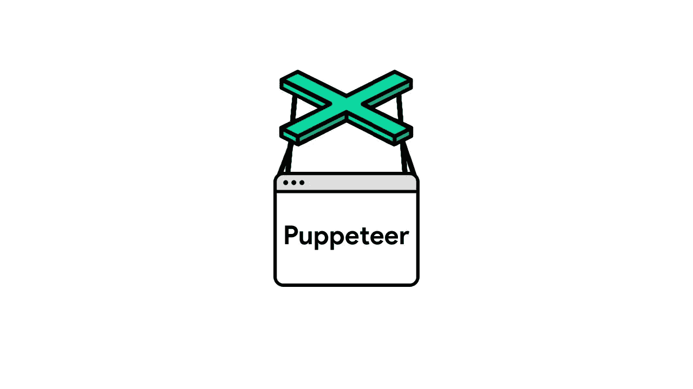
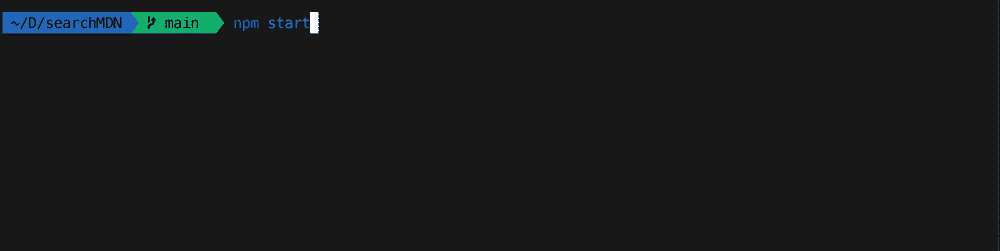

# 和木偶师玩耍

> 原文：<https://levelup.gitconnected.com/playing-with-puppeteer-1438af6bf95e>



本周，我决定去看一看[木偶师](https://github.com/puppeteer/puppeteer)。我知道这是一种制作小型自动化浏览器脚本的方法，并且很高兴尝试一下。我编写了一个简单的脚本，在 MDN JavaScript docs 网站上搜索数组方法，返回方法的定义和数组方法网页的链接。这是一个概念验证，只是为了让我了解木偶师。

如果你对它不熟悉，[木偶师](https://github.com/puppeteer/puppeteer)是一个节点库，它提供了一个高级 API 来通过 [DevTools 协议](https://chromedevtools.github.io/devtools-protocol/)控制 Chrome 或 Chrome。默认情况下，它无头运行，但可以配置为完全运行(非无头)。

对于这个项目，我决定也使用包[粉笔](https://www.npmjs.com/package/chalk)和[询问者](https://www.npmjs.com/package/inquirer)。Chalk 将允许我轻松地格式化我们的终端输出，Inquirer 将允许我轻松地创建我们的命令行用户界面。

我创建了一个名为“searchMDN”的新文件夹，在终端中导航到它并安装了三个依赖项。

```
$ npm i puppeteer chalk inquirer
```

创建一个名为 app.js 的新 JavaScript 文件，首先，我将创建将在终端中显示的用户提示。我还进入了 package.json 文件，并将启动命令设置为‘node app . js’…

# 创建用户提示

首先要求我们的文件中的问询者包。

```
const inquirer = require('inquirer')
```

现在它可用了，我可以用它来让用户提示。我只希望提示是“输入要搜索的数组方法”。Inquirer 有许多如何提示用户的选项，但我不需要太多——只需要它最基本的提示，即“prompt()”方法。这个方法要求我指定提示的类型。我希望用户写下他们希望查找的方法的名称。对于这种用户输入，我将使用 inquirer 提供的“输入”类型。接下来，我必须命名从用户那里得到的响应。我将把它命名为 userInput。

```
inquirer.prompt({
  type: 'input',
  name: 'userInput',
  message: 'Enter array method to search for'
})
```

接下来，我需要获取 userInput 并将其发送给一个使用 Puppeteer 搜索 MDN 网站并返回结果的函数。因为 prompt()方法返回一个承诺，所以我将使用。then()方法并获取 userInput 的结果，然后将其传递给“getResults()”函数，我将在 Puppeteer 的帮助下创建该函数。我还将把它包装在一个名为 start()的函数中。因为这个函数必须是第一个被调用的函数，并且启动 getResults()函数，所以在文件末尾调用 start()来初始化这个数组方法搜索脚本是有意义的。

```
const start = () => {
  inquirer.prompt({
    type: 'input',
    name: 'userInput',
    message: 'Enter array method to search for'
  })
  .then(resp => getResults(resp.userInput))
}
```

# 使用木偶师实现自动化

就像上面一样，我需要 app.js 文件中的木偶师包。

```
const puppeteer = require('puppeteer')
```

所有的功能，我需要从木偶戏将是异步的，这是有意义的。我必须创建一个 chromium 浏览器的实例，打开一个新页面，加载网站，找到搜索栏的 id，输入搜索词，等待新页面加载，然后找到第一个结果，将结果 url 存储在一个变量中，转到结果的网页，找到定义，将定义存储在一个变量中，最后输出到控制台。我需要代码等待这些任务完成后再继续。因此，我将把这一切包装在一个异步函数中。

```
async function getResults(term) {
  const browser = await puppeteer.launch()
  const page = await browser.newPage() 
}
```

上面，我已经创建了 async getResults()函数，它接受一个参数，该参数由我将用来查询 MDN 站点的搜索词的 start()函数发送。我用 puppeteer.launch()创建了一个无头 chromium 浏览器的实例。一旦完成，代码将创建一个新页面。然后我们需要给木偶师我希望开始搜索的 url 地址。

当我弄清楚这个脚本时，我启用了创建完整(非无头)浏览器的选项。这样，随着我每一步的进展，我可以在浏览器中迅速找出下一步需要做什么。我通过调用 puppeteer.launch()中的选项{ headless: false }来实现这一点。

我使用了开发者主页，并将语言环境设置为 en-US，以确保我只能得到英文结果。使用 chrome 开发工具，我发现网站上的搜索栏的 html id 是“main-q”。

```
const mdnUrl = 'https://developer.mozilla.org/en-US/search?locale=en-US'async function getResults(term) {
  const browser = await puppeteer.launch({ headless: false })
  const page = await browser.newPage()
  await page.goto(mdnUrl)
  await page.type('#main-q', `Array.prototype.${term}`)
  await page.keyboard.down('Enter')
}
```

使用`page.type`选择我想要输入文本的元素，并在第二个参数中选择我想要输入的文本。我只搜索数组方法，所以我将在字符串“Array.prototype”的末尾输入术语。一旦按下回车键，搜索查询就被发送。

现在我们需要等待新页面加载并找到第一个结果。页面上的所有结果都有“结果”类，每个标题都有“结果-标题”类。如果我只是在“result-title”上调用 querySelector，它将获取第一个结果，然后剩下要做的就是从结果标题中获取链接。

```
const mdnUrl = 'https://developer.mozilla.org/en-US/search?locale=en-US'async function getResults(term) {
  const browser = await puppeteer.launch({ headless: false })
  const page = await browser.newPage()
  await page.goto(mdnUrl)
  await page.type('#main-q', `Array.prototype.${term}`)
  await page.keyboard.down('Enter')
  await page.waitForSelector('.result') const resultUrl = await page.evaluate(() => {
    const topResult = document.querySelector('.result-title')
    return topResult.href
  })
}
```

好了，快到了！我有了方法定义的 url，现在我所需要的就是获取定义并输出到终端。

按照类似的模式，我用我们保存在 resultUrl 常量中的 url 打开一个页面。定义在最顶层的

标记中，所以我用 querySelector 选择它，然后将 innerText 保存到 resultDef 的常量中。之后，我们完成了浏览器，需要关闭它，这样它就不会继续在后台运行。

```
const mdnUrl = 'https://developer.mozilla.org/en-US/search?locale=en-US'async function getResults(term) {
  const browser = await puppeteer.launch({ headless: false })
  const page = await browser.newPage()
  await page.goto(mdnUrl)
  await page.type('#main-q', `Array.prototype.${term}`)
  await page.keyboard.down('Enter')
  await page.waitForSelector('.result') const resultUrl = await page.evaluate(() => {
    const topResult = document.querySelector('.result-title')
    return topResult.href
  }) await page.goto(resultUrl)

  const resultDef = await page.evaluate(() => {
    const termDef = document.querySelector('p')
    return termDef.innerText
  }) browser.close()
}
```

这样，我就有了我们需要的所有数据，我唯一需要做的就是将结果输出到控制台。

# 输出到控制台

接下来，我需要将 Chalk 包添加到 app.js 文件中。

```
const chalk = require('chalk')
```

Chalk 有很多格式化文本的选项，最棒的是它们都是简单的英语，没有十六进制或 RGB 值。嗯，**你**可以用粉笔使用 RGB 值，但我会保持简单。我只是想添加一点颜色，这样定义和 url 感觉是分开的，输出更容易阅读。

```
console.log(chalk.magentaBright(resultDef))
console.log(chalk.underline.dim(resultUrl))
```

我将 resultDef 文本设为亮洋红色，并为 url 加下划线，将其颜色从显示它的控制台的默认颜色变暗。

现在，我从 puppeteer.launch()中删除了{ headless: false }选项，这样，这个简单的概念验证脚本就完成了。



关于这些软件包的更多信息，请查看下面它们各自的链接。

[木偶师](https://github.com/puppeteer/puppeteer)

[粉笔](https://www.npmjs.com/package/chalk)

[问询者](https://www.npmjs.com/package/inquirer)