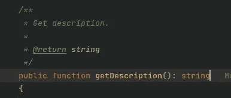

# 请不要评论你的代码

> 原文：<https://levelup.gitconnected.com/please-dont-comment-your-code-d0830785bdc9>

## 当不良行为失去控制时

在软件开发领域，代码注释和“hello world”几乎是齐头并进的。每个例子都体现了一种语言的最简单的结构。然而，在我们被教导如何在我们各自的语言中使用这些评论之后，我们是否被教导如何*而不是*使用它们？

很可能不是。因此，我目睹了太多糟糕的编程实践，也是它们的始作俑者。是的，我认为评论是一种编程实践。我遇到过一些明显的例子，在这些例子中，我惊叹于一个项目的注释的深思熟虑的结构，而在其他例子中，它充其量是不必要的。

现在是时候我们看看我们的代码中那些永远不会进入生产环境的部分了，但是肯定会影响到发布之前的内容。

# 过度沟通会稀释它的价值

在一个沟通工具激增、沟通不畅的世界里，过度沟通难道不是解决之道吗？就像大多数问题一样，世界上没有等待释放其解决问题的灵丹妙药。

事实上，人类缩短的注意力持续时间需要更有效的沟通。梅洛迪·威尔丁是亨特学院的人类行为学教授，也是《今日心理学》的作者。在她的文章[中，她认为“良好的沟通技巧很大程度上植根于准备和简洁”(野生)](https://go.oliverspryn.com/concise-communicator)

考虑到人类的平均注意力持续时间已经从 2000 年的 12 秒下降到 8 秒，你的机会之窗比以往任何时候都要短。“当人们不得不加班加点地理解你所说的话时，他们会变得不耐烦……(而且)你最终会因为过度解释(原文如此)而模糊了(你正在交流的内容)。”(野生)

# 代码就是交流

代码只是人类思想的另一种表达方式。因此，如果书面和口头交流变得令人厌倦和膨胀，那么通过代码的表达也是如此。

考虑这个例子:

一个无关的评论，来自 Reddit 上的 [r/badcode](https://go.oliverspryn.com/bad-php-comment)

虽然这个 PHP 示例可能被认为很幽默，但它证明了一个非常好的观点。代码的价值被没有价值的无关注释冲淡了。

这个片段本质上是一个糟糕的实践。它是为了文档而文档，即使函数的签名完美地传达了相同的思想。

 [## 无效技术领先的优点

### 当改变角色意味着改变心态时

better 编程. pub](https://betterprogramming.pub/the-virtues-of-an-unproductive-tech-lead-b17b31ee9065) 

# 评论变得陈旧

作为一名工程师同事，我明白我们真正的激情往往存在于代码之中。再次考虑上面的 PHP 代码片段。假设需要将函数从`getDescription()`重命名为`getBody()`，以便更好地对数据进行建模。

这不仅需要更改函数名，还需要更改注释的内容。这造成了更大的维护负担，在本例中，这是完全不必要的。

此外，您没有 IDE 重构工具的好处来智能地更新注释。你有责任做这件事。如果你忘记了，那么你的注释描述了代码中实际发生的事情之外的东西，这就变得有误导性了。

# 解决方案

我在一个名为 MyUPMC 的大型 [Android 项目中工作。自 2017 年以来，它的代码库一直在不断开发和扩展，已经有几十名工程师接触过。然而，它很少有评论。我们不依赖代码注释作为交流思想的媒介。](https://go.oliverspryn.com/myupmc-android)

相反，在项目历史的早期，我们被指示并集体同意编写自文档化的代码。考虑这个例子:

两个代码示例通过不同的媒介传达相同的思想

第一个片段是来自 MyUPMC 应用程序的实际样本。它使用一个描述性的变量名来解码一行文本的含义。下一个例子是对相同代码的修改，但是使用了上下文注释。

*   **哪个例子的维护负担更低？**第一个。除了代码之外，我没有要维护的注释。
*   如果发生变化，哪个示例可以使用 IDE 的重构功能？又来了，第一个。
*   哪个例子的意图更清楚？可以说，都不是。它们的区别仅在于信息传递的方式，而不在于信息传递的内容。

这完美地满足了注意力持续时间缩短的一代人。我可以专注于阅读代码，而不是注释和代码，然后带着同样的理解离开。

 [## 让自己在工作中变得无价的四步计划

### 多年的经验，浓缩成几个步骤

better 编程. pub](https://betterprogramming.pub/the-4-step-plan-to-make-yourself-invaluable-at-work-5f19a8b1f9b4) 

从本质上说，我发现的赋予晦涩代码清晰含义的最佳方式是将其隔离在一个变量或函数中，该变量或函数清楚地描述了后面代码中发生的事情。

# 规则的例外

再说一次，通常没有放之四海而皆准的答案。对于这些情况，我反对完全自文档化代码的想法:

*   公共图书馆(如 RxJava、Spring Boot 等)
*   公共 API(例如 Auth0、Stripe 等)

想象一下这些没有任何 Javadoc 注释的库。在您的 IDE 中没有任何 Javadocs 或额外的上下文可供您使用。作为 MyUPMC 中 RxJava 的老用户，我觉得 IDE 提供了对 Javadocs 的深刻见解，这是该库最大的优势之一。

当然，这并不意味着 RxJava 团队不能使用自文档化代码。相反，他们有更广泛的受众需要服务，必须付出额外的努力来满足他们的需求。在这种情况下，他们用 Javadocs 填补了这个空白。

公共 API 可能会做类似的事情，比如说，包括元数据，允许它们生成大摇大摆的 ui 来构建开发人员游乐场。在每种情况下，供应商都会采取适当的措施，走适当的距离来满足必要的需求。

# 记录其余的

对于其他太大而无法在注释中表达的元思想，请在适当的位置放置长格式文档。对我和我的团队来说，那将是大西洋汇流。对你来说，这可能是一个 wiki、README 或 Word 文档。

 [## 不喜欢写文档？那就不要，要学会更有效

### 利用直觉和人性中已有的东西

better 编程. pub](https://betterprogramming.pub/dont-like-writing-documentation-then-don-t-and-learn-to-be-more-effective-d545928caf77) 

不管媒介是什么，这个观点仍然成立。长格式文档和大创意不属于代码注释。在像代码注释这样的微观层次上表达诸如架构设计模式、产品需求和宏观层次的业务决策这样的事情，只会是混乱无序的。

很像一个组织良好的代码架构，这是一个注释级的关注点分离。

# 结论

当谈到代码注释时，似乎很少考虑它们。我经常看到项目被过度评论或评论不足，并且缺乏关键的平衡。为评论而评论并不总是增加他们想要的清晰度。

然而，当涉及到编写清晰描述自身的代码时，注释的需要就明显减少了。代码就是你的注释，因为变量和函数被用来隔离具有明确名称和含义的代码块。

和往常一样，没有针对所有场景的灵丹妙药，但是这个想法确实值得考虑。下次你想用注释来解释一段代码时，挑战自己用代码来解释它。您不仅会发现自己编写的代码读起来像书中的句子，而且还会在前进的道路上为自己节省不必要的努力和维护。

# 喜欢你读的东西吗？

媒体上还有成千上万篇类似的文章。我是这个网站的付费会员，我完全认为这项投资是值得的。[点击这里加入](https://go.oliverspryn.com/medium-membership)，你将会用你的一部分会员资格来支持我的工作。

本文最初发表于[https://oliverspryn.com/](https://go.oliverspryn.com/please-dont-comment-your-code)。[加入我的邮件列表。](https://go.oliverspryn.com/medium-subscribe)

## 参考

狂野啊，梅洛迪。“如何成为自信简洁的沟通者|今日心理学。”*今日心理学*，今日心理学苏塞克斯出版社，LLC，2021 年 7 月 9 日，[www . psychologytoday . com/us/blog/trust-yourself/202107/how-been-confident-and-concrete-communicator](https://go.oliverspryn.com/concise-communicator)。