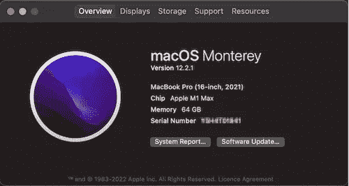

# 请把最好的机器给开发者

> 原文：<https://levelup.gitconnected.com/please-give-the-best-machine-to-developers-b0f7e0b7318d>

## 软件世界

## 当我们为开发者提供最好的机器时，回报是多倍的

[天一马](https://unsplash.com/@tma?utm_source=medium&utm_medium=referral)在 [Unsplash](https://unsplash.com?utm_source=medium&utm_medium=referral) 上拍照

如果你能为你的开发者做一件事，那就是为他们获得最好的机器。对一些人来说，这听起来是显而易见的，但对另一些人来说，需要一些令人信服的东西。

以下是我的一些想法。希望这足够有说服力。

# 机器成本与开发人员时间

我们都知道处理器更快、内存更大、存储容量更大的机器有利于软件开发。但问题是快多少或好多少？

## 简单的数学计算

使用普通数学，如果使用一台 3000 美元的机器需要 1 小时的编译时间，我们希望一台 6000 美元的机器应该将编译时间减少到 30 分钟，这就叫做收支平衡。

假设一台 6000 美元的机器只减少了 15 分钟而不是 30 分钟的时间，这听起来可能不值得，因为一台 3000 美元的机器是一台 6000 美元机器的 75%。一些人认为这不是成本最优的

但是，以上是过于简单的一种思维。

## 更现实的计算模型

实际上，如果一次编译节省了 1 小时中的 15 分钟，那么当我们一天执行 4 次编译时，这一天总共将节省 1 小时的时间。

一小时节省了 8 小时工作时间的 12.5%！您为您的开发人员带来了 12.5%的生产率增长！如果他们的年薪是 50，000 美元，那就相当于生产率提高了 6，250 美元！仅仅一年，你就获得了净收益！

另一种观点是，节省下来的一个小时可以用来运行另一次编译！不是编 4 次，现在一天可以编 5 次！这意味着额外编译增加了 25%。一个人能做的编译越多，软件开发就越多。

## 人力资本是昂贵的

虽然上述两种观点仍然不能完全代表现实，但任何节省开发人员时间的事情都值得认真考虑。通常在任何企业中，人力资本都是最昂贵的。

我早期工作的一家公司(在笔记本电脑强大到足以进行大开发之前)为每个开发人员提供了两台顶级的最高规格的机器。我问为什么。导演说:“你的时间比机器更宝贵，我们不想让你等机器”。

# 开发商的士气

虽然机器通常不是损耗的主要原因，但我们不能否认它对开发人员士气的影响。下面是几个故事分享。

## 故事 1:最新的型号出来了，但是我得到了一个旧型号。

我记得在某个时间点，我拿着一台 15 英寸的 MacbookPro 2016，内存为 16 GB，存储为 512 GB。我已经用了 3 年了。它仍然在做它的工作，我为我的 Android 和 iOS 开发工作感到高兴。两者都需要大量的存储空间。

通常，3 年后，我们可以将机器更新为较新的型号。不过我还是坚持住了，因为公司当时只在服务 Macbook Pro 2018 机型，而我听说更强大的 Macbook Pro 2019 机型已经出了。

在 2020 年初，我希望我的机器可以持续更长时间，直到公司推出 2019 年的型号，因为它已经推出了一段时间。但不幸的是，我的机器的显示器死了。我别无选择，只能去买一个新的。他们有 MacbookPro 2018，内存为 16 GB，存储容量为 256 GB。

尽管我应该很高兴能更新我的机器。我并不兴奋，因为我知道在外面的市场上，已经有更好的了。内心苦苦思索，为什么机构还没到 2019 款。另外 256 GB 真的是要命。我必须不断地删除和清除存储才能让事情正常进行。

## 故事 2:一个人的语气与他们得到的机器的相关性

有一次，我在做一个关于其他公司的移动开发者正在使用什么机器的调查。我联系了我的许多前同事。

第一个回复我的发给我截图如下。从谈话的语气来看，有一种满足感和自豪感，那就是在一家提供顶级机器的公司工作。“此外，它是 1TB 固态硬盘存储”，他说。

其他几位前同事说，他们的新公司只是提供刚加入时喜欢的任何机器规格。毫无疑问，人们会选择最好的规格。我能感受到“我为我的公司愿意给我最好的机器而自豪”的强烈感觉。

还有其他人对我的询问反应不那么热情。他们还是很有帮助的，只是语气像是“嗯，就是这个那个 spec，希望好一点”。一个人的语气和他们的感受是相关的，这取决于他们得到的机器。

## 它有助于开发人员的快乐。

让开发者不断开心是一件很难实现的事情。拥有一台好机器是保持开发者快乐的 21 种方法之一，分享如下。这实际上是比较容易实现的一个点。

 [## 保持团队中开发人员快乐的 21 种方法

### 这与薪水或津贴无关

better 编程. pub](https://betterprogramming.pub/21-ways-to-maintain-developer-happiness-in-your-team-7df811ca1d75) 

# 更好的公司声誉

信不信由你，开发者使用的机器描绘了公司声誉的强烈形象

## 伟大的公司；伟大的机器

我很幸运在一些大公司有一些朋友，像 Meta，Square，Google，优步等等。只要和他们核实一下他们用的是什么机器，就有两种可能的答案，我能想到的最好的机器，或者比我能想到的更好的机器。

我无法想象是否有一家顶级软件开发公司会节省机器，因为这对公司的声誉有很大的影响。

有了为用户提供的好机器，它甚至可以作为一个公司如何对待开发者的免费宣传。

在这条推特之后，紧接着是一篇关于该公司为什么这么做的文章

 [## Mahyar McDonald 在 LinkedIn 上说:#效率#大技术#mac

### 优步和 Shopify 立即向工程师发布最新的 M1 MacBook pro，Shopify 让人们保留…

www.linkedin.com](https://www.linkedin.com/posts/mahyar-mcdonald-91aa78_efficiency-bigtech-mac-activity-6867189055713624064-OOtt/) 

好吧，也许这只适用于大公司，谁有那么多钱？….不完全是。

## 小公司，还是大机器！

在一次关于为他们的开发者提供什么机器的调查中，我问了一个来自一个小得多的咨询公司的员工。我认为小公司通常对成本更敏感。因此，我认为他们会选择基本的“足够好”模式是可以理解的。

让我惊讶的是，他们还得到了顶级的机器！

后来我从公司的一位前员工那里知道，那是公司的挽留策略。作为一个小公司，他们必须在许多方面进行节约，但绝不是机器。

这是一个有意识的公司战略

*   这是公司给员工的额外津贴。
*   对于一些候选人来说，这是公司招聘的一个吸引人的项目(这些候选人要么是自由职业者，预算很低，要么来自一家碰巧没有为他们的员工提供最好的机器的公司)

# 这是双赢

为开发人员提供最好的工作机器，虽然这听起来像是额外津贴，但实际上，当它在开发人员手中时，对公司来说是一笔巨大的资产

开发人员会以拥有一个为荣，并且更有动力和生产力。这只会给拥有它们的公司带来好处，而成本只是一小部分。除此之外，这些机器也塑造了公司的形象。

这是一个双赢的模式。去吧！