# 用 Python 绘制 Choropleth 地图

> 原文：<https://levelup.gitconnected.com/plotting-choropleth-maps-in-python-b74c53b8d0a6>

## 学习如何使用 Plotly 绘制 choropleth 地图


由[gal Gaborel](https://unsplash.com/@orbisterrae?utm_source=medium&utm_medium=referral)在 [Unsplash](https://unsplash.com?utm_source=medium&utm_medium=referral) 上拍摄的照片

地图是一种非常有用的可视化技术，可以显示地理特征的汇总概要，如世界各国的人口或收入水平。在这篇文章中，我将向你展示如何使用 Plotly 来绘制 choropleth 地图。

> Plotly 是 Python 中的一个高级绘图库，用于创建交互式绘图。

# 安装 Plotly

对于这篇文章，我将使用 Jupyter 笔记本。要安装 Plotly，请在 Juypter 笔记本中使用以下命令:

```
!pip install plotly
```

# 绘制 Choropleth 地图

在绘制地图之前，需要导入`graph_objs` ( **图形对象**)模块:

```
import plotly.graph_objs as go
```

然后使用来自**图形对象**模块的`Figure`类来创建一个地图:

```
choropleth_map = go.Figure(
    data = {
        'type':'choropleth',
        'locationmode':'USA-states',        
        'locations':['AL','CA','WA'],
        'colorscale':'Portland',            
        'text':['Alabama Population',
                'California Population',
                'Washington Population'],
        'z':[5024279,39538223,7705281],                  
        'colorbar':{'title':'USA Population'}
    },     
    layout = {
      'geo':{
          'scope':'usa'
      }  
    })choropleth_map
```

在上面的代码片段中，您向`Figure`的初始化器传递了两个参数。第一个参数是`data`，具有以下字典键和值:

*   `type` —您正在创建的地图类型
*   `locationmode` —可以是`ISO-3`(默认)、`USA-states`或`country names`。如果设置为`ISO-3`，那么`locations`键的值将包含三个字母的国家代码，例如`USA`代表美国，`JPN`代表日本，等等。更多细节见[https://en.wikipedia.org/wiki/ISO_3166-1_alpha-3](https://en.wikipedia.org/wiki/ISO_3166-1_alpha-3)。如果您将`locationmode`设置为`USA-states`，那么`locations`键将获取包含美国各州代码的值，例如`AL`代表阿拉巴马，`CA`代表加利福尼亚，等等。如果您将`locationmode`设置为`country names`，您可以将国家名称传递给`locations`键。
*   `colorscale` —要在地图上应用的热图的名称。点击此链接查看您可以使用的热图列表—[https://plot ly . com/JavaScript/color scales/# portland-heat map。](https://plotly.com/javascript/colorscales/#portland-heatmap.)
*   `text` —当鼠标悬停在特定位置时显示在地图上的文本
*   `z` —设置颜色栏上的颜色值
*   `colorbar` —显示地图上使用的值和颜色编码的图例

第二个参数是`layout`，它允许你配置地图来显示世界的不同部分，以及地图的投影(稍后会详细介绍)。

当您运行上述代码片段时，您将看到如下地图:

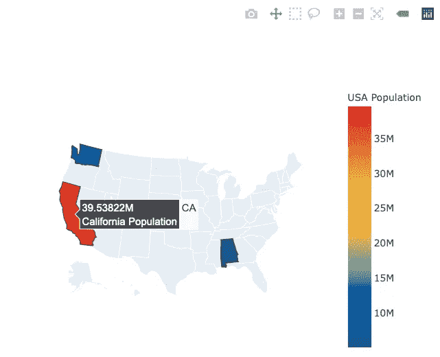

当鼠标悬停在三种状态之一上时，您将看到在`locations`、`text`和`z`键中指定的值。

# 绘制 2019 年美国人口

现在，您已经了解了绘制 choropleth 地图的基本知识，让我们加载一个真实世界的数据集并显示 2019 年美国的人口。为此，您可以在以下位置找到数据集:[https://www . ka ggle . com/peretzcohen/2019-census-us-population-data-by-state/version/3](https://www.kaggle.com/peretzcohen/2019-census-us-population-data-by-state/version/3)。

下载数据集并将 CSV 文件加载到 Pandas 数据框架中:

```
import pandas as pddf = \
 pd.read_csv('2019_Census_US_Population_Data_By_State_Lat_Long.csv')
df.head()
```

您将看到以下内容:

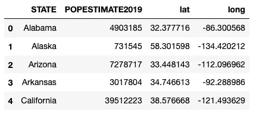

请注意，各州的名称都是完整的，但是`locationmode`键只支持州代码(例如，AL、NY 等)、国家名称(中国、日本等)或国家代码(美国、JPN 等)。因此，在这种情况下，您必须将 STATE 列转换为包含相应州代码的列。幸运的是，您可以从[https://worldpopulationreview . com/States/state-abstracts](https://worldpopulationreview.com/states/state-abbreviations)下载包含每个州代码的 CSV 文件。

下载 CSV 文件后，将其加载到熊猫数据框中:

```
df_state_mapping = pd.read_csv('abbr-name.csv', 
                               header=None, 
                               names=['CODE', 'STATE'])
df_state_mapping.head()
```

您应该看到以下内容:

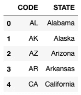

现在，您可以在两个数据帧之间执行内部连接:

```
df = df.merge(df_state_mapping, on='STATE')
df.head()
```

更新后的`df`现在应该有一个名为`CODE`的附加列:

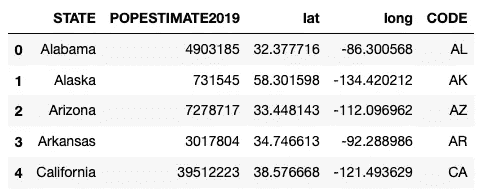

你现在可以开始绘制美国 2019 年的人口:

```
choropleth_map = go.Figure(
    data = {
        'type':'choropleth',
        **'locations':df['CODE'],**
 **'locationmode':'USA-states',** 
 **'colorscale':'YlGnBu',** 
 **'text':df['STATE'],**
 **'z':df['POPESTIMATE2019'],**
        'colorbar':{'title':'USA Population'}
    },     
    layout = {
      'geo':{
          'scope':'usa'
      }  
    })choropleth_map
```

您将看到以下地图:

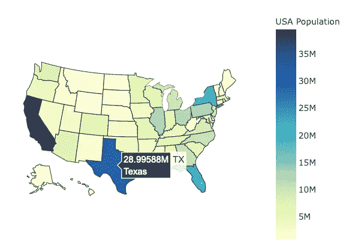

注意上面的地图使用了 **YlGnBu** 热图。

现在让我们通过向`data`字典添加`marker`键来修改地图。此外，让我们也为`geo`字典添加两个额外的关键字:

```
choropleth_map = go.Figure(
    data = {
        'type':'choropleth',
        'locations':df['CODE'],
        'locationmode':'USA-states',        
        'colorscale':'**Portland**',            
        'text':df['STATE'],
        'z':df['POPESTIMATE2019'],
        'colorbar':{'title':'USA Population'},
  **      'marker': {
            'line': {
                'color':'rgb(255,255,255)',
                'width':2
            }
        }**
    },     
    layout = {      
      'geo':{
          'scope':'usa', 
         ** 'showlakes': True,
          'lakecolor':'rgb(85,173,240)'**
      }  
    })choropleth_map
```

你现在应该看到显示湖泊的地图。此外，每个州都有一个白色的轮廓:

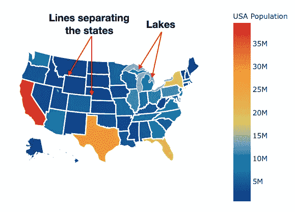

如果你想显示河流，你也可以添加`showrivers`和`rivercolor`键:

```
 layout = {      
      'geo':{
          'scope':'usa', 
          'showlakes': True,                     
          'lakecolor':'rgb(85,173,240)',         
   **       'showrivers': True,                     
          'rivercolor':'rgb(85,173,240)',**
      }  
    })
```

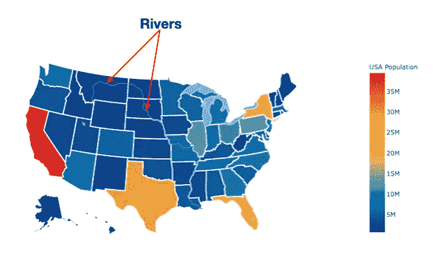

# 绘制世界人口图

让我们试试另一个例子。这一次，我想画出 2020 年的世界人口。可以从[https://www . ka ggle . com/tanu prabhu/population-by-country-2020](https://www.kaggle.com/tanuprabhu/population-by-country-2020)下载数据。一旦 CSV 文件下载完毕，将其加载到熊猫数据框架中:

```
df = pd.read_csv('population_by_country_2020.csv')
df
```

您将看到以下内容:

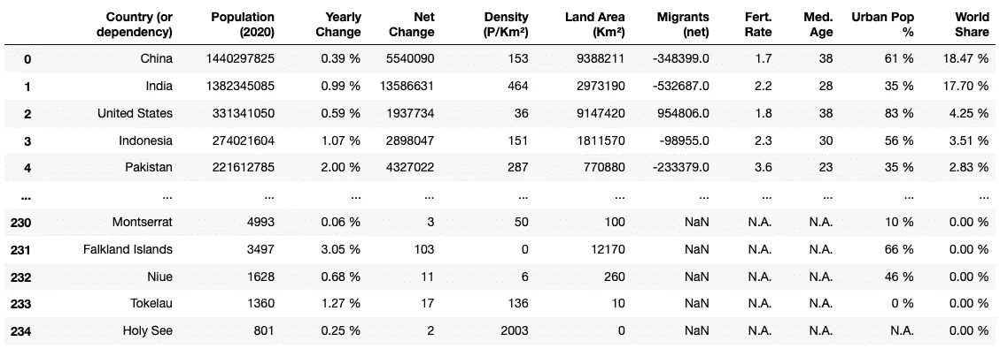

我们将使用`**Country (or dependency)**` 列作为国家名称，并使用`**Population (2020)**` 列显示每个国家的人口:

```
choropleth_map = go.Figure(
    data = {
        'type':'choropleth',
        'locations':**df['Country (or dependency)']**,
        'locationmode':'**country names**',
        'colorscale':'Portland',
        'z':**df['Population (2020)']**,
        'colorbar':{'title':'World Population in 2020'},
        'marker': {
            'line': {
                'color':'rgb(255,255,255)',
                'width':2
            }
        }
    },     
    layout = {      
      'geo':{
          'scope':'**world**', 
      }  
    })choropleth_map
```

> 注意你现在将**示波器**设置为`world`。可用的作用域有:'`world`'、`usa`'、`europe`'、`asia`'、`africa`'、`north america`和'`south america’`。

你现在应该可以看到世界地图了:

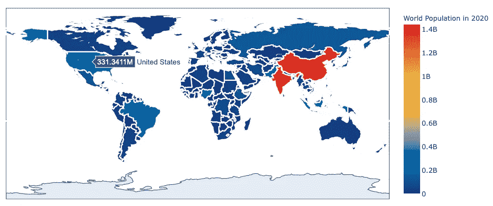

你可以应用到世界地图上的一个有趣的投影是`orthographic:`

```
choropleth_map = go.Figure(
    data = {
        'type':'choropleth',
        'locations':df['Country (or dependency)'],
        'locationmode':'country names',        
        'colorscale':'Portland',         
        'z':df['Population (2020)'],
        'colorbar':{'title':'World Population in 2020'},
        'marker': {  
            'line': {
                'color':'rgb(255,255,255)',
                'width':2
            }
        }
    },
    layout = {
      'geo':{
 **'projection':{
              'type':'orthographic'  # default is '****equirectangular****'
          },**
          'scope':'world',
      }
    })choropleth_map
```

使用`orthographic`投影，您可以使用鼠标旋转地球仪。你真的需要尝试一下，看看其中的乐趣！

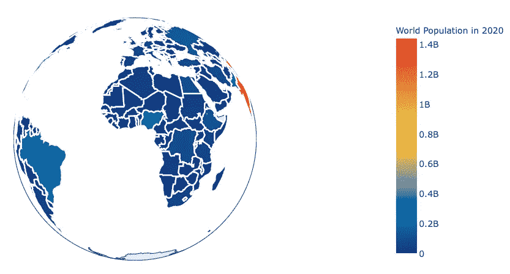

关于色阶有一点。您可以通过在热图名称后附加一个`_r`来反转色标，例如:

```
choropleth_map = go.Figure(
    data = {
        'type':'choropleth',
        'locations':df['Country (or dependency)'],
        'locationmode':'country names',        
        'colorscale':'**Portland_r**',         
        'z':df['Population (2020)'],
        'colorbar':{'title':'World Population in 2020'},
        'marker': {  
            'line': {
                'color':'rgb(255,255,255)',
                'width':2
            }
        }
    },
    layout = {
      'geo':{
          'projection':{
              'type':'orthographic'
          },
          'scope':'world',
      }
    })choropleth_map
```

这将反转色阶:

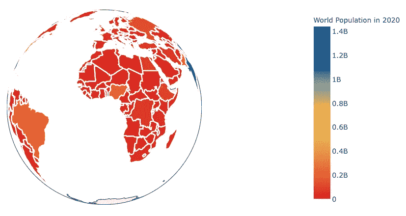

另一种方法是将`reversescale`键值设置为`True`:

```
data = {
        'type':'choropleth',
        'locations':df['Country (or dependency)'],
        'locationmode':'country names',        
 **'colorscale':'Portland',
        'reversescale' : True,**        'z':df['Population (2020)'],
        'colorbar':{'title':'World Population in 2020'},
        'marker': {  
            'line': {
                'color':'rgb(255,255,255)',
                'width':2
            }
        }
    },
```

# 调整地图的大小

最后，如果要调整地图的大小，可以在布局字典中设置地图的宽度和高度:

```
 layout = {
 **'width':500,
        'height':500,**
        'geo':{
            'projection':{
                'type':'orthographic'
            },
            'scope':'world',
        }
    })
```

现在将调整地图的大小:

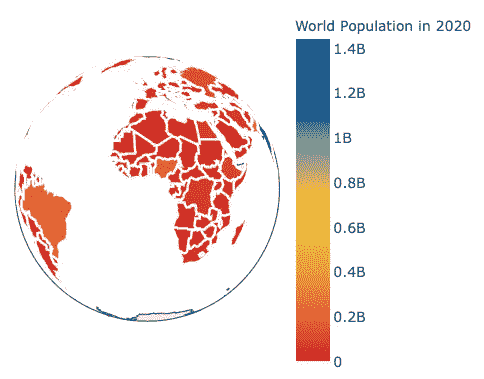

# 摘要

在本文中，我展示了一些如何使用 Plotly 创建 choropleth 地图的例子。还有更多的特性需要探索，但是希望这篇文章能够帮助您开始！

[](https://weimenglee.medium.com/membership) [## 加入媒介与我的介绍链接-李伟孟

### 作为一个媒体会员，你的会员费的一部分会给你阅读的作家，你可以完全接触到每一个故事…

weimenglee.medium.com](https://weimenglee.medium.com/membership)