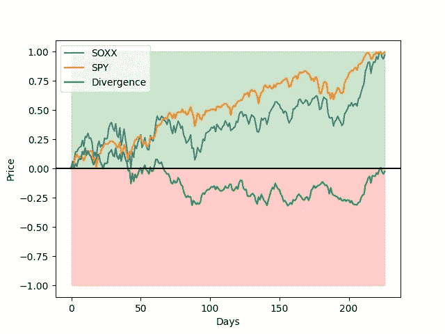
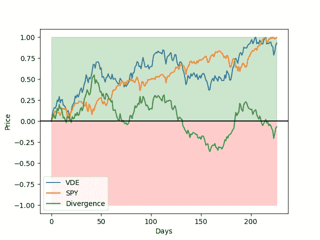
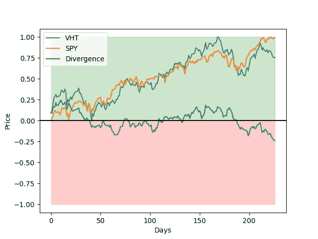
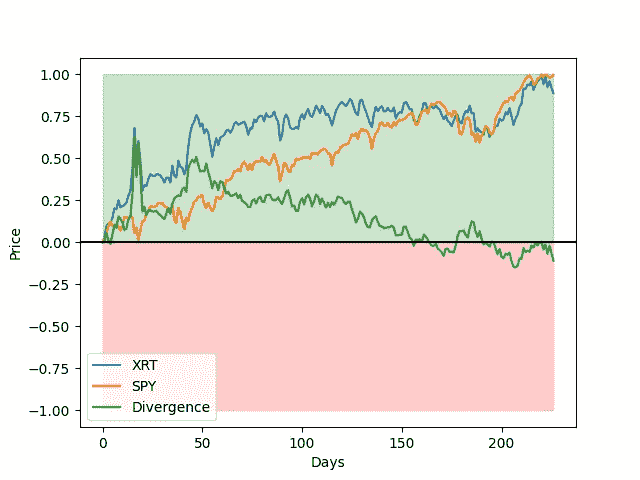

# 在 C++中绘制数据

> 原文：<https://levelup.gitconnected.com/plotting-data-in-c-84960b63ce92>

[KOBU 机构](https://unsplash.com/@kobuagency?utm_source=medium&utm_medium=referral)在 [Unsplash](https://unsplash.com?utm_source=medium&utm_medium=referral) 上拍摄的照片

在我所做的大部分工作中，在为项目选择编程语言时，用 Python 轻松绘制数据的能力是一个主要的决定因素。不久前，我在研究如何用 C++工具取代我的 Python 机器学习工作流。不幸的是，没有太多好的选择来代替像 Keras 或熊猫这样的东西。这让我开发了后者的一个非常原始的[版本，来帮助处理 C++](https://github.com/anthonymorast/DataTables) 中的表格数据结构。

该项目缺少的一件事是绘制和可视化数据的方法。幸运的是，许多其他人认为这也是 C++中的一个问题，并创建了[一个包含 matplotlib.pyplot](https://github.com/lava/matplotlib-cpp) 所有功能的 API。这个库本质上是一个头文件中的一组 C++函数，它使用 C++/Python 绑定来调用 matplotlib 函数。在这篇文章中，我将提供 matplotibcpp 的使用示例，方法是重新创建我在[上一篇关于寻找被低估的股票市场板块](https://medium.com/analytics-vidhya/finding-undervalued-sectors-in-the-stock-market-eb16d79bf8dd)的文章中创建的一些图。

# 在项目中包含 matplotlibcpp

matplotlibcpp 是一个用于 C++的只有标题的绘图 API。源代码可以在[项目的 GitHub 资源库](https://github.com/lava/matplotlib-cpp)中找到，并且可以通过

假设头文件与 C++源文件在同一个目录中。为了方便起见，matplotlibcpp 名称空间被设置为 plt。这允许以下用法差异

正如这里所看到的，代码不仅更容易阅读和编写，而且与在 Python 中将 matplotlib.pyplot 作为 plt 导入的常见做法直接相似。这里省略了包含 C++源代码的头文件，因为它大约有 3000 行代码，和这篇文章一样长。在不同操作系统上安装依赖项和基本使用编译的说明可以在 GitHub 项目上找到。显然，Python 是必需的，因为 C++绑定只是调用 Python 函数。这些指令使用 Python2.7，但是使用类似的安装指令和编译包，Python3.x 也可以使用。在我的例子中，我使用了 Python3.8，在使用文档中任何适用的地方，或多或少地用“python3.8”替换了“python2.7”。

# 基本用法

为了演示 matplotlibcpp 的一些基本用法，我将从以前的帖子中重新创建图[，其中价格差异被用作快速比较，以确定股票市场部门的公平价值有多高](https://medium.com/analytics-vidhya/finding-undervalued-sectors-in-the-stock-market-eb16d79bf8dd)。这里不描述方法，但我鼓励任何感兴趣的人看看那个帖子和它的[姐妹帖子，主要关注个股](https://medium.datadriveninvestor.com/finding-potentially-undervalued-stocks-in-the-stock-market-41f15cc6a014)。相对于 matplotlib 中可以做的事情，这些图并不太复杂，但它们确实展示了一些额外的、较少使用的函数调用的基本功能。

## 跑马灯数据预处理

首先，我们需要一种方法来检索和存储指数基金/ETF 的每日股票行情数据。在另外两篇文章中，我创建了一个用 C++ 处理表格数据结构的[库和一个从 Yahoo Finance](https://medium.com/analytics-vidhya/datatables-a-c-tabular-data-structure-project-d2d928b1c579) 检索股票市场数据的[小函数集；后者依赖于前者(松散地)。我也不会包括这些库的细节，因为它们不在本文的讨论范围之内。下面是一些帮助函数以及这个程序使用的所有 API/库。有一些注释描述了正在发生的事情，但是这个功能只是为了帮助我们得到绘制数据的主要结论，所以省略了全面的解释。](https://medium.com/analytics-vidhya/retrieving-historical-stock-data-in-c-2876ab9c5ff)

## 绘制数据

当数据可用并经过处理后，可以调用 matplotlibcpp 函数来可视化数据集。

在上面的 main 函数中，助手函数用于以与 matplotlibcpp 兼容的格式检索 ETF 股票行情数据。接下来，用 1、-1 和 0 填充一些向量，这些向量用于用红色或绿色填充图形的部分，在这个相同的循环中，也计算散度度量。最后，调用 matplotlibcpp 函数来绘制数据并将其保存到一个 *plots/* 目录中。下面是如上所示运行程序时的输出示例。

半导体行业 ETF SOXX 与标准普尔 500 的差异。

能源行业 ETF VDE 与标准普尔 500 的差异。

医疗保健行业 ETF VHT 与标准普尔 500 的差异。

零售行业 ETF XRT 与标准普尔 500 的差异。

作为一个快速概述，假设当绿色背离线在图表的红色部分时，该行业被低估，在 0 时该行业被合理估价，在 0 以上该行业被高估。这只是对这些行业的初步看法，不应用于投资决策。然而，找到一个似乎被低估的行业可能需要进一步的研究。

# 对 matplotlibcpp 的小改动

在创建这些图时，我在*matplotlib::fill _ between(…)*函数中发现了一个小问题。当传递使用数值作为参数值(例如，alpha=0.2)的参数映射时，参数将被解析为字符串，并且不会设置值。为了解决这个问题，对函数做了一个小的修改，以使这个值成为特例。这是 [GitHub 问题的一部分，该问题有其他推荐的修复](https://github.com/lava/matplotlib-cpp/issues/75)，例如使用 C++17 *any* 类。我选择了最简单的解决方案，因为我的案例不需要是通用的。在编写本文档时，第 842 行附近的库的 *fill_betwee* n 方法中存在修复程序:

这解决了 *alpha* 参数的特殊情况，并将其解析为双精度值而不是字符串值。这似乎纠正了我的问题。

# 结论

在这篇文章中，介绍了调用 Python matplotlib 库的 c++ API matplotlibcpp。通过复制作为我的另一个项目的一部分而创建的地块，提供了示例用法。这只是这个库的冰山一角，几乎任何可以用 matplotlib 完成的事情都可以用 matplotlibcpp 来完成。这篇文章的目的是向那些可能知道这个库可用的人介绍这个库。

# 完整代码

## 雅虎财经 API (yfapi.h)

## 绘图逻辑

*原载于 2021 年 11 月 29 日 https://www.anthonymorast.com***。**