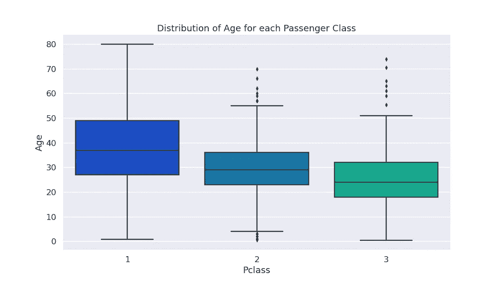

# 用 Python 绘图:用这些库更聪明而不是更困难地工作

> 原文：<https://levelup.gitconnected.com/plotting-in-python-work-smarter-not-harder-with-these-libraries-42b0be6b61f>


照片由[尼克·费因斯](https://unsplash.com/@jannerboy62)在 [Unsplash](https://unsplash.com/photos/f2Bi-VBs71M) 拍摄

# 用 Python 绘图

可视化数据是任何数据科学家工作流程的重要组成部分。绘图是可视化数据集中正在发生的事情的一种极好的方式，并且是与他人共享发现的理想方式。在真正的 Python 风格中，有相当多的绘图库可供您使用，但是您应该在什么时候使用每一个呢？

在这篇文章中，我将讨论我最喜欢的四个绘图库:Pandas、Matplotlib、Seaborn 和 Plotly。虽然所有这四个库都能够生成图，但它们在生成所需的工作量和最终产品的视觉质量方面有很大差异。一般来说，一个情节看起来越好，就需要花费越多的努力去创造，然而，这个规则有一些例外，我们将在下面讨论。

# 熊猫

Pandas 是我每天看到的最常用的 python 库之一。如果您使用 Python 进行过任何数据分析，那么您可能已经将数据存储在 Pandas 数据框架中。

虽然我们可能不认为 Pandas 是一个绘图库，但它确实有使用 Matplotlib API 的有限的内置绘图功能。尽管它在创建详细绘图方面有局限性，但它是快速可视化的最佳工具之一，可帮助您理解数据中的模式。当您正在探索新的数据集时，使用 Pandas 创建快速而肮脏的绘图比使用更详细的绘图库浪费时间更有意义。如果你不打算分享它，为什么要花时间让它看起来很漂亮呢？

## 例子

对于这篇文章中的所有例子，我将使用一个经典的泰坦尼克号数据集，许多计算机科学的学生在他们的课程中使用过这个数据集。

```
titanic.head()
```


泰坦尼克号. head()

我想知道按乘客级别分组的乘客年龄分布情况。箱形图是可视化按类分组的分布的好方法。对于 Pandas，我们所要做的就是调用 DataFrame 的`boxplot()`方法来产生一个情节。

```
df.boxplot(by='Pclass', column=['Age'], grid=False)
```


熊猫方块图

熊猫使这变得容易，但是正如你所看到的，这个情节有一些视觉问题。y 标签在标题下面，如果我手动设置标题和 y 标签，仍然会有重叠的问题。但是，这个图非常适合您工作时的个人可视化，因为它只需要一行，不需要处理数据。我们很容易看出，等级越低，乘客可能越年轻。

**注**:不值得花时间去提高一个熊猫剧情的视觉吸引力。使用下面的绘图库会更有意义。

# Matplotlib

Matplotlib 本质上是 Python 中可用的标准绘图库。它基于 MATLAB 的绘图库，看起来非常相似。Matplotlib 如此有用是因为它非常灵活。您可以使用 Matplotlib 制作非常基本的绘图、演示质量可视化，甚至动画绘图。它提供了极大的灵活性，这非常有用。

灵活性的代价是有时有点冗长。如果你想让你的情节看起来非常特别，可能需要 10 行以上的代码和一些谷歌搜索来使它看起来正确；有些情节可能涉及 50 多行代码。然而，能够随心所欲地定制你的剧情是一个非常强大的属性。

```
# Reorganize data into list for matplotlib 
data = []
for i in range(1,4):
    data.append(df[df['Pclass'] == i]['Age'].dropna().values)# Plot Using Matplotlib
fig = plt.figure(1, figsize=(9,6))
ax = fig.add_subplot(111)
bp = ax.boxplot(data)
ax.set_xlabel('Passenger Class')
ax.set_ylabel('Age')
ax.set_title('Distribution of Age for each Passenger Class')
```


Matplotlib 箱形图

对于这个方框图，仍然可以做很多定制，但是你已经可以看到，为了产生一个基本的图，你将比熊猫写更多的代码行。尽管花费了更多的努力，这个图看起来更好，并且可以很容易地在演示中进一步增强。

Matplotlib 中的 box plots 最讨厌的地方在于，它们不像 pandas 和 Seaborn 那样接受 x，y 参数。必须将每个系列提取到一个数组中，对其进行清理，并将其放入一个列表中，这是一个额外的步骤，我宁愿不去担心。幸运的是，我们的下一个库 Seaborn 有一些出色的绘图功能，它们是 Matplotlib 的扩展。

# 海生的

Seaborn 是我个人最喜欢的绘图库。它基于 Matplotlib，但旨在用更少的代码行提供更好看的绘图。它还开辟了一些更适合的情节类型，使它们更容易创作。Matplotlib 看起来有点过时；你可以花时间定制和设计你的情节，但是当 Seaborn 为你做的时候，为什么要浪费时间在基本的设计上呢？

Seaborn 有许多现成的风格和主题，可以节省你大量的时间，让情节看起来“漂亮”。能够用很少几行代码创建一个看起来足够好的情节来与同事分享是非常方便的。

```
sns.set_theme(context='talk', style='darkgrid', palette='winter')
```

Seaborn 的`set_theme()`方法允许使用许多预设。我将这个图设置为“talk”上下文，这会自动使黑线变粗，标签变大。样式`darkgrid`给我们一个愉快的蓝色/灰色背景，调色板`winter`为我们处理颜色映射。

```
plt.figure(figsize=(14,8))
sns.boxplot(x='Pclass', y='Age', data=train)
plt.title('Distribution of Age for each Passenger Class')
```



Seaborn 箱线图

我想我们都同意这是迄今为止最好看的方框图！请注意，与上面的 Matplotlib 版本相比，生成一个客观上看起来更好的绘图只需要几行代码。

认识到 Seaborn 和 Matplotlib 相互交织也很重要；为了控制我的图形大小，我创建了一个 Matplotlib 图形，并在那里设置大小:`plt.figure(figsize=(14,8)`。Seaborn 图只是一个 Matplotlib 图，上面有一层格式。这意味着 Matplotlib 的许多令人敬畏的灵活性在 Seaborn 中也是可用的。

Seaborn 提供了一些非常简洁和简单的方法，让你的传统情节更加信息密集。例如，对于许多类型的分布图，您可以指定一个`hue`,它将通过一个附加变量对每个类进行分组。

```
plt.figure(figsize=(14,8))
sns.boxplot(x='Pclass', y='Age', data=df, hue='Survived')
plt.title('Distribution of Age for each Passenger Class')
```


带有色调的 Seaborn 箱线图

在这里，我们现在看到，不考虑乘客等级，幸存者的年龄通常低于那些没有幸存下来的人。当了解更多关于数据的信息时，这些类型的可视化非常有用。我将在接下来的文章中深入报道 Seaborn，敬请关注！

# Plotly

Plotly 是一个非常有趣的绘图库，旨在产生在线和交互式数据可视化。与目前为止介绍的其他库不同，Plotly 可用于 Python、R、MATLAB、Perl、Julia 等。Plotly 还支持 Dash，这是一个用于构建生产质量数据仪表板的流行框架。

即使您对创建仪表板不感兴趣，Plotly 也允许创建奇妙的交互式图表，这些图表可以在线发布到任何地方或在您的机器上本地使用。当我处理被动微波数据时，Plotly 是我的绘图库，因为它允许复杂信息更容易可视化。

```
import plotly.express as pxfig = px.box(df, x='Pclass', y='Age',labels=dict(
            Total="Passenger Class", Day_Avg="Age"))
fig.update_layout(title_text='Distribution of Age grouped by Passenger Class',title_x=0.5)
fig.show()
```

能够嵌入互动情节，让读者能够更好地理解正在显示的内容，这是非常棒的。与 Matplotlib 和 Seaborn 一样，Plotly 也有大量进一步定制的空间。这里我使用的是`plotly.express`模块，这是为了快速可视化。但是 Plotly 有很多更详细的情节，我将在以后的帖子中介绍，并可以在他们的文档中探索。

## 荣誉奖:散景

Bokeh 是一个交互式可视化库，很像 plotly。但是它缺少像`plotly.express`这样的快速出图模块。Bokeh 开始与 Plotly 竞争的地方是创建包含更复杂信息的仪表板。Bokeh 的优势之一是支持流数据，这可能会引起一些人的兴趣。因为我们不会在这篇文章中讨论仪表盘，所以我不会详细讨论散景，但我认为它是值得一提的交互式绘图的一个很好的选择。

# 总结和文档

我们已经看到了如何使用 Pandas、matplotlib、Seaborn 和 Plotly 在 Python 中创建简单的可视化。虽然没有明确的赢家，但对于哪个库适合您当前的任务，肯定需要考虑。

*   [**熊猫**](https://pandas.pydata.org/docs/) 是我们工作时快速可视化的工具。
*   [**Matplotlib**](https://matplotlib.org/3.3.3/contents.html) 总是一个很好的选择，并允许广泛的灵活性，但是它可能需要许多行代码来获得您想要的精确绘图。Matplotlib 的基本情节看起来有点简单。
*   [**Seaborn**](https://seaborn.pydata.org/) 允许创建高质量的绘图，而不需要像 Matplotlib 一样多的代码行。还有一些小众的情节，像一个小提琴情节，在其他绘图库中很难找到。
*   [**Plotly**](https://plotly.com/python/) 是我们去进行互动的剧情。如果你想在网站上发布互动的情节，就像我在这里一样，那么 Plotly 是一个很好的选择。它还能更好地适应复杂的数据可视化，这些数据在静态绘图库中会显得杂乱无章。
*   [**散景**](https://docs.bokeh.org/en/latest/) 在创建具有交互情节的复杂仪表板时是一个很好的选择。它还支持流数据，这对于某些用例可能是至关重要的。

敬请关注更多 Python 内容！我将在未来几天发布 Seaborn 和 Plotly 的深入教程，以及一些 AWS Lambda、SQL 和许多其他与 Python 应用程序开发相关的教程。如果你有任何问题或意见，让我们在下面的评论中讨论吧！