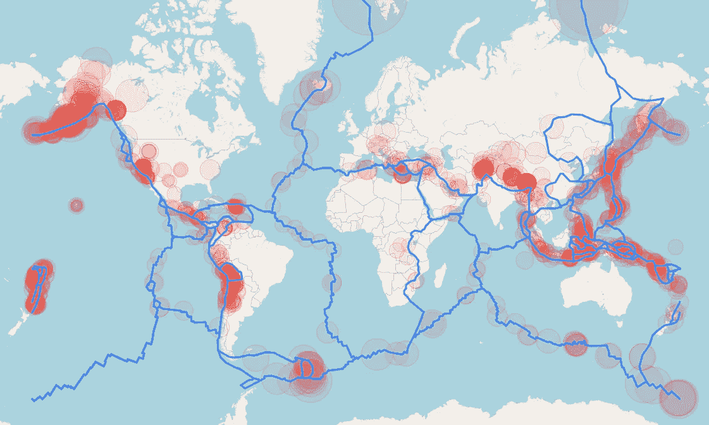
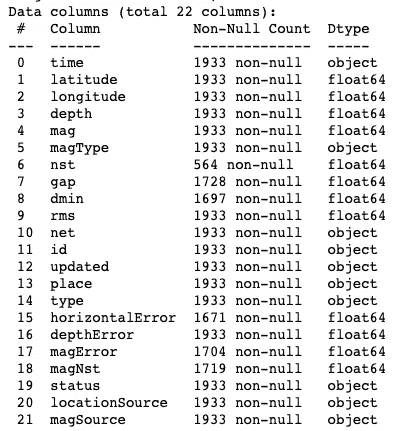
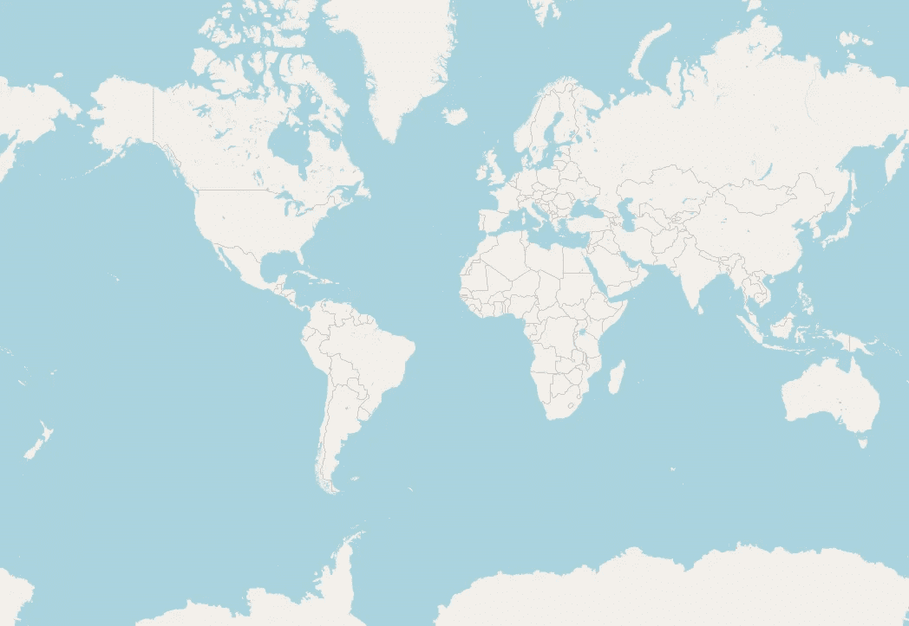
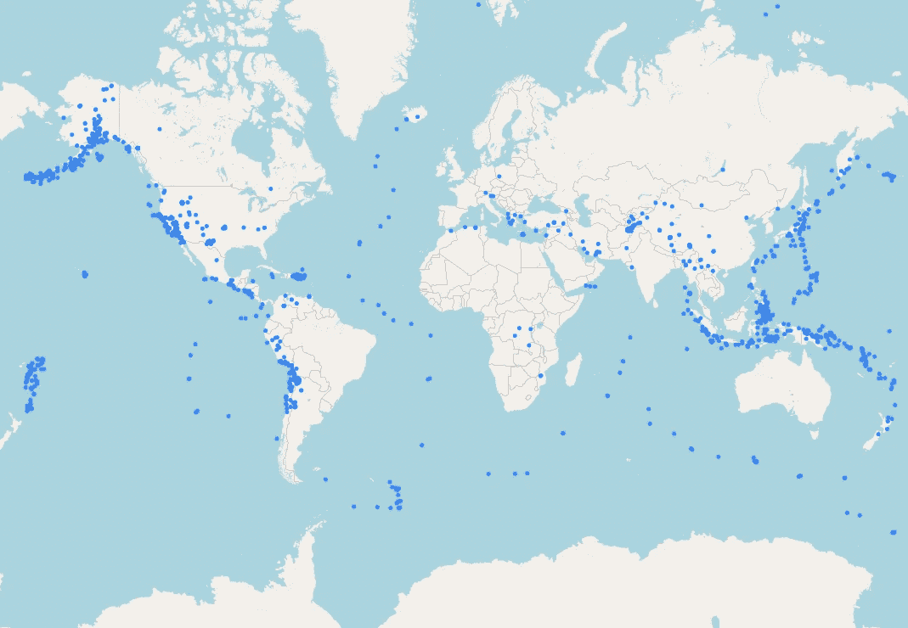
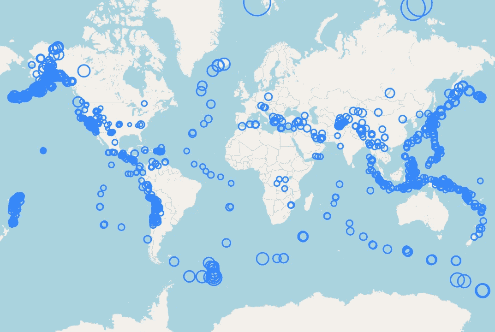
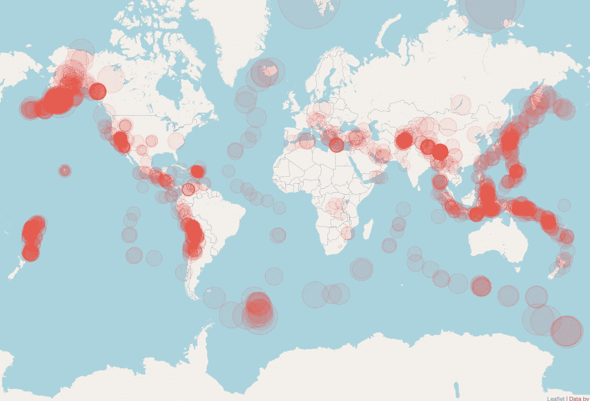
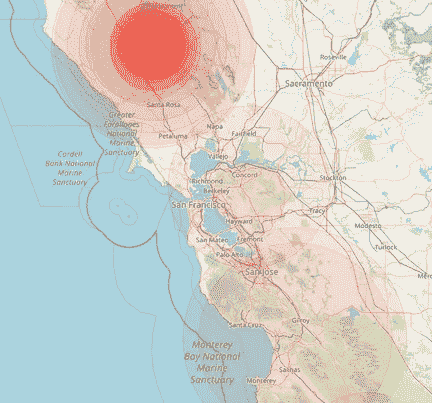
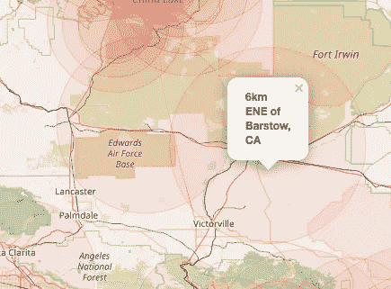

# 用 Folium 绘制 USGS 地震数据

> 原文：<https://levelup.gitconnected.com/plotting-usgs-earthquake-data-with-folium-8f11ddc21950>

## Python 中的叶数据绘图示例

最终地图

美国地质调查局(USGS)提供的众多服务之一是监测和跟踪世界范围内的地震事件。我最近偶然发现了他们在下面网站上提供的地震数据集。

 [## 地震数据集

### 全球地震数据的 CSV 文件。提供从 5 分钟到上个月的实时更新数据。

earthquake.usgs.gov](https://earthquake.usgs.gov/earthquakes/feed/v1.0/csv.php) 

该网站有数据馈送，包含过去一小时、一天、一周或一个月内每一次重大地震的“实时”csv 数据。数据每分钟更新一次，包含震级、纬度/经度、深度和其他地震描述符。

虽然有很多地震可视化，我认为这将是一个有趣的练习，看看哪些可以很容易地从原始数据中创建出来。在这个项目中，我们将用熊猫和叶子来绘制世界范围内的每一次地震。我们还会用 geoJSON 添加一些板块边界，只是为了好玩。

# 导入我们的数据

我将使用位于以下 URL 的数据馈送。

[https://seismic . USGS . gov/seismics/feed/v 1.0/summary/2.5 _ month . CSV](https://earthquake.usgs.gov/earthquakes/feed/v1.0/summary/2.5_hour.csv)

这是一个 csv 格式的文件的直接链接，其中包含了上个月世界范围内所有大于 2.5 级的地震。我鼓励你尝试其他的数据源，但是我发现当你包括较小的地震时，数据集的大小真的膨胀了。

在下面的代码中，我们导入我们的库，并使用 pandas.read_csv()函数直接从 URL 创建 DataFrame 对象。

地震数据框架中的可用列

美国地质勘探局网站上对数据列的描述有详细记录。我们的项目的**相关列将是:纬度、经度和 mag(地震的震级)。所有都存储为浮动对象，不需要预处理。感谢美国地质调查局保持这些数据集的干净和用户友好。**

# 用叶子制作底图

我们将从使用下面的代码制作一个简单的地图开始。

我们选择了一个 lat/long 值 **(0，0)** ，因为我们正在绘制整个世界。缩放值为 2 对我在 openstreetmap 中查看整个地球很有效。我得到的 earthquakes.html 文件看起来是这样的。

基本世界地图

# 使用叶形圆添加地震数据

现在我们有了一个工作底图，让我们来绘制我们的地震。我们将使用叶的圆形物体来代表每一次地震。首先，我们将使所有的地震大小相同。

在上面的代码中，我们遍历了数据帧中的每个地震，在那个位置创建了一个 Circle 对象，并使用 add_to()方法将其添加到我的地图中。我们最终得到了一张已经令人印象深刻的地图，显示了过去一个月中所有重大地震。数据是不断变化的，所以你的尝试可能看起来不同。

# 可视化地震震级

为了给我们一个快速直观的震级表示，我选择根据地震的大小改变每个圆圈的大小。(或者，您可以尝试色彩图或热图)

在最后一张地图上，我用 10 作为每个圆圈的半径，我们看到每个地震用一个蓝点代表。圆形对象的半径在地图上以米为单位显示，因此当您在交互式地图上一直放大时，每个圆形标记都显示为一个 10 米的圆环。

我们将使半径成为地震震级的函数。大地震将由大半径的圆圈标记来表示。

我选择将我的半径设置为星等的 50，000 倍。一场 4.0 级的地震会在我的地图上显示为半径 200，000 米或 200 公里。这个值对我来说是正确的，但是您当然可以更改它，尤其是在绘制区域数据时。

现在我们可以清楚地看到绘制的地震的相对大小，尽管我们在格式上还有一些工作要做。

# 让它变漂亮

现在，只需很少的编码，地图就可以正常工作了。我们现在可以使用 Circle 对象的关键字参数来使它们更有吸引力。

这一次，我们在 Circle 对象中指定了五个新的关键字参数(weight、color、opacity、fill_color 和 fill_opacity)。我们现在看到多个地震一个接一个。除了代表震级的相对大小之外，暗红色现在代表热点(多个地震)，并给它一个热图效果。

# 使用 GeoJSON 添加构造板块

当我们查看生成的地图时，我们看到了环太平洋“火环”的可视化。我立即想到将实际的板块边界作为地图的一部分。

在谷歌上快速搜索后，我找到了 github 上的这个文件，其中包含以 geoJSON 格式存储的构造边界多边形。

 [## fraxen/构造板块

### permalink dissolve GitHub 是超过 5000 万开发人员的家园，他们一起工作来托管和审查代码，管理…

github.com](https://github.com/fraxen/tectonicplates/blob/master/GeoJSON/PB2002_boundaries.json) 

GeoJSON 是我个人最喜欢的形状文件类型，但你也可以使用其他形状文件。geoJSON 格式具有作为 JSON 文件工作的优势，如果需要，可以像 Python 中的字典一样处理。

下面的代码显示了 follow 如何轻松地处理 GeoJson 文件来添加地图覆盖。

GeoJson 对象被直接添加到我们刚刚创建的地图中。重新保存地图会产生以下结果。

地图结果与您预期的完全一样。地震被整齐地放置在我们构造板块的边界上，就像我中学科学课本上的一样。

# 更进一步

现在我们已经有了一个吸引人的地震地图，你可能想做一些额外的工作来创造一些更令人惊奇的东西。

考虑制作一个带有震级、时间范围和位置控件的 web 应用程序。在下面的照片中，我们看到了过去七天旧金山发生的所有地震。

思科 7 天地图

考虑一下 follow Circle 类的重要格式选项。通过弹出的 kwarg，你可以为每一次地震插入 html 标签。然后你可以添加世界范围内每一次地震的震级和描述。下图是显示' **place** '列中的字符串的弹出窗口示例

弹出窗口的示例

看看你能用这些神奇的数据集创造出什么。如果你做了漂亮的东西，让我知道。祝你好运！