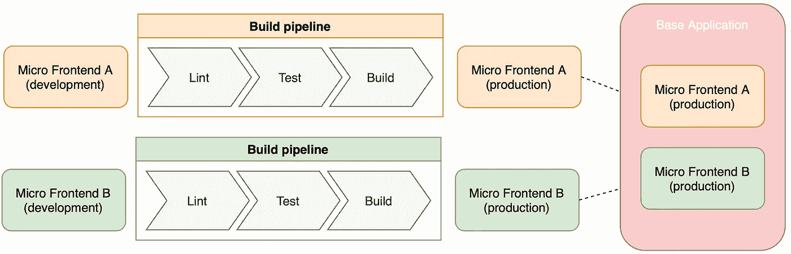
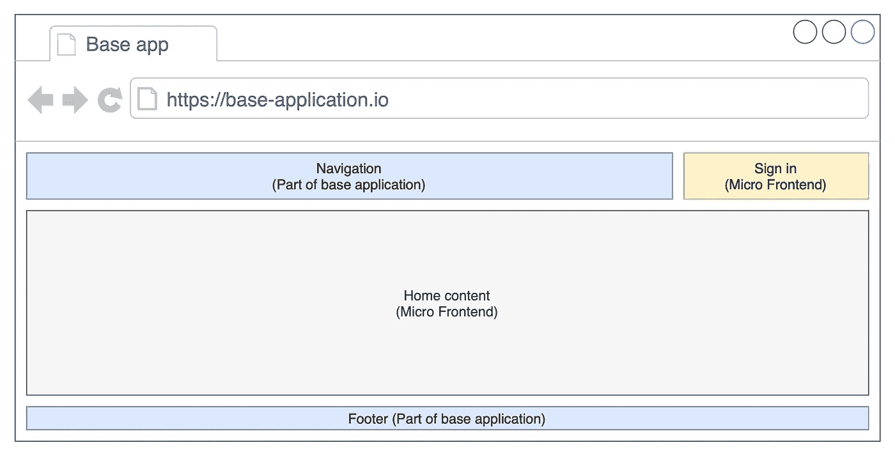
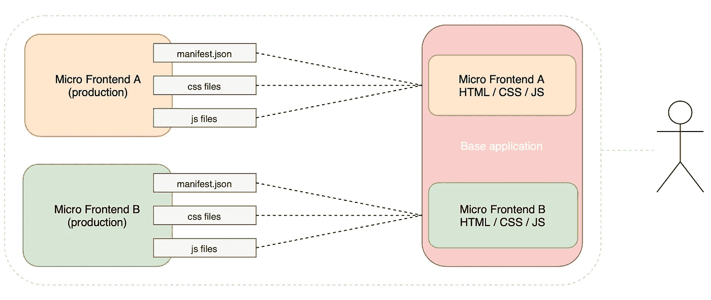

# 带讲台的简易服务器端微前端

> 原文：<https://levelup.gitconnected.com/podium-easy-server-side-micro-frontends-385f3a4cd346>

*想直接跳到代码？*

[](https://github.com/Jozzeh/podium-basic-example) [## jozzeh/讲台-基本-示例

### 一个基本的例子，两个 Podlets 组合在一个页面或布局。-Jozzeh/讲台-基本-示例

github.com](https://github.com/Jozzeh/podium-basic-example) 

这听起来熟悉吗？

> 我们的大型前端应用程序使用过去的技术堆栈
> 
> 开发人员维护应用程序，不能创建新功能。
> 
> 有一些快速和肮脏的代码在那里(由于交付压力)。
> 
> 项目太大，连核心团队都不知道什么在哪里。

作为一名开发人员，完全重写是非常诱人的。然而，重写可能会引入其他问题，例如巨大的成本。一个解决方案可能是将应用程序一部分一部分地分离和重写。同时，团队仍然可以向最终用户或客户交付新的特性。

这种解耦和逐段重写导致了微前端架构。这些新的部分很小，应该更容易理解和维护，因为它做一件“事情”，而且做得很好……
开发者只需要关注“他们的部分”，这反过来使他们高度专业化。

它还使开发人员能够独立开发和部署应用程序，而不必构建和测试所有其他部分，从而大大缩短了上市时间。



构建管道和微前端组成示例

最终游戏:松散耦合的不同微前端。在每个微前端应用程序中，开发人员有很大的自由去做对项目最有利的事情。这些微前端被捆绑在一个页面或其他应用程序中…基础应用程序。

*注意:不全是小猫彩虹。在采用微前端架构之前，应该考虑一些缺点。一个陷阱可能是用户界面的不一致性，所以准备好努力使用/创建一个通用的用户界面库或者投资一个设计系统。*

## 服务器端合成

微前端的一个常见的、重复出现的项目是捆绑或组成不同微前端的一个基础应用程序。



集成了 2 个微前端的小应用程序

微前端的组成可以在 3 个阶段集成:

1.  **客户端**:浏览器进入页面，运行时加载微前端。
2.  **构建时间**:当构建基础应用程序时，它会引入微前端。(微前端通常是(npm)包。)
3.  **服务器端**:服务器将组成页面/应用，然后返回给用户。

在本文中，我们将研究如何使用 powder 框架集成服务器端方法。

一个简单但强大的服务器端组合框架。


# 讲台

Podium 是一个简单的微前端服务器端组合框架。该框架成功地实现了非侵入性，处理简单的概念，但执行起来非常强大。

这导致了一个微前端框架，它不仅是框架不可知的，而且是语言不可知的。换句话说，你可以使用你最喜欢的前端框架，比如 React，Svelte，VueJS，Angular，…或者甚至可以集成一个 Java/PHP/C#应用。

页面的组合是以编程方式完成的，而不是通过配置文件。它提供了更多的权力和自由。

> 拥有按照自己的方式工作的自由…这吸引了我使用讲台。讲台是根据项目的需要量身定制的，而不是相反。

讲台还具有其他一些优势:

*   完全隔离的微前端开发和测试
    (我认为这是绝对必须的)
*   多回购或单回购…你的选择
*   文档写得很好
*   回应作者

关于领奖台，还有很多东西需要发掘。
以下是网站链接&文档:【https://podium-lib.io/】T2

## 概念

Podium 在组合和微前端之间放置了一个 NodeJS 服务器(Express、哈比神、Fastify 或 HTTP)。

**布局** 指挥台的基础应用称为“布局”。
一个布局将结合一个页面上的所有微前端。

下面是一个使用 express 创建 NodeJS 服务器的布局示例。

上面的代码只有一个网页的根网址，但布局并不限于一个网址。

**podlet** podlet 是独立开发和运行的页面片段。它们是基础应用程序或布局的构建块。

一个 Podlet 需要为一个布局提供 3 个项目:

1.  超文本标记语言
2.  半铸钢ˌ钢性铸铁(Cast Semi-Steel)
3.  射流研究…

这是通过 manifest.json 文件完成的，该文件还包含一些其他信息。有一个为 Podium 制作的 JavaScript 包，让这个过程变得更简单。使用 JavaScript 包不是必需的，因为 Podium 是与语言无关的。



服务器端组合的呈现

## manifest.json 剖析

```
{
  "name":"aPodlet",
  "version":"1.0.0",
  "content":"/",
  "fallback":"",
  "assets": {
    "js":"/js/podleta.js",
    "css":"/css/podleta.css"
  },
  "css":
  [{"value":"/css/podleta.css",
    "type":"text/css",
    "rel":"stylesheet"
  }],
  "js":
  [{"value":"/js/podleta.js",
    "defer":true,
    "type":"default"
  }],
  "proxy":{}
}
```

*   名称:Podlet 的唯一名称
*   版本:版本有助于确定基本应用程序是否需要重新加载 Podlet 清单和回退
*   内容:是可以找到 HTML 内容的路径
*   回退:是内容加载失败时的路径
*   资产:(已弃用)运行应用程序所需的初始 CSS 和 JS 文件
*   CSS:应用程序使用的所有 CSS 文件的数组
*   JS:应用程序使用的所有 JavaScript 文件的数组(加载可以推迟，类型可以设置)
*   代理:额外的路由，并且它们应该通过布局服务器上的路由被给予公共访问。

podlet 附带了一个 NodeJS 包(@podium/podlet)来轻松创建这个 manifest.json 文件。使用 NodeJS 包并不是强制性的，您可以编写自己的 manifest.json 或者从任何其他编程语言生成它。

## 基本示例

这是一个非常基本的例子，两个微前端应用程序(Podlets)被合并在一个页面(布局)。

**Podlets 示例**

这两个静态 HTML 应用程序非常简单。一个是橙色背景，中间有一个大“A”，另一个是绿色背景，中间有一个大“B”。

代码非常简单，但是 podlet-a 和 podlet-b 文件夹中的 *index.js* 非常有趣。出于演示目的，除了 Podlet 名称之外，这两个名称是相同的。

**布局示例**

Podlets 已经准备好了，是时候将它们合并到一个页面上了。
首先，我们需要开始布局，注册 podlets，然后在页面上呈现它们。

代码可以在我的 Github 页面上找到。

[](https://github.com/Jozzeh/podium-basic-example) [## jozzeh/讲台-基本-示例

### 一个基本的例子，两个 Podlets 组合在一个页面或布局。-Jozzeh/讲台-基本-示例

github.com](https://github.com/Jozzeh/podium-basic-example) 

*注意:尽管 Podlets 和布局现在都在一个存储库中，但是每个应用程序都可以驻留在它们的存储库中。这两种 Podlets 都可以完全独立地开发和部署。*

这是一个非常基础的领奖台入门，还有很多需要探索的地方。
https://podium-lib . io 上有写得很好的文档。

本文是将流行的前端框架组合在一个页面上的系列文章的一部分。Podium 非常灵活，可以组合多个框架。以下是本系列的其他文章:

[*React 微前端带讲台*](https://medium.com/@jozzeh/react-micro-frontends-with-podium-dd832075d924) [*苗条的服务器端微前端带讲台*](https://medium.com/@jozzeh/easy-svelte-micro-frontends-with-podium-34aa949bed02)[*VueJS 微前端带讲台*](https://medium.com/@jozzeh/vue-micro-frontends-with-podium-7d4d96b36596)[*微前端带讲台(React，苗条的& VueJS)*](https://medium.com/@jozzeh/react-vue-svelte-on-one-page-with-micro-frontends-f740b3ee6979)