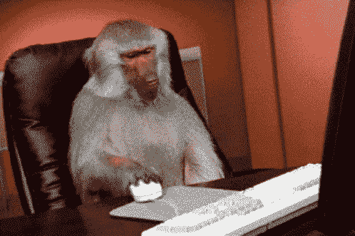
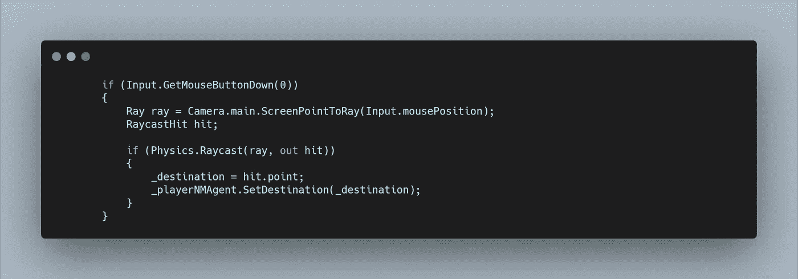
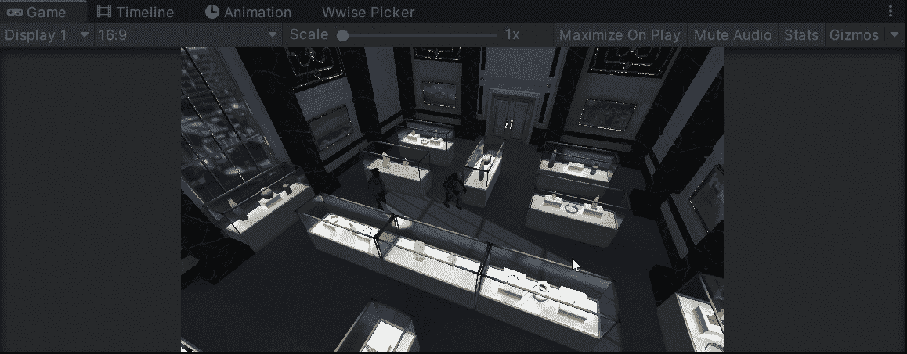

# 点击移动！

> 原文：<https://levelup.gitconnected.com/point-and-click-to-move-2bdf1bcac8c0>

对于这个游戏，我们对我们的主角有一个自上而下的视角，并希望能够点击屏幕来移动他。为此，我们可以利用**光线投射。**

**光线投射**是 **Unity 的物理系统**的一部分，允许我们创建从一个物体到另一个物体的直线(或光线)。 **Raycast** 的一个功能是 **ScreenPointToRay** ，它允许我们从屏幕或摄像机位置绘制**光线**。

在检查鼠标左键是否被点击时，我们可以从我们的**主摄像机**中画出一条**光线**通过鼠标位置作为目标。

**物理系统**允许我们检测**射线击中了什么**并将其存储为一个变量。当我们希望根据点击的内容发生不同的事情时，这非常有用。但是现在，我们只是想移动我们的球员。

在这个例子中，我们使用的是 **Unity 的 NavMeshAgent 系统**，这将在明天的文章中介绍。但是请注意，我们只是存储了一个带有 **Hit 变量的点位置的 **Vector3** ，**，然后将它传递给 **NavMeshAgent 的 **SetDestination 函数**。**

