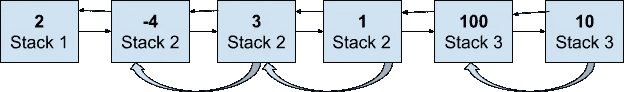

# 指针和迭代器:使用一个链表的三个堆栈

> 原文：<https://levelup.gitconnected.com/pointers-and-iterators-three-stacks-using-one-linked-list-bda0459b76cd>

数据结构操作在编程面试问题中经常出现。这篇文章讨论了操纵链表来设计堆栈。这个问题是微软在一次编程采访中问到的。

这篇文章还通过使用 C++语言支持(迭代器和模板)增加了实现的健壮性。掌握标准语言结构会让你的面试脱颖而出，并在招聘过程中给你额外的优势！

# 问题:

使用一个链表实现三个栈。

# 解决方案 1:指针管理

基本算法想一想应该就容易了。下面是解释它的图表！

带有 stack_successor 指针的双向链表

该图显示了一个包含几个元素的双向链表:`(2, 4, 3, 1, 100, 10)`。列表的头部在元素`2`处。 ***在每一个节点，我们还保留了一个指针，指向堆栈中具有相同堆栈 id 的下一个元素！。*** 当前栈顶被移除时(例如通过`Pop`方法)，这个下一个栈指针，或`stack_successor`允许我们快速跳转到栈顶。我们还需要在一个指针数组中跟踪所有堆栈的顶部。

此时，在给定一个节点指针的情况下，您应该可以轻松地在双向链表中实现`Insert`和`Delete`方法。下面是我们如何使用`Insert`和`Delete`修改`Push`和`Pop`方法

1.  `Push`:

*   叫`Insert`榜头。
*   更新新插入节点的`stack_successor`指针
*   更新`tops`数组，用新创建的节点替换现有节点(具有匹配的 stack_id)。

`2\. Pop`:

*   从链表中删除带有给定`stack_id`的顶层节点。节点指针可以从`tops`数组中获得。
*   用被删除节点的`stack_successor`更新`tops`数组。
*   不要忘记通过调用节点指针上的`Delete`来释放内存。

下面是使用双向链表实现三个堆栈。

三个带链表和指针操作的堆栈

# 解决方案 2:迭代器和类模板

上面的解决方案很棒，大部分考生(还有面试官！)会对它满意的。然而，有几件事可以进一步改进:

*   初始解决方案中没有异常处理。我们需要处理两种类型的异常:
*   当`stack_id`大于堆栈数量时，出现超出范围异常
*   当相应的堆栈为空时，`Pop`和`Top`出现超范围异常。
*   该解决方案使用了太多的低位指针操作。指针操作容易出错，任何现代 C++都应该使用更高级的抽象。(这里是 ***迭代器*** ！)
*   该解决方案没有留下任何空间来扩展堆栈的数量或所提供的数据类型。当然，我们可以简单地使用栈的数量作为类构造函数的参数。但是我们可以做得更好——通过使用另一种 C++语言结构— *模板。*

我们将使用 [std::iterator](https://www.cplusplus.com/reference/iterator/) 接口而不是指针来跟踪堆栈后继者。根据定义，

> *迭代器*是一个指向容器的对象(比如 std::list)，能够遍历容器的元素。它定义了两个操作符:(1) *用于解引用，以及(2 ++用于遍历容器。

因此，为了使用迭代器，我们将

1.  维护一个`std::list`元素，而不是定义我们自己的`Node`结构。
2.  使用`std::list<>::iterator`作为`stack_successor`的数据类型，而不是节点指针。
3.  使用 *std::list 方法、*尤、 [*push_front*](https://en.cppreference.com/w/cpp/container/list/push_front) 、 [*front*](http://front) 、 [*erase*](https://en.cppreference.com/w/cpp/container/list/erase) 代替指针操作。所有这些方法都使用迭代器。

下面的清单说明了我们如何使用*模板、std::list 和迭代器*来避免低级指针操作，同时提供三个栈的通用实现。这段代码还处理两种类型的异常:

1.  `stack_id_out_of_bound`:当`Push`、`Pop`或`Top`方法中传递的 stack_id 超过堆栈数时。
2.  `empty_stack`:当`Pop`或`Top`在一个空栈上被调用时，对应的栈 id。

使用 std::list、迭代器和模板的三个堆栈

# 测试

以下是一些测试案例:

1.  异常:`stack_id_out_of_bound`和`empty_stack`异常
2.  单个堆栈上的单个`Push`、`Top`和`Pop`序列
3.  单个堆栈上的多个`Push`、`Top`和`Pop`序列

*原载于 2021 年 2 月 8 日*[*https://cppcodingzen.com*](https://cppcodingzen.com/?p=2651)*。*