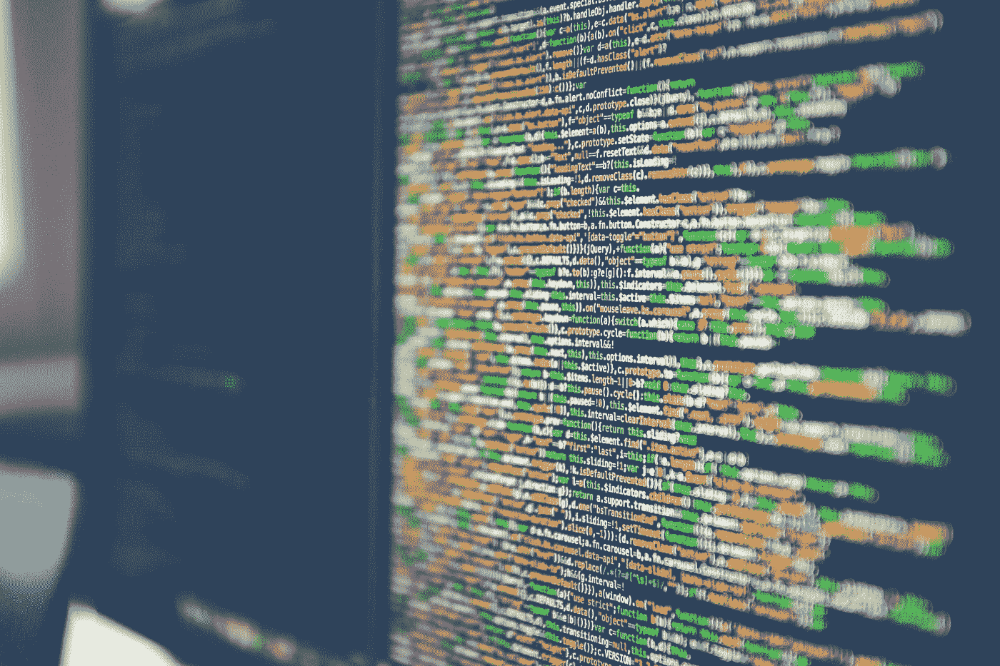

# 围棋中的指针——它们是什么以及如何使用

> 原文：<https://levelup.gitconnected.com/pointers-in-go-what-are-they-and-how-to-use-them-35dd777956dc>

## 看看值类型和引用类型以及它们对指针的意义

马库斯·斯皮斯克在 [Unsplash](https://unsplash.com/photos/Skf7HxARcoc) 上的照片

## 什么是指针？

指针是一个变量，用来存储另一个变量的内存地址。

这个图表希望能让它更有意义。我们创建了一个名为“number”的变量，这个变量既有地址又有值。然后，如果我们创建一个与“&number”相等的指针，那么“&”会给我们这个数字的地址，然后我们可以使用这个地址找到值“50”并更新它。

所以，我想现在的问题是，为什么我们不能只使用我们的变量，这样更新值。

在上面的代码中，我创建了一个名为 user 的简单结构，它有用户名和年龄。我的“updateAge”函数有一个 user 类型的接收器，它所做的只是将用户的年龄设置为我们已经过的新年龄，在我们的例子中是 11 岁。然而，这是行不通的，第 17 行的 *Println* 将打印出一个 10 岁的用户。为什么会这样呢？原因是 Go 是一种按值传递的语言，换句话说，它在函数中创建了一个值的副本。

让我们仔细看看它是如何工作的。

由于 Go 是一种通过值传递的语言，所以当我们向函数传递一个值时，Go 会创建该值的副本，然后该副本可供函数中的代码使用。这就是为什么在上面我们看到的代码中，当我们打印“john”时，他的年龄没有改变，但是如果 *Println* 在 *func* 中，在设置了新的年龄之后，我们会看到副本的年龄确实更新到了新的值。

知道了所有这些，我们现在可以看看如何使用指针来解决这个小问题。

## 使用指针

首先，我将粘贴下面的工作代码，然后进行修改。

唯一的改动是在第 16 行，我们创建了一个指针，使用符号“&”指向 john 的地址。然后我们在指针上调用函数，而不是在 john 上调用函数。另一个变化是，在我们的 *updateAge* 函数中，接收器现在是一个指针，用户前面有“*”符号。让我们想象一下这是怎么回事。

这就是那两个神秘符号的意义。在 *func* 中，逻辑如下:

## 我们什么时候需要指针？

如果我们试图更新任何值类型，那么指针肯定是需要的，但是如果我们使用引用类型，我们不需要担心指针。

 [## 通过我的推荐链接加入 Medium-Ivan Stoev

### 作为一个媒体会员，你的会员费的一部分会给你阅读的作家，你可以完全接触到每一个故事…

medium.com](https://medium.com/@ivan.zstoev/membership)