# 用 Python 中的 Greykite 进行口袋妖怪 TCG 产品价格预测

> 原文：<https://levelup.gitconnected.com/pokemon-tcg-product-price-forecasting-with-greykite-in-python-a77223567d58>

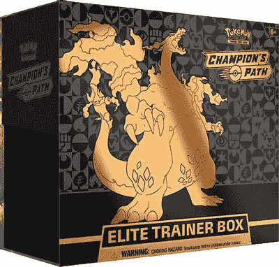

口袋妖怪 TCG 冠军之路精英教练盒

时间序列预测包括根据历史数据预测未来的观察值(如价格或连续测量值)。它通常通过分析过去的趋势来假设未来的趋势与历史趋势相似。

随着口袋妖怪 TCG 在过去几个月里越来越受欢迎，我认为在一个高销量的产品上测试预测者会很有趣:口袋妖怪 TCG 冠军的路径精英教练盒。

因此，在这篇文章中，我们将看看如何应用 Greykite 模型来预测产品的平均每日销售价格。

在进行预测之前，让我们快速浏览一下 Greykite 库。

Greykite 是一个预测库，用于 EDA、预测管道、模型调整、基准测试等。它包括 Linkedin 开发的 Silverkite 预测算法和脸书开发的 Prophet 预测算法接口。

不久前，我写了一篇关于使用 Prophet 进行时间序列预测的简单指南，你也可以看看，尽管它不是用 Python 写的。

[](/time-series-forecasting-with-prophet-in-r-a9ee81dc82e1) [## R 中的 Prophet 时间序列预测

### 本周早些时候，当我浏览 LinkedIn 时，我看到一个帖子，简要提到了“先知”图书馆…

levelup.gitconnected.com](/time-series-forecasting-with-prophet-in-r-a9ee81dc82e1) 

我们还可以看看这两种预测算法之间的高级比较。

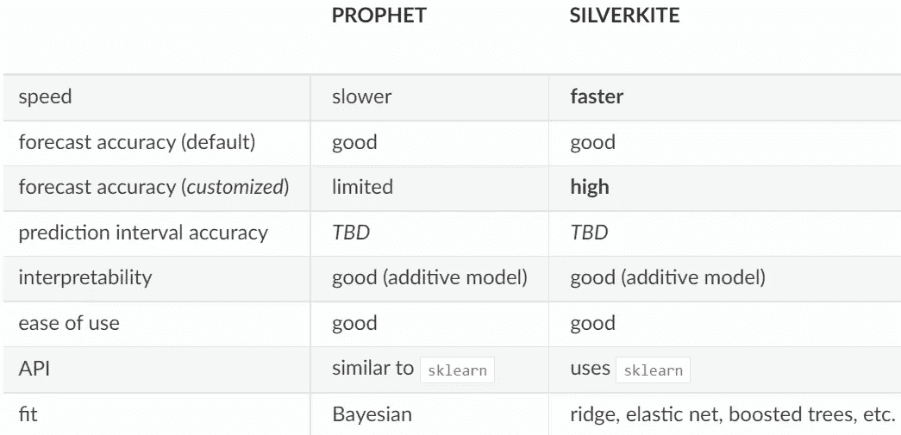

可以找到 Greykite 预测库的完整文档:[https://LinkedIn . github . io/grey kite/docs/0 . 1 . 0/html/pages/grey kite/overview . html](https://linkedin.github.io/greykite/docs/0.1.0/html/pages/greykite/overview.html)

在任何预处理之前看一下数据集和数据类型。

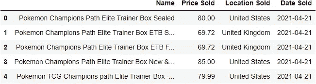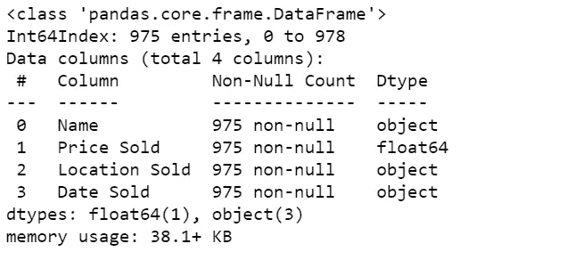

Greykite 模型需要一个时间戳和值列来进行预测，我们可以稍后在元数据参数中定义。

为了简单起见，我将只保留相关的列，对值进行分组，并返回数据集中每天的平均价格。

因此，这将是我们用于预测模型的最终数据集。

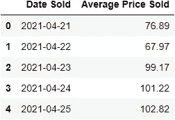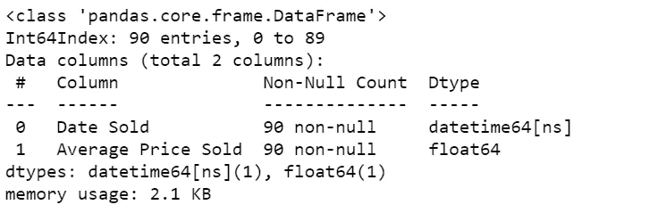

好的，让我们从安装灰风筝库开始。

```
pip install greykite
```

接下来，导入相关的库来执行一个简单的预测(我在一个在线 Jupyter 笔记本上工作。notebook_connected 用于默认的 Plotly 渲染器)。

```
from collections import defaultdict
import warnings
import pandas as pd
import plotly.io as piopio.renderers.default = "notebook_connected"from greykite.common.data_loader import DataLoader
from greykite.framework.templates.autogen.forecast_config import ForecastConfig
from greykite.framework.templates.autogen.forecast_config import MetadataParam
from greykite.framework.templates.forecaster import Forecaster
from greykite.framework.templates.model_templates import ModelTemplateEnum
from greykite.framework.utils.result_summary import summarize_grid_search_resultswarnings.filterwarnings("ignore")
```

导入库后，我们将指定用于预测的数据集信息。

```
metadata = MetadataParam(
    time_col="Date Sold",  
    value_col="Average Price Sold",  
    freq="D")
```

其中:

*   time_col =时间戳的列名。
*   value_col =我们要预测的值的列名。
*   熊猫日期范围格式，每日，每月，每周等。

然后，我们可以继续使用 Silverkite 算法创建预测。

```
forecaster = Forecaster()  
result = forecaster.run_forecast_config(  
    df=modified,
    config=ForecastConfig(
        model_template=ModelTemplateEnum.SILVERKITE.name,
        forecast_horizon=30,  
        coverage=0.95,         
        metadata_param=metadata
    )
)
```

其中:

*   forecast_horizon =预测的步骤数。
*   覆盖率=预测区间百分比。

在看预测预报之前，我们可以先看一下原始的时间序列。

```
ts = result.timeseries
fig = ts.plot()
pio.show(fig)
```

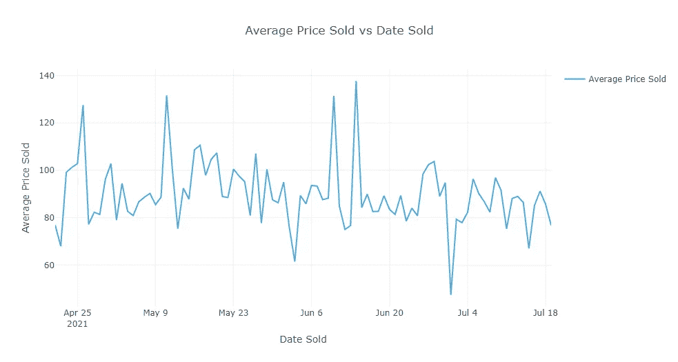

我们还可以利用交叉验证分割来查看预测对过去数据的执行情况。在这种情况下，在分割中选择平均绝对百分比误差(MAPE)。

```
grid_search = result.grid_search
cv_results = summarize_grid_search_results(
    grid_search=grid_search,
    decimals=4,
    cv_report_metrics=None,
    column_order=["rank", "mean_test", "split_test", "mean_train", "split_train", "mean_fit_time", "mean_score_time", "params"])cv_results["params"] = cv_results["params"].astype(str)
cv_results.set_index("params", drop=True, inplace=True)
cv_results.transpose()
```

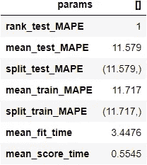

接下来，我们将在测试集上绘制回溯测试(历史预测)。

```
backtest = result.backtest
fig = backtest.plot()
pio.show(fig)
```

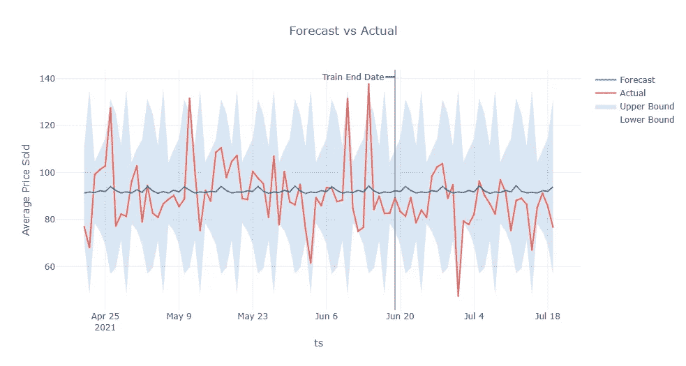

我们还可以查看历史训练集和测试集之间的回溯测试历史评估指标。

```
backtest_eval = defaultdict(list)
for metric, value in backtest.train_evaluation.items():
    backtest_eval[metric].append(value)
    backtest_eval[metric].append(backtest.test_evaluation[metric])
metrics = pd.DataFrame(backtest_eval, index=["train", "test"]).T
```

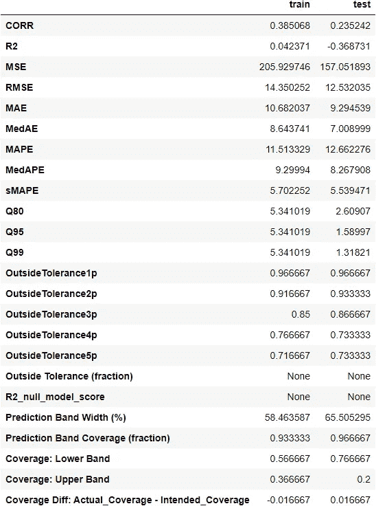

接下来，我们将看看预测的结果。

```
forecast = result.forecast
fig = forecast.plot()
pio.show(fig)
```

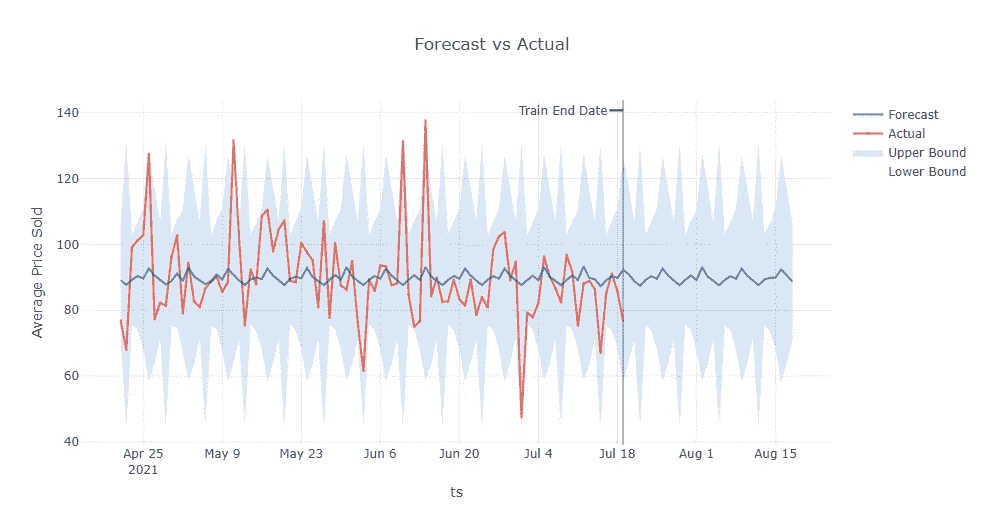

预测值也存储在可访问的数据框中。

```
forecast.df.tail().round(2)
```

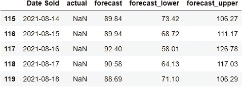

我们还可以查看预测模型的组件。

```
forecast.df.tail().round(2)
```

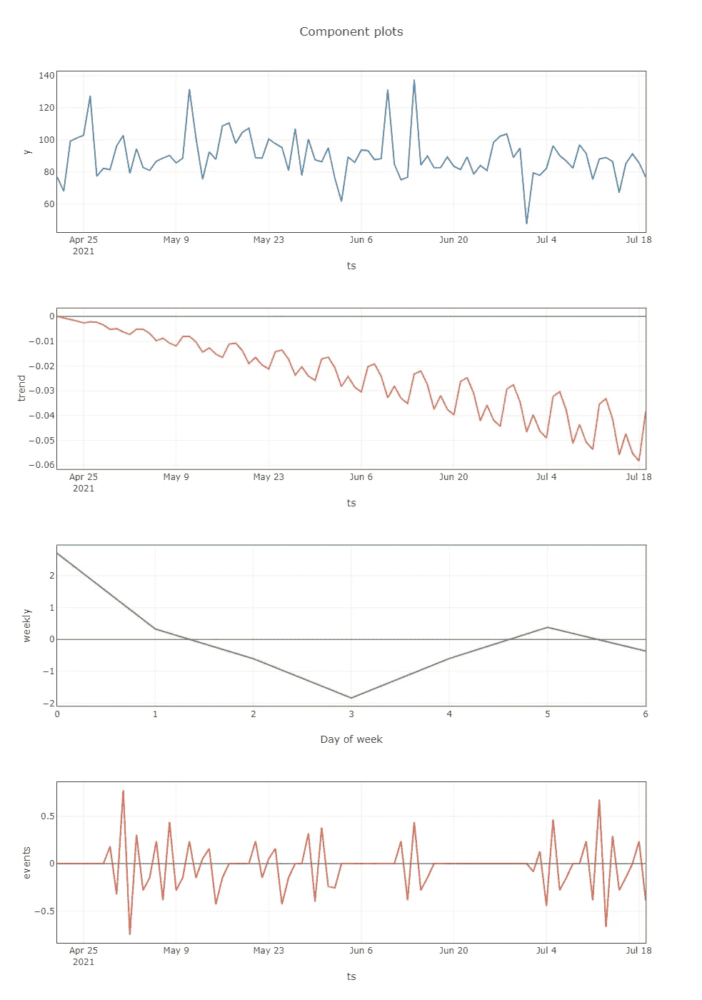

我们还可以检查单个模型术语、参数估计和显著性。当希望进一步调整模型参数时，这是必不可少的。

```
summary = result.model[-1].summary() 
print(summary)
```

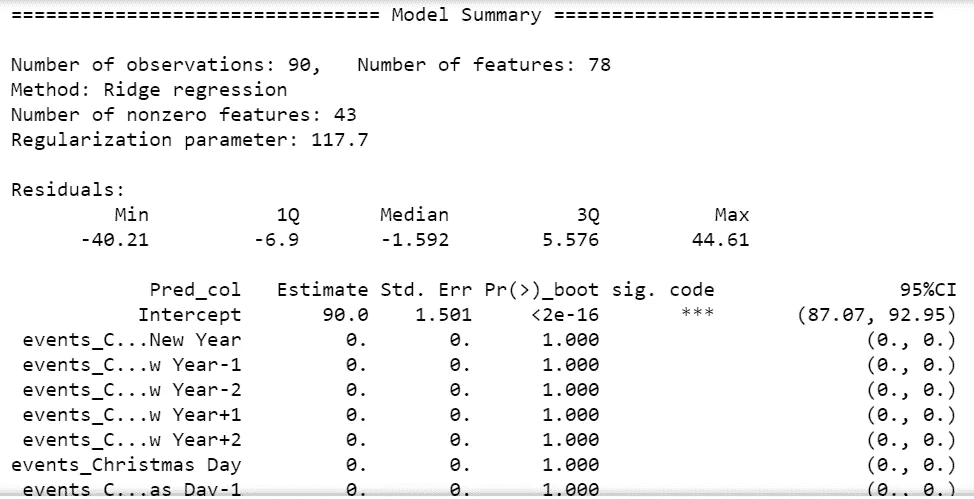

根据获得的结果，该产品未来 30 天的平均预测值约为 89.85 美元。

最后，通过传递新的预测数据框，最终模型可用于预测任何日期范围。

在这个例子中，我使用了 90 天的未来时间预测范围，而不是前面例子中的 30 天。

```
future_model = result.model
future_df = result.timeseries.make_future_dataframe(
    periods=90,
    include_history=False)
results_90 = future_model.predict(future_df)
results_90.tail()
```

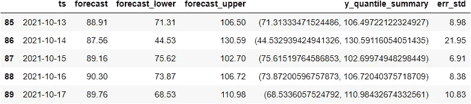

接下来，基于模型摘要中的结果，可以基于参数调整预测模型，以给出更好的结果。

我可能会写一篇单独的文章来调整模型，所以请继续关注，我希望这对你有用！

好奇的学习者？释放你在媒体上学习的全部潜力，用不到一杯咖啡的钱支持像我这样的作家。

[](https://lzpdatascience.medium.com/membership) [## 通过我的推荐链接加入媒体——杰森·LZP

### 作为一个媒体会员，你的会员费的一部分会给你阅读的作家，你可以完全接触到每一个故事…

lzpdatascience.medium.com](https://lzpdatascience.medium.com/membership)