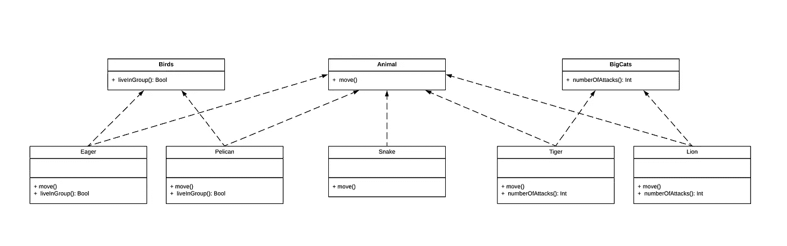
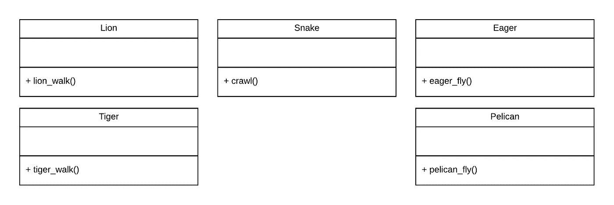
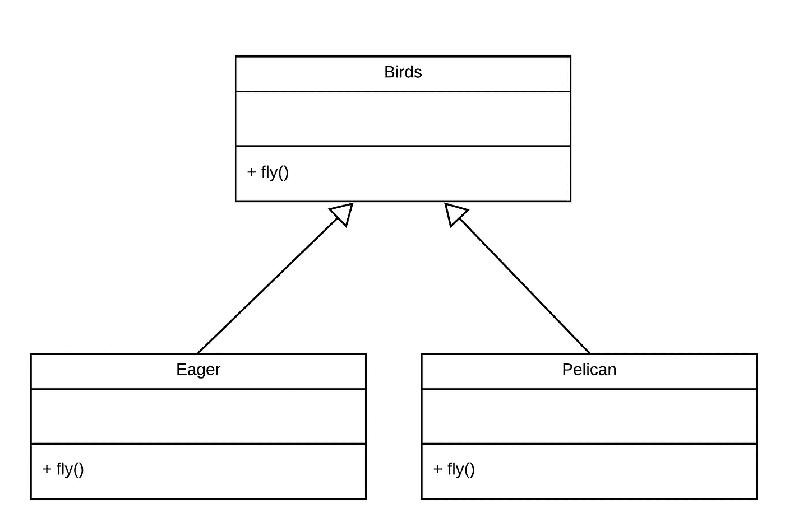
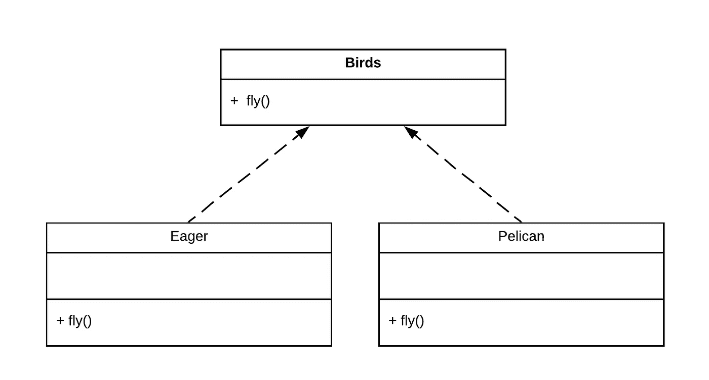
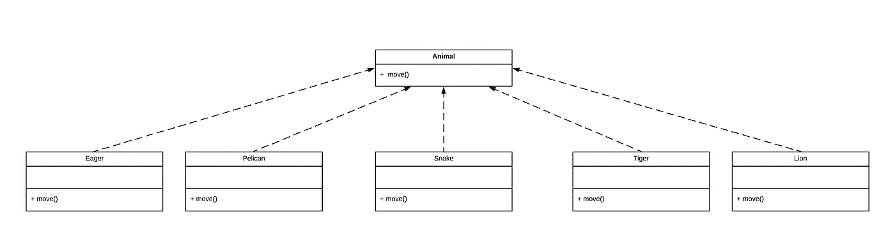
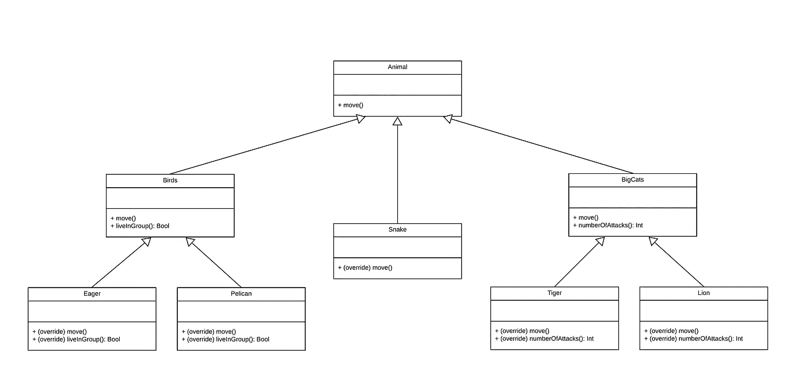

# Swift 中的多态性

> 原文：<https://levelup.gitconnected.com/polymorphism-in-swift-b03def92fa26>

## 高级主题

## 如何在 Swift 中实现多态性

通过使用协议实现横向增长

面向对象编程已经统治编程世界很多年了。一些编程语言(比如 Java)被设计成对 OOP 原则的本地支持，而一些较老的编程语言(比如 C++)被修改成对 OOP 爱好者的支持。尽管这些年来出现了新的方法，OOP 仍然是几乎任何一种不同规模和不同团队技能的软件项目的最佳方法之一。尽管如此受欢迎，这篇文章并不是关于 OOP 的，而是关于如何一起学习如何使用 Swift 协议和传统的 OOP 方法来实现**多态性**。

# 什么是多态性

据[维基百科](https://en.wikipedia.org/wiki/Polymorphism_(computer_science))

> ***多态性*** *是关于为不同类型的实体提供单一接口*。

虽然它通常被低估，但它是软件工程中最强大的概念之一，它允许您为不同的对象定义不同的行为，同时您仍然可以在它们之间使用一个共享的接口。如果你仍然不清楚，不要担心，让我们快速回顾一下它是如何工作的。

# 如何使用多态性

假设我们被要求开发一个简单的动物园应用程序，该应用程序可以包含不同类型的动物，但是为了简单起见，让我们假设只有 3 种动物:狮子、蛇和鹰。为了简单起见，我们被要求只关注这些类型的单个行为，*移动*

我们想到的第一种方法是将 3 个对象定义为狮子、蛇、鹰，然后为它们定义不同的属性和行为。虽然一开始这看起来不是一个坏的设计，但是如果我们被要求添加更多相同类别的动物，比如鹈鹕或老虎，我们就会面临问题。**我们看到的是，我们逐渐对所有新动物重复同样的行为。**

基本对象

这是一个我们可以获得*多态性*来做出更好设计的例子。

# OOP 方式

在 OOP 中，多态性是由另一个 OOP 原则实现的，**继承**。我们所要做的就是将所有对象定义为父类型，并用子对象初始化它们。然后，调用父函数将执行子函数被覆盖的函数。神奇！

简单继承

# 协议

记住同一个例子，让我们看看如何使用 Swift 中的协议解决这个问题。**协议**是最强大的 Swift 概念之一，使得编程比以前更加容易。在这里，我们将学习它们如何对多态性的实现有用，多态性是一种没有任何继承的**多态性。**

为了解决我们例子中的设计问题，我们首先需要定义适当的协议。**这可能是设计你的架构最重要的一步，决定你想设计什么**。在我们的例子中，我们可以把不同的类别看作不同的协议。

Birds 协议一致性

# 再走一步

我们有一个适当的多态实现，没有任何继承，只使用协议。现在，让我们看看我们如何能走得更远，做得更好。

动物协议一致性

# POP 还是 OOP？

到目前为止，我们已经看到了如何用面向对象和面向协议的方法实现多态性。但是你更喜欢哪一个？各有什么优点？

虽然多态性是 OOP 原则，但我个人更喜欢使用协议来实现它，尤其是对于大型项目。让我们快速看一下当前动物园项目的一个更复杂的层次。

想象一下，现在我们被要求为不同的动物类别添加与任何其他类别都没有共同点的特定行为。例如，我们现在知道大型猫科动物是天生的攻击者，所以我们想记录它们的攻击性反应。这种行为是所有大型猫科动物共有的，但对于鸟类等其他动物来说并不成立。

现在我们必须决定我们更愿意使用哪种方法。

## 面向对象的程序设计(Object Oriented Programming)

对于 OOP，我们需要提出一个反映我们现实世界问题的分层继承设计。在这种情况下，我们需要再添加一个包含我们需要的函数的父对象。因为在大多数现代 OOP 语言中不可能有多重继承，所以中间父代也必须从另一个父代继承。因为现在这可能有点混乱，所以让我们检查一下代码。

OOP 复杂继承

## 购买凭证（proof of purchase）

对于协议，您不需要有任何继承(尽管您可以继承您的协议)。Swift 中的任何对象都可以同时符合多个协议，这意味着它可以同时持有不同的行为，而无需任何额外的继承。查看下面的代码来了解这个想法。

POP 复杂一致性

# 结论

正如您到目前为止所看到的，多态性是一个非常强大的概念，它让您能够以可伸缩的方式设计对象之间的复杂关系。由于 OOP 和 POP 都提供了各自的优势，作为一名软件工程师，选择水平增长(POP)还是垂直增长(OOP)最终取决于您。就我个人而言，我宁愿选择 POP，因为它适用于 Swift structs 类型，由于性能的提高，通常建议不要使用类。

还有许多文章可以帮助您组合不同的特性，以获得更好的设计决策，最终您将获得更易于阅读、维护和扩展的代码。