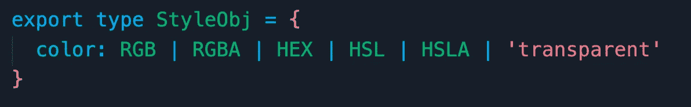
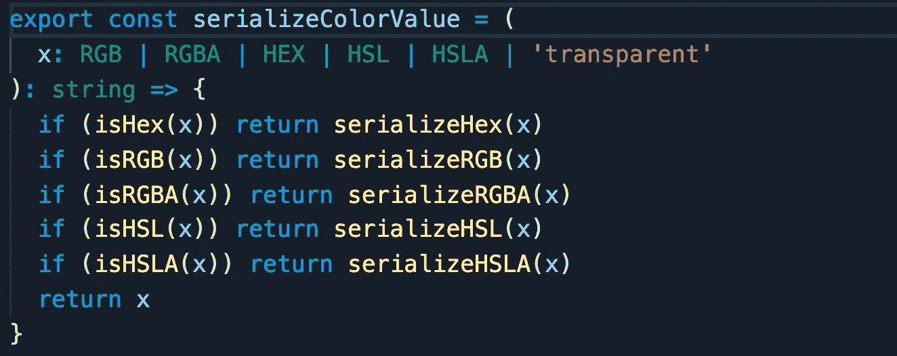
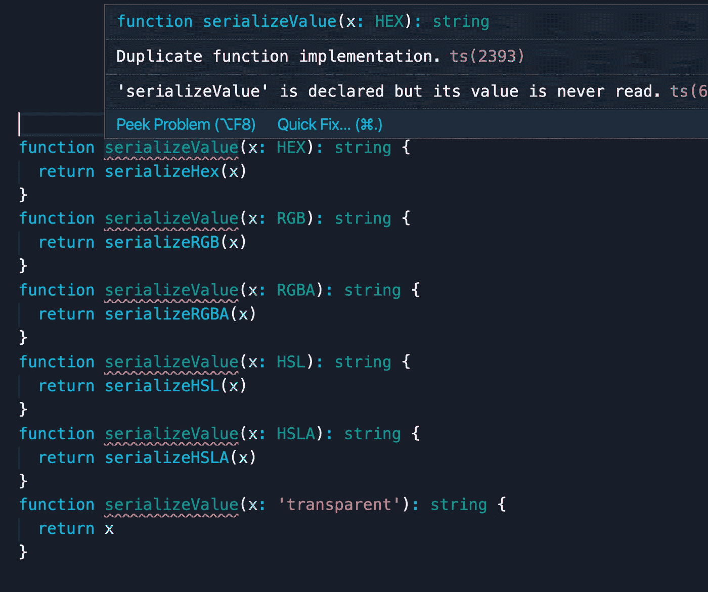
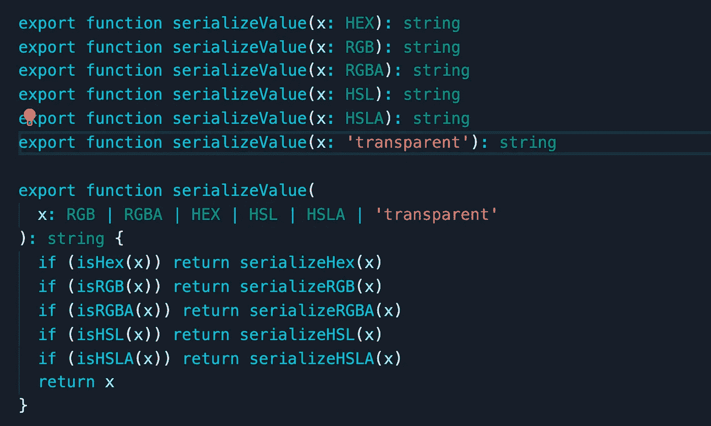
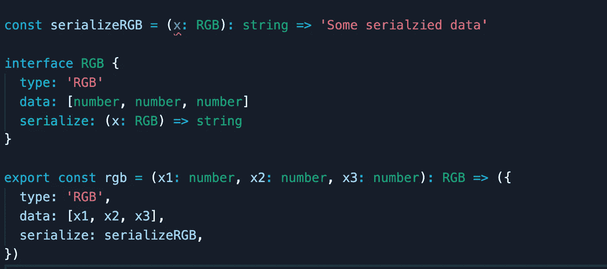
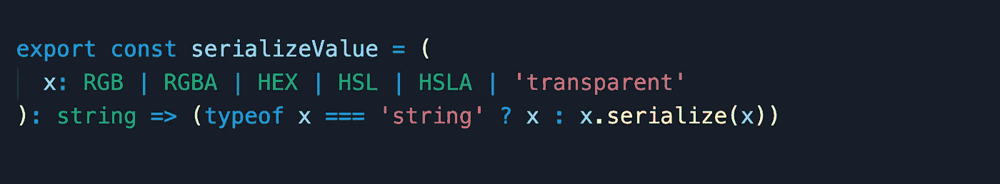

# 类型脚本中的多态性

> 原文：<https://levelup.gitconnected.com/polymorphism-in-typescript-59fad77f8cd7>

## FP 和 OOP 联手对抗代码冗余

Robert Euro Djojoseputro 在 [Unsplash](https://unsplash.com/s/photos/shapes?utm_source=unsplash&utm_medium=referral&utm_content=creditCopyText) 上拍摄的照片

人们常常认为面向对象编程和函数式编程是互斥的，这是可以理解的；任何涉及这两者的讨论往往会变成一场以竞争为中心主题的辩论。但事实证明，在某些情况下，我们可以利用这两种范式来获得两个世界的最佳效果。Typescript 中的**特殊多态性**就是这样一种情况。

# 场景

考虑我们开发内联样式库的情况。该库具有对应于不同 CSS 数据类型的不同类型，例如:

*   RGB
*   RGBA
*   high-speedlaunch 高速快艇
*   high-strength low-alloy 高力低合金
*   十六进制
*   长度
*   百分率
*   分贝
*   时间
*   转换

为了简单起见，这些内联样式对象的接口将只支持一个属性:`color`属性。

如上面的照片所示，我们的接口中的 color 属性的值有一个 tagged-union 类型，它由一个`stringLiteral`类型和五个其他自定义类型组成，表示为 Javascript 对象，并模仿我的前一篇文章中的[描述的名义类型模型。](/nominal-typing-in-typescript-c712e7116006)

现在，在库代码的范围内，这些类型已经被很好地理解了，它们的值可以被相应地操作，但是在这些范围之外，比如说在 React 中，它们没有任何意义。为了让 React 利用这些值进行样式化，我们需要将它们序列化为`string`或`number`值。

# 问题是

基于我们的场景，我们需要一个将颜色值序列化为`string`值的函数。有一种方法可以这样做:

这里没什么特别的。我们创建一些小函数，每个函数负责序列化一个子类型(颜色的一个子类型)，然后创建一个函数来检查传递的参数的类型(使用类型保护)并调用与该类型相关联的函数。**这种方法导致了多余的代码和增加的导入数量(在本例中，我们使用了五个导入)。**

在 Haskell 中，您将使用临时多态性来处理这种情况。在相同的名称下，不同的实现与不同的类型相关联，Haskell 会根据参数的类型自动为您选择合适的实现。如果 Typescript 拥有它，它将“有点”看起来像这样(当然，没有错误):

正如您所看到的，TS 的编译器抱怨“重复的函数实现”。出现此错误是因为在同一名称下可以有多个签名，但只允许一个实现。这个实现负责找到合适的函数来调用。因此，要修复该错误，我们需要执行以下操作:

一文不值！我们的情况和以前相似，只是更糟，代码更多。Typescript 调用这个**函数重载**。它在许多情况下都很方便，但在本例中不方便。

> 在 Typescript 中，同一名称下可以有多个签名，但只允许一个实现与该名称关联

TS 中的功能超载并没有如预期的那样起作用，你感到悲伤和被背叛，你脑袋里的声音在催促你去接触黑暗的一面，在那里所有可怜的物体都在因突变和方法绑定而痛苦地尖叫。但是，就在你迈出面向对象编程世界的第一步之前，我——你的守护天使——出现并阻止了你，为你提供了一个中间地带，一个安全的地方，在那里你的功能可以和你的对象一起在一个纯净的氛围中茁壮成长。

面向对象程序世界一瞥

# 解决方案

我解决这个问题的方法是**保留从 OOP 世界中窃取的“类型化”对象**中的函数引用。不要惊慌，这种方法不涉及任何状态，并且该功能仍然是透明的。该参考只是为了方便和快速地访问适当的功能，并消除代码冗余。我们可以通过添加一个其值是函数引用的属性来实现，如下所示:

您可以忽略属性`type`和`data`。`rgb`函数只是一个工厂函数，它创建类型为`RGB`的值。生成的对象将具有指向函数`serializeRGB`的属性`serialize`。按照这种模式和我们的其他定制类型，我们现在可以将我们的`serializeColor`函数重构为以下形式:

每种类型都负责指向自己的序列化行为实现，不需要导入或手动类型检查。

我希望你同意我的观点，这比之前的版本更简洁。如果你没有，那也没关系。我们都有权有自己的观点，只要留下评论，我会让连姆·尼森找到你，让你相信我的观点。

> 我们可以在对象内部保留对函数的引用，以便将特定类型与重载行为相关联，而不会破坏函数代码的纯洁性。

# 概述

*   在不破坏其纯粹性的情况下，将 OOP 的一些原则引入我们的功能代码是可能的。
*   使用引用是在 TS 中实现类似 ad-hoc 的多态性的一个很好的方法。

我在本文中使用的场景实际上是我在项目中处理的一个场景的简化版本， [Rosebox](https://www.rosebox.dev/) ，这是我用 Typescript 编写的一个样式库。看看这个。