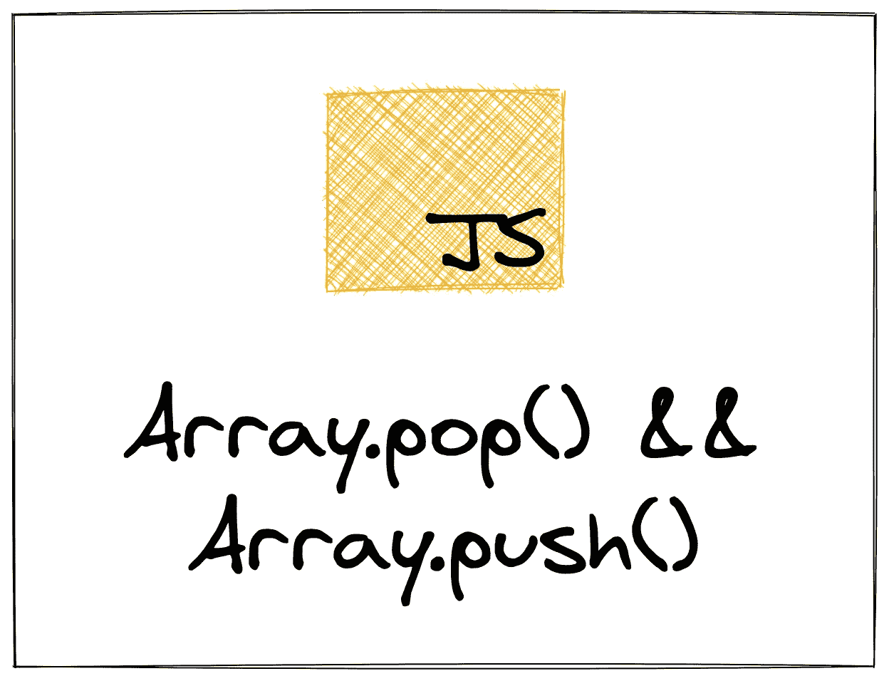

# pop 和 push:通过构建学习 Javascript 的数组方法

> 原文：<https://levelup.gitconnected.com/pop-and-push-learning-javascripts-array-methods-by-building-them-fed7096cf6f0>

我将在本系列的第五篇文章中探讨实现 pop 和 push。具体来说，我们如何在不使用 push 的情况下添加一个项目，或者在不使用 pop 的情况下删除一个项目？



到目前为止，我在本系列中介绍的数组方法都是为了某种目的而循环遍历数组:对每一项做一些事情，获取每一项的修改版本，或者获取数组的一部分。这包括查看`forEach`、`filter`和`map`。

在本文中，我将重点介绍使用数组的另一种方式。具体来说，`pop`和`push`，用于在数组中添加和删除条目。

就像我以前的文章一样，我将介绍如何实现您自己版本的`pop`和`push`。也就是说，90%的情况下，您会希望使用这些内置方法。查看如何实现您自己的功能的目的是了解在无法使用`pop`和`push`的情况下如何获得相同的功能。例如，在构建 React 应用程序的部分中，状态是不可变的(不能被改变)。

# 它们是如何工作的

使用`push`向数组末尾添加一个项目，使用`pop`从数组末尾删除一个项目:

```
const numbers = [1, 2, 3, 4]// Add an item to the end:
numbers.push(5) // [1, 2, 3, 4, 5]// Removethe last item:
numbers.pop() // [1, 2, 3, 4 ]
```

这里我取一个数组(`numbers`)，用`push`在末尾加一个条目(`5`)。然后，我马上用`pop`把它去掉。

从数组开始处添加和移除有单独的、对应的方法。这些是`shift`和`unshift`，我将在以后的文章中介绍它们。

# 不使用`push`添加

如何在不使用`push`方法的情况下将一个项目添加到数组的末尾？

最简单的方法是给数组中的索引位置赋值:

```
const numbers = [1, 2, 3, 4]
numbers[ numbers.length ] = 5
```

不是每种编程语言都允许这样做。一般来说，数组的长度是固定的，实际上你必须用新值创建一个新的更长的数组。比如围棋就是如此。

JavaScript 会让你在大多数情况下做到这一点。但是，这种方法有两个限制。首先，您现在手动管理这个数组的索引。仔细检查你的代码，确保你没有遗漏某处的索引或者有任何一个问题。第二，正如我前面提到的，有时候你想要(或者需要)创建一个新的数组。

你可以使用 spread 操作符创建一个新的数组，我在我的实现`[concat](https://zkf.io/js-array-methods-concat/)`中提到过。使用 spread 操作符，我可以实现我自己版本的模拟相同行为的`push`。

为此，我需要定义一个函数，它接受一个数组和新项作为参数。然后，它需要返回一个新数组，其中包含原始数组的所有值，以及新的项。大概是这样的:

```
function push(array, item) {
  return [
    ...array,
    item
  ]
}
```

现在，用我原来的`numbers`数组，我可以这样做:

```
let numbers = [1, 2, 3, 4]numbers = push(numbers, 5) // [1, 2, 3, 4, 5]
```

这个实现缺少一样东西:内置的`push`方法允许您一次添加多个值:

```
let numbers = [1, 2, 3, 4]numbers.push(5, 6, 7) // [1, 2, 3, 4, 5, 6, 7]
```

使用 spread 和 rest 操作符修改我的实现来适应这一点实际上相当简单:

```
function push(array, ...items) {
  return [
    ...array,
    ...items
  ]
}
```

在第 1 行，我在初始数组后获取任意数量的参数，并使用 rest 操作符将它们合并到一个名为`items`的数组中。然后，我使用`spread`操作符将这些项目和传入数组中的项目一起放入新数组中。

(请注意，当`...`执行展开操作和静止操作时，可能会有点混乱。更令人困惑的是，这个操作符也可以处理对象！)

现在，我的实现可以在原始数组后接受任意数量的参数:

```
let numbers = [1, 2, 3, 4]// Adding one new item:
numbers = push(numbers, 5) // [1, 2, 3, 4, 5]// Adding more than one:
numbers = push(numbers, 6, 7, 8) // 1, 2, 3, 4, 5, 6, 7, 8]
```

# 移除时不弹出

不使用`pop`从数组中移除最后一项有点棘手。最佳方法将取决于您的环境，并且可能涉及另一个数组方法。我将向您展示一种不如您想象的那样有效的方法，一种有效的方法，然后是我认为最好的方法。

如果你在 JavaScript 中遇到过`delete`，你可能会把它作为一种方法。不过，我通常会建议避免使用`delete`。在这种情况下，它将从数组中删除该项，但是您可能没有预料到的行为是数组的长度将保持不变，并且在末尾会留下一个空项(或槽):

```
let numbers = [1, 2, 3, 4]// The original length:
numbers.length // 4// Delete the last item:
delete numbers[ numbers.length - 1]// The new length:
numbers.length // 4numbers // [1, 2, 3, <1 empty slot>]
```

如果您稍后循环这个数组，长度将不会对应于数组中实际值的数量，并且您会得到一些奇怪的、难以调试的行为:

```
for (let i = 0; i < numbers.length; i++) {
  console.log(numbers[i])
}
// 1
// 2
// 3
// undefined
```

另一种方法是编写一个创建新数组的`for`循环。我可以在一个函数中模仿`pop`的行为:

```
function pop(array) {
  let res = []
  for (let i = 0; i < array.length - 1; i++) {
    res[i] = array[i]
  }

  return res
}
```

在上面的`pop`方法中，我把原始数组作为一个参数。然后，我立即创建一个新的空数组，最终返回给调用者。然后，我遍历原始数组，但是跳过最后一项(`i < array.length -1`)，这实际上删除了它。在这个循环体内，我将传入数组的当前位置的值赋给新数组的位置(`res[i] = array[i]`)。

这工作得很好:

```
let numbers = [1, 2, 3, 4]numbers = pop(numbers) // [1, 2, 3]
```

这继续支持了我的理论，即每个数组方法都可以用一个`for`循环来实现。但是，正如我之前在本系列中说过的，你通常希望避免`for`循环，而是使用命名方法，这样你的代码更容易阅读。这里也是如此，但是有一个小小的警告。

我可以使用`slice`完成同样的目标，并跳过循环。需要注意的是，很多人很难记住`slice`和`splice`之间的区别。我发现学习围棋对我有帮助。Go 中的切片是一种数据结构，相当于 JavaScript 中的数组，其中 Go 中的数组的行为类似于更传统的数组类型。Go 中的数组有一个固定的长度，在初始化后不能改变。不然我还没听过好的记住区别的助记法。

无论如何，我可以通过使用`slice`来简化我的`pop`方法的实现:

```
function pop(array) {
  return array.slice(0, array.length - 1)
}
```

本系列的后续文章将介绍如何实现`slice`和`splice`。同时，您需要知道传入的参数是切片的开始和结束位置。`slice`然后返回数组这一部分的浅表副本。

使用我的`pop`方法的新版本，我可以得到相同的结果:

```
let numbers = [1, 2, 3, 4]numbers = pop(numbers) // [1, 2, 3]
numbers = pop(numbers) // [1, 2]
numbers = pop(numbers) // [1]
```

在解决这个问题的三种方法中，使用`slice`是最好的选择。不过，我写了一个关于每个数组方法的完整系列，所以我可能对它们有偏见。

# 结论

这是介绍 JavaScript 中每个内置数组方法的系列文章的第四篇。如果您还没有看过，一定要看看本系列的其他文章:

*   `[forEach](https://zkf.io/js-array-methods-foreach/)`
*   `[map](https://zkf.io/js-array-methods-map/)`
*   `[concat](https://zkf.io/js-array-methods-concat/)`
*   `[filter](https://zkf.io/js-array-methods-filter/)`

我将解释并实现每个内置方法。如果你对此感兴趣，我鼓励你在 [Twitter](https://twitter.com/ZFleischmann) 上关注我，这样你就不会错过本系列未来的文章。