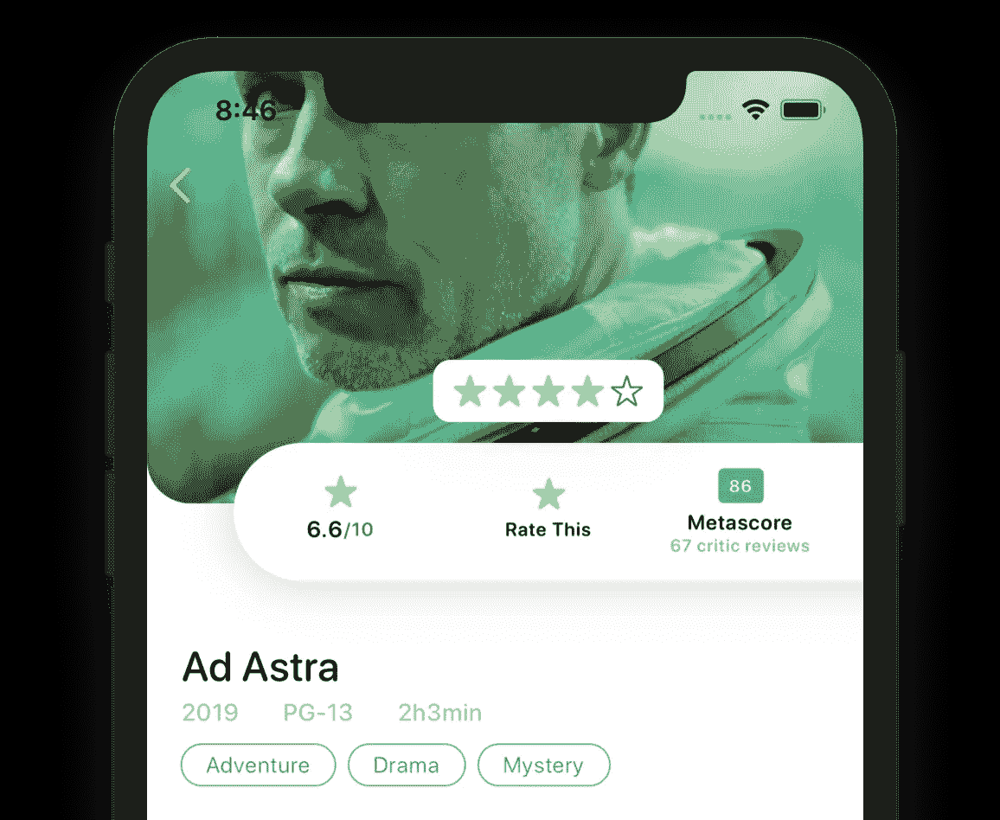
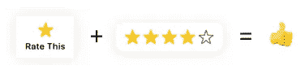
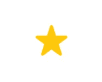
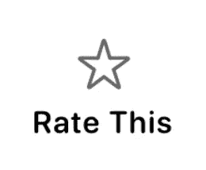
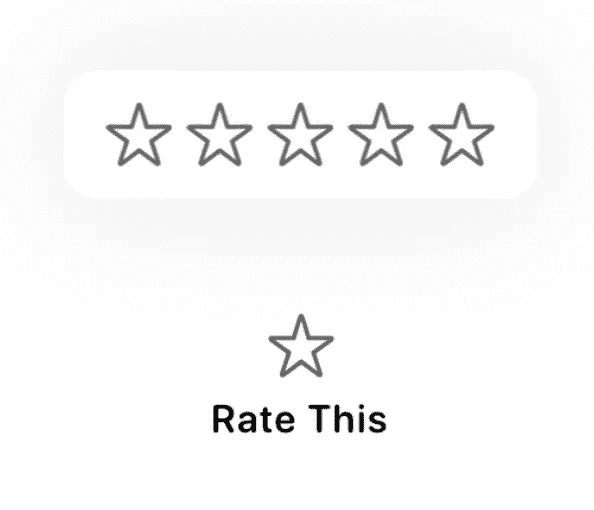
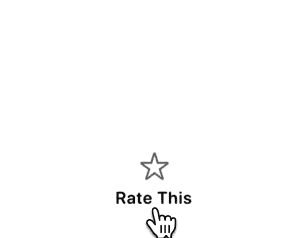
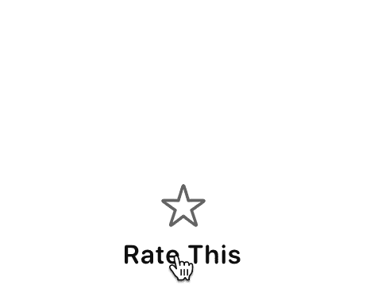

# 使用 SwiftUI 构建一个弹出审查按钮

> 原文：<https://levelup.gitconnected.com/popup-review-button-using-swiftui-2ddd6e6bf675>

## 当有意义时，向用户显示附加信息



弹出式查看按钮—在电影应用程序上下文中显示

让我们快速浏览一下我们今天要创建的内容。在本教程结束时，你将能够在你的应用程序中使用这个弹出审查按钮，让用户对你的应用程序提供的任何东西进行评级。

## 入门指南

创建一个名为`ReviewButton`的新 SwiftUI 文件，生成一个模板让我们开始。这是一个将一切联系在一起的观点。一旦完成按钮的构建，我们将把它添加到我们的应用程序中。

```
import SwiftUI

struct ReviewButton: View {
    var body: some View {
        Text("Hello, World!")
    }
}

struct ReviewButton_Previews: PreviewProvider {
    static var previews: some View {
        ReviewButton()
    }
}
```

## 分解我们的观点

我们将把这个`ReviewButton`分解成两部分。第一个是星星`Image`和“Rate This”`Text`，第二个是弹出的 5 颗星星。



“查看”按钮的两个部分

很明显，在这个项目中会出现很多星星，所以让我们继续创造一个对我们有利的星星。

## `StarIcon`

*   创建另一个名为`StarIcon`的 SwiftUI 视图
*   为正在填充(或未填充)的星形添加一个属性变量。

`var filled: Bool = false`

*   删除模板代码，用一个显示星号的`Image`替换它。这里的关键点是改变我们是否使用系统提供的`star.fill`或`star`图标。我们将使用刚刚定义的属性来决定。

`Image(systemName: filled ? "star.fill" : "star")`

*   如果你不熟悉上面使用的三元条件运算符，请查看苹果的相关文档[这里](https://docs.swift.org/swift-book/LanguageGuide/BasicOperators.html#ID71)
*   然后，我们将根据它是否被填充来给星形图标着色。

```
Image(systemName: filled ? "star.fill" : "star") .foregroundColor(filled ? Color.yellow : Color.black.opacity(0.6))
```

这是所有这些放在一起。

```
import SwiftUI

struct RatingIcon: View {

    var filled:Bool = true

    var body: some View {
        Image(systemName: filled ? "star.fill" : "star")
            .foregroundColor(filled ? Color.yellow : Color.black.opacity(0.6))
    }
}

struct RatingIcon_Previews: PreviewProvider {
    static var previews: some View {
        RatingIcon(filled: true)
    }
}
```



呜哇！金星给你；)

## 现在让这些星星发挥作用吧！

就像我之前说的，我们将首先创建`Star`和`Label`，然后是`Popup`。

回到`ReviewButton`，让我们开始第一部分。

*   用`Button`替换`Text`。毕竟那是我们创造的，对吗？？暂时将动作留空，但是继续添加一个 VStack 作为`Button`内容中的根视图。

```
Button(action: { // Empty for now... }) { 
  VStack(alignment: .center, spacing: 8) { 
    //Star Icon and Label Here... 
  } 
}
```

*   在`VStack`中添加我们的`StarIcon`，然后添加一个带有字符串“Rate This”的`Text`。将颜色更改为黑色以及默认字体。

```
VStack(alignment: .center, spacing: 8) { 
  //Star Icon and Label Here... 
  StarIcon() Text("Rate This").foregroundColor(Color.black) .font(Font.system(size: 11, weight: .semibold, design: .rounded)) 
}
```

在画布中预览视图，您应该看到如下所示的视图。



呸…我们的金星怎么了？

## 创建弹出窗口

现在，我们将创建一个显示 5 颗星的弹出窗口。我们将重用我们之前创建的`StarIcon`。

在`RatingButton`视图中，在`Button`上添加一个覆盖图，就像这样。

```
Button(action: { // Empty for now... }) { 
  VStack(alignment: .center, spacing: 8) { 
    //Star Icon and Label Here...
    StarIcon() Text("Rate This") .foregroundColor(Color.black) .font(Font.system(size: 11, weight: .semibold, design: .rounded)) 
  } 
}.overlay( /* Star Icons Here */ )
```

*   使用一个`HStack`将五个`StarIcon`放在一起。确保对准在中心，并且`HStack`使用的间距值为 4。

```
.overlay( HStack(alignment: .center, spacing: 4) { RatingIcon(filled: false) RatingIcon(filled: false) RatingIcon(filled: false) RatingIcon(filled: false) RatingIcon(filled: false) 
})
```

*   现在，让我们通过添加一些填充、背景、弯曲的角和阴影来设计我们的弹出窗口。

```
.overlay( HStack(alignment: .center, spacing: 4) { RatingIcon(filled: false) RatingIcon(filled: false) RatingIcon(filled: false) RatingIcon(filled: false) RatingIcon(filled: false) 
} // Start styling the popup... 
.padding(.all, 12) .background(Color.white) .cornerRadius(10) .shadow(color: Color.black.opacity(0.1), radius: 20, x: 0, y: 0) )
```

*   现在向上偏移弹出窗口，这样它就不在按钮的正上方了。

```
.overlay(HStack(alignment: .center, spacing: 4) { 
RatingIcon(filled: false) RatingIcon(filled: false) RatingIcon(filled: false) RatingIcon(filled: false) RatingIcon(filled: false) 
} 
.padding(.all, 12) .background(Color.white) .cornerRadius(10) .shadow(color: Color.black.opacity(0.1), radius: 20, x: 0, y: 0) .offset(x: 0, y: -70) // Move the view above the button 
)
```



嘿嘿，现在我们有进展了😎

## 显示弹出窗口

接下来，我们需要隐藏弹出窗口，直到点击按钮。向`ReviewButton`添加一个`bool`属性，它将控制弹出窗口的状态。

```
@State var popupOpen:Bool = false
```

现在回到我们之前声明的`Button`。将这段代码添加到`action`参数中。

```
Button(action: {
    withAnimation { self.popupOpen = !self.popupOpen }
})
```

然后将这段代码添加到覆盖图中的`HStack`中，以调整不透明度。你应该把它放在我们设置叠加偏移的地方。

```
.opacity(popupOpen ? 1.0 : 0)
```

现在，在画布视图或模拟器中尝试一下。



## 让那些星星变成金子！(添加审阅功能)

接下来，我们需要开始根据用户的评价给这些星星上色。为了跟踪这一点，添加一个属性来跟踪星级。

```
@State var stars:Int = 0
```

我们将使用这个属性给按钮和弹出窗口上的星形着色。让我们修改代码来反映这一点。

如果当前星级大于`0`，将`Button`内的`StarIcon`变为黄色。

```
// Inside the Button
VStack(alignment: .center, spacing: 8) {
    //Star Icon and Label Here...
    StarIcon(filled: stars > 0)
    // "Rate This" Label Below
```

修改弹出覆盖图中的`StarIcon`来改变颜色。

```
HStack(alignment: .center, spacing: 4) {
    RatingIcon(filled: stars > 0)
    RatingIcon(filled: stars > 1)
    RatingIcon(filled: stars > 2)
    RatingIcon(filled: stars > 3)
    RatingIcon(filled: stars > 4)
}
```

既然`StarIcon`会随着评级的变化而改变颜色，我们需要实际允许用户选择一个评级。我们将使用`DragGesture`来实现这一点。

就在我们声明了`popupOpen`和`stars`属性的下面，创建一个`DragGesture`。将`minimumDistance`设置为`0`，将`coordinateSpace`设置为`.local`。

> 通过将最小距离设置为`0`，它允许`DragGesture`识别点击，而不仅仅是拖动手势。

```
var gesture: some Gesture {
    return DragGesture(minimumDistance: 0, coordinateSpace: .local)
        .onChanged({ val in
            // Update Rating Here
        })
        .onEnded { val in
           // Update Rating Here
        }
}
```

最后，要做的最后一件事是根据用户点击或拖动的`x`位置来计算选择了多少颗星星。

在返回`DragGesture`的地方声明一个闭包，让它为 x 位置接收一个`CGFloat`。然后我们将做一些快速的计算来确定用户选择了哪个`StarIcon`并更新状态。

```
let updateRating: (CGFloat)->() = { x in
    let percent = max((x / 110.0), 0.0)
    self.stars = min(Int(percent * 5.0) + 1, 5)
}
```

然后调用我们之前设置的`onChanged`和`onEnded`函数中的函数。

> 您会注意到，我还添加了一个动画，在用户选择评级后关闭弹出窗口。

```
return DragGesture(minimumDistance: 0, coordinateSpace: .local)
.onChanged({ val in
    updateRating(val.location.x)
})
.onEnded { val in
    updateRating(val.location.x)
    DispatchQueue.main.asyncAfter(deadline: .now() + 0.1) {
        withAnimation {
            self.popupOpen = false
        }
    }
}
```

最后要做的是将手势添加到我们的弹出菜单中！在像这样声明了`HStack`之后，简单地直接添加这段代码。

```
HStack(alignment: .center, spacing: 4) {
    RatingIcon(filled: stars > 0)
    RatingIcon(filled: stars > 1)
    RatingIcon(filled: stars > 2)
    RatingIcon(filled: stars > 3)
    RatingIcon(filled: stars > 4)
}
.gesture(dragGesture)
```

## 最终产品！



只有 4 星？！…哎呀，这群人真难缠

# 支持未来教程

如果你喜欢这个教程，请考虑使用这个[链接](https://trailingclosure.com/signup)订阅我的网站。我们的订户只需注册就能获得我们的独家内容。哦，如果你没有在[TrailingClosure.com](https://trailingclosure.com/)上读到这篇文章，请随时来看看我们！

**免责声明** 示例中使用的电影海报不是我的，仅作为示例使用。未经业主同意，不得将它们用于任何商业项目。