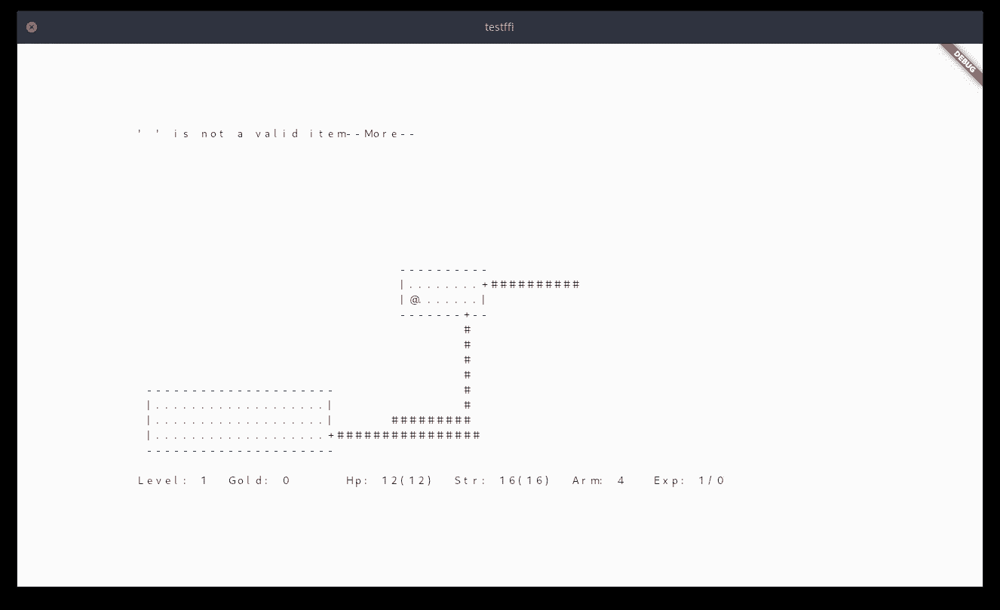
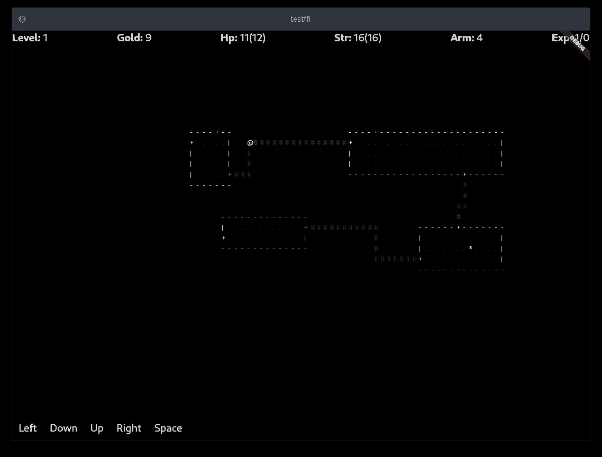
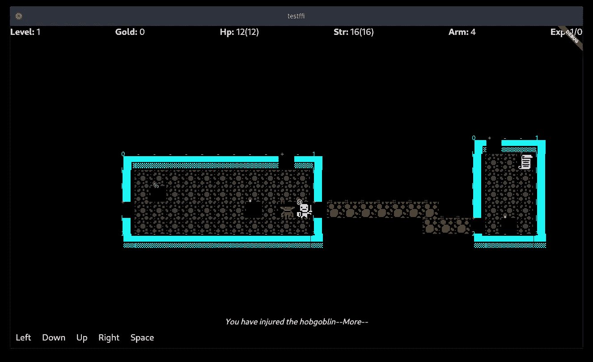
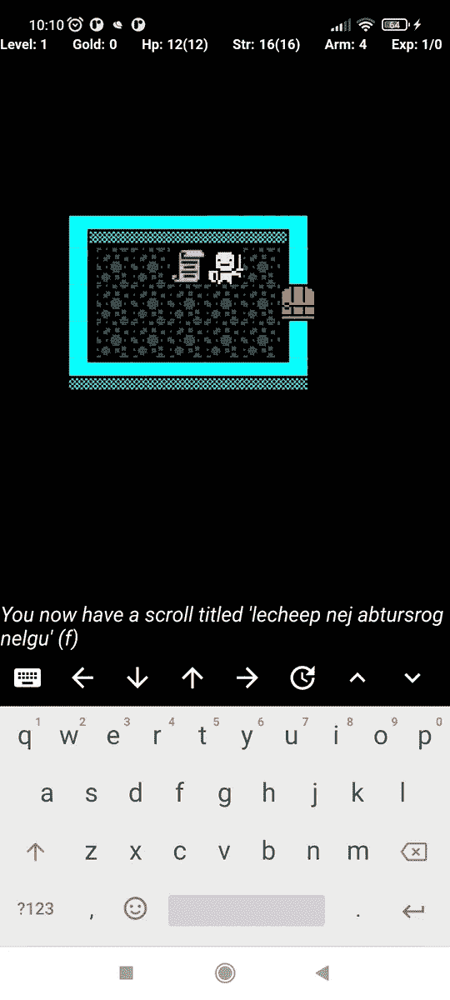

# 移植一个现有的 C/C++应用程序(地牢爬虫——流氓),使之与 Dart FFI 一起跳动

> 原文：<https://levelup.gitconnected.com/port-an-existing-c-c-app-dungeon-crawler-rogue-to-flutter-with-dart-ffi-a701284aa289>

在之前的 [*文章*](/port-an-existing-c-c-app-to-flutter-with-dart-ffi-8dc401a69fd7) 中，我们开始了将现有 C/C++应用移植到 Flutter 的旅程。我们学习了如何在 Flutter 环境中使用 C/C++。现在我们开始实际移植一个应用程序。

# 流氓 5.4

我们选择了地牢爬行，幻想角色扮演游戏——流氓。

Rogue 在终端上运行，使用 Curses 库来管理其基于文本的用户界面。这个游戏很古老。通过下面的截图，你会相信这是真的。但是游戏被认为是经典。它的风格有一个狂热的 T4，一直延续到今天。为具有 Flutter 功能的移动设备重新想象这款经典游戏，就像给旧滑板添加一个电动马达一样。但是如果我们正确地完成这项任务，我们将会取得胜利。也许我们的名字会被铭刻在流氓地牢的末日传说中。


# 战略

我们应对这一挑战的方法如下:

1.  编译 Rogue 作为 Flutter app 构建过程的一部分；
2.  编译 PDCurses —将 Curses UI 替换为一个可以定制为与 Dart 对话的 UI；
3.  构建应用程序渲染器—编写我们的 Flutter UI 代码；
4.  调整应用程序——让它可以在移动设备上播放；
5.  使游戏图形现代化；

*警告:从现在开始，我将假设您已经* [*阅读了之前的文章*](/port-an-existing-c-c-app-to-flutter-with-dart-ffi-8dc401a69fd7) *。这是先决条件。*

本文完成的项目源代码位于:

```
git clone [https://github.com/icedman/rogue_flutter](https://github.com/icedman/rogue_flutter)
```

这个应用程序包含从上一篇文章中摘录的代码:

```
git clone [https://github.com/icedman/flutter_ffi_test](https://github.com/icedman/flutter_ffi_test)
```

# **添加第三方 C/C++库**

我们的策略包括向我们的应用程序添加两个第三方库。Rogue-5.4，我们的 C/C++游戏；PDCurses-3.4 是我们的 Curses 替代品。

## *编译流氓*

我们必须确保现有的代码和第三方库至少可以在 Flutter 环境下编译。目标是还没有运行一个可玩的游戏。而是调查在构建过程中是否有任何可能需要处理的障碍。

我们先查 Linux 和 Android。回想一下第一篇文章，这些系统可以共享同一个 *CMakeLists* 文件。我们可以测试我们的理论:“写一次，在任何地方运行”( T21)。出于本文的目的，测试将只针对 Linux 和 Android。而且在这个阶段，测试还没有在任何地方运行。不过仅仅是*写一次*， ***随时随地打造。***

在目录 *libs* 下，我们创建一个目录 *rogue-5.4* ，其中将包含 Rogue 5.4 的源代码。

```
libs\rogue-5.4\
  ./armor.c
  ./chase.c
...
```

我们编辑 *libs\CMakeLists.txt* 文件并定义一个静态库 *rogue:*

```
add_library(rogue
  STATIC
  ./rogue-5.4/armor.c
  ./rogue-5.4/chase.c
...
```

我们还定义了包含目录，以便在构建过程中找到头文件:

```
target_include_directories(rogue 
    PRIVATE
    ./rogue-5.4/
)
```

我们自己的库— *libapi.so* (在 Linux 和 Android 上)，以前配置为:

```
add_library(api
  SHARED
  ./api.cpp
  exports.def
)
```

我们将把新的静态库 rogue 链接到我们的 api 库:

```
target_include_directories(api 
    PRIVATE
    ./rogue-5.4/
)target_link_libraries(api PRIVATE rogue)
```

## *首次构建*

```
flutter build linux -v
```

在我的 Linux 系统上，这可以毫无问题地构建库。这很奇怪。流氓使用，我们还没注入的诅咒。编译时缺少 Curses 头，或者链接时缺少引用，构建应该会失败。

原因是我的 Linux 系统安装了 *libncurses* 。Flutter 构建过程选择了这个库和它的头文件路径，并且毫无怨言地继续进行。这是一个值得注意的陷阱。请记住，我们将删除诅咒，并实现我们自己的 UI。

```
flutter build apk -v
```

Android 构建运行如预期的那样失败。*“写一次，随处运行”*的一个推论应该是*“失败一次，处处失败”。*

我们将继续进行，同时在心里记下这个麻烦——就像遇到蝙蝠后继续进行地牢爬行一样。

## 编译程序

PD Curses——公共域 Curses——是 Curses 的一个可移植实现。它实现了大多数 Curses 函数调用，同时允许我们用自己的实现轻松地覆盖它们。我们将定制 PDCurses，以允许我们的应用程序在终端之外运行。

将 *pdcurses* 源代码复制到 *libs* 文件夹中。就像我们对*流氓*做的一样。并修改我们的 CMakeLists 来定义我们的 *pdcurses* 库。

```
add_library(pdcurses
  STATIC
  ./PDCurses-3.4/pdcurses/addch.c
  ./PDCurses-3.4/pdcurses/addchstr.c
...
```

将静态 *pdcurses* 库链接到我们的 *rogue* 库和我们的 *api* 库，并配置头路径:

```
target_include_directories(rogue 
    PRIVATE
   ./pdcurses-3.4
   ./rogue-5.4/
...
target_link_libraries(rogue PRIVATE pdcurses)target_include_directories(api 
    PRIVATE
   ./pdcurses-3.4
...
target_link_libraries(api PRIVATE rogue pdcurses)
```

在我们的 *api.cpp* 代码中——我们正在编写的库——我们现在可以使用第三方库 *pdcurses* 和 *rogue* 。

```
#include <curses>
#include <rogue.h>...
initscr(); // pdcurses library call
rogue_main(); // rogue library call
```

## 第二次构建

```
flutter build linux -v
flutter build apk -v
```

对于 Linux 和 Android，这两个命令现在都可以正确构建了。

# 一些快进

我已经对*盗贼*和*诅咒*库做了一些改动。

我禁用了可能不存在或无法在其他系统上工作的代码和功能，或者可能需要特定权限的代码和功能，例如涉及文件读写的代码和功能，或者涉及会在 Android 上崩溃的系统调用(如 *getuid()* )的代码和功能。这些涉及到一些构建、运行、失败、修改，我在这里就不详述了。

我还通过定制 *pdcurses* 实现了 Flutter 和我们的原生流氓应用之间的双向通信。现在，Rogue 中的每个相关诅咒调用都会经过这个文件:

```
libs/PDCurses-3.4/impl/pdc_impl.c
```

我们的 *pdcurses* 实现捕获并保存 curses 所做的所有屏幕更新。它还提供了一种模拟用户按键输入的方法。我们的 Flutter/Dart 应用程序通过调用 *getScreenBuffer* ()读取屏幕数据。Flutter/Dart 应用程序通过调用 *pushKey()向我们的库写入一个键输入。*

## **重访球棒**

如果我们对我们的代码进行一次测试，我们将再次遇到 Linux 构建中提到的麻烦。原来 *libncursesw.so* 在创建窗口时加载了 Flutter *runner* (我们的应用程序可执行文件)。我们的 PDCurses 实现永远不会被调用，因为现有的 Curses 库符号已经被 *libncursesw* 加载了。

编辑 *linux/CMakeLists.txt* :

```
target_link_libraries(${BINARY_NAME} PRIVATE flutter)
target_link_libraries(${BINARY_NAME} PRIVATE PkgConfig::GTK)
**target_link_libraries(${BINARY_NAME} PRIVATE api)**
```

我们不是仅仅在运行时用 Dart FFI*dynamic library . open 来加载我们的 *api* 库，而是用 Flutter *runner 来链接我们的 *api* 库。*这具有在 *libncursesw* 上预加载我们的 *api* 库和 *pdcurses* 符号的效果。*

# 运行流氓应用程序

考虑以下代码:

```
extern "C" {
   int rogue_main(int argc, char **argv);
}EXPORT
int initApp() { const char *argv[] = {
        "rogue",
        "--scr-width=80",
        "--scr-height=25",
        "--sec-width=80",
        "--sec-height=25",
    };

  return rogue_main(5, (char**)argv);
}
```

我们导出函数 *initApp —* ，我们将从我们的 Flutter/Dart 应用程序中调用它。这又会调用 *rogue_main —* 流氓 app 的入口点。

问题是 *rogue_main* 是阻塞调用。它永远不会退出或返回。它会无休止地循环查询输入、计算游戏逻辑、更新游戏状态、刷新屏幕等等。Flutter 应用程序会变得没有响应。

## 线程上的流氓

因此，我们需要在一个单独的线程中运行 *rogue_main* 。这里我们将使用 *pthread* 。这个库可以在 Linux、Android、macOS、iOS 上使用。Windows 有自己的线程库，但是 *pthread* wrappers 存在。

```
void* run_thread(void*) {
  const char *argv[] = {
        "rogue",
        "--scr-width=80",
        "--scr-height=25",
        "--sec-width=80",
        "--sec-height=25",
    };

  rogue_main(5, (char**)argv);
}EXPORT
int initApp() {
   **pthread_create(&threadId, NULL, &run_thread, (void*)"");**
   return 0;
}
```

我们的游戏现在有效地与我们的 Flutter 应用程序并行运行。在 Flutter 中，我们通过对*char** g*etScreenBuffer()、*和 *void pushKey(int key)的同步调用，与本地应用线程进行通信。*

```
extern "C" {
   char *getScreenData();
   void pushKey(int k);
}EXPORT
char* read() {
  return getScreenData();
}EXPORT
void write(int key) {
  pushKey(key);
}
```

在 Flutter 上，我们将这些导出的函数绑定在我们的 *FFIBridge* 类上；

```
class FFIBridge {...final _initApp = nativeApiLib.lookup<NativeFunction<Void Function()>>('initApp');
**initApp** = _initApp.asFunction<void Function()>();final _getSB = nativeApiLib        .lookup<NativeFunction<Pointer<Utf8> Function()>>('read');
**_getScreenBuffer** = _getSB.asFunction<Pointer<Utf8> Function()>();final _pk = nativeApiLib.lookup<NativeFunction<Void Function(Pointer<Utf8>)>>('write');
**_pushKey** = _pk.asFunction<void Function(Pointer<Utf8>)>();...}
```

## **螺纹安全**

屏幕缓冲区是一个预先分配和初始化的 80x25 字符的固定内存缓冲区。 *getScreenBuffer* 操作应该是内存访问安全的。*按键*操作将单个*字符*推送到流氓线程，也应该是安全的原子操作。

# 快速回顾

我们已经完成了以下工作:

1.  编译两个第三方库 Rogue-5.4，和 PD curses-3.4；
2.  将这些库链接到我们的 api 库；
3.  在 PDCurses 上添加实现来捕获屏幕上的字符，并模拟用户输入；
4.  增加 Rogue 和 Flutter 之间的通信方法；
5.  使用 *pthread* 并行运行两个应用——Flutter 和 Rogue

# **在 Flutter 上构建渲染器**

一个非常基本的渲染器可以在几分钟内完成:

```
1\. // query the PDCurses bufferbuffer = FFIBridge.getScreenBuffer();2\. // loop through the buffer and display character by characterfor(int row=0; row<25; row++) {
   for(int col=0; col<25; col++) { 
      drawCharacter(row, col, character: buffer[row*80 + col]);
   }
}
```



上面的实现简单地使用了一个组合了*列、行和文本*的小部件。

对于用户输入，我们将监听 *onKey* 事件，并将输入传递给我们的本地库:

```
*onKey*: (FocusNode *node*, RawKeyEvent *event*) {
    FIBridge.pushString(event.keyLabel);
}
```

在 Android 上我们添加了一个不可见的*TextField；*给它焦点来激活虚拟键盘；并且同样听取关键事件。

没有太多的调整现有的流氓应用程序，我们有一个游戏，可在 Linux 和 Android 上运行。

# 流氓闪亮的新图形

*进入下一关……*

流氓游戏屏幕有三个部分。这是地牢的地图*和*。墙壁用“-”、“|”表示，路径用“#”表示，英雄用“@”表示。一切都是性格。

底部有*统计*行，显示生命、黄金、地下城等级。

还有一个*消息*行，告诉游戏的事件，或者提示输入。

我们将分别呈现这些部分。

使用正则表达式可以分解 *stats* 行。然后，我们可以用样式化的文本或图形分别呈现每个状态项。

```
// parse status "Level: 1  Gold: 0      Hp: 12(12)  Str: 16(16)  Arm: 4   Exp: 1/0"String status = getLine(23);
RegExp regExp = RegExp(r"(([a-zA-Z]{0,9}):\s{0,8}([0-9()/]{0,9}))")res = regExp.matchAll(status);drawStats(res)
```

并且地图可以简单地通过将每个字符映射到其自己的颜色或效果来着色:

```
colorMap['^'] = const Color.fromRGBO(0x50, 0xff, 0x55, 1);
colorMap['%'] = const Color.fromRGBO(0x50, 0xff, 0x55, 1);
colorMap['+'] = Colors.orange;
colorMap['@'] = const Color.fromRGBO(0xff, 0xff, 0xaa, 1);
...drawCharacter(row, col, character: c, color: colorMap[c]);
```



## 进一步下降…

我们也可以用图像或精灵在地图上绘制角色:

```
tilesetMap[':'] = Sprite('food.png'); // food
tilesetMap['!'] = Sprite('potion.png'); // potion...drawCharacter(row, col, image: tilesetMap[c]);
```



图形现代化。

# 挑战完成

我们已经成功地将经典的地牢爬行游戏 Rogue 5.4 移植到 Flutter 和 Android 上，而没有重写游戏本身的任何重要部分。



Android 上的应用程序

```
git clone [https://github.com/icedman/rogue_flutte](https://github.com/icedman/rogue_flutter)r
cd rogue_flutter
flutter pub get
flutter run -v
```

这个 github 项目包含我没有讨论过的代码:一个 Spritesheet 类和使用 *CustomPainter* 的渲染器，带有工具栏和虚拟键盘的输入类。我倾向于把事情看得过于简单。但是颤振方面只有 900 行左右的代码。PDCurses 实现大约有 500 行。这些代码值得一读。

在这款应用有出版价值之前，还有很多润色工作要做。所以挑战并没有真正结束。但是就像在《侠盗猎车手》游戏中一样，穿越地下城的旅程和完成寻找难以捉摸的延多护身符一样重要。