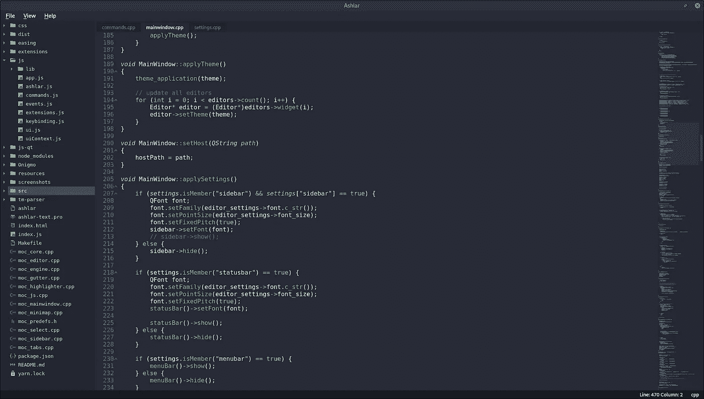
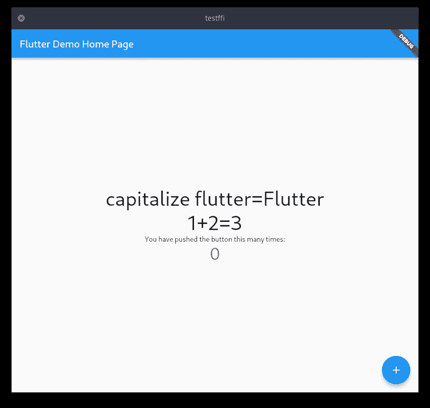
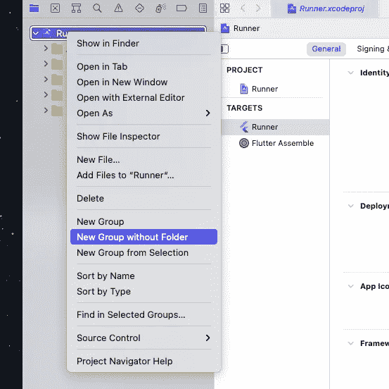
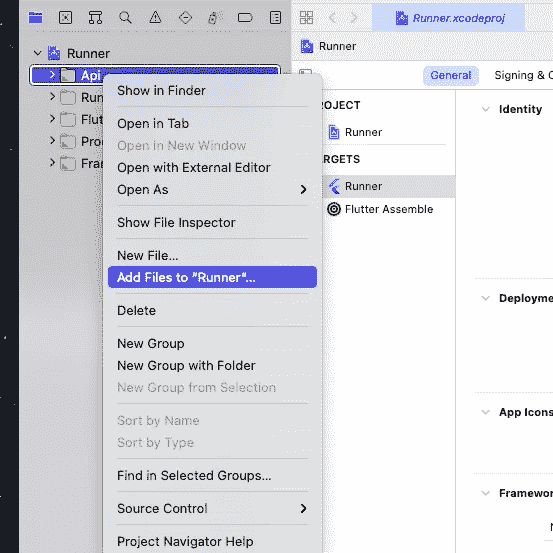
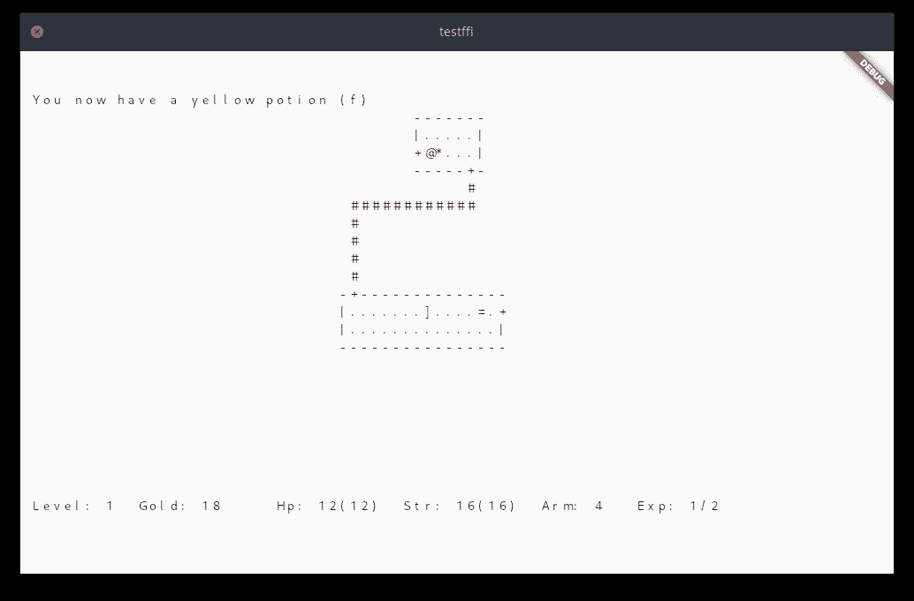

# 将现有的 C/C++应用程序移植到 Dart FFI

> 原文：<https://levelup.gitconnected.com/port-an-existing-c-c-app-to-flutter-with-dart-ffi-8dc401a69fd7>

# 挑战

*拿一个现有的 C/C++ app，用 Flutter 升级它的 UI，在所有平台(Linux、Windows、Android、macOS、iOS)上运行现代化的 app。*

我写了一个开源文本编辑器 [Ashlar 文本](https://github.com/icedman/ashlar-text)。它是用 Qt 框架用 C/C++写的。我之前做了几次尝试让 app 跨平台，包括在移动设备上运行。我已经放弃了 Qt，尝试了 Curses，甚至制作了自己的基于 SDL 的 UI 框架。我在这方面取得了一些成功(见 [TAshlar](https://github.com/icedman/tashlar) ，它既可以在终端上运行，也可以在基于 SDL 的窗口上运行)——但仍然没有稳定的、值得发布的移动应用。

我准备放弃跨平台的想法和 Ashlar Text Android。但是后来我发现了 Flutter UI。Ashlar 文本现在在 PlayStore 中的名称是 [Ashlar 代码](https://play.google.com/store/apps/details?id=com.munchyapps.ashlar.lite)。编辑器代码、目录和文件管理、git 集成、sftp、vscode 兼容语法突出显示和主题化都在本机 C/C++中运行。但是 butter smooth UI 呈现都是扑扑的。



ashar Text(Linux)——下载 Ashlar 代码，看看它是如何在 Android 上运行的

因此，我们的挑战——将一些古老的应用移植并运行到新平台，尤其是移动设备上——将是一项可行且有趣的工作。

# 我们的目标—移动领域的 Rogue 5.4

github 中有许多 C/C++开源应用程序，它们只是乞求被移植到移动平台上。但可能没有一个应用程序的用户界面比基于诅咒的更古老。一款经典的地牢爬行游戏《盗贼》是一个很好的升级选择。


流氓档案截图

我们应该能够做到以下几点:

1.  将地牢爬虫《流氓》——所有奇幻角色扮演游戏的祖母——移植到各大平台；
2.  用 Flutter 渲染它的 UI；
3.  它必须可以在手机上玩——有虚拟键盘和触摸界面；
4.  可选:在 Google PlayStore 发布应用；
5.  可选:控制台文本用户界面看起来太过时了——用一点点图形增加应用程序的趣味；

# 重要的事情先来

*学点新东西——Dart FFI*

在我们超越自我之前，我们必须首先解决我们即将面临的障碍。扑是用 Dart 写的。*注意，Flutter 是 UI 框架——Dart 是 Flutter 中使用的语言。*虽然 Dart 语言看起来非常类似于 C 和 C++，但我们必须找到一种方法将我们用 C/C++编写的代码与 Dart 语言连接起来。

Flutter 为此提供了一个包— FFI。 *FFI* 代表 [*对外函数接口。*](https://en.wikipedia.org/wiki/Foreign_function_interface) 我们将在这里学习如何使用它。

在 Flutter 中有一种调用原生代码的官方方式——[使用 dart:ffi](https://docs.flutter.dev/development/platform-integration/c-interop) 绑定到原生代码。这包括创建一个在你的 Flutter 应用上使用的 Flutter 插件。如果你有一个基于 Flutter 的应用程序，并且想用本地代码扩展它的功能，你可能更喜欢这条路。或者如果你需要创建一个像 SQLite(用 C 语言编写)这样的插件来添加任何 Flutter 应用程序数据库功能。然后把插件分享给全世界。

然而，我们现在的概念是反过来的。我们有 C/C++或原生应用程序。而且我们想用 Flutter 升级它的 UI。在某种意义上，Flutter 本身仅仅是我们的 C/C++应用程序的 UI 插件。

所以在这里，我们将以稍微不同的方式来处理 *FFI* 。

# 对外函数接口

FFI 允许我们将 C/C++代码绑定到 Dart——或者将本机函数映射到 Dart 函数。它为两种语言提供了相互交流的途径。

我们的目标是跨平台开发的圣杯——Linux、Android、Windows、macOS、iOS。每个平台构建环境都有自己的细微差别。Linux 使用 CMake 进行编译器配置。在 Android 中，我们有 grad le——幸运的是——可以将 CMake 作为外部构建。Windows 还使用 CMake 来配置 Visual Studio 生成工具。在 macOS 和 iOS 中，我们会遇到 Xcode。

在一个普通的 Flutter 应用程序中，这些都无关紧要。CMake、Gradle、Xcode——这些由 Flutter 的构建环境负责。我们简单的称 *flutter build linux 或者 flutter build macos。但是既然我们足够大胆地让我们的 C/C++代码跳动起来，我们将不得不熟悉一些新的构建设置和调整。*

# Linux 上的 FFI

我们将首先为 Linux 构建。Linux 中的 Flutter 构建系统使用 CMake。

如果没有 Linux 系统，你可以从 Windows 开始，但是一定要通读这个 Linux 指南。如果您的 Linux 系统也有 Android 构建环境，我们将能够很容易地设置 Android 构建。

首先创建“Hello Word”Flutter 应用程序:

```
flutter create testffi --platforms=linux,android,macos,windows
```

*或者，你可以复制文章的* [***示例应用程序***](http://github.com/icedman/flutter_ffi_test) *，在通读时浏览代码。*

在项目文件夹中创建一个目录 *libs* 。这是我们的本地代码将驻留的地方。我们称之为“*库*，因为我们也可以在这里添加其他第三方代码或库。

创建下一个文件 *CMakeLists.txt.*

```
[testffi/libs/CMakeLists.txt](https://github.com/icedman/flutter_ffi_test/commit/d25083be729cc2a0dbbaa406784b21adca82597d#diff-8f9a4b3c1e71669e52d39efa0f2d810e010fa1a95aad7c9d641aa6785ed09f88)
```

添加以下几行:

```
cmake_minimum_required(VERSION 3.10)                         project(api LANGUAGES CXX C) add_library(api
  SHARED
  ./api.cpp
)
```

这里，我们告诉 CMake 构建我们的共享原生库，名为 ***api*** *。*它将被构建为 *libapi.so.*

创建 *api.cpp* ，它将包含我们的 C/C++代码。首先，使用以下示例:

```
// testffi/libs/api.cpp#define EXPORT extern "C" __attribute__((visibility("default"))) __attribute__((used))#include <cstring>EXPORT
int add(int *a*, int *b*) {
   return a + b;
}EXPORT
char* capitalize(char **str*) {
   static char buffer[1024];
   strcpy(buffer, str);
   buffer[0] = toupper(buffer[0]);
   return buffer;
}
```

导出定义允许我们用 Flutter/Dart 使用的 C 风格符号导出我们的 C++代码。

作为例子，我们有两个简单的本地函数——*add*，它接受两个整数作为参数，将这两个数字相加，并返回一个整数；另一个*大写*，它接受一个 char*字符串作为输入，操作该字符串，并返回一个 char*字符串。

编辑 *linux/CMakeLists.txt* 来添加我们新创建的子目录*。/libs* 。

```
set(CMAKE_INSTALL_RPATH "$ORIGIN/lib")...# add this line
add_subdirectory("./libs")
```

重要提示:我们在项目或根目录中创建了我们的 *libs* 文件夹，这样就可以很容易地从其他平台设置中访问它。但是，在 CMake 中添加子目录要求该目录是源树的一部分。

```
cd linux
ln -s ../libs ./libs
```

这创建了一个从 *testff/linux/libs 到 *testffi/libs* 目录的符号链接。这满足了 CMake 的要求。*

或者，您可以直接在 *testffi/linux —* 下创建 *libs* 文件夹，但是您必须更新 *CMakeLists* 文件中的所有相对路径。

# *先造*

如果我们运行 *flutter build linux* ，作为构建过程的一部分，我们的 *api* 库现在将被构建为 *libapi.so* 。输出将为:

```
testfii/build/linux/x86/release/libs/libapi.so
```

我们需要这个 *libapi.so* 文件位于 *bundle* 目录中，这样我们的库就可以很容易地被定位和加载。所以我们进一步修改 *linux/CMakeLists.txt* :

```
# === Installation ===...# add this line at the very end of the install commands
install(FILES ${PROJECT_BINARY_DIR}/libs/libapi.so DESTINATION "${INSTALL_BUNDLE_LIB_DIR}" COMPONENT Runtime)
```

这将把我们的 *api* 库复制到每次成功构建的正确位置。如果我们再次运行构建我们的 *libapi。*所以会被正确复制:

```
testffi/build/linux/x86/release/bundle/lib/libapi.so
```

# 快速回顾

我们已经构建了我们的 *libapi.so* 。到目前为止一切顺利。以下是我们刚刚所做工作的总结:

1.  创建一个 *libs* 文件夹来保存我们的本地 C/C++代码。目前我们只有*libs/API . CPP；*
2.  创建一个 *libs/CMakeLists.txt* 来指导 CMake 如何构建我们的名为 *api 的原生库；*
3.  修改 *linux/CMakeLists.txt* 将我们的库包含在 linux 构建过程中，并将输出库 *libapi.so* 复制到正确的位置；

*简单如 1，2，3。*

# 从 Flutter/Dart 调用本机 C/C++

在我们继续之前，我们将 *ffi* 包添加到我们的项目中。

```
flutter pub add ffi
```

修改 *lib/main.dart* ，添加如下代码:

```
import 'dart:ffi';
import 'package:ffi/ffi.dart';

class FFIBridge {static bool initialize() {
   nativeApiLib =(DynamicLibrary.open('libapi.so')); // android and linux final _add = nativeApiLib.lookup<NativeFunction<Int32 *Function*(Int32, Int32)>>('add');
   add = _add.asFunction<int *Function*(int, int)>(); final _cap = nativeApiLib.lookup<NativeFunction<Pointer<Utf8> *Function*(Pointer<Utf8>)>>('capitalize');
   _capitalize = _cap.asFunction<Pointer<Utf8> *Function*(Pointer<Utf8>)>();
   return true;
}static late DynamicLibrary nativeApiLib;
static late Function add;
static late Function _capitalize;static String capitalize(String *str*) {
   final _str = *str*.toNativeUtf8();
   Pointer<Utf8> res = _capitalize(_str);
   calloc.free(_str);
   return res.toDartString();
}}
```

上面的代码定义了一个类 *FFIBridge。*这是本地代码绑定或映射到 Dart 的地方。FFIBrdige 有一个静态函数 *initialize* ，我们在运行应用程序时调用它。

```
void main() {
   FFIBridge.initialize();
   runApp(const MyApp());
}
```

1.  *初始化*函数加载我们的库 *libapi.so*

```
nativeApiLib = DynamicLibrary.open('libapi.so')
```

2.然后它查找我们的本地函数 *add:*

```
final _add = nativeApiLib.lookup<NativeFunction<Int32 *Function*(Int32, Int32)>>('add');
```

3.这将返回对将映射到 dart 函数 FFIBridge.add 的本机函数的引用—参见类成员变量*静态后期函数 add*

```
add = _add.asFunction<int *Function*(int, int)>();
```

现在我们有了一个本地函数到 Dart 函数的绑定。我们现在可以在 Dart 代码的任何地方调用 *int FFIBridge.add(int，int)* 函数。

*再简单如 1、2、3。*

对原生函数*大写进行类似的处理。*然而，当我们将字符串参数传递给本机函数时，我们需要一个包装函数来将 Dart *字符串*转换为*指针< Utf8 >* 。并将返回的原生字符串*指针<Utf8>转换回 Dart *字符串。**

```
static String capitalize(String *dart_str*) {
   ... // convert dart_str
   _res_native_str = _capitalize( _native_str ) 
   ... // convert _res_native_str
   return _res_dart_str
}
```

# 构建并运行

```
flutter build linux -v
```

我们的本机函数调用在起作用:

```
Column(children: [
   Text('capitalize flutter=${FFIBridge.capitalize('flutter')}'),
   Text('1+2=${FFIBridge.add(1, 2)}'),
]);
```



我们 Linux 中的 Flutter 应用程序

# Android 上的 FFI

如果您正确地遵循了 Linux 指令，并且您的 Linux 应用程序可以正确地调用本机函数，那么 Android 步骤将会非常非常快:

修改*Android/app/build . gradle:*

```
android { externalNativeBuild {
        cmake {
            path "../../libs/CMakeLists.txt"
        }
    } 
```

我们简单地将 *externalNativeBuild* 定义添加到 Gradle 构建配置中。它指向我们为 Linux 编写的同一个 *CMakeLists.txt* 文件。

```
flutter build apk -v
```

你现在有了一个带有本地 C/C++调用的 Flutter Android 应用程序。

# 源代码

对于那些跳过了所有的剪切和粘贴，但希望看到应用程序实际构建和运行的人:

```
git clone [https://github.com/icedman/flutter_ffi_test/](https://github.com/icedman/flutter_ffi_test/)
cd flutter_ffi_test
flutter pub get
flutter run -v
```

# Windows 上的 FFI

CMake 也用于 Windows 的构建系统。设置类似于 Linux，但有一些小的不同。

首先，我们没有像在 Android 中那样使用 CMakeLists.txt，而是修改了*testffi/windows/runner/cmakelists . txt。*在最后添加了我们的库配置:

```
add_library(api
   SHARED
   ../../libs/api.cpp
   ../../libs/exports.def
)
```

相对路径不同于 Linux CMakeLists，但是它们指向完全相同的 C++文件。这将产生这样的效果:我们的 *api* 就构建在我们的应用程序可执行文件旁边。与 Linux 不同，Windows 应用程序目录结构没有*捆绑包*或*捆绑包/库*目录。我们的库 Windows 上的*api.dll*——应该位于与我们的 *testffi* 可执行文件相同的目录中。

```
testffi/build/windows/runner/api.dll
testffi/build/windows/runner/testffi.exe
```

第二个区别是 *exports.def* 文件。在 *libs* 文件夹中创建该文件，内容如下:

```
LIBRARY api
EXPORTS
    add
    capitalize
```

我们想要导出的每个新函数都应该在 *exports.def* 文件中定义。

并且还要修改 *api.app* 导出定义:

```
#ifdef WIN32
   #define EXPORT __declspec(dllexport)
#else
   #define EXPORT extern "C" __attribute__((visibility("default"))) __attribute__((used))
#endif
```

这些变化将正确地暴露我们的库—*api.dll 的原生函数。*

我们还应该更新我们的 *FFIBridge* 类:

```
nativeApiLib = Platform.isMacOS || Platform.isIOS ? DynamicLibrary.process() // macos and ios
: (DynamicLibrary.open(Platform.isWindows // windows
? 'api.dll'
: 'libapi.so')); // android and linux
```

Linux 和 Android 加载 *libapi.so，* Windows 加载*api.dll。*我们的 macOS 和 iOS 设置将直接从 *runner* 应用程序库进程加载本机函数符号，而无需加载外部库。

```
flutter build windows -v
```

# macOS 和 iOS 上的 FFI

macOS 和 iOS 中的构建系统由 Xcode 处理——没有 CMake。我们将本机 C/C++代码直接整合到 *Runner* 应用中。打开*MAC OS/runner . xcode proj .*

添加新群组，而不创建新文件夹。称之为 *libs。*



添加我们的 *api.cpp.*



将我们的文件添加到新的 Api 组中

这对于 macOS 来说出奇的简单。对于 iOS 构建配置，我们遵循相同的方法。*免责声明:我其实还没有测试过 iOS。*

```
nativeApiLib = Platform.isMacOS || Platform.isIOS ? DynamicLibrary.process()
```

本机函数的查找方式不同，因为它们不是从单独的动态库中加载的，而是从 Flutter *Runner* 库本身加载的。

```
flutter build macos -v
```

# 快速回顾

1.  我们使用 dart:ffi 包加载并绑定我们的本地库到 Dart；
2.  Android 设置就是在 gradle 中添加一个 *externalNativeBuild* 定义，指向并重用 Linux 中使用的*CMakeLists*；
3.  Windows 设置略有不同——我们修改了*windows/runner/cmakelists . txt*,并在那里添加了我们的库构建配置；
4.  Windows 需要一个 *exports.def* 文件；
5.  Windows 也有不同的导出函数签名——*_ _ declspec(DLL export)*——用于动态链接库(DLL)；
6.  macOS 和 iOS 查找原生函数略有不同。没有 CMake——但是处理 Xcode 并不困难；

# 一次编写，随处运行

我们已经建立了一个 Flutter 应用程序，它调用本机 C/C++代码，可以在 Linux、Windows、Android、macOS、*(还有待完成和确认——iOS)上运行。*

在我使用 Flutter 之前，我发现单独使用原生外部构建来设置、构建和测试 Android 非常麻烦。这篇文章展示了使用 Flutter 作为我们的*构建环境*可以减轻很多痛苦。我们已经简单地通过编辑几个文件介绍了几个平台。现在，我们的构建环境已经设置好了，可以用于 Flutter/Dart + Native C/C++，我们应该——至少在理论上——确信我们的代码可以在我们所有的目标平台上运行。我们现在应该能够真正地*写一次就跑一次了。*

当我们在文章的第二部分移植和构建我们的 Rogue 5.4 应用程序时，我们将测试这个理论，并完成我们的挑战。



预览— Rogue 5.4 on Flutter

*未完待续* [*续*](https://medium.com/@marvinsanchez_43796/port-an-existing-c-c-app-dungeon-crawler-rogue-to-flutter-with-dart-ffi-a701284aa289)*……*