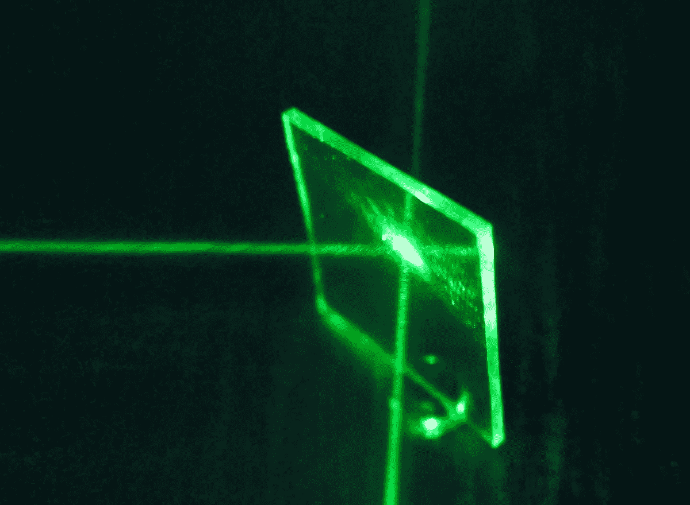
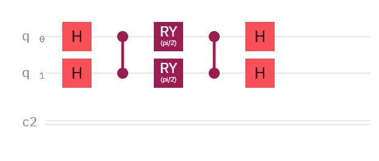
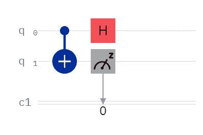

# 便携式量子计算

> 原文：<https://levelup.gitconnected.com/portable-quantum-computing-877e3438adee>

[https://pix abay . com/photos/laptop-table t-smart phone-hand-3423713/](https://pixabay.com/photos/laptop-tablet-smartphone-hand-3423713/)

# 跨量子位技术设计算法

在这篇文章中，我将解释计算机科学对可移植性的定义，并将该术语定义为跨不同量子位技术运行量子算法。例如，无论你的设备是智能手机还是台式机，无论你的操作系统是 Windows 还是 Linux，无论你使用的是 Wi-Fi 还是数据，你都可以阅读这篇文章；它是便携式的。同样，这篇文章是关于运行量子算法的，不管你的量子比特是光子、俘获离子、超导量子还是其他什么。

本文并不打算成为一个全面的教程。相反，我的目标是分享这种意识，无论你是否使用某种高级框架，这都是可能的。

[https://commons . wikimedia . org/wiki/File:Flat _ metal-coated _ beam splitter . png](https://commons.wikimedia.org/wiki/File:Flat_metal-coated_beamsplitter.png)

## 分束器

顾名思义，分束器将一束光分开。对于非光学系统，我们可以使用这个概念来分割概率。对于阱离子系统，有一个门叫做可重构分束器(RBS)，我不能在这里展示，因为我没有访问阱离子系统的权限。但是，当我发现这一点时，我想知道如何在 IBM Quantum 中模拟它。毕竟 IBM Quantum 没有原生的 RBS 门。

可重构分束器的超导量子比特实现

最简单的实现是在初始化后对 q0 应用 Pauli-X 门。让 q1 处于基态。仅有的两个参数是 RY 门的旋转角度。就像分裂一束光子一样，你的测量将显示你基本上把 q0 分裂成了 q0 和 q1。如果从 ID、RY(pi/2)和 Y 门开始，调整这个“门”是相当直观的。当然，您可以微调输入状态和 RY 门，但这超出了本文的范围。

哈达玛试验

## 状态重叠

现在，让我们反过来。让我们使用哈达玛测试来确定两个量子态，在这种情况下 q0 和 q1，是否相同。如果它们是相同的，我们将测量 0。如果它们相距最远，比如|0 >和|1 >，我们将测量 1。对于每一个其他组合，较高百分比的 0 表示接近(相似)，较高百分比的 1 表示距离(不同)。

【https://commons.wikimedia.org/wiki/File:HOM_video.gif 

我们可以用洪-欧-曼德尔干涉仪在光学上做同样的事情。如果两个相同的光子从两个不同的侧面进入，它们将一起离开。这相当于用哈达玛测试测量 0。如果它们不相同，光子可以从它们原来的一侧出射，交换位置，或者一起出射。这实际上比哈达玛测试更适合于[交换测试](/comparing-quantum-states-c6445e1e46fd)，但是交换测试使用安西拉量子位，所以与哈达玛测试的两个量子位相比，你更有可能找到洪-欧-曼德尔干涉仪的两侧。

## 结论

虽然我只提供了两个例子，但你可以看到如何将光学概念应用于俘获离子和超导 transmon 系统，以及如何将超导 transmon 概念应用于光学系统。因此，即使没有高级框架，也有可能将你的量子算法不仅“移植”到其他提供商，还可以移植到非常不同的量子位。

## 收场白

我想知道有多少人读了这篇文章的标题，担心它可能是关于量子笔记本电脑的。这种想法很有趣，我可能还会就此写一篇讽刺文章。