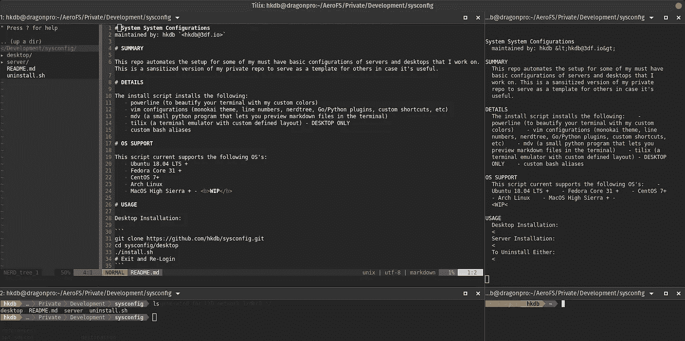

# 便携式外壳和 VIM 定制

> 原文：<https://levelup.gitconnected.com/portable-shell-and-vim-customization-9c054d80f5ca>

## 几分钟内完成部署和回滚！

如果您像我一样花大量时间使用终端和 vim，那么您可能有一个很长的、与众不同的别名和定制集，以便让 shell 和 vim 的外观和行为完全符合您的要求。根据是工作站还是远程服务器，您还可以进行不同的定制。您可能还希望那些定制配置可以很容易地部署和回滚，以防万一，如果您说，暂时在其他人的机器上工作，而不是在之后留下某些配置，如您的别名。有很多处理这个问题的回复，但是我想要一些超级简单的，真正属于我自己的东西；做我想做的事。

因此，与其在数百万个回购协议中寻找可能适合我的，然后解析一切进行定制，我更快地创建了自己的回购协议，并编写了自己的 bash 脚本。周末，我决定修改我的私人回购协议，然后今天在我的 [GitHub](https://github.com/hkdb/sysconfig) 上公开分享，以防对其他人有所帮助。

这个脚本(以及相关的发行版特定脚本)的作用是在 Debian、Ubuntu、Fedora、CentOS 或 Arch 上自动安装和回滚以下配置:

*   [电力线](https://github.com/powerline/powerline)(用自定义颜色美化你的终端)
*   [vim](https://www.vim.org/) 配置(monokai 主题、行号、nerdtree、Go/Python 插件、自定义快捷方式等)
*   mdv (一个小的 python 程序，可以让你在终端中预览降价文件)
*   [tilix](https://gnunn1.github.io/tilix-web/) (具有自定义预定义布局的终端仿真器)——仅限桌面
*   自定义 bash [别名](https://linuxize.com/post/how-to-create-bash-aliases/)

您可以看看它的运行情况:

参见[asci NEMA](https://asciinema.org/a/WbyPfyLxKfvrSezNpsMUjFwgr)处的高分辨率

正如您从上面的演示中看到的，它实际上只是一个要部署的 liner 和一个要回滚的 liner。uninstall.sh 脚本还会分解。bash_aliases 文件，以便在回滚中有一个小的附加安全层。有关如何使用这个回购的更多信息，请访问我的 [GitHub 页面](https://github.com/hkdb/sysconfig)。