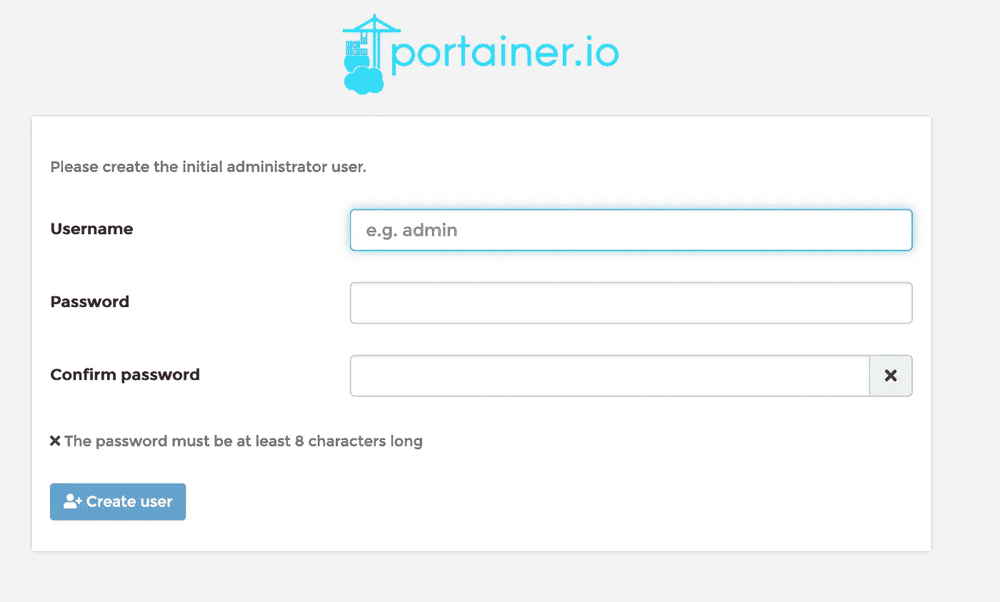
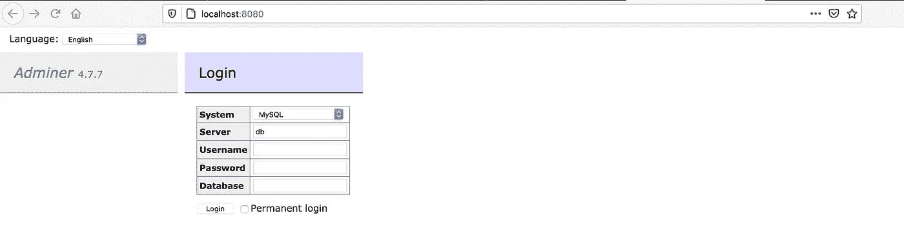

# portainer——管理 Docker 的简单方法

> 原文：<https://levelup.gitconnected.com/portainer-the-easy-way-to-manage-docker-a982a17146c1>


仍然有很多开发人员和 IT 专业人员没有使用 Docker 的经验。我个人的经验是，他们认为 Docker 很复杂，很难管理。

在本教程中，我将演示如何快速启动并运行 Docker，以及如何使用基于 Web 的图形管理工具 Portainer 来简化 Docker 管理。

# Docker 与虚拟机

在我们开始之前，快速了解一下 Docker 和虚拟机之间的区别可能会有所帮助。如果你已经熟悉 Docker，跳过这一部分。

虚拟机是一个封装的操作系统，运行在另一个操作系统之上。虚拟机使用底层硬件的内存、处理器和磁盘资源。这里的关键点是，虚拟机中运行的操作系统需要大量的主机资源来运行。在一台典型的 16GB i5 计算机上，您将很难同时运行五台虚拟机。即使他们没有运行任何应用程序，您也会很快看到底层操作系统的性能显著下降，虚拟机开始冻结。

**另一方面，Docker 容器通过底层操作系统来利用硬件资源，就好像它们是一个已安装的应用程序一样(这是一个非常简单的描述)。与 VM 相比，用于构建 Docker 容器的映像非常小，通常只有 40 或 50 MB。由于 Docker 容器中没有完整的操作系统需要维护，因此内存和处理器资源的使用率通常非常低。我经常在我的 16GB Mac Book Pro 上运行 20 多个容器。使用虚拟机是不可能的。**

# 便携式集装箱

默认情况下，我们通过命令行管理 Docker。Portainer 为管理 Docker 的各个方面提供了一个优秀的、信息丰富的用户界面。It 图表和仪表板提供了容器资源使用情况的实时图表。只需点击几下鼠标，就可以启动和管理容器和堆栈。

# 安装 Docker

## 在 Windows 上安装

理想情况下，您需要运行 Windows 10 Pro 才能利用 Windows Linux 子系统。如果你使用的是一台很多选项都被禁用的工作电脑，你可能会很纠结，但是看看你能走多远，然后在需要的时候向你的 IT 管理员寻求帮助。

从以下网址下载 docker。选择稳定版。

 [## 面向 Windows 的 Docker 桌面— Docker Hub

### 在 Windows 上开始使用 Docker 的最快和最简单的方法

hub.docker.com](https://hub.docker.com/editions/community/docker-ce-desktop-windows/) 

运行安装程序。确保选择 WSL(Linux 的 Windows 子系统)


安装完成后，重新启动 Windows。

一旦系统重新启动，您可能会看到安装更新的 WSL 2 Linux 内核的提示。只需点击链接并按照说明进行操作。


如果您得到一个关于 WSL 没有被启用的错误。尝试以下命令。

以管理员身份打开 PowerShell 并运行

```
dism.exe /online /enable-feature /featurename:Microsoft-Windows-Subsystem-Linux /all /norestart
```

## 在 Linux 上安装

Linux 是 Docker 的首选环境，因为它在本地环境中提供了最佳性能。

由于 Linux 的许多发行版和您可能运行它的各种平台，您必须按照 docker 网站上的说明进行安装。[https://docs.docker.com/engine/install/](https://docs.docker.com/engine/install/)在这个网页上有一些链接，可以带你找到具体的发行说明。

## 在 macOS 上安装

您可以通过访问以下网站下载并安装 Docker desktop for Mac。[https://hub . docker . com/editions/community/docker-ce-desktop-MAC/](https://hub.docker.com/editions/community/docker-ce-desktop-mac/)

一定要拿到稳定版。


下载后，打开。dmg 安装程序文件，拖动应用程序文件夹中的 Docker 应用程序，如上图所示。

# 安装集装箱

无论您运行的是哪种操作系统，从现在开始的命令都是一样的。当我提到打开终端时，我指的是 windows 上的命令提示符。

打开一个终端，运行以下命令创建一个

```
docker volume create portainer_data
```

上述命令在您的磁盘上创建一个数据卷，Portainer 将使用它来保存配置数据。如果没有它，数据将存储在容器中，并在每次容器重新启动时丢失。

接下来，运行以下命令下载并运行 Portainer 映像，并启动 Portainer 容器。

```
docker run -d -p 8000:8000 -p 9000:9000 --name=portainer --restart=always -v /var/run/docker.sock:/var/run/docker.sock -v portainer_data:/data portainer/portainer
```

# 连接到 Portainer

安装 Portainer 很容易，连接到它也很容易。打开网络浏览器并访问`[http://localhost:9000](http://loaclhost:9000)`



默认用户名是`admin`，因为这是您第一次登录，系统会要求您创建一个新密码并进行确认。

在下一个屏幕上，选择`Local`并点击`Connect`


# Portainer 主屏幕

Portainer 知道的 Docker 实例显示在屏幕的中央部分。这个时候只会有一个，“本地”。左边是一个菜单，提供了你在 Docker 命令行中会有的许多选项，还有更多。


单击本地 Docker 实例，查看显示当前在 Docker 中运行的内容的高级概述的仪表板。


除非你已经在使用 Docker，否则你不会有太多的运行时间。

# 添加新图像并启动容器

让我们启动并运行一个 MariaDB Docker 容器，看看工作流和它有多简单。

首先要做的是创建一个将保存数据库数据的卷—单击左侧菜单面板中的 Volumes。

## 创建卷

点击`Add volume`


将卷命名为 MariaDB，然后单击`Create the volume`

## 创建一个 MariaDB 容器

点击左侧菜单面板中的`Containers`

点击`Add container`按钮

命名容器`MariaDB`

在图像文本框中输入`mariadb:latest`


单击发布新的网络端口


输入`host`和`container`的 **3306**


在`Advanced container settings`页面底部，点击`Volumes`，然后点击`map additional volumes`


将以下内容添加到`container`和`volume`

*   **容器:**
*   **卷:**从下拉列表中选择您之前创建的 MariaDB 卷，该卷将被命名为`MariaDB — local`


最后，选择`Env`选项卡并点击`add enviroment variable`


我们需要告诉 MariaDB 应该设置什么样的`root`用户密码。我们通过提供一个环境变量来做到这一点。如下填写`name`和`value`文本框

*   **名称:**
*   **值:** `password`请使用更合适的密码！


要完成 MariaDB 容器的配置，单击`Deploy the container`按钮。

过一会儿，你将被带回到`container list`，你应该看到你的`MariaDB`容器处于**运行**状态


## 创建管理员容器

我们可以通过控制台连接到 MariaDB 容器，并在命令行上发出 MySQL 命令。更好的方法是使用图形界面。我更喜欢`adminer`，我们现在将把它添加为一个容器。

确保您仍在`container list`屏幕上，点击`Add container`按钮。

将容器命名为`Adminer`，并输入`adminer:latest`作为图像。


在`Network ports configuration`部分，点击`publish a new network port`

为主机输入`8080`，为容器输入`8080`


我们不需要做任何其他的改变。点击`Deploy the container`

# 检查一切正常

打开浏览器并导航至`[http://localhost:8080](http://localhost:8080)`

您应该会看到管理员登录屏幕



在我们尝试连接之前，请注意您不能使用`localhost`进行`Server`设置。为什么？因为 Adminer 运行在自己的容器中，所以 localhost 引用**它的**容器。相反，您需要提供您的计算机的 IP 地址。我的情况是 192.168.30.100。

用户名将是 root，密码也是您设置的`MYSQL_ROOT_PASSWORD`的值。


现在点击`Login`


恭喜你，你的生活将不再一样！:-)能够在不影响底层操作系统的情况下快速打开 Docker 中的容器，这带来了很多机会。

Portainer 中包含了许多预构建的容器模板。如果你点击左边工具栏的`App Templates`，你会发现一些有趣的应用。

最终，你会找到一个不包含在应用模板中的容器。你应该看的第一个地方是 https://hub.docker.com/。

# 资源监控

让我们检查 MariaDB 正在使用的资源。点击左侧菜单中的`Containers`。单击`Quick Actions`列中 MariaDB 旁边的小图表图标。


您将看到三个实时图表，分别是`Memory usage`、`CPU usage`和`Network usage`


# 检查日志

返回到`Containers`屏幕。单击`Quck actions`列中管理员容器旁边的`Document icon`。


您将看到的日志是 Adminer 的 PHP web 服务器日志。打开管理员网页 [http://localhost:8080](http://localhost:8080) 刷新屏幕。稍后，您将看到日志更新了最新的条目。


# 与 Docker 一起前进

Portainer 能做的远不止这些。在以后的教程中，我将研究 Docker 和 Portainer 的其他特性。要使用 Docker 的一些更高级的特性，即使有 Portainer 的帮助，你也需要更多关于 Docker 如何工作和 docker-compose 工具的知识。我建议你从参观 https://docs.docker.com/get-started/开始。

[](https://docs.docker.com/get-started/) [## 方向和设置

### 预计阅读时间:4 分钟欢迎！我们很高兴你想学习 Docker。此页面包含…

docs.docker.com。](https://docs.docker.com/get-started/) 

# 摘要

为了确保你不会错过我的任何教程，你可以点击[西蒙·卡尔](https://medium.com/u/4cb30a4e956d?source=post_page-----a982a17146c1--------------------------------)来关注我。

我希望你觉得这篇教程很有启发性，并且你学到了你所期望的东西。如果你喜欢，请在评论中告诉我，或者给我一些如何改进教程或写作风格的建议。