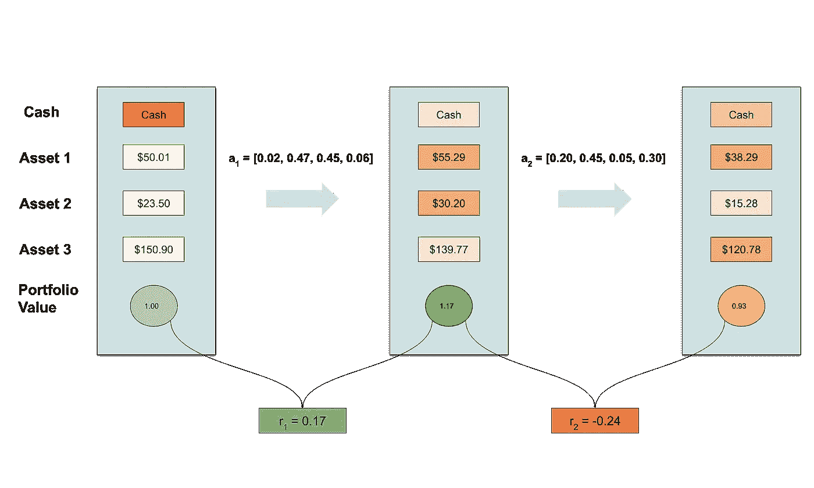
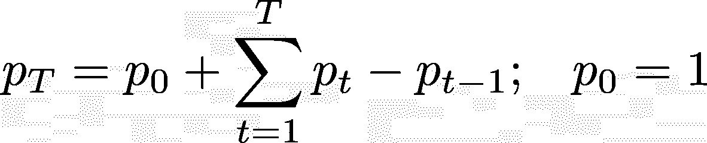
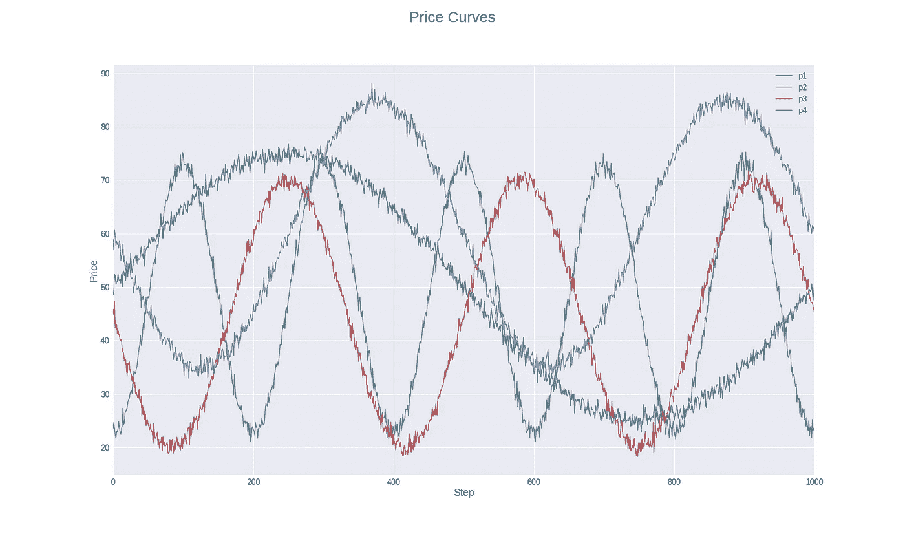
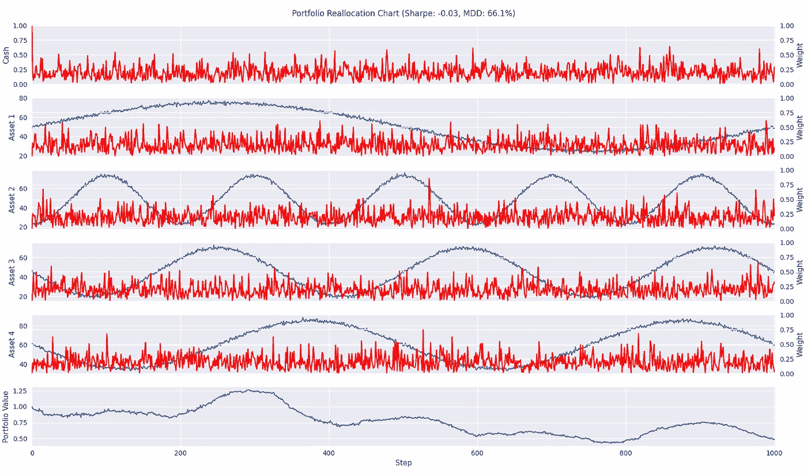

# 基于 TensorTrade 的投资组合配置(下)

> 原文：<https://levelup.gitconnected.com/portfolio-allocation-with-tensortrade-part-1-2-1d0c3b126bf6>

在本文中，我将在 TensorTrade 中制作一个不同类型的算法。如题所示，我将实现一个在每个时间步在资产组合中重新分配资金的环境。在我之前的[文章](/using-tensortrade-for-making-a-simple-trading-algorithm-6fad4d9bc79c)中，我使用正弦曲线来检查环境是否真的达到了预期的目标。我将在这里采用类似的方法。然而，我将通过在等式中注入一些随机性来增加价格曲线的复杂性。这一系列有许多主题，让我们开始吧！

> "没有一个聪明人每天都去尝试他前一天已经证明是错误的东西."
> ——詹姆斯·特鲁·亚当斯

# 环境

我所构建的环境受到了大约一年前我读过的一篇论文[的启发，这篇论文给出了一个投资组合配置环境的结构框架。虽然我不会完全按照本文所做的来构建，但是我会解释一下我在实现中所做的一些小的不同。关于行动方案，一切都是一样的。然而，与论文不同的是，我将奖励方案公式化为应用重新分配前后投资组合价值的差异。下图显示了转换的样子:](https://arxiv.org/pdf/1706.10059.pdf)

推移图

每个时间步的资金分配由现金和资产行上不同深浅的橙色表示。该图显示，当资金被分配给价格上涨的资产时，回报是正的，如果资金被分配给价格下跌的资产，回报是负的。记住这个图表，让我们开始构建组件。

## 行动方案

到目前为止，还没有任何一个 TensorTrade 行动计划涉及到对行动空间的具体要求。具体来说，TensorTrade 中显示的所有环境到目前为止一直使用离散的动作空间。例如，前一篇文章的动作空间是二进制的。然而，对于投资组合分配，行动空间是连续的。事实上，假设投资组合有 *m* 项资产，那么行动空间就是一个标准的[m-单纯形](https://en.wikipedia.org/wiki/Simplex)。以下代码是使用`gym.Space`接口实现`Simplex`动作空间:

行为空间

在行动方案中，投资组合权重和投资组合价值被更新以反映已经应用的行动。此外，计算中还包括佣金率，因此当资金被重新分配时，行动计划将产生成本。我添加了一个*交易剩余因子*，正如论文所称，这是一个考虑佣金成本的特定变量。

行动方案

## 奖励计划

代理的目标是最大化最终的投资组合价值，这可以分解为:

其中 *p(t)* 是时间步长 *t.* 的投资组合价值，由于最大化结果不依赖于添加到目标中的常数，我们可以将此目标表示为 t=1:T 的投资组合价值之间的差异之和，即算法的累积利润。在论文中，他们使用累积对数回报的平均值作为奖励。然而，我发现这种奖励对于训练策略和价值函数并不奏效。

奖励计划

## 观察者

对于观察者，我使用了一个包含三个组件的数据馈送: *state* 、 *obs* 和 *performance。**状态*保存关于环境变量的信息，以计算变化，将其带入下一步。 *obs* 产生与我将输入模型的内容相关的变量。最后，*性能*给出了渲染器用来渲染环境图像的变量。

由于有些特性需要一段特定的时间来预热，所以我向观察器添加了一个参数 *min_periods* ，以确保在代理开始交互时环境已经准备好。还有一个用于回看窗口大小的参数叫做 *window_size* 。以下代码是环境的观察者组件的实现:

观察者

## 特征

为了检查这个设置在行动和奖励方案方面的功能，我将使用具有不同位移和频率的正弦曲线来表示每个资产的价格。此外，我还从-10 到 10 的截尾正态分布中添加了随机噪声。

价格曲线

过去，环境中只包含简单的功能；然而，我将添加更复杂的设置。对于每种资产，我将添加以下三个特征:分数微分、相对强弱指数(RSI)和移动平均收敛发散(MACD)。

## 渲染器

要实现的最后一个组件是渲染器，它创建了整个剧集中代理决策的可视化。我将从这一集中收集的信息是，随着时间的推移，当与资产价格直接比较时，权重分布是什么样子。

## 把所有的放在一起

创建完所有部分后，我构建了一个函数，将所有部分组合起来，创建一个交易环境的实例。

环境创造

为了测试一切都正常运行，我在环境中使用从动作空间随机采样的动作进行了冒烟测试。

测试运行环境

投资组合再分配图表

# 结论

随着环境的建立和准备就绪，所有需要的是一个代理可以学习如何在这些价格曲线上分配资金。我将在本系列的第 2 部分讨论这一部分。下一篇文章将涵盖以下主题:

*   使用 Ray 库中的 PPO 算法，在 portfolio 环境中调整、训练和评估代理。
*   使用 PyTorch 创建一个自定义模型和动作分布，以插入到 Ray 中的 PPO 算法中
*   向 TensorBoard 添加自定义指标，以便在训练时跟踪代理的表现。

我希望你喜欢这篇文章，我期待在下一篇文章中见到大家，敬请期待！

## 密码

*   [Google Colab](https://colab.research.google.com/drive/13Jr5KHWdtqYgCt-9I4LNIZLD4qaty_eI?usp=sharing)

## 参考

*   蒋、、徐迪星、梁金军。"金融投资组合管理问题的深度强化学习框架."ArXiv.org(2017 年)。网络。【https://arxiv.org/abs/1706.10059】<[>。](https://arxiv.org/pdf/1706.10059.pdf)