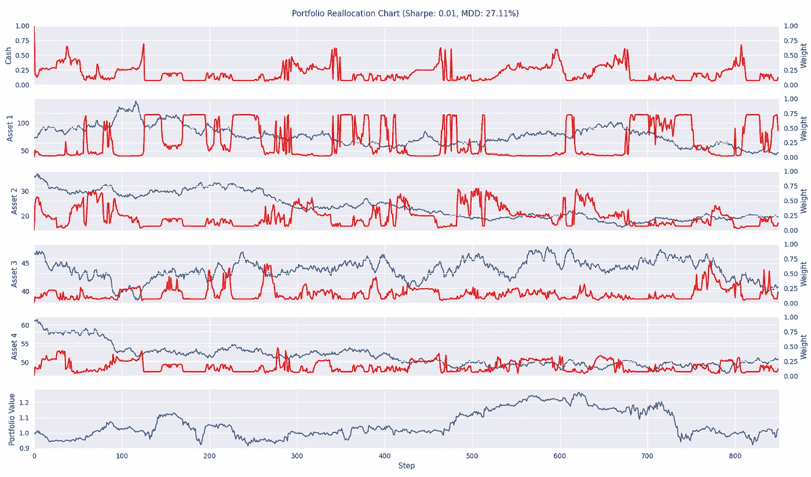

# 基于 TensorTrade 的投资组合配置(下)

> 原文：<https://levelup.gitconnected.com/portfolio-allocation-with-tensortrade-part-2-2-9ac30a6bcbfe>

在[的上一篇文章](/portfolio-allocation-with-tensortrade-part-1-2-1d0c3b126bf6)中，我讲述了如何使用 TensorTrade 库中提供的通用组件创建一个交易环境。本文将关注如何在构建的环境中调优、训练和评估代理，同时展示如何在 Ray 中创建定制模型和动作分布。不再拖延，让我们开始构建模型和动作分配吧！

# 光线分量

当使用 RL 环境时，定制培训过程的不同组件是很方便的。这是由于环境可能产生的数据类型、代理接收观察之前所需的预处理或探索过程的动作采样过程。Ray 很好地支持定制许多不同 RL 算法的能力。下图显示了 RL 算法的工作过程，涉及到制作算法的组件:

来源:射线文档

从图中可以看出，用户可以定制任何绿色的东西。我将使用近似策略优化(PPO)算法进行训练。因此，我们的目标是构建一个定制的模型和动作分布，用于与我们的环境进行交互。

## 模型

这个模型的实现很简单，并演示了将来如何修改自己的模型。对于像 DQN 这样的简单 RL 算法，在探索方法中没有选择。不像 DQN，PPO 在你可以使用的行动类型和探索方法上给了你更多的自由。模型输出与动作分布有直接联系。事实上，模型的输出被用作动作分布的参数。

行动分配探索

这使得代理能够保持接近确定性动作，同时保持探索其周围的局部区域的能力。下面是模型代码的实现:

## 动作分布

给定在投资组合中定义了 m 个资产，投资组合分配问题的动作空间是 m-单纯形。我们如何从这个探索空间中抽取动作样本？答案以[狄利克雷分布](https://en.wikipedia.org/wiki/Dirichlet_distribution)的形式出现。这个分布非常适合这个问题，因为它支持概率单纯形。

来源:[https://en.wikipedia.org/wiki/Dirichlet_distribution](https://en.wikipedia.org/wiki/Dirichlet_distribution)

要在 Ray 中实现这一点，需要几个方法:

*   `deterministic_sample`
*   `logp`
*   `entropy`
*   `kl`
*   `required_model_output_shape`

因为 Dirichlet 分布内置于 PyTorch 中，所以我们可以利用内置方法来实现该类。下面是基于 Ray 的`TorchDistributionWrapper`类构建的自定义动作分布的代码:

实现了模型和动作分布之后，是时候开始调整算法了。

## 调整

RL 算法面临的主要问题之一是在建立训练算法时选择超参数。我应该为多少个时代训练一个模型？批量应该是多少？在一个神经网络中应该使用多少个隐藏单元？幸运的是，有许多算法可以解决这个问题。在本教程中，我将使用基于群体的训练(PBT)算法。

调谐码

## 火车

培训将按照调优脚本的相同“调”进行😉。唯一的区别是将超参数设置为调整后的参数，并根据平均剧集奖励设置更高的停止阈值。

列车代码

从图表中，我们可以看到代理学会了如何成功地在环境中导航。有明显的低买高卖模式。也有代理人将资金分配给一种资产而不是另一种资产的时间点，因为价格在不同的方向移动。因为代理已经通过了我们给它的随机正弦曲线，让我们看看使用不同随机过程生成的价格曲线会发生什么。

## 评价

为了做一些启发式评估，我用多元几何布朗运动生成了价格曲线。要查看实现，请访问 [GitHub](https://github.com/mwbrulhardt/penv) 库。为该算法计算的两个指标是夏普比率和最大每日压降。

我用多元几何布朗运动的三种实现方式渲染了三个不同环境场景的图像。以下是三集样片中的图片:

样本第 1 集

样本第 2 集

样本第 3 集

三个样本的结果相当中性。夏普比率分别为-0.01、0.04 和 0.01。在大多数情况下，代理人没有赚或亏太多的钱。平心而论，这个代理并不是在这种环境中直接训练出来的，所以我并不指望它能做得非常好。

随机代理

值得注意的是，与随机代理相比，代理实际上表现良好。平均而言，随机代理的夏普比率为-0.06，MDD 为 42%。因此，代理必须学会一些东西，以退出环境收支平衡！

# 结论

在本系列中，我演示了用户如何定制 TensorTrade 组件来创建投资组合分配环境。此外，我们能够根据我们的期望定制 Ray 的组件。从本质上讲，这些教程是一个模板，用于结合使用 TensorTrade 和 Ray 来创建适合任何情况的特定需求的交易算法。最后，我总结了我们在本系列第 1 部分和第 2 部分中学到的所有东西。

## 我们学到了什么？

*   从 TensorTrade 通用组件构建一个定制的投资组合环境。
*   在 TensorTrade 中实现一个自定义的连续`ActionScheme`。
*   在 Ray 中实现自定义模型和动作分布。
*   实现使用多元几何布朗运动来模拟价格的流。
*   使用 Ray 的调整库，通过 PPO 算法在自定义环境中执行超参数调整。
*   计算剧集的两个不同指标。

期待以后能出新的教程，下次和大家再见！

## 密码

*   [GitHub](https://github.com/mwbrulhardt/penv)

## 参考

*   蒋、、徐迪星、梁金军。"金融投资组合管理问题的深度强化学习框架."ArXiv.org(2017 年)。网络。<[https://arxiv.org/abs/1706.10059](https://arxiv.org/abs/1706.10059)T5。