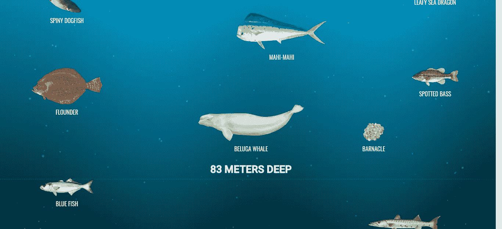
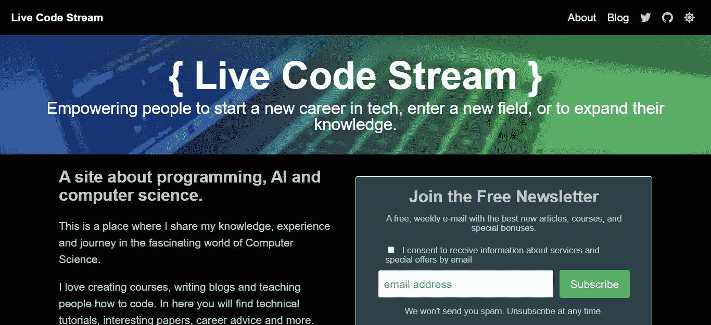
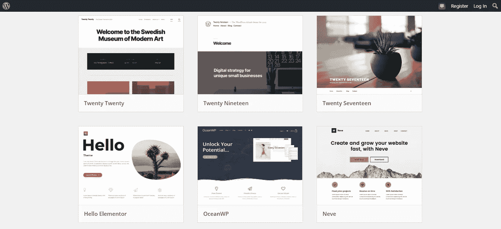
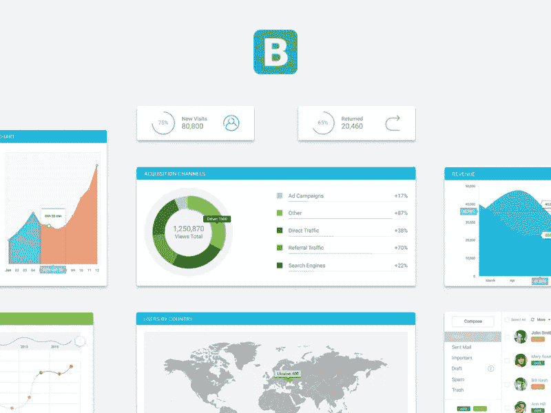
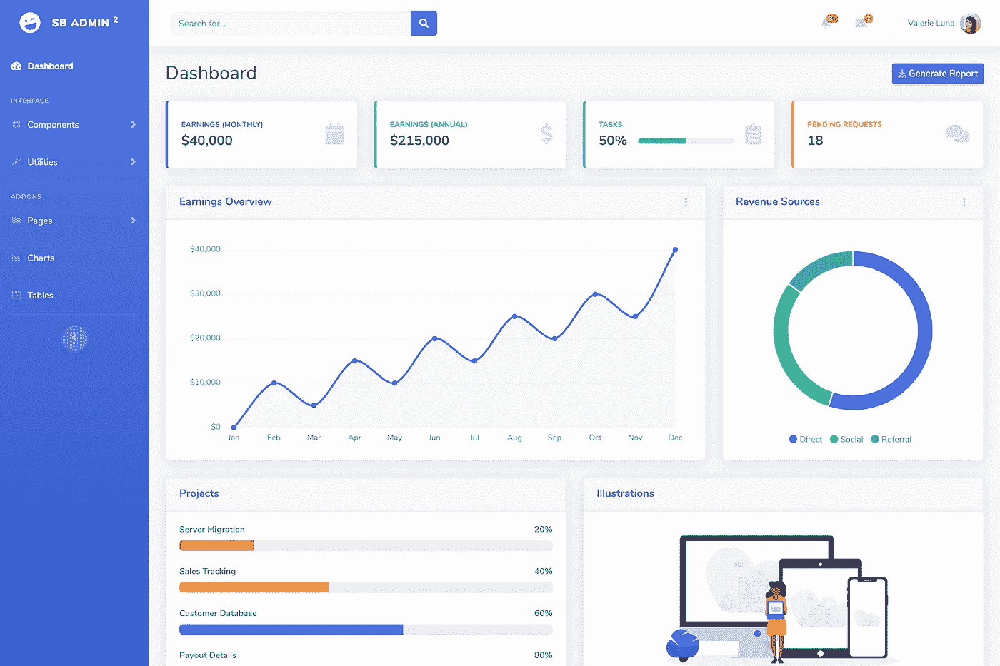
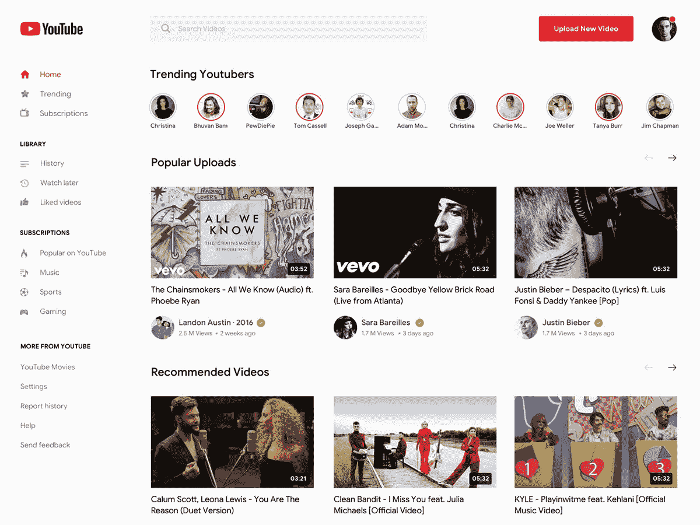

# 设计师必备的作品集

> 原文：<https://levelup.gitconnected.com/portfolio-must-have-for-a-designer-f2c17ca8e564>

## 投资组合系列

## 建立一个令人敬畏的设计组合和土地你的梦想工作

伊恩·施耐德在 [Unsplash](https://unsplash.com/s/photos/job?utm_source=unsplash&utm_medium=referral&utm_content=creditCopyText) 上拍摄的照片

作为一名**网页设计师**获得你的第一份有薪工作似乎是这个世界上最困难的任务。并不是因为你没有能力或者缺乏任何技术技能。相反，雇主对雇佣新人才有点犹豫。

但是，每个设计师都必须从某个地方开始。不是吗？

在这篇文章中，我将与你分享一些有趣的项目想法。这些项目将帮助你制作一个伟大的**网页设计作品集**。

现在你可能想知道拥有投资组合的好处是什么。基本上，它是用来向潜在客户展示你的技能。反过来，这使得你的第一份编程工作变得非常容易。

# 创造性思维

创造性思维示例

你不必总是设计一个传统外观的网站。有时候，跳出框框思考，运用你的网页设计技能进行创造性创新会更好。

例如，让我们看看尼尔·阿加瓦尔的这个[深海项目。](https://neal.fun/deep-sea/)

不像大多数商业网站，它没有货币价值。但是，这种项目肯定会吸引大量的观众。这意味着你将有更多的机会被雇佣。

我个人是尼尔的超级粉丝，并从他的项目中学习。在写这篇文章的时候，他已经发布了 20 个有趣且有创意的项目。《花比尔·盖茨的钱》、《深海》、《太空的大小》是我最喜欢的几部。你可以在 Neal.fun 网站上找到他所有的项目。

还有许多其他前端设计师花时间来展示他们的创造力。例如，看看罗比·莱昂纳迪的互动简历。

所以基本上，我想传达的想法是，你应该设计一些最终会给你的投资组合带来大量观众的东西。你吸引的眼球越多，你被潜在客户雇佣的机会就越大。

# 应用流行的网页设计

黑暗模式示例

你有没有注意到其他科技巨头(例如 Instagram、Twitter、WhatsApp 等)是如何？)现在在他们的应用程序中提供了一个黑暗模式。

2020 年，它就像是网页设计领域最潮流的概念。由于这是一个相对较新的概念，所以你仍然有机会为你的投资组合创建一个“在亮模式和暗模式之间切换”的项目。如果有人想在他们的网站上添加黑暗模式，那么你将是他们的首选。

同样，这些天，你也会看到带有**发光和夜光配色**的网页。它使网页看起来更有未来感和吸引力。拥有一个包含这些配色方案的模板会让你的作品集从其他网页设计师中脱颖而出。

寻找新的东西，并自己实现它。

# 为 WordPress 设计一个主题

Wordpress 主题示例

毫无疑问，WordPress 是建立网站的首选。根据[的估计](https://w3techs.com/technologies/details/cm-wordpress)，WordPress 驱动了万维网上 38.2%的网站。这意味着它拥有庞大的用户群。

所以，如果你瞄准这个社区，为他们设计一个完美的主题，那么你将有更多的机会接触到真正愿意购买主题的观众。

你可以为任何东西设计一个主题，比如电子商务商店，论坛，或者仅仅是一个博客。但是，要注意的一点是，你的主题必须是移动友好的，并且可以在所有屏幕尺寸上无缝工作。

# 创建 UI 工具包

UI 套件示例

用户界面(UI)工具包只不过是可重用设计组件的集合。例如，表格、卡片、图表和菜单是许多网站都需要的用户界面元素。

如果你能以某种方式创建一个通用的 UI 工具包，那么我会强烈推荐你去做。它将帮助你快速为你的客户设计网站，在线销售，甚至免费分发。

最后，它可能会成为你的主要产品，产生多种收入来源。一个是吸引雇主，另一个是出售许可证。

开始时，您可以使用[自举](https://getbootstrap.com/)和[材料设计](https://material.io/)。

# 管理面板主题

管理面板示例

管理面板是每个动态网站的需要。它有助于网站管理员轻松调节他们的网站。

管理面板使用许多用户界面组件来赋予数据生命。例如，他们经常使用图形和图表来显示进度。另一方面，他们还利用数据表在 HTML 表中添加搜索和排序功能。

在我看来，设计一个管理面板主题将提高你的技能，并帮助你更容易地找到相关的工作。

# 加强大型网站的网页设计

YouTube 主页

你知道 [UpLabs](https://www.uplabs.com/) 吗？

这是平面设计师与社区分享设计的最大网站之一。许多科技公司，如谷歌、Airbnb 和 Fitbit，定期宣布为他们的团队挑选优秀人才的竞赛。

如果你熟悉 Adobe Photoshop 和 Illustrator，那么你可以参加这些比赛。大多数时候，你必须重新设计他们现有的应用程序。但是，如果你不知道这些工具，我建议你重新设计流行的网站(如 YouTube，脸书等。)与编码，并把它们展示在你的作品集上。

现在，访问你的作品集的人可能熟悉流行的网站，所以如果你改进他们的设计，雇主就可以将你的作品与现有的设计进行比较，以评估你的技能。

# 结论

无论你是网页设计师、应用程序开发人员还是内容创作者，作品集在建立客户信任方面都扮演着重要的角色。你必须展示一些过去的项目和评论，以获得一个自由职业项目或土地的永久工作。

今天，我只是与你分享一些项目想法，以将其添加到您的投资组合中。一定会帮助潜在客户看到你的能力，最后给你一个付费任务。

 [## 改进开发人员工作流程的工具

### 作为一名 web 开发人员，我一直在寻找资源来提高我的工作效率。在这里阅读我最喜欢的…

uxdesign.cc](https://uxdesign.cc/tools-to-improve-a-developers-workflow-4123e2c362f1) 

感谢阅读！