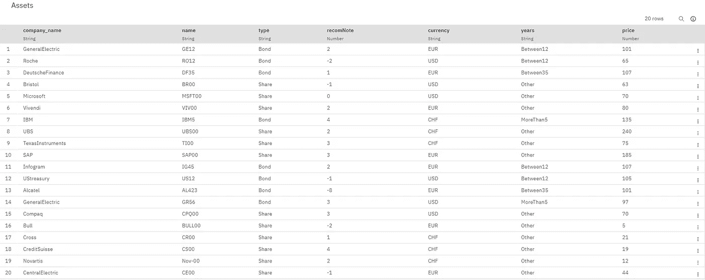
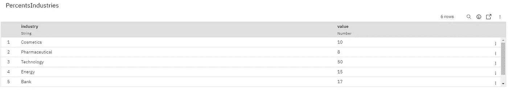
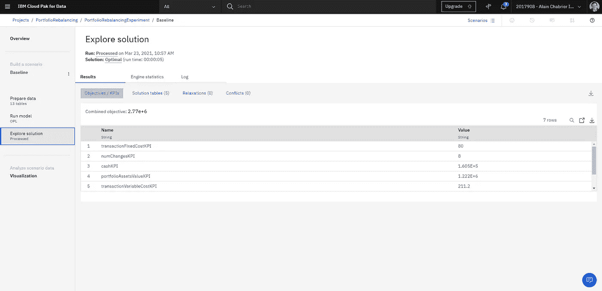
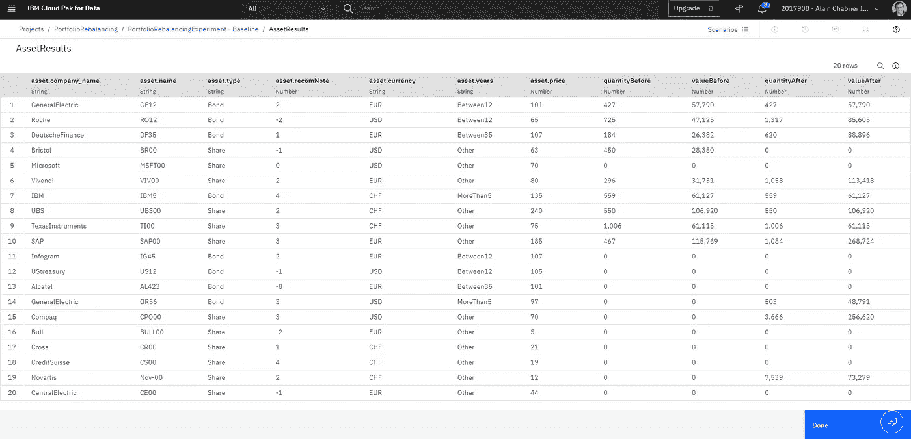
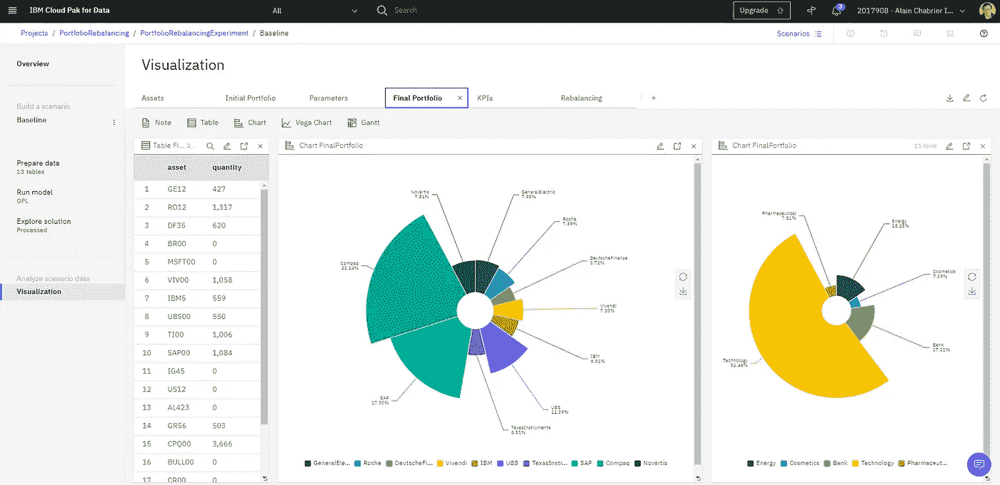
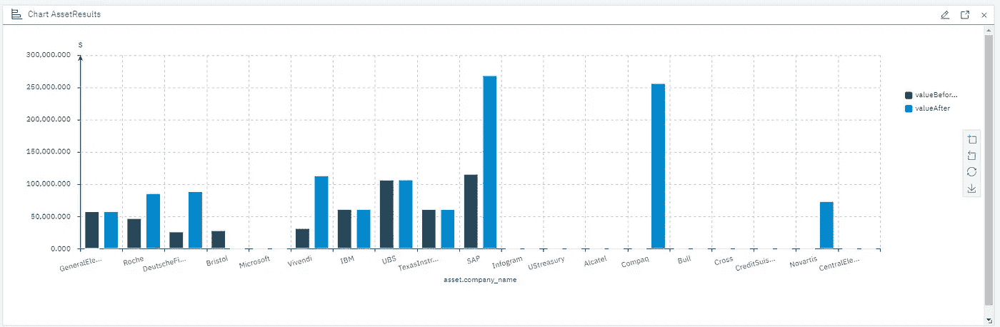

# 决策优化下的投资组合再平衡

> 原文：<https://levelup.gitconnected.com/portfolio-rebalancing-with-decision-optimization-c86798c87ac4>

这篇文章介绍了另一个决策优化的商业应用示例，并提供了在[云包数据](https://dataplatform.cloud.ibm.com/)上复制该示例所需的所有资产和模型。

## 问题。

考虑的问题是**投资组合的再平衡。**投资组合由一组自有资产组成，每项资产都有价格和数量。也可能有一些现金。在本例中，不同类型的资产被视为使用不同的货币，因此必须管理汇率。

不同的资产对应不同的公司。他们可能会根据不同的货币报价，并有不同的分析师建议说明。



示例中使用的资产

投资组合再平衡的目标是出售和购买一些资产，以便新的投资组合具有更好的平均推荐值，并遵守每个行业或类型的资产分布以及每种货币的剩余现金分布的一些安全限制。再平衡的成本也必须考虑。



每个行业的百分比限制示例

## 模型

该模型已使用 **OPL** (优化编程语言)，一种优化建模专用语言，公式化。选择使用 OPL 这样的专用语言还是 Python 这样的通用语言是个人偏好问题，参见[这篇关于利弊的文章](https://medium.com/@AlainChabrier/opl-vs-python-docplex-2d7b28814740)。

该模型是使用**实验用户界面**开发的，可作为 Cloud Pak for Data 的一部分。它支持多种场景和简单的可视化，从而加快了优化模型的开发和调试过程。[详见本帖](https://medium.com/ibm-watson/decision-optimization-model-builder-now-in-open-beta-on-watson-studio-public-45db16628e5b)。

该模型是一个**混合整数规划**，将由 CPLEX 引擎求解。下面列出了决策变量。例如，`finalQuantities`是一个整数决策变量数组，由资产索引，代表每种资产在最终投资组合中所占的比例。

```
dvar int deltaQuantity [Assets];
dvar int deltaBuyQuantity [Assets];
dvar int deltaSellQuantity [Assets];
dvar boolean changed [Assets];
dvar float finalCash [Currencies];
dvar boolean ownedCompany [Companies];
dvar int finalQuantities [Assets];
```

有 3 种不同的表述被认为是目标的一部分:

*   基于推荐票据的总投资组合符号，
*   交易的固定成本，
*   交易的可变成本。

其中的每一个都被定义为输入数据和决策变量的决策表达式(`dexpr`)，目标是在最小化成本的同时最大化符号。

```
dexpr float Notation = sum(a in Assets) (a.price * finalQuantities[a] * exchangeRates[<a.currency>] * a.recomNote);dexpr float TransactionFixedCost = 
  sum(a in Assets) changed[a] * parameters["FixedFee"];dexpr float TransactionVariableCost =
  sum(a in Assets) (deltaBuyQuantity[a] + deltaSellQuantity[a]) * parameters["TransactionCostPercentage"] / 100.;maximize Notation - TransactionFixedCost - TransactionVariableCost;
```

注意，在这种情况下，对每个目标元素赋予相同的权重。如果不同的目标元素不是直接等价的，有几种技术是可用的。最简单的方法是引入这些元素的一些**加权和**，为每个元素提供或多或少的值。当元素不可直接比较时，CPLEX 和 OPL 还提供了对字典顺序目标的简单支持，有些应该首先考虑。

正如你在[完整的 OPL 模型](https://github.com/achabrier/assets/blob/master/PortfolioRebalancing/model.mod)中看到的，有多个约束条件。

该模型中一些有趣的约束是逻辑 **if-then** 约束，用于链接布尔变量`ownedCompany`和整数变量`finalQuantitites`。这些逻辑约束被 CPLEX 自动线性化。

```
// Owning assets or not 
 forall(c in Companies) 
    ownedCompany[c] == 1 => sum(a in AssetsC[c]) finalQuantities[a] >= 1;

 forall(a in Assets) 
    ownedCompany[<a.company_name>] == 0 => finalQuantities[a] == 0;
```

本着同样的精神，添加了一些逻辑约束，以排除同时购买和出售某些给定资产的决策。这些也将被自动线性化，并由 CPLEX 引擎求解。

```
// cannot sell and buy of the same
 forall(a in Assets)
  (deltaBuyQuantity[a] == 0) || (deltaSellQuantity[a] == 0);
```

其他几个更简单的约束正在实施一些需要遵守的限制。例如，以下约束确保对于每个给定的公司，`LowerLimit`全局参数被用作与该公司对应的所有资产的最终头寸的下限:

```
forall(c in Companies)
    LowLimitCompanyPercent:
       parameters["LowerLimit"] * portfolioAssetsValue / 100 
       <= 
       sum(a in AssetsC[c])
        a.price * finalQuantities[a] * exchangeRates[<a.currency>] + maxint * (1 - ownedCompany[c]);
```

在目标和约束公式化之后，定义一些 KPI，这些 KPI 将在实验中报告并在 WML 上求解时导出。

```
// KPIs for business displaydexpr float portfolioAssetsValueKPI = portfolioAssetsValue;
dexpr float portfolioFitnessKPI = sum(a in Assets) ((a.price * initialQuantities[a] * exchangeRates[<a.currency>] / portfolioValue) * a.recomNote);
dexpr float portfolioTotalValueKPI = portfolioValue;
dexpr float transactionFixedCostKPI = TransactionFixedCost;
dexpr float transactionVariableCostKPI = TransactionVariableCost;
dexpr float cashKPI = sum(m in Currencies) finalCash[m] * exchangeRates[m];
dexpr float numChangesKPI = sum (a in Assets) changed[a];
```

此外，输出以易于使用的表格组织。

## 结果。

在实验 UI 中解决了给定的场景之后，用户可以浏览 KPI 和解决方案。



总体综合目标和关键绩效指标

`AssetResults`输出表如下所示:



资产结果

一个更好的理解和解释结果的方法，从而能够验证当前的模型或找出一些缺失的约束，是使用实验可视化。

例如，可以创建一些图表来表示重新平衡前后每个资产或每个行业的分布情况，如下所示。



最终投资组合分布

一些图表还可以比较再平衡前后的投资组合资产数量:



之前与之后

完整的仪表板配置[可在此处](https://github.com/achabrier/assets/blob/master/PortfolioRebalancing/dashboard.json)获得。

重现这个例子的所有元素都可以在[这个 github 库](https://github.com/achabrier/assets/tree/master/PortfolioRebalancing)中找到。

## 结论

这个应用决策优化的例子增加了一个不断增长的可重用例子列表:

*   [网络设计](https://towardsdatascience.com/network-design-with-decision-optimization-3c7fcade523)
*   [呼叫中心员工规划](https://medium.com/swlh/call-centers-staff-planning-bda6ed1c5518)
*   [病人转院](https://medium.com/@AlainChabrier/prototype-decision-optimization-usage-for-covid-19-decision-making-26794a17b5f0)
*   [口罩供应链管理](https://medium.com/@AlainChabrier/decision-optimization-covid-19-prototype-two-bb69d16ad228)
*   [预测性维护计划](https://towardsdatascience.com/predictive-maintenance-scheduling-with-ibm-data-science-experience-and-decision-optimization-25bc5f1b1b99)

更多关于 AI 和 DO 的故事，请关注我的 [Medium](https://medium.com/@AlainChabrier) 、 [Twitter](https://twitter.com/AlainChabrier) 或 [LinkedIn](https://www.linkedin.com/in/alain-chabrier-5430656/) 。

[](https://www.linkedin.com/in/alain-chabrier-5430656/) [## Alain Chabrier-IBM 决策优化高级技术人员(STSM)

### 我的专长是管理软件开发以做出更好的决策。我一直在推动……的重新设计

www.linkedin.com](https://www.linkedin.com/in/alain-chabrier-5430656/)