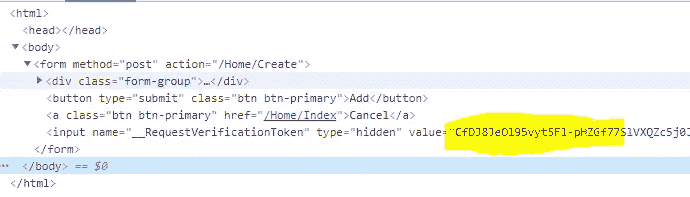
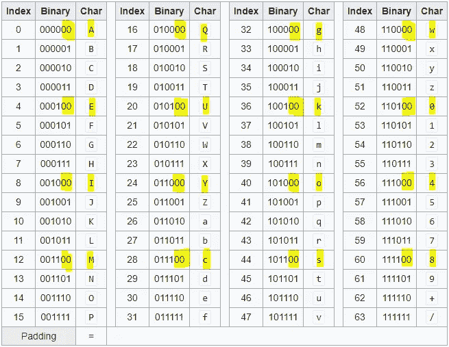
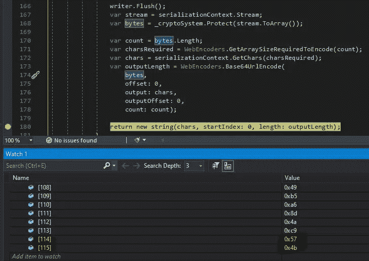
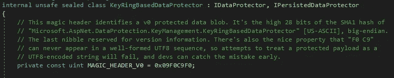

# 防伪标记的可能值

> 原文：<https://levelup.gitconnected.com/possible-values-for-antiforgery-tokens-d1adecb93db5>

## 深入探究防伪标记的内部工作原理。NET 5.0

照片由 [Aaron Burden](https://unsplash.com/@aaronburden) 在 [Unsplash](https://unsplash.com/photos/RgTI2KaQ5N4) 上拍摄

在这篇文章中，我将谈论什么样的价值防伪令牌可以在。NET 5.0。

您应该已经对防伪标记以及如何在中使用它们有了基本的了解。NET 5.0。

## 前 26 个字符

如果你读过我的第一篇关于防伪令牌的文章，你会知道在组成令牌的 155 个字符中，前 5 个字符总是相同的:

`CfDJ8`

这是因为在进行 base64 编码之前，这些硬编码的八个字节总是被写入数组的开头:

`0x09F0C9F0`

根据您的应用程序使用的加密密钥 ID，接下来的 21 个字符对于您的应用程序总是相同的。

前 26 个字符总是相同的

## 中间 128 个字符

由于令牌只是一个 base64 URL 编码版本的加密随机生成的字节数组，因此中间 128 个字符的[可能值](https://stackoverflow.com/a/6102233/2063755)是这 64 个字符:

*   `A, B, C, D, E, F, G, H, I, J, K, L, M, N, O, P, Q, R, S, T, U, V, W, X, Y, Z`
*   `a, b, c, d, e, f, g, h, i, j, k, l, m, n, o, p, q, r, s, t, u, v, w, x, y, z`
*   `0, 1, 2, 3, 4, 5, 6, 7, 8, 9`
*   `-` ( *减*)和`_` ( *下划线*)

## 最后一个字符

如果您不断地重新加载使用防伪标记的页面，您会注意到每次最后一个字符都是这 16 个值中的一个:

`A, E, I, M, Q, U, Y, c, g, k, o, s, w, 0, 4, 8`

为了理解这是为什么，让我们看一下 base64 [图表](https://en.wikipedia.org/wiki/Base64):

## 填充零

注意最后一个字符的 16 个可能值，所有的**在二进制编码中都以两个零**结尾？

这是一个很大的暗示，暗示了幕后发生了什么。

让我们来看看一些代码:

DefaultAntiforgeryTokenSerializer。序列化()

这是在[DefaultAntiforgeryTokenSerializer 中生成的结果字节数组。Serialize()](https://github.com/aspnet/Antiforgery/blob/master/src/Microsoft.AspNetCore.Antiforgery/Internal/DefaultAntiforgeryTokenSerializer.cs#L173) 方法来自 ASP.NET 核心源代码。

这个字节数组是加密随机生成的字节数组的结果。为简单起见，让我们集中讨论最后两个字节:

`0x57, 0x4b`

在二进制中，它们是:

`01010111`和`01001011`

## Base64 编码

当您进行 base64 编码时，您将字节分成六位一组。对于上面的两个字节，这变成:

`010101 110100 1011`

注意到最后没有足够的位来组成一组六位吗？

长度* 8 不是 6 和 8 的公倍数的任何字节数组，最后的余数都小于 6 位。

因为前面描述的字节数组有 116 个值，也就是 928 位，还有`928 modulo 6 = 4.`

在 base64 URL 编码过程中，总会有四个剩余位**。**

一些接近 928 的六和八的[公倍数](https://www.calculatorsoup.com/calculators/math/multiples.php)有:

`912, 936, 960`

如果以位为单位的字节数组的长度是这三个值中的一个，则不会有剩余的位，最后一个字符将是 64 个值中的一个，而不是 16 个值中的一个。

因为总有四位剩余，所以它们与两个零组合在一起形成一个六位值。

这就是为什么最后一个字符总是这 16 个值中的一个。

## 不同的值将被解释为相同的值

当防伪标记被验证时，该过程被逆转。字符串中的字符被转换为六位编码。然后，它们被转换成八位组，形成加密数组。

由于最后两个零在转换为八位组时会被截断，因此实际上可以用 base64 表中其他三个连续值中的任何一个来替换防伪标记中的最后一个字符。

例如，以下标记末尾的`w`可以替换为`x`、`y`或`z`，应用程序不会知道任何不同:

`CfDJ8JeOl95vyt5Fl-pHZGf77Sm3JmKSHdO1PQpV74QafJuJKW3y-uSagKNSpzLHS4SBLkNoOov2RrbaJow-61gPO3CoQllu1D9qeqWIDciJzPXJGakA-boNPsC_9H7DgtClsFHz6lS-Qd9qFeQs3vskEsw`

## 仔细看看第六个字符

现在您已经了解了字节是如何转换为 base64 的，让我们回过头来更仔细地看看第 6 个字符:

`J`

如果你在互联网上测试许多不同的应用程序。NET 5.0 防伪标记，您会注意到该字符始终是以下 16 个字符之一:

`A, B, C, D, E, F, G, H, I, J, K, L, M, N, O, P`

这是因为“魔头”:

该报头是四个字节，当转换成六位组时，看起来像这样:

`000010 011111 000011 001001 111100 00`

这里我们有一个与最后一个字符类似的情况。我们还剩两个零。

最后两个零与加密密钥 ID ( `defaultId`)组合在一起，这就是为什么第 6 个字符总是来自 base64 表中第一列，该列的字符以两个零开头。

## 你能有多少独特的价值观？

前五个字符可以忽略，因为它们不会改变。

第六个字符可以是 16 个值之一。

接下来的 148 个字符可以是 64 个值中的任何一个。

最后一个字符只能是 16 个值中的一个。

这意味着您可以拥有以下可能数量的值:

16 * 64¹⁴⁸ * 16 = 5.282945 * 10²⁶⁹

**那就是** 5282945 **后面有 263 个零，或者:**

`528294500000000000000000000000000000000000000000000000000000000000000000000000000000000000000000000000000000000000000000000000000000000000000000000000000000000000000000000000000000000000000000000000000000000000000000000000000000000000000000000000000000000000000000000000`

但是，如果您知道**加密密钥 id** ，那么前 26 个字符将是相同的，您只需尝试以下数量的组合:

64 个⁸ * 16 = 2.484029 * 10 个组合。

那就是 2484029 后面有 226 个零。

这是一个非常大的数字。很明显，了解内部工作原理可以帮助你最小化要尝试的唯一值的数量，但是仍然要花几个世纪来强力处理这么大的字符串。

## 结论

我希望您喜欢了解防伪标记如何在幕后工作，以及它们可能具有的不同价值。

这在很大程度上是一个实现细节，然而理解这些细节真的很有趣，并且当涉及到[泄漏抽象](https://www.joelonsoftware.com/2002/11/11/the-law-of-leaky-abstractions/)时会有所帮助。