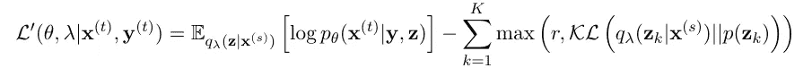
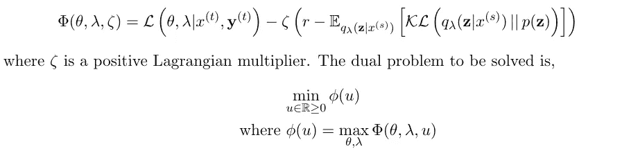
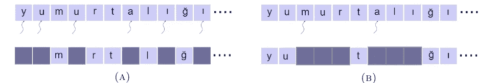
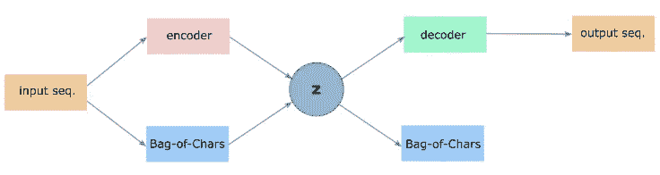
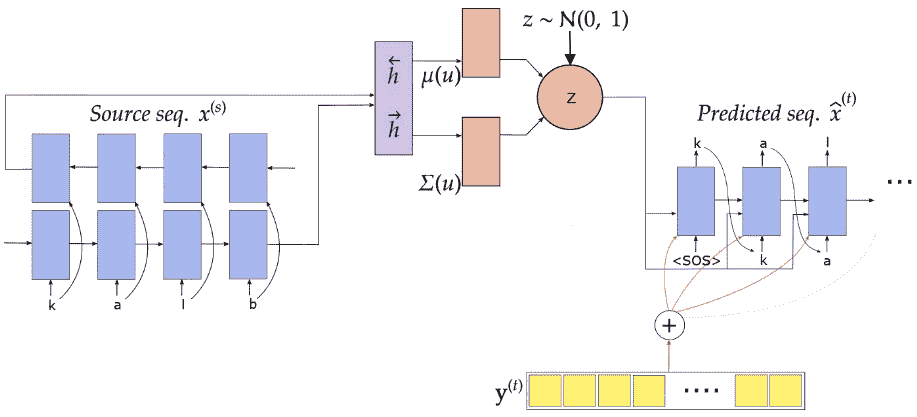
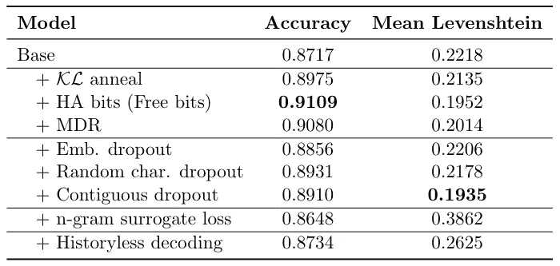
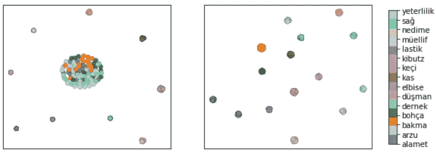

# 后验坍缩和强生成元问题

> 原文：<https://levelup.gitconnected.com/posterior-collapse-and-the-strong-generator-problem-fe0939cb4f8c>

已知变分自动编码器易受后验崩溃的影响，其中由于 *KL* 项的消失，近似后验崩溃为先验分布(Bowman 等人，2015 [1])。这迫使近似后验概率独立于数据，即*q(****z****【x)= q(****z****)= p(****z****)*，其中***z****代表潜在空间， *x* 代表)是变分后验和 *p(。)*表示先验分布。在这种情况下，递归解码器可以严重依赖于训练期间的先前预测输出来解码序列中的下一项。解码器忽略输入的潜在表示，并且 ***z*** 空间不学习任何有用的数据表示。*

*为了减轻后验崩溃和强解码器带来的问题，我们探索(a)各种可用的方法和(b)引入现有方法的变体。我们在下面描述每一种方法。在本文的其余部分，ELBO 用于表示证据下限，RNN 表示递归神经网络。*

## *1.KL 发散退火*

*遵循 Bowman et al. (2015) [1]，我们可以在训练时给目标中的 *KL* 项增加一个可变权重 *λ* 。在训练开始时，我们设置 *λ = 0* 并逐渐增加到固定阈值 *λₘ* (这是一个超参数)。*

**

*其中 *t* 表示训练步骤， *r* 是退火速率， *KLₑ𝒻𝒻* 。是有效的 Kullback-Leibler 散度。在开始时，这迫使模型通过学习投射源序列的表示来编码来自潜在空间的尽可能多的信息。该模型潜在地增加了输入和潜在空间之间的互信息，*I(****)x****；****z****)*。随着训练的进行，我们让模型用 *KL* 代价来正则化它。对于增长率，有两种选择，(a)线性增长，(b)指数增长。*

## *2.自由位*

*自由位(FB)的思想是以预先指定的速率为目标(Alemi 等人，2017 年)[2]。根据 Kingma 等人(2016) [3]，我们可以使用以下替代目标，其中鼓励使用 *K* 组随机单元。*

**

*其中 r 是预先指定的目标速率，K 表示潜在维度。由于信息的前 r 位/nats 被编码为“自由”，这种技术被称为**自由位**。这种技术提供了优于 KL 退火的优势，因为它通常容易确定编码所需的最小比特数和随机单元数。*

*我们在该方法中注意到以下两个问题，(a)只要 *KL* 项小于 *r* ，实际的 ELBO 就没有被优化，(b)‘max’引入了不连续性，即，它在边界处具有急剧的转变。为了解决这些缺点，陈等人(2016) [4]引入了**、**。这里， *KL* 项乘以权重因子 *0 < β ≤ 1* ，该权重因子根据目标速率通过因子 *α* 进行调整。虽然优化更加平滑，但是这种技术引入了许多需要调整的超参数。我们使用被称为 **HA bits** (最初在此介绍:[https://github.com/kastnerkyle/pytorch-text-vae](https://github.com/kastnerkyle/pytorch-text-vae))的自由位的修改版本，它将目标速率与整个层上的 *KL* 项的平均值进行比较。*

***3。最低期望利率***

*Pelsmaeker 和 Aziz (2019) [5]提出的最小期望速率(MDR)是一种用于以预先指定的速率 *r* 获得 ELBO 值的技术。它有两个优点， *(a)与自由位*不同的连续梯度，以及 *(b)与软自由位*相比更少的超级参数。ELBO 根据最小速率约束 *r* 进行优化，即，*

**

*其中 *λ* 表示变分参数，而 *θ* 表示神经网络的参数。注意，为了方便起见，我们只推导了有监督情况下的方程，但也适用于非监督情况。由于上述方程是难以处理的，我们导出了它的拉格朗日对偶函数*

**

*我们可以使用现成的关于 u 的随机梯度下降技术和关于 *λ，θ* 的随机梯度上升技术。*

***4。辍学***

*使用深度神经网络的一个优点是它们能够学习输入和输出之间的复杂和表达关系。尽管具有表达能力和鲁棒性，但普通深度神经网络易于过度拟合，这可能导致对错误预测的过度信任。文献中已经介绍了几种方法来解决这个问题:当验证集上的精度(性能)开始下降时停止训练，在目标中引入正则化项，例如 *L1* 和 *L2* ，以及在神经网络中使用贝叶斯框架。辍学是一种解决上述过度适应和过度自信问题的技术。在编码器-解码器架构中使用丢失来削弱强解码器。它迫使网络依赖于潜在空间中的数据表示。*

***4.1 随机辍学***

*我们对随机退出的两种变体进行了实验:*

1.  **嵌入丢失*:在每个解码时间步，嵌入矩阵中的每个单元以一个概率 *p* 被丢失。我们发现这无助于模型利用潜在的空间表示。*
2.  **字符丢失*:iy yer 等人(2015)【6】介绍的这种技术，用未知单词令牌*<>*替换序列中的随机单词。我们通过以概率 *β* 在每个解码时间步长丢弃一个字符来适应这种技术。设 *dᵢ* 为从伯努利分布中采样的指示变量， *dᵢ = 1* 暗示 *iᵗʰ* 人物被丢弃。 *emb(xᵢ)* 代表嵌入的 *iᵗʰ* 字，*代表 xᵢ* 字，那么*

**

*在这两种情况下，解码器被迫使用潜在空间的表示(表示引理)和标签嵌入信息。*

**

*随机字符丢失(A)和连续字符丢失(B)。第二行显示了解码器的丢失输入。在连续漏失中，我们首先使用伯努利分布对位置进行采样，然后使用泊松分布对长度进行采样。*

***4.2 连续辍学***

*这是前面描述的随机字符删除过程的扩展。它包括 2 个步骤: *(a)在一个字序列中的样本位置*， *(b)每个位置的样本长度*，*

**

*其中 mi 是以概率 *β* 选择的序列中的 *iᵗʰ* 位置的指示变量， *lᵢ* 是从位置 *i* 下降的长度序列。我们从参数为 *λ* 的泊松分布中抽取长度样本。上图(B)显示了一个连续辍学的例子。第一行显示选择的位置: *m(3)* 和 *a(7)* 。然后，泊松分布被用于在这些位置中的每一个位置采样长度(这里，两个位置的采样长度都是 3)。*

> *通过使用连续下降，我们鼓励潜在空间学习 n-gram 特征。*

## *5.独立隐藏状态—无历史解码*

*在每个解码步骤，RNN 解码器严重依赖于先前的观察。这防止网络使用来自潜在空间 ***z*** 的任何有用信息。我们可以通过强迫解码器忽略历史来削弱它。这可以通过两种方式实现:*

1.  *Semeniuta 等人(2017) [7]通过对丢失率为 1 的输入元素使用丢失来实现无历史解码。*
2.  *RNN 解码器允许运行 t 个时间步长，产生 *t* 个隐藏状态:*【h₁，h₂，…，ht】*。从每个隐藏状态， *hᵢ* ，独立生成输出字符。*

*注意，对于这两种方法，在每个时间步，我们给解码器(a)潜在空间信息和(b)嵌入。这两种方法有时是等同的。在 historyess 解码中，我们强制模型学习 n-gram 特征。*

## *6.多任务学习*

*许多前述方法通过削弱解码器能力来迫使模型使用潜在信息，从而解决后验崩溃问题。这种策略并不理想，因为它可能会降低生成序列的质量。Kamoi 和 Fukutomi (2018) [8]提出了一种 VAE 的变体，它利用多模态先验和多任务学习来生成条件良好的序列，而不会削弱解码器。*

**

*在多任务学习中，编码器隐藏状态和字符包(BoC)特征被连接起来。除了生成目标序列之外，解码器还必须估计输入序列的 BoC。*

*Pagliardini 等人(2017)报告说，简单的词袋在编码句子的语义内容方面是有效的。在他们的工作之后，除了编码序列之外，我们还将源序列的字符包特征输入到潜在空间。上图显示了多任务模型的架构。*

> *多任务学习有助于获得更好的中间表征。*

# *实验*

*我们选择形态学再反射的任务。任务是从源屈折序列和目标形态特征生成目标屈折序列。为了训练我们的模型，我们使用 SIGMORPHON 2016 中共享任务的数据。*

**

*我们把形态特征 y(t)表示为长度为 m 的二进制向量。⊕represents 注意了这些特征。<sos>是序列的开始字符。</sos>*

*上图显示了受监督案例的整体模型架构。我们使用双向门控循环单元作为编码器和解码器。在每个时间步，我们连接向前和向后的隐藏状态。潜在空间用高斯分布建模*z∞N(μ(u)，σ(u)，*和 *u* 是源序列的隐藏表示。有关培训程序的详细信息，请参考[报告](https://github.com/akashrajkn/akruti)。*

***修理坏掉的 ELBO***

**

*土耳其 task 3 数据集的精度(越高越好)和平均 Levenshtein 距离(越低越好)。我们试验了不同的方法来对抗后部塌陷。*

*在上表中，当使用不同的方法来解决后验崩溃时，我们报告了准确度(*如果预测序列等于基础真实目标序列*)和平均 Levenshtein 距离(*预测字离基础真实目标序列*有多远)。基本模型是普通模型，没有经过修改的 ELBO。我们观察到，通过使用空闲比特或 MDR 来确定速率目标在准确性方面有最大的提高。在丢弃方案中，随机字符丢弃的精度最高。然而，我们可以看到，连续的辍学有最小的平均 Levenshtein 距离。我们的直觉是，连续的缺失迫使模型学习 n 元语法特征，从而产生更好的预测。*

**

*使用(左)KL 退火和(右)MDR 时的潜在空间可视化。注意:在这两种情况下，随机字符丢失被用来削弱解码器。*

*上图显示了使用(左)KL 退火和(右)MDR 时潜在空间的 tSNE 图(具有相同引理的单词被类似地着色)。MDR 导致更有意义的潜在表现。除了获得更好的潜在表示，自由位和 MDR 引入了超参数，这些超参数比退火中的权重因子更易于解释和实用。*

## ***结论***

*在这篇文章中，我们简要描述了各种方法来解决后方塌陷的问题。此外，我们引入了一些现有方法的变体。虽然有些方法有助于缓解问题，但它们取决于手头的任务。*

# *参考*

1.  *Bowman，S. R .、Vilnis，l .、Vinyals，o .、Dai，A. M .、Jozefowicz，r .和 Bengio，S. (2015 年)。从连续空间生成句子。arXiv 预印本 arXiv:1511.06349。*
2.  *Alemi，A. A .，Poole，b .，Fischer，I .，Dillon，J. V .，Saurous，R. A .，和 Murphy，K. (2017)。Fixinga broken elbo.arXiv 预印本 arXiv:1711.00464。*
3.  *Kingma，D. P .，Salimans，t .，Jozefowicz，r .，Chen，x .，Sutskever，I .，和 Welling，M. (2016)。逆自回归流的改进变分推断。神经信息处理系统进展。*
4.  *Chen，x .，Kingma，D. P .，Salimans，t .，Duan，y .，Dhariwal，p .，Schulman，j .，Sutskever，I .，Abbeel，P. (2016)。变分有损自动编码器. arXiv 预印本 arXiv:1611.02731。*
5.  *Pelsmaeker 和 w . Aziz(2019 年)。深度生成语言模型的有效估计。*
6.  *Iyyer、v . Manjunatha、j . Boyd-Graber 和 h . Daum III(2015 年)。深度无序组合可以与文本分类的句法方法相媲美。计算语言学协会第 53 届年会和第 7 届国际自然语言处理联合会议论文集。*
7.  *Semeniuta，s .，Severyn，a .，和 Barth，E. (2017 年)。文本生成的混合卷积变分自动编码器。*
8.  *Kamoi，r .和 Fukutomi，H. (2018 年)。在不削弱解码器的情况下，用于文本建模的可变自动编码器。*