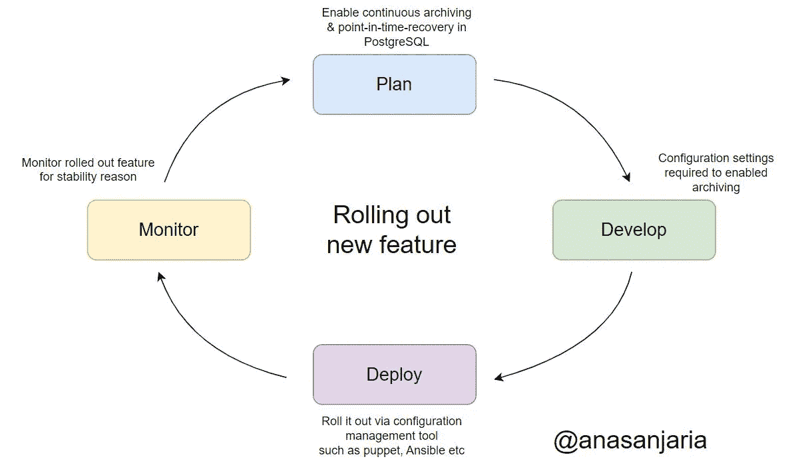
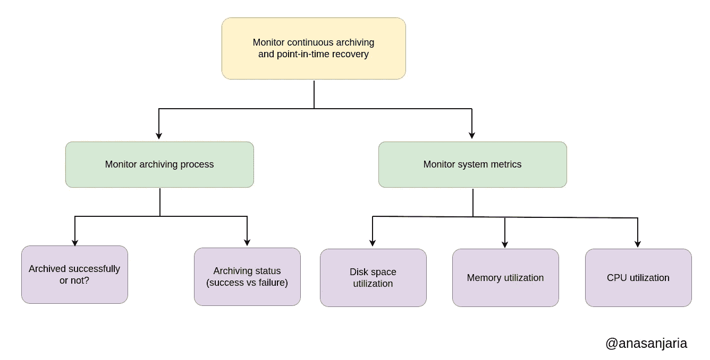

# PostgreSQL —监控连续归档和时间点恢复

> 原文：<https://levelup.gitconnected.com/postgresql-monitor-continuous-archiving-and-point-in-time-recovery-c08ec0dd9f6c>

## [连续归档和时间点恢复](https://medium.com/@anasanjaria/list/psql-continuous-archiving-and-pointintime-recovery-db6aad0e417a)

欢迎使用我的[连续归档和时间点恢复](https://medium.com/@anasanjaria/list/psql-continuous-archiving-and-pointintime-recovery-db6aad0e417a)系列。

到目前为止，我们已经介绍了理解归档机制所需的[基本概念](https://medium.com/@anasanjaria/postgres-backup-management-using-spilo-20a66befb88a)，在 AWS S3 中存储备份的[配置设置](https://medium.com/@anasanjaria/store-postgresql-backup-in-aws-s3-using-spilo-942d05567bc3)，以及如何使用 AWS 云中存储的备份[恢复独立节点](https://medium.com/@anasanjaria/postgresql-restore-a-node-from-backups-stored-in-aws-cloud-c0f9b1cc0fce)。

这篇文章的重点是在将连续归档推广到我们的生产系统后对其进行监控，以确保稳定性和可靠性。



推出新功能的开发周期

如果我们观察归档流程和运行该流程的系统(或实例),我们可以确保备份管理的稳定性和可靠性。



监控连续归档和时间点恢复的基本指标

# 监控归档过程

为了确保我们的归档流程完美运行，我们可以观察:

*   存档状态(是否无法将备份存储到 AWS 云)。
*   存档完成(是否定期成功存储备份)。

我们使用以下步骤来收集这些基本指标。这里的想法是使用`log-as-metrics`。

1.  将度量转储到日志文件中。
2.  使用 [filebeat](https://www.elastic.co/beats/filebeat) 将这些指标发送给弹性搜索。
3.  使用 [kibana](https://www.elastic.co/kibana/) 可视化信息。
4.  最后，在失败的情况下通过 slack 通知我们的团队。

```
I have explained this approach in more details in my following articles:

- [Monitor Ansible Playbook Executions](/monitor-ansible-playbook-executions-bf92ce16d100)
- [Monitor Postgres Performance Using Custom Queries](https://medium.com/@anasanjaria/monitor-postgres-performance-using-custom-queries-1c06a766969b)
```

## 监控存档状态

我们可以使用下面的 SQL 查询来监控归档。

```
select * from pg_stat_archiver;
```

您可以查看我关于使用定制查询监控 Postgres 性能的文章。

## 监控存档完成情况

由于我们使用了`wal-g`，因此，我们可以使用以下命令列出所有备份(成功存储在 AWS S3 中)来监控归档过程。

根据时间戳，我们可以确定最近 24 小时内是否有备份。

```
wal-g backup-list --json
```

更准确地说，我们将使用以下命令列出 AWS S3 的备份，将它们转储到一个日志文件中，并将其用作指标。

```
#!/bin/bash

docker run --rm --name monitor-completed-backup \
  --env AWS_REGION='...' \
  --env AWS_ENDPOINT='...' \
  --env WAL_S3_BUCKET='...' \
  --env WALE_S3_PREFIX='...' \
  --env WALE_S3_ENDPOINT='...' \
  registry.opensource.zalan.do/acid/spilo-14:2.1-p7 \
  wal-g backup-list --json | jq -c '.[]' \
  >> /path/to/metrics.log
```

请注意，我们使用 [jq](https://stedolan.github.io/jq/) 来操作 JSON。

# 监控系统指标

我们可以使用 [metricbeat](https://www.elastic.co/beats/metricbeat) 的`system`模块来监控我们的系统。配置如下所示:

```
metricbeat.modules:
# https://www.elastic.co/guide/en/beats/metricbeat/current/metricbeat-metricset-system-cpu.html
- module: system
  period: 1m
  metricsets:
    - cpu
    - memory
  process.include_top_n:
    by_cpu: 5      # include top 5 processes by CPU
    by_memory: 5   # include top 5 processes by memory

# https://www.elastic.co/guide/en/beats/metricbeat/current/metricbeat-metricset-system-filesystem.html
- module: system
    period: 30s
    metricsets: ["filesystem"]
    processors:
    - drop_event.when.regexp:
        system.filesystem.mount_point: '^/(sys|cgroup|proc|dev|etc|host)($|/)'
```

`system.filesystem.used.pct`-已用磁盘空间的百分比。

`system.memory.actual.used.pct` —实际使用的内存百分比。

`system.cpu.total.pct` —处于非空闲和低等待状态的 CPU 时间百分比。

感谢阅读。

如果你有任何问题，请随时在评论区提问。

如果你喜欢这篇文章，你可能也会喜欢我的网站可靠性工程系列。


[阿纳斯·安贾里亚](https://medium.com/@anasanjaria?source=post_page-----c08ec0dd9f6c--------------------------------)

## 现场可靠性工程

[View list](https://medium.com/@anasanjaria/list/site-reliability-engineering-fd4dc0eabf12?source=post_page-----c08ec0dd9f6c--------------------------------)6 stories

```
**Want to connect?**

[Facebook](https://www.facebook.com/anas.anjaria.kh) | [LinkedIn](https://www.linkedin.com/in/anasanjaria/) | [Twitter](https://twitter.com/anasanjaria)
```